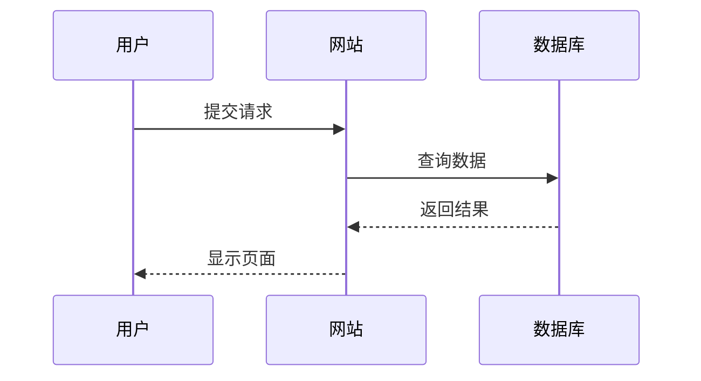

# 技术博客生成器

一个基于Node.js的静态博客生成器，专门为技术人员设计，支持Markdown、LaTeX数学公式和Mermaid流程图。

## 特性

- ✅ **完整的Markdown支持** - 支持所有标准Markdown语法
- ✅ **LaTeX数学公式** - 支持行内公式 `$...$` 和块级公式 `$$...$$`
- ✅ **Mermaid图表** - 支持流程图、序列图、类图、状态图、甘特图、饼图
- ✅ **Front Matter元数据** - 支持文章标题、日期、标签、摘要等元数据
- ✅ **静态生成** - 生成纯静态HTML文件，无需服务器，可直接部署
- ✅ **响应式设计** - 适配各种设备屏幕
- ✅ **实时预览** - 开发模式下支持文件监听和实时重新生成
- ✅ **导航系统** - 完整的导航菜单，支持多个分类

## 安装

```bash
# 克隆项目
git clone <your-repo-url>
cd tech-blog

# 安装依赖
npm install
```

## 使用方法

### 生成静态网站
```bash
npm run build
```

### 开发模式（实时监听文件变化）
```bash
npm run dev
```

## 项目结构

```
tech-blog/
├── articles/          # 技术文章
├── blog/             # 博客文章
├── projects/         # 开源项目
├── about/           # 关于我
├── render.js        # 主渲染脚本
├── package.json     # 项目配置
└── README.md        # 说明文档
```

## 文章格式

每篇文章使用YAML front matter来定义元数据：

```markdown
---
title: "文章标题"
date: 2024-01-01
tags: ["标签1", "标签2"]
excerpt: "文章摘要"
---

# 文章内容

这里是文章的正文内容...
```

## 支持的特殊语法

### LaTeX数学公式

**行内公式**：
```markdown
爱因斯坦的质能方程：$E = mc^2$
```

**块级公式**：
```markdown
$$
\int_{-\infty}^{\infty} e^{-x^2} dx = \sqrt{\pi}
$$
```

### Mermaid图表

**流程图**：
````markdown

````

**序列图**：
````markdown

````

## 自定义配置

### 修改导航菜单

在 `render.js` 文件中修改 `navItems` 数组：

```javascript
const navItems = [
  { name: '技术文章', path: '/articles/', folder: 'articles' },
  { name: 'Blog', path: '/blog/', folder: 'blog' },
  { name: '开源项目', path: '/projects/', folder: 'projects' },
  { name: '关于我', path: '/about/', folder: 'about' }
];
```

### 自定义样式

在 `render.js` 文件的 `generateHTML` 函数中修改CSS样式。

## 部署

### GitHub Pages 部署指南

#### 方法一：手动部署（推荐）

1. **生成静态文件**
   ```bash
   npm run build
   ```

2. **创建GitHub仓库**
   - 在GitHub上创建新的repository
   - 仓库名格式：`你的用户名.github.io`（例如：`jones.github.io`）

3. **初始化Git并推送**
   ```bash
   git init
   git add .
   git commit -m "Initial commit"
   git branch -M main
   git remote add origin https://github.com/你的用户名/你的用户名.github.io.git
   git push -u origin main
   ```

4. **启用GitHub Pages**
   - 进入仓库设置 → Pages
   - 选择部署分支：`main`
   - 选择部署文件夹：`/`（根目录）
   - 保存设置

5. **访问网站**
   - 打开 `https://你的用户名.github.io`

#### 方法二：使用GitHub Actions自动部署

1. **创建工作流文件** `.github/workflows/deploy.yml`：
   ```yaml
   name: Deploy to GitHub Pages
   
   on:
     push:
       branches: [ main ]
   
   jobs:
     deploy:
       runs-on: ubuntu-latest
       
       steps:
       - uses: actions/checkout@v3
       
       - name: Setup Node.js
         uses: actions/setup-node@v3
         with:
           node-version: '18'
           
       - name: Install dependencies
         run: npm install
         
       - name: Build website
         run: npm run build
         
       - name: Deploy to GitHub Pages
         uses: peaceiris/actions-gh-pages@v3
         with:
           github_token: ${{ secrets.GITHUB_TOKEN }}
           publish_dir: ./
   ```

2. **推送代码自动部署**
   ```bash
   git add .
   git commit -m "Add GitHub Actions workflow"
   git push
   ```

### 其他部署选项

生成的HTML文件也可以部署到其他静态网站托管服务：

- **Netlify** - 拖拽部署，支持自动构建
- **Vercel** - 极速部署，支持GitHub集成
- **阿里云OSS** - 国内访问快，支持CDN
- **腾讯云COS** - 类似阿里云OSS
- **Cloudflare Pages** - 全球CDN，免费额度高

### 自定义域名

如果您有自己的域名，可以在GitHub Pages设置中添加自定义域名：

1. 在域名注册商处添加CNAME记录：
   ```
   yourdomain.com CNAME 你的用户名.github.io
   www.yourdomain.com CNAME 你的用户名.github.io
   ```

2. 在GitHub仓库设置中填写自定义域名
3. 在项目根目录创建 `CNAME` 文件，内容为您的域名

## 技术栈和依赖

### 核心依赖

- **Node.js** - JavaScript运行时环境
- **@shd101wyy/mume** - Markdown渲染引擎（支持LaTeX、Mermaid、代码高亮）
- **front-matter** - Front Matter元数据解析
- **fs-extra** - 增强的文件系统操作

### 完整依赖列表

```json
{
  "dependencies": {
    "@shd101wyy/mume": "^0.7.9",    // Markdown渲染引擎
    "front-matter": "^4.0.2",       // Front Matter解析
    "fs-extra": "^11.0.0",          // 文件系统操作
    "highlight.js": "^11.11.1",     // 代码语法高亮
    "katex": "^0.16.0",             // LaTeX数学公式渲染
    "marked": "^5.0.0",             // Markdown解析（备用）
    "mermaid": "^10.0.0"            // 图表生成
  }
}
```

### 各依赖的功能说明

1. **@shd101wyy/mume** - 核心Markdown渲染引擎，提供：
   - 完整的Markdown语法支持
   - LaTeX数学公式渲染
   - Mermaid图表支持
   - 代码语法高亮
   - HTML导出功能

2. **front-matter** - 解析Markdown文件中的YAML front matter：
   ```yaml
   ---
   title: "文章标题"
   date: "2024-01-01"
   tags: ["标签1", "标签2"]
   excerpt: "文章摘要"
   image: "./path/to/image.jpg"
   ---
   ```

3. **fs-extra** - 提供增强的文件系统API：
   - 递归目录创建
   - 文件复制和移动
   - JSON读写支持
   - Promise支持

4. **highlight.js** - 代码语法高亮，支持300+种编程语言

5. **katex** - 高性能LaTeX数学公式渲染，比MathJax更快

6. **mermaid** - 文本到图表转换，支持多种图表类型

### 安装所有依赖

```bash
npm install
```

### 开发依赖（可选）

如果需要添加测试或构建工具，可以考虑：
- **jest** - 单元测试框架
- **eslint** - 代码质量检查
- **prettier** - 代码格式化

## 许可证

MIT License - 查看 [LICENSE](LICENSE) 文件了解详情。

## 贡献

欢迎提交Issue和Pull Request来改进这个项目！

## 问题反馈

如果您遇到任何问题，请创建 [Issue](https://github.com/yourusername/tech-blog/issues)。
