# 3D 高斯溅射：实时辐射场渲染方法

arXiv:2308.04079v1  2023年8月8日

**作者：**
- Bernhard Kerbl（法国蔚蓝海岸大学 Inria）
- Georgios Kopanas（法国蔚蓝海岸大学 Inria）
- Thomas Leimkühler（德国马克斯·普朗克信息学研究所）
- George Drettakis（法国蔚蓝海岸大学 Inria）

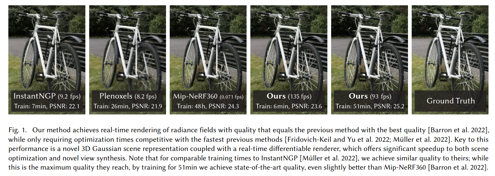

**摘要**

辐射场方法近年来极大地推动了基于多张照片或视频的场景新视角合成。然而，实现高视觉质量仍需依赖训练和渲染成本高昂的神经网络，而近期更快的方法则不可避免地以牺牲质量为代价。对于无界且完整的场景（而非孤立物体）以及1080p分辨率渲染，目前尚无方法能实现实时显示速率。

我们提出三项关键技术，使我们能够在保持与最快方法相当的优化时间的同时，实现与当前最佳质量方法相当的视觉质量，并且首次在1080p分辨率下实现高质量实时（≥30fps）新视角合成。首先，从相机标定过程中获得的稀疏点出发，我们用3D高斯体表示场景，既保留了连续体积辐射场优化的优点，又避免了空白空间的无效计算；其次，我们对3D高斯体进行交替的优化和密度控制，特别是对各向异性协方差的优化，以实现对场景的精确表达；第三，我们开发了一种快速的、可见性感知的渲染算法，支持各向异性溅射，极大加速了训练并实现了实时渲染。我们在多个公开数据集上展示了本方法的高质量和实时渲染能力。

**关键词：** 新视角合成、辐射场、3D高斯体、实时渲染

---
## 1. 引言

网格和点是最常见的三维场景表示方式，因为它们是显式的，并且非常适合基于GPU/CUDA的快速光栅化。相比之下，近年来的神经辐射场（NeRF）方法采用连续场景表示，通常通过体积光线行进优化多层感知机（MLP），以实现捕获场景的新视角合成。同样，迄今为止最高效的辐射场解决方案也基于连续表示，通过插值存储在体素、哈希网格或点中的值。虽然这些方法的连续性有助于优化，但渲染时所需的随机采样代价高昂，且可能导致噪声。

我们提出了一种结合两者优点的新方法：3D高斯体表示既能实现与最新方法相当的视觉质量和训练速度，又能通过基于瓦片的溅射方案，在多个公开数据集上实现1080p分辨率下的实时渲染。

我们的目标是让多照片捕获的场景能够实时渲染，并且优化时间与以往最高效方法相当。近期方法虽然训练速度快，但难以达到当前最佳NeRF方法（如Mip-NeRF360）所获得的视觉质量，而后者训练时间可达48小时。快速但质量较低的辐射场方法在某些场景下可实现10-15帧每秒的交互式渲染，但在高分辨率下仍难以实现实时。

我们的方案包含三大核心：首先，引入3D高斯体作为灵活且表达力强的场景表示。我们与以往NeRF方法一样，从结构光束（SfM）标定得到的稀疏点云初始化3D高斯体集合。与大多数基于点的方法需要多视图立体（MVS）数据不同，我们仅用SfM点即可获得高质量结果。对于NeRF-synthetic数据集，我们的方法甚至在随机初始化下也能获得高质量。我们证明3D高斯体是极佳选择，因为它既是可微分的体积表示，也能高效地投影到2D并用标准α混合进行光栅化，等价于NeRF的成像模型。

第二，我们对3D高斯体的属性（位置、透明度α、各向异性协方差、球谐系数）进行优化，并交替进行自适应密度控制，在优化过程中动态增删高斯体。该过程生成了紧凑、无结构且精确的场景表示（所有测试场景高斯体数量为100万至500万）。

第三，我们提出了基于GPU的实时渲染方案，采用快速排序算法并借鉴了基于瓦片的光栅化思想。得益于3D高斯体表示，我们能实现可见性排序的各向异性溅射，并通过追踪排序溅射的遍历过程，实现快速且准确的反向传播。

**主要贡献：**
- 首次提出各向异性3D高斯体作为高质量、无结构的辐射场表示；
- 提出3D高斯体属性的优化方法，并交替进行自适应密度控制，生成高质量场景表示；
- 提出一种快速、可微分、可见性感知的GPU渲染方法，支持各向异性溅射和高效反向传播，实现高质量新视角合成。

我们在多个公开数据集上验证了方法的有效性，能够从多视角捕获中优化3D高斯体，获得与最佳隐式辐射场方法相当甚至更优的质量，同时训练速度与最快方法相当，并首次实现了高质量的新视角实时渲染。

---
## 2. 相关工作

我们首先简要回顾传统重建方法，然后讨论基于点的渲染和辐射场相关工作。由于辐射场领域内容庞大，这里仅关注直接相关的研究，完整综述可参考近期综述文献。

### 2.1 传统场景重建与渲染

最早的新视角合成方法基于光场，先是密集采样，后发展为非结构化采集。结构光束（SfM）的出现使得可以用多张照片合成新视角。SfM在相机标定时估算稀疏点云，最初用于简单的三维可视化。随后多视图立体（MVS）推动了完整三维重建算法的发展，带来了多种新视角合成方法。这些方法通过重投影和融合输入图像到新视角，并用几何信息引导重投影。尽管这些方法在许多情况下效果出色，但通常无法完全修复未重建区域或MVS生成的虚假几何。近年来的神经渲染算法极大减少了此类伪影，并避免了将所有输入图像存储在GPU上的高昂代价，在大多数方面优于传统方法。

### 2.2 神经渲染与辐射场

深度学习技术很早就被用于新视角合成，如用CNN估算融合权重或进行纹理空间处理。大多数此类方法依赖MVS几何，且最终渲染用CNN常导致时间抖动。

体积表示的新视角合成始于Soft3D，随后结合体积光线行进的深度学习方法被提出，利用连续可微分密度场表示几何。体积光线行进渲染代价高昂，因为需要大量采样。NeRF引入了重要性采样和位置编码提升质量，但采用大型MLP影响速度。NeRF的成功带来了大量后续方法，主要通过正则化提升质量和速度，目前新视角合成的最佳图像质量由Mip-NeRF360保持。尽管渲染质量极佳，但训练和渲染时间极高；而我们的方法在保证训练和渲染速度的同时，质量可与其媲美甚至超越。

### 2.3 基于点的渲染与辐射场

基于点的方法能够高效渲染离散、无结构的几何样本（即点云）。最简单的点采样渲染是将一组无结构点以固定大小光栅化，可以利用图形API原生支持的点类型或在GPU上并行软件光栅化。尽管忠实于原始数据，点采样渲染容易出现空洞、锯齿，并且本质上是非连续的。高质量点渲染的开创性工作通过“溅射”像素以上的点元（如圆盘、椭圆盘、椭球体或表面元）来解决这些问题。

近年来，基于点的可微分渲染技术受到关注。点被赋予神经特征并用CNN渲染，实现了快速甚至实时的新视角合成，但仍依赖MVS获取初始几何，因此继承了MVS的伪影，尤其在无特征/高光区域或细结构中易出现过度或不足重建。

点的α混合和NeRF风格的体积渲染本质上采用相同的成像模型。具体来说，像素颜色C由沿光线的体积渲染给出：
$$
C = Σ T_i (1 - exp(-σ_i δ_i)) c_i，其中T_i = exp(-Σ_{j=1}^{i-1} σ_j δ_j)
$$
也可写为：
$$
C = Σ T_i α_i c_i，其中α_i = (1 - exp(-σ_i δ_i))，T_i = Π_{j=1}^{i-1} (1 - α_j)
$$
典型的神经点渲染方法通过对像素重叠的N个有序点进行加权混合计算颜色：
$$
C = Σ_{i∈N} c_i α_i Π_{j=1}^{i-1} (1 - α_j)
$$
其中c_i为每个点的颜色，α_i由2D高斯协方差Σ与每点学习到的不透明度相乘得到。

从上述公式可见，成像模型一致，但渲染算法不同。NeRF是连续表示，隐式表达空/实空间，需大量随机采样，计算量大且有噪声；点是无结构、离散表示，灵活支持几何的创建、删除和移动，通过优化不透明度和位置实现，避免了体积表示的缺点。

Pulsar方法实现了快速球体光栅化，启发了我们的基于瓦片和排序的渲染器。但我们希望在排序溅射上保持（近似）常规α混合，以获得体积表示的优点：我们的光栅化尊重可见性顺序，并对像素内所有溅射反向传播梯度，支持各向异性溅射。这些都提升了视觉质量。此外，前述方法多用CNN渲染，导致时间不稳定。尽管如此，Pulsar和ADOP的渲染速度激励了我们开发快速渲染方案。

在人体捕捉领域，3D高斯体被用于表示人体，近期也用于体积光线行进的视觉任务。神经体积基元也被提出用于类似场景，但多聚焦于单一物体（如人体或人脸），深度复杂度低。相比之下，我们通过各向异性协方差优化、交替优化/密度控制和高效深度排序渲染，能处理包含背景的完整复杂场景。

---
## 3. 方法概述

我们的方法输入为静态场景的多张图片及其SfM标定相机，SfM过程会生成稀疏点云。我们用这些点初始化3D高斯体（详见第4节），每个高斯体由位置（均值）、协方差矩阵和不透明度α定义，便于灵活优化。高斯体的各向异性体积溅射能紧凑表达细结构，使得整体表示较为紧凑。辐射场的方向外观（颜色）用球谐函数（SH）表示。我们的算法通过一系列3D高斯体参数（位置、协方差、α、SH系数）优化步骤，交替进行高斯体密度自适应控制，最终生成辐射场表示（见第5节）。

本方法高效的关键在于基于瓦片的光栅化器（第6节），支持各向异性溅射的α混合，并通过快速排序实现可见性排序。我们的光栅化器还支持高效反向传播，无需限制可接收梯度的高斯体数量。方法流程如图2所示。

---
## 4. 可微分3D高斯溅射

我们的目标是从稀疏（SfM）点集出发，优化出可实现高质量新视角合成的场景表示。为此，需要一种既具备可微分体积表示特性，又无结构、显式、便于快速渲染的基元。我们选择3D高斯体：它们可微分，且易于投影为2D溅射，便于快速α混合。

我们的表示方法与以往使用2D点的方法类似，这些方法假设每个点是带法线的小平面圆。然而，由于SfM点极为稀疏，估算法线非常困难，且噪声大。我们选择用一组不需要法线的3D高斯体来建模几何。每个高斯体由世界坐标下的3D协方差矩阵Σ和中心点μ定义：
$$
G(x) = exp(-0.5 * (x^T Σ^{-1} x))
$$
在我们的混合过程中，这个高斯体会乘以α。但渲染时需要将3D高斯体投影到2D。Zwicker等人展示了如何将其投影到图像空间。给定视图变换W，协方差矩阵在相机坐标下为：
$$
Σ' = J W Σ W^T J^T
$$
其中J是投影变换的仿射近似的雅可比矩阵。省略Σ'的第三行和第三列后，得到的2x2方差矩阵与以往基于法线的平面点方法结构一致。

直接优化Σ以获得3D高斯体虽直观，但协方差矩阵只有在正半定时才有物理意义。我们采用梯度下降优化所有参数，难以直接约束Σ为有效矩阵，更新步骤和梯度很容易导致无效协方差。

因此，我们采用更直观但表达力等价的优化方式。3D高斯体的协方差矩阵可类比为椭球体的配置。给定缩放矩阵S和旋转矩阵R，有：
$$
Σ = R S S^T R^T
$$
为便于独立优化，我们分别存储3D缩放向量s和四元数q表示旋转。它们可轻松转换为矩阵并组合，且需归一化q以保证为单位四元数。

为避免训练时自动微分带来的开销，我们为所有参数显式推导了梯度，具体推导见附录A。这种适合优化的各向异性协方差表示，使我们能针对不同形状自适应优化3D高斯体，获得紧凑的场景表达。图3展示了优化后的高斯体形状。

## 5. 3D高斯体的自适应密度优化

我们方法的核心是优化步骤，通过优化生成密集的3D高斯体集合，准确表达场景，实现自由视角合成。除位置p、α和协方差Σ外，我们还优化每个高斯体的SH系数以表达视角相关的颜色。参数优化与高斯体密度控制交替进行，以更好地表达场景。

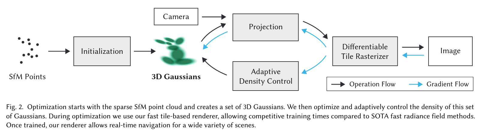

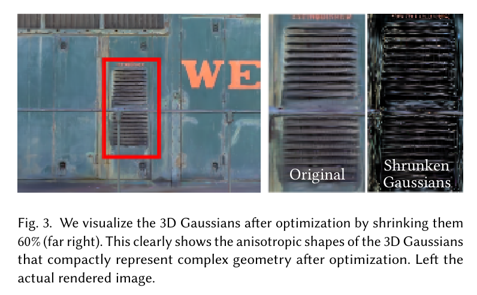

### 5.1 优化

优化基于不断迭代渲染并与训练视图对比。由于3D到2D投影的歧义，几何可能被错误放置，因此优化需能创建、删除或移动几何。3D高斯体协方差参数的质量对表达的紧凑性至关重要，大面积均匀区域可用少量大各向异性高斯体表达。

我们采用随机梯度下降优化，充分利用GPU加速框架，并为部分操作自定义CUDA核。快速光栅化（见第6节）对优化效率至关重要，是主要计算瓶颈。

α采用sigmoid激活约束在[0,1)区间，获得平滑梯度；协方差缩放采用指数激活。初始协方差设为各轴等于最近三个点距离均值的各向同性高斯体。位置参数采用指数衰减调度，损失函数为L1与D-SSIM的加权和：
$$
L = (1-λ)L1 + λL_D-SSIM
$$
我们所有实验中λ=0.2。学习率调度等细节见7.1节。

### 5.2 高斯体的自适应控制

我们从SfM稀疏点集初始化，然后自适应控制高斯体数量和单位体积密度，使其从稀疏变为密集，更好表达场景且参数正确。优化热身后，每100次迭代进行一次密度增强，并移除α低于阈值ε_α的高斯体。

自适应控制需填补空白区域，关注几何缺失（“欠重建”）和高斯体覆盖大面积（“过重建”）区域，这两类区域的视图空间位置梯度都较大，说明尚未充分重建，优化正试图调整高斯体。

两种情况都适合密度增强。我们对平均视图空间位置梯度大于阈值τ_pos（实验中设为0.0002）的高斯体进行增强。具体流程见图4。

对于欠重建区域的小高斯体，需要创建新几何，直接克隆高斯体并沿位置梯度方向移动即可。对于高方差区域的大高斯体，则将其分裂为两个新高斯体，缩放因子为φ=1.6，位置用原高斯体作为PDF采样。

前者增加系统总体积和高斯体数量，后者保持总体积但增加数量。与其他体积表示类似，优化可能在靠近输入相机处卡住，导致高斯体密度异常增加。有效抑制高斯体数量增长的方法是每N=3000步将α设为接近零。

优化过程中，若某些高斯体需要，则其α会被提升，同时我们会剔除α低于ε_α的高斯体。高斯体可能收缩、膨胀并与其他高斯体有较大重叠，但我们会定期移除在世界空间过大或在视图空间占据较大面积的高斯体。该策略有效控制了高斯体总数。我们的高斯体始终作为欧氏空间中的基本元存在；与其他方法不同，我们无需对远距离或大型高斯体进行空间压缩、变形或投影。

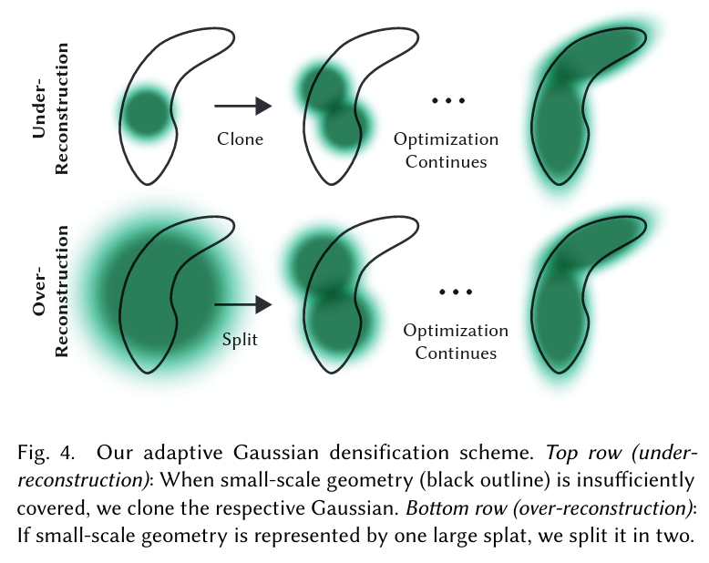

## 6. 快速可微高斯光栅化器

我们的目标是实现整体渲染和排序的高效，支持各向异性溅射的近似α混合，并避免以往方法对可接收梯度溅射数量的硬性限制。

为此，我们设计了基于瓦片的高斯溅射光栅化器，借鉴了最新的软件光栅化方法，对整张图像的所有基元预排序，避免了以往每像素排序带来的高昂开销。我们的光栅化器支持任意数量高斯体的高效反向传播，每像素只需常数级内存开销。整个光栅化流程完全可微，能对各向异性溅射进行光栅化。

方法流程如下：首先将屏幕划分为16×16的瓦片，对3D高斯体进行视锥和瓦片裁剪，仅保留99%置信区间与视锥相交的高斯体。对于极端位置的高斯体（如靠近近平面且远离视锥），直接剔除以避免投影不稳定。每个高斯体根据其重叠的瓦片数量实例化，并为每个实例分配一个结合了视图空间深度和瓦片ID的排序键。随后，利用GPU上的Radix排序对所有高斯体进行排序。排序后，按瓦片生成高斯体列表，并为每个瓦片启动一个线程块，协作加载高斯体到共享内存，并对每个像素自前向后累加颜色和α值，直到α饱和（即α达到1）为止。

与以往不同，我们不限制可接收梯度的溅射数量，因此可适应任意深度复杂度的场景，无需特定超参数调优。反向传播时，需恢复前向过程中每像素的所有混合点序列。为避免动态内存管理开销，我们复用前向排序结果，反向遍历瓦片列表。每个点在前向过程中存储最终累积α，反向遍历时用该值除以当前点的α即可获得梯度计算所需系数。

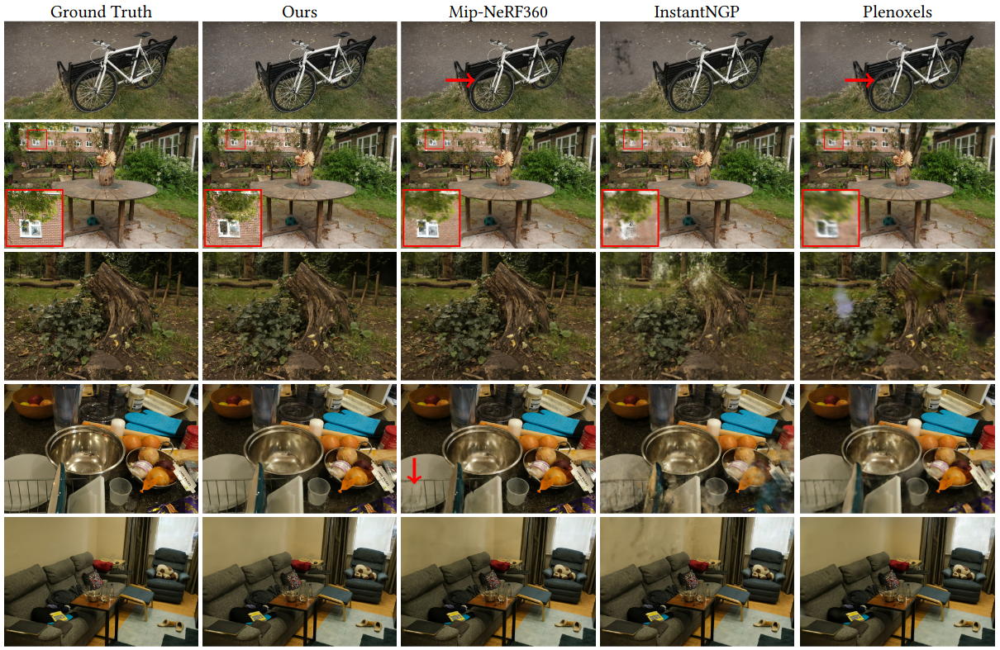
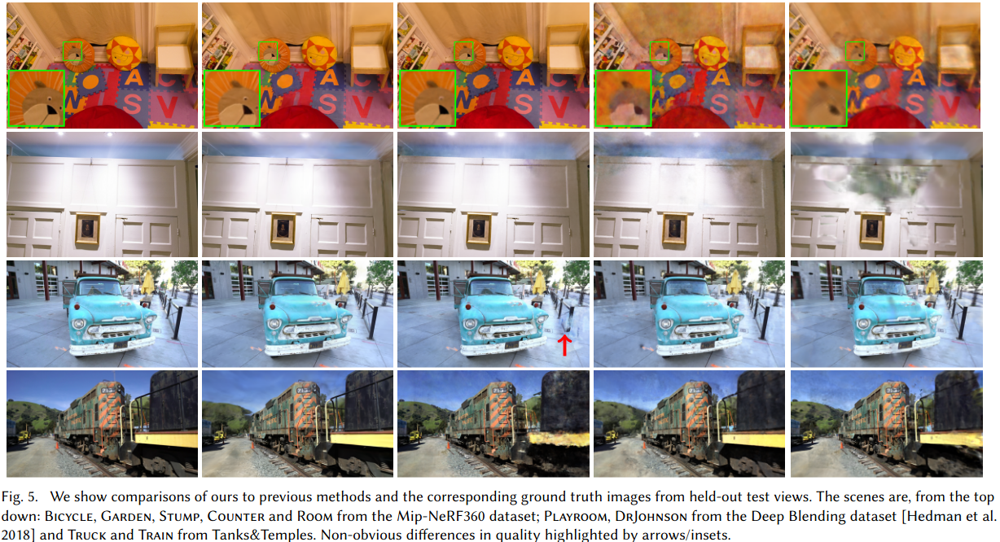

## 7. 实现、结果与评估

本节将介绍实现细节，展示结果，并与以往方法及消融实验进行对比评估。

### 7.1 实现

我们的方法基于 Python 和 PyTorch 框架实现，光栅化部分编写了自定义 CUDA 内核，扩展自以往方法，并使用 NVIDIA CUB 排序库实现快速 Radix 排序。我们还基于开源 SIBR 构建了交互式查看器，用于交互式浏览和帧率测试。源代码和全部数据已公开：https://repo-sam.inria.fr/fungraph/3d-gaussian-splatting/

优化细节：为保证稳定性，优化初期采用低分辨率（初始为原图1/4），在第250和500次迭代后分别上采样两次。SH系数优化对角度信息缺失较为敏感。对于典型的“NeRF风格”采集（即物体被全方位拍摄），优化效果良好。但若采集角度不全（如场景角落或“inside-out”采集），则SH零阶分量（基色/漫反射色）可能被错误优化。为此，我们先仅优化零阶分量，每1000步引入一阶，直到全部4阶SH分量参与优化。

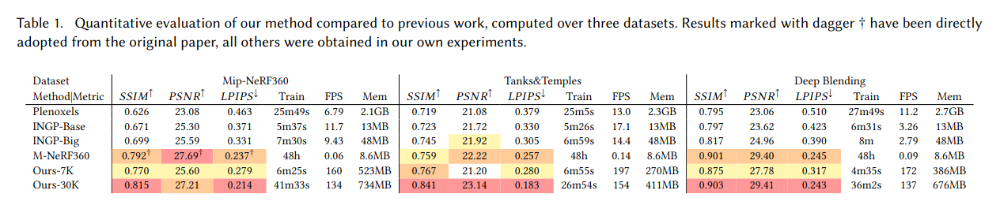

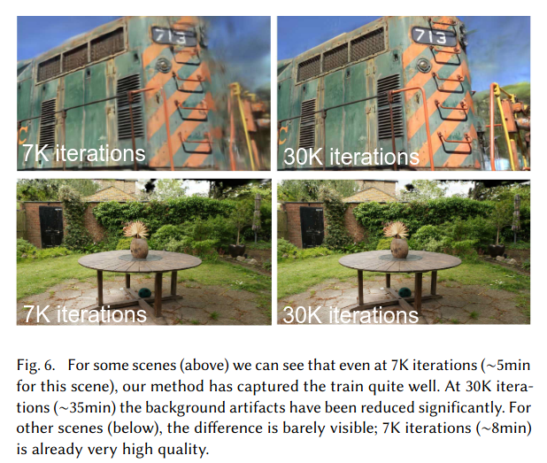

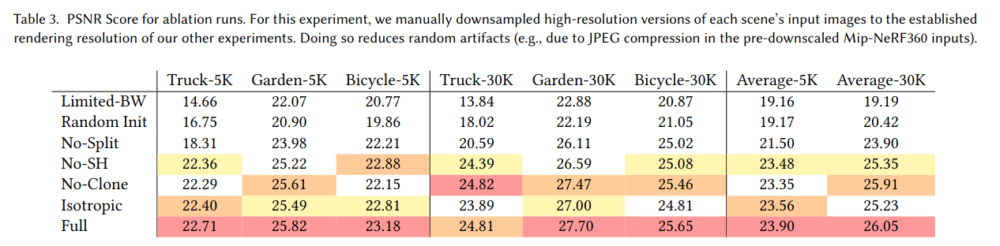

### 7.2 结果与评估

我们在13个真实场景和Blender合成数据集上测试了算法，特别是在当前NeRF渲染领域SOTA的Mip-NeRF360全套场景上进行了评测。

我们在不同风格的场景（包括室内外、有限和无界环境）上进行了测试，所有实验均采用相同的超参数配置。除Mip-NeRF360外，所有结果均在A6000 GPU上获得。我们还在补充材料中展示了远离输入照片路径的渲染视频。

真实场景：当前SOTA为Mip-NeRF360，我们以其为质量基准，并与最新的快速NeRF方法InstantNGP和Plenoxels对比。数据集采用train/test分割，每8张取1张为测试，采用PSNR、L-PIPS和SSIM等标准指标。表1展示了所有方法的对比结果。除Mip-NeRF360外，所有数据均为我们复现所得，Mip-NeRF360数据直接引用原文以避免混淆。我们还报告了训练时间、渲染速度和模型内存占用。我们的模型在35-45分钟内即可收敛，渲染速度远超Mip-NeRF360（后者需48小时训练，10秒/帧渲染）。与InstantNGP和Plenoxels相比，我们在5-10分钟内即可达到相当质量，进一步训练则可超越SOTA。

合成场景：在Blender数据集上，我们从100K随机高斯体初始化，训练后自动筛选至6-10K有效高斯体，最终模型约20-50万高斯体。表2展示了与以往方法的PSNR对比。渲染速度可达180-300 FPS。

模型紧凑性：与以往显式场景表示相比，我们的各向异性高斯体能用更少参数表达复杂形状。与[Zhang et al. 2022]的点云模型对比，我们仅用其1/4的点数即可超越其PSNR，平均模型仅3.8MB（对方为9MB）。

### 7.3 消融实验

我们分别评估了各项算法设计的贡献，包括SfM初始化、密度增强策略、各向异性协方差、允许无限溅射梯度和球谐函数的使用。表3总结了各项选择的定量影响。

SfM初始化：若用随机点云初始化，方法整体表现尚可，但背景区域质量下降，且训练视角覆盖不足时易出现浮点无法优化的问题。合成数据集因无背景且相机约束好，不会出现此问题。
密度增强：分别禁用clone和split策略，发现分裂大高斯体对背景重建尤为重要，而克隆小高斯体则有助于细结构的快速收敛。
各向异性协方差：能用更少高斯体表达复杂结构，提升模型紧凑性和质量。
无限溅射梯度：允许任意数量高斯体接收梯度，适应任意深度复杂度场景，无需超参数调优。
球谐函数：提升视角相关外观表达能力。
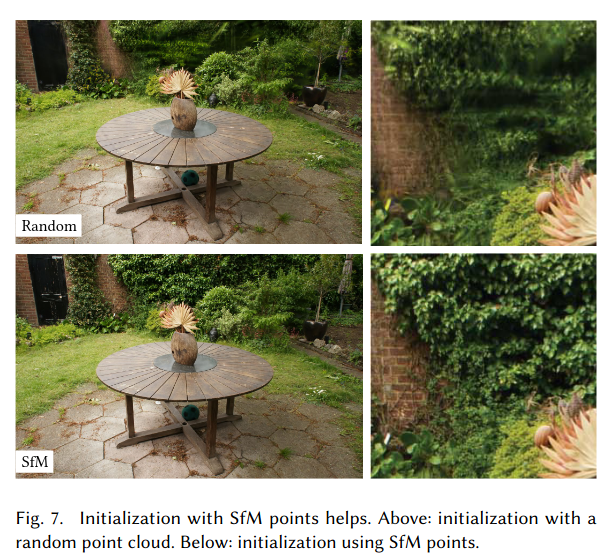

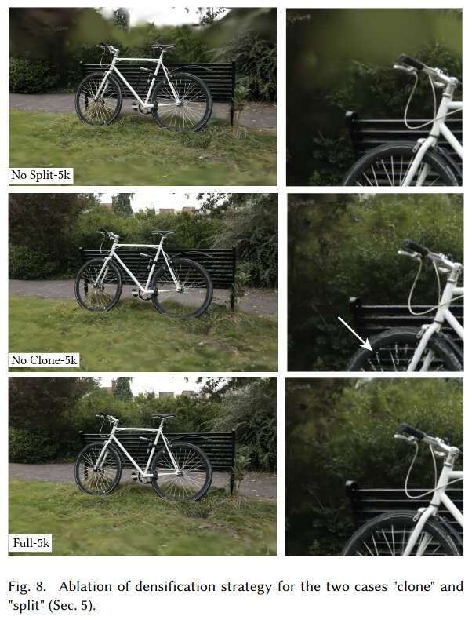
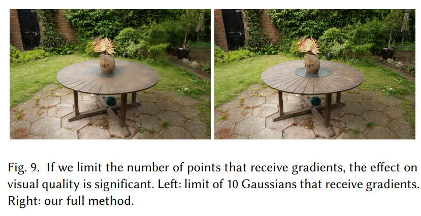

### 7.4 局限性

我们的方法也存在一些局限。在场景观测不充分的区域会出现伪影，这也是其他方法（如Mip-NeRF360）同样难以避免的问题。虽然各向异性高斯体有诸多优点，但有时会产生拉长或“斑块状”伪影（见图12），尤其在视角相关外观区域，优化可能导致大高斯体产生“跳变”伪影。这部分原因在于光栅化器中对高斯体的简单剔除策略，更合理的剔除方法可缓解此问题。另一个原因是可见性算法较为简单，可能导致高斯体深度/混合顺序突变，可通过抗锯齿进一步改进。当前我们未对优化过程做任何正则化，未来可通过正则化缓解未观测区域和跳变伪影。对于超大场景，降低位置学习率有助于收敛。

尽管与以往基于点的方法相比，我们的模型更紧凑，但内存消耗仍高于NeRF类方法。大场景训练时，GPU峰值内存可超20GB（未优化实现），但通过底层优化可大幅降低。渲染时需足够GPU内存存储完整模型（大场景数百MB），光栅化器还需额外30-500MB，具体取决于场景和分辨率。未来可借鉴点云压缩等技术进一步降低内存消耗。
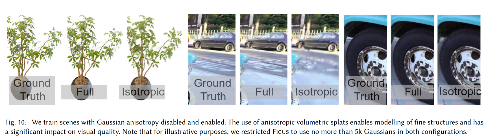
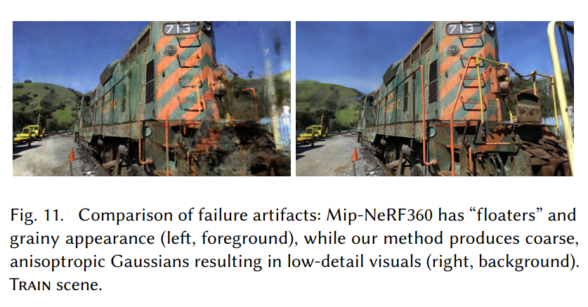

## 8. 讨论与结论

我们首次提出了真正实现实时高质量辐射场渲染的方法，适用于多种场景和采集风格，训练时间与最快方法相当。

我们选择3D高斯体作为基本元，既保留了体积渲染优化的优点，又能直接实现高效的溅射光栅化。我们的工作表明，连续表示并非实现高效高质量辐射场训练的唯一途径。

目前约80%的训练时间花在Python代码上，仅光栅化部分为CUDA优化。若将全部优化流程迁移到CUDA，性能可进一步提升。

我们还展示了实时渲染原理和GPU加速、软件光栅化架构对训练和实时渲染性能的关键作用。未来可探索用高斯体进行网格重建，以更好理解本方法在体积与表面表示之间的位置。

总之，我们首次实现了实时辐射场渲染，质量媲美最优方法，训练速度与最快方案相当。

致谢
本研究由ERC高级项目FUNGRAPH（No 788065）资助。感谢Adobe公司、蔚蓝海岸大学OPAL基础设施和GENCI–IDRIS（Grant 2022-AD011013409）提供的资源。感谢匿名评审、P. Hedman、A. Tewari对早期稿件的校对，以及T. Müller、A. Yu、S. Fridovich-Keil在对比实验中的帮助。


参考文献
Kara-Ali Aliev, Artem Sevastopolsky, Maria Kolos, Dmitry Ulyanov, and Victor Lempitsky. 2020. Neural Point-Based Graphics. In Computer Vision – ECCV 2020: 16th European Conference, Glasgow, UK, August 23–28, 2020, Proceedings, Part XXII. 696–712.

Jonathan T Barron, Ben Mildenhall, Matthew Tancik, Peter Hedman, Ricardo Martin-Brualla, and Pratul P Srinivasan. 2021. Mip-nerf: A multiscale representation for anti-aliasing neural radiance fields. In Proceedings of the IEEE/CVF International Conference on Computer Vision. 5855–5864.

Jonathan T. Barron, Ben Mildenhall, Dor Verbin, Pratul P. Srinivasan, and Peter Hedman. 2022. Mip-NeRF 360: Unbounded Anti-Aliased Neural Radiance Fields. CVPR (2022).

Sebastien Bonopera, Jerome Esnault, Siddhant Prakash, Simon Rodriguez, Theo Thonat, Mehdi Benadel, Gaurav Chaurasia, Julien Philip, and George Drettakis. 2020. sibr: A System for Image Based Rendering. https://gitlab.inria.fr/sibr/sibr_core

Mario Botsch, Alexander Hornung, Matthias Zwicker, and Leif Kobbelt. 2005. High-Quality Surface Splatting on Today’s GPUs. In Proceedings of the Second Eurographics / IEEE VGTC Conference on Point-Based Graphics (New York, USA) (SPBG’05). Eurographics Association, Goslar, DEU, 17–24.

Chris Buehler, Michael Bosse, Leonard McMillan, Steven Gortler, and Michael Cohen. 2001. Unstructured lumigraph rendering. In Proc. SIGGRAPH.

Gaurav Chaurasia, Sylvain Duchene, Olga Sorkine-Hornung, and George Drettakis. 2013. Depth synthesis and local warps for plausible image-based navigation. ACM Transactions on Graphics (TOG) 32, 3 (2013), 1–12.

Anpei Chen, Zexiang Xu, Andreas Geiger, Jingyi Yu, and Hao Su. 2022b. TensoRF: Tensorial Radiance Fields. In European Conference on Computer Vision (ECCV).

Zhiqin Chen, Thomas Funkhouser, Peter Hedman, and Andrea Tagliasacchi. 2022a. MobileNeRF: Exploiting the Polygon Rasterization Pipeline for Efficient Neural Field Rendering on Mobile Architectures. arXiv preprint arXiv:2208.00277 (2022).

Ricardo L De Queiroz and Philip A Chou. 2016. Compression of 3D point clouds using a region-adaptive hierarchical transform. IEEE Transactions on Image Processing 25, 8 (2016), 3947–3956.

Martin Eisemann, Bert De Decker, Marcus Magnor, Philippe Bekaert, Edilson De Aguiar, Naveed Ahmed, Christian Theobalt, and Anita Sellent. 2008. Floating textures. In Computer graphics forum, Vol. 27. Wiley Online Library, 409–418.

John Flynn, Ivan Neulander, James Philbin, and Noah Snavely. 2016. Deepstereo: Learning to predict new views from the world’s imagery. In CVPR.

Fridovich-Keil and Yu, Matthew Tancik, Qinhong Chen, Benjamin Recht, and Angjoo Kanazawa. 2022. Plenoxels: Radiance Fields without Neural Networks. In CVPR.

Stephan J. Garbin, Marek Kowalski, Matthew Johnson, Jamie Shotton, and Julien Valentin. 2021. FastNeRF: High-Fidelity Neural Rendering at 200FPS. In Proceedings of the IEEE/CVF International Conference on Computer Vision (ICCV). 14346–14355.

Michael Goesele, Noah Snavely, Brian Curless, Hugues Hoppe, and Steven M Seitz. 2007. Multi-view stereo for community photo collections. In ICCV.

Steven J Gortler, Radek Grzeszczuk, Richard Szeliski, and Michael F Cohen. 1996. The lumigraph. In Proceedings of the 23rd annual conference on Computer graphics and interactive techniques. 43–54.

Markus Gross and Hanspeter (Eds) Pfister. 2011. Point-based graphics. Elsevier.

Jeff P. Grossman and William J. Dally. 1998. Point Sample Rendering. In Rendering Techniques.

Peter Hedman, Julien Philip, True Price, Jan-Michael Frahm, George Drettakis, and Gabriel Brostow. 2018. Deep blending for free-viewpoint image-based rendering. ACM Trans. on Graphics (TOG) 37, 6 (2018).

Peter Hedman, Tobias Ritschel, George Drettakis, and Gabriel Brostow. 2016. Scalable Inside-Out Image-Based Rendering. ACM Transactions on Graphics (SIGGRAPH Asia Conference Proceedings) 35, 6 (December 2016). http://www-sop.inria.fr/reves/Basilic/2016/HRDB16

Peter Hedman, Pratul P. Srinivasan, Ben Mildenhall, Jonathan T. Barron, and Paul Debevec. 2021. Baking Neural Radiance Fields for Real-Time View Synthesis. ICCV (2021).

Philipp Henzler, Niloy J Mitra, and Tobias Ritschel. 2019. Escaping plato’s cave: 3d shape from adversarial rendering. In Proceedings of the IEEE/CVF International Conference on Computer Vision. 9984–9993.

Arno Knapitsch, Jaesik Park, Qian-Yi Zhou, and Vladlen Koltun. 2017. Tanks and temples: Benchmarking large-scale scene reconstruction. ACM Transactions on Graphics (ToG) 36, 4 (2017), 1–13.

Georgios Kopanas, Thomas Leimkühler, Gilles Rainer, Clément Jambon, and George Drettakis. 2022. Neural Point Catacaustics for Novel-View Synthesis of Reflections. ACM Transactions on Graphics (SIGGRAPH Asia Conference Proceedings) 41, 6 (2022), 201. http://www-sop.inria.fr/reves/Basilic/2022/KLRJD22

Georgios Kopanas, Julien Philip, Thomas Leimkühler, and George Drettakis. 2021. Point-Based Neural Rendering with Per-View Optimization. Computer Graphics Forum 40, 4 (2021), 29–43. https://doi.org/10.1111/cgf.14339

Samuli Laine and Tero Karras. 2011. High-performance software rasterization on GPUs. In Proceedings of the ACM SIGGRAPH Symposium on High Performance Graphics. 79–88.

Christoph Lassner and Michael Zollhofer. 2021. Pulsar: Efficient Sphere-Based Neural Rendering. In Proceedings of the IEEE/CVF Conference on Computer Vision and Pattern Recognition (CVPR). 1440–1449.

Marc Levoy and Pat Hanrahan. 1996. Light field rendering. In Proceedings of the 23rd annual conference on Computer graphics and interactive techniques. 31–42.

Stephen Lombardi, Tomas Simon, Gabriel Schwartz, Michael Zollhoefer, Yaser Sheikh, and Jason Saragih. 2021. Mixture of volumetric primitives for efficient neural rendering. ACM Transactions on Graphics (TOG) 40, 4 (2021), 1–13.

Duane G Merrill and Andrew S Grimshaw. 2010. Revisiting sorting for GPGPU stream architectures. In Proceedings of the 19th international conference on Parallel architectures and compilation techniques. 545–546.

Ben Mildenhall, Pratul P. Srinivasan, Matthew Tancik, Jonathan T. Barron, Ravi Ramamoorthi, and Ren Ng. 2020. NeRF: Representing Scenes as Neural Radiance Fields for View Synthesis. In ECCV.

Thomas Müller, Alex Evans, Christoph Schied, and Alexander Keller. 2022. Instant Neural Graphics Primitives with a Multiresolution Hash Encoding. ACM Trans. Graph. 41, 4, Article 102 (July 2022), 15 pages. https://doi.org/10.1145/3528223.3530127

Eric Penner and Li Zhang. 2017. Soft 3D reconstruction for view synthesis. ACM Transactions on Graphics (TOG) 36, 6 (2017), 1–11.

Hanspeter Pfister, Matthias Zwicker, Jeroen van Baar, and Markus Gross. 2000. Surfels: Surface Elements as Rendering Primitives. In Proceedings of the 27th Annual Conference on Computer Graphics and Interactive Techniques (SIGGRAPH ’00). ACM Press/Addison-Wesley Publishing Co., USA, 335–342. https://doi.org/10.1145/344779.344936

Christian Reiser, Songyou Peng, Yiyi Liao, and Andreas Geiger. 2021. KiloNeRF: Speeding up Neural Radiance Fields with Thousands of Tiny MLPs. In International Conference on Computer Vision (ICCV).

Liu Ren, Hanspeter Pfister, and Matthias Zwicker. 2002. Object Space EWA Surface Splatting: A Hardware Accelerated Approach to High Quality Point Rendering. Computer Graphics Forum 21 (2002).

Helge Rhodin, Nadia Robertini, Christian Richardt, Hans-Peter Seidel, and Christian Theobalt. 2015. A versatile scene model with differentiable visibility applied to generative pose estimation. In Proceedings of the IEEE International Conference on Computer Vision. 765–773.

Gernot Riegler and Vladlen Koltun. 2020. Free view synthesis. In European Conference on Computer Vision. Springer, 623–640.

Darius Rückert, Linus Franke, and Marc Stamminger. 2022. ADOP: Approximate Differentiable One-Pixel Point Rendering. ACM Trans. Graph. 41, 4, Article 99 (jul 2022), 14 pages. https://doi.org/10.1145/3528223.3530122

Miguel Sainz and Renato Pajarola. 2004. Point-based rendering techniques. Computers and Graphics 28, 6 (2004), 869–879. https://doi.org/10.1016/j.cag.2004.08.014

Johannes Lutz Schönberger and Jan-Michael Frahm. 2016. Structure-from-Motion Revisited. In Conference on Computer Vision and Pattern Recognition (CVPR).

Markus Schütz, Bernhard Kerbl, and Michael Wimmer. 2022. Software Rasterization of 2 Billion Points in Real Time. Proc. ACM Comput. Graph. Interact. Tech. 5, 3, Article 24 (jul 2022), 17 pages. https://doi.org/10.1145/3543863

Vincent Sitzmann, Justus Thies, Felix Heide, Matthias Nießner, Gordon Wetzstein, and Michael Zollhofer. 2019. Deepvoxels: Learning persistent 3d feature embeddings. In Proceedings of the IEEE/CVF Conference on Computer Vision and Pattern Recognition. 2437–2446.

Noah Snavely, Steven M Seitz, and Richard Szeliski. 2006. Photo tourism: exploring photo collections in 3D. In Proc. SIGGRAPH.

Carsten Stoll, Nils Hasler, Juergen Gall, Hans-Peter Seidel, and Christian Theobalt. 2011. Fast articulated motion tracking using a sums of gaussians body model. In 2011 International Conference on Computer Vision. IEEE, 951–958.

Cheng Sun, Min Sun, and Hwann-Tzong Chen. 2022. Direct Voxel Grid Optimization: Super-fast Convergence for Radiance Fields Reconstruction. In CVPR.

Towaki Takikawa, Alex Evans, Jonathan Tremblay, Thomas Müller, Morgan McGuire, Alec Jacobson, and Sanja Fidler. 2022. Variable bitrate neural fields. In ACM SIGGRAPH 2022 Conference Proceedings. 1–9.

Towaki Takikawa, Joey Litalien, Kangxue Yin, Karsten Kreis, Charles Loop, Derek Nowrouzezahrai, Alec Jacobson, Morgan McGuire, and Sanja Fidler. 2021. Neural Geometric Level of Detail: Real-time Rendering with Implicit 3D Shapes. (2021).

Ayush Tewari, Justus Thies, Ben Mildenhall, Pratul Srinivasan, Edgar Tretschk, W Yifan, Christoph Lassner, Vincent Sitzmann, Ricardo Martin-Brualla, Stephen Lombardi, et al. 2022. Advances in neural rendering. In Computer Graphics Forum, Vol. 41. Wiley Online Library, 703–735.

Justus Thies, Michael Zollhöfer, and Matthias Nießner. 2019. Deferred neural rendering: Image synthesis using neural textures. ACM Transactions on Graphics (TOG) 38, 4 (2019), 1–12.

Angtian Wang, Peng Wang, Jian Sun, Adam Kortylewski, and Alan Yuille. 2023. VoGE: A Differentiable Volume Renderer using Gaussian Ellipsoids for Analysis-by-Synthesis. In The Eleventh International Conference on Learning Representations. https://openreview.net/forum?id=AdPJb9cud_Y

Olivia Wiles, Georgia Gkioxari, Richard Szeliski, and Justin Johnson. 2020. Synsin: End-to-end view synthesis from a single image. In Proceedings of the IEEE/CVF Conference on Computer Vision and Pattern Recognition. 7467–7477.

Xiuchao Wu, Jiamin Xu, Zihan Zhu, Hujun Bao, Qixing Huang, James Tompkin, and Weiwei Xu. 2022. Scalable Neural Indoor Scene Rendering. ACM Transactions on Graphics (TOG) (2022).

Yiheng Xie, Towaki Takikawa, Shunsuke Saito, Or Litany, Shiqin Yan, Numair Khan, Federico Tombari, James Tompkin, Vincent Sitzmann, and Srinath Sridhar. 2022. Neural fields in visual computing and beyond. In Computer Graphics Forum, Vol. 41. Wiley Online Library, 641–676.

Qiangeng Xu, Zexiang Xu, Julien Philip, Sai Bi, Zhixin Shu, Kalyan Sunkavalli, and Ulrich Neumann. 2022. Point-nerf: Point-based neural radiance fields. In Proceedings of the IEEE/CVF Conference on Computer Vision and Pattern Recognition. 5438–5448.

Wang Yifan, Felice Serena, Shihao Wu, Cengiz Öztireli, and Olga Sorkine-Hornung. 2019. Differentiable surface splatting for point-based geometry processing. ACM Transactions on Graphics (TOG) 38, 6 (2019), 1–14.

Alex Yu, Ruilong Li, Matthew Tancik, Hao Li, Ren Ng, and Angjoo Kanazawa. 2021. PlenOctrees for Real-time Rendering of Neural Radiance Fields. In ICCV.

Qiang Zhang, Seung-Hwan Baek, Szymon Rusinkiewicz, and Felix Heide. 2022. Differentiable Point-Based Radiance Fields for Efficient View Synthesis. In SIGGRAPH Asia 2022 Conference Papers (Daegu, Republic of Korea) (SA ’22). Association for Computing Machinery, New York, NY, USA, Article 7, 12 pages. https://doi.org/10.1145/3550469.3555413

Tinghui Zhou, Shubham Tulsiani, Weilun Sun, Jitendra Malik, and Alexei A Efros. 2016. View synthesis by appearance flow. In European conference on computer vision. Springer, 286–301.

Matthias Zwicker, Hanspeter Pfister, Jeroen Van Baar, and Markus Gross. 2001a. EWA volume splatting. In Proceedings Visualization, 2001. VIS’01. IEEE, 29–538.

Matthias Zwicker, Hanspeter Pfister, Jeroen van Baar, and Markus Gross. 2001b. Surface Splatting. In Proceedings of the 28th Annual Conference on Computer Graphics and Interactive Techniques (SIGGRAPH ’01). Association for Computing Machinery, New York, NY, USA, 371–378. https://doi.org/10.1145/383259.383300


## A 

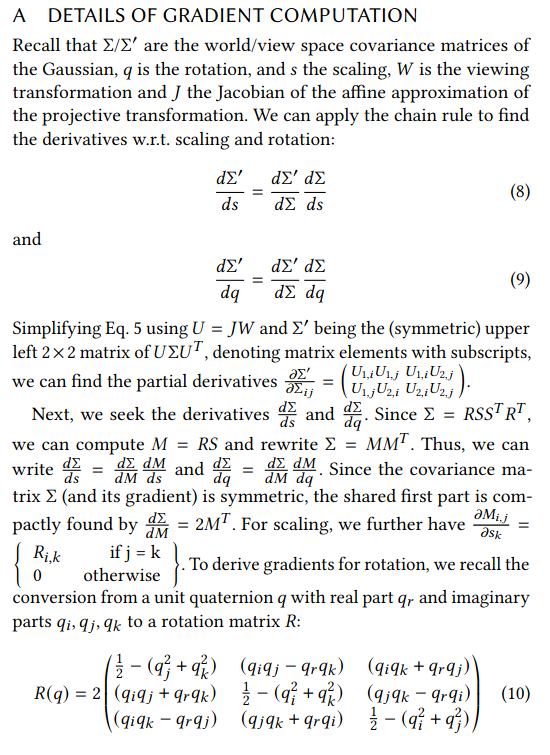

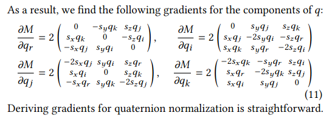


## B
```
Algorithm 1 Optimization and Densification
w, h: width and height of the training images
M ← SfM Points           ⊲ Positions
S, C, A ← InitAttributes() ⊲ Covariances, Colors, Opacities
i ← 0                    ⊲ Iteration Count
while not converged do
    V, Î ← SampleTrainingView()      ⊲ Camera V and Image
    I ← Rasterize(M, S, C, A, V)    ⊲ Alg. 2
    L ← Loss(I, Î)                  ⊲ Loss
    M, S, C, A ← Adam(∇L)           ⊲ Backprop & Step
    if IsRefinementIteration(i) then
        for all Gaussians (μ, Σ, c, α) in (M, S, C, A) do
            if α < ε or IsTooLarge(μ, Σ) then
                ⊲ Pruning
                RemoveGaussian()
            end if
            if ∇p L > τp then
                ⊲ Densification
                if ∥S∥ > τS then
                    ⊲ Over-reconstruction
                    SplitGaussian(μ, Σ, c, α)
                else
                    ⊲ Under-reconstruction
                    CloneGaussian(μ, Σ, c, α)
                end if
            end if
        end for
    end if
    i ← i + 1
end while
```

# C. 光栅化器细节（Algorithm 2）

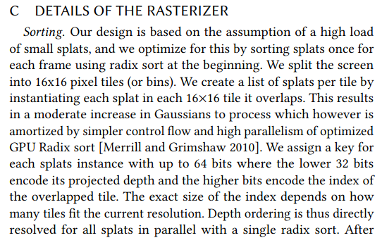
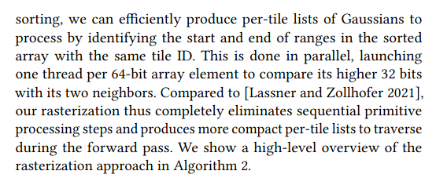

```
Algorithm 2 GPU software rasterization of 3D Gaussians
w, h: width and height of the image to rasterize
M, S: Gaussian means and covariances in world space
C, A: Gaussian colors and opacities
V: view configuration of current camera

function Rasterize(w, h, M, S, C, A, V)
    CullGaussian(p, V)                  ⊲ Frustum Culling
    M', S' ← ScreenspaceGaussians(M, S, V) ⊲ Transform
    T ← CreateTiles(w, h)
    L, K ← DuplicateWithKeys(M', T)     ⊲ Indices and Keys
    SortByKeys(K, L)                    ⊲ Globally Sort
    R ← IdentifyTileRanges(T, K)
    I ← 0                               ⊲ Init Canvas
    for all Tiles t in I do
        for all Pixels i in t do
            r ← GetTileRange(R, t)
            I[i] ← BlendInOrder(i, L, r, K, M', S', C, A)
        end for
    end for
    return I
end function
```
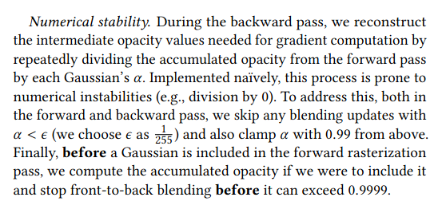

## D
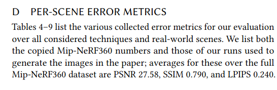

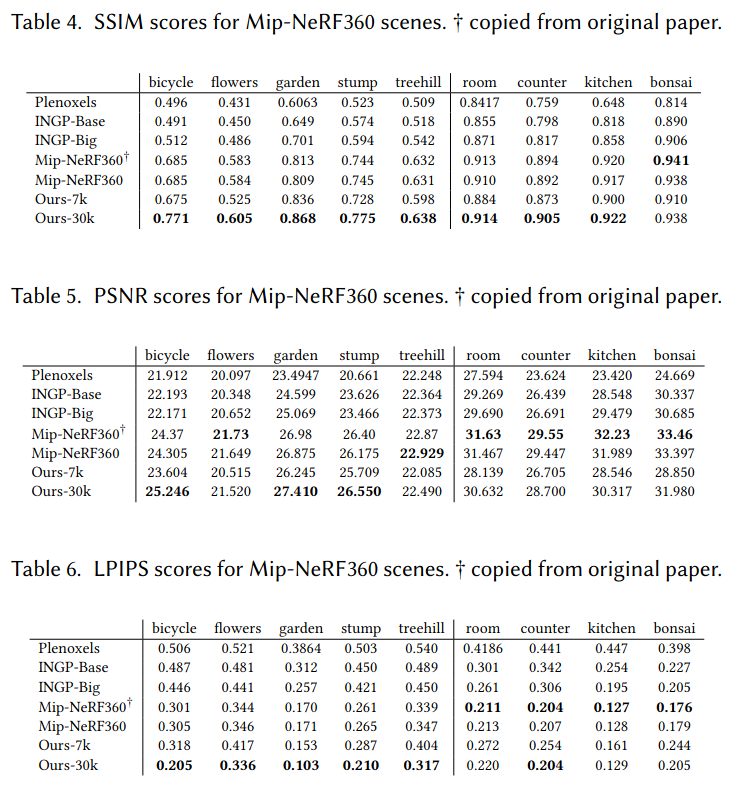

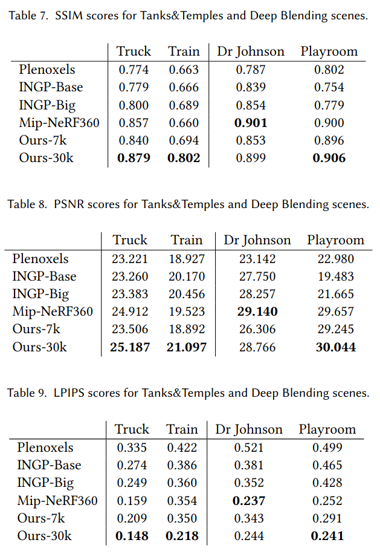

