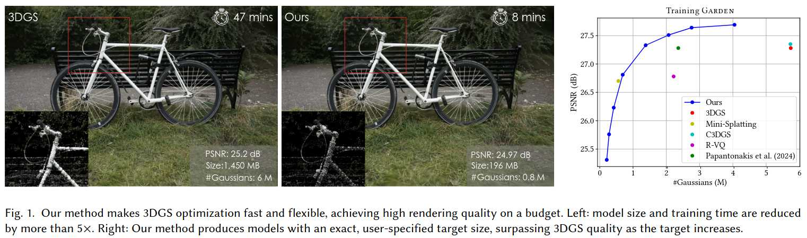
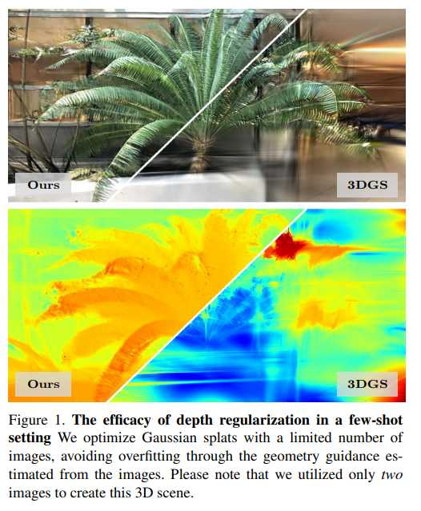
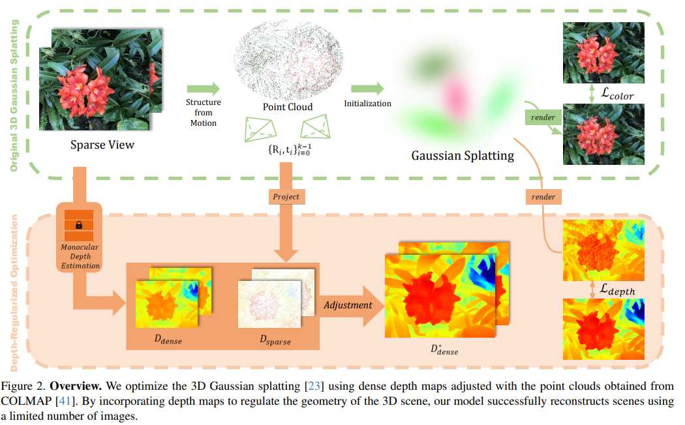

# Awesome 3DGS papers

**Project** : [awesome-3D-gaussian-splatting](https://mrnerf.github.io/awesome-3D-gaussian-splatting)
https://github.com/MrNeRF

# LichtFeld-Studio
**Code** : [LichtFeld-Studio](https://github.com/MrNeRF/LichtFeld-Studio)

# Taming 3DGS: High-Quality Radiance Fields with Limited Resources

**Project** : [Taming 3DGS](https://humansensinglab.github.io/taming-3dgs/)
**Code**: [Github](https://github.com/HumanSensingLab/taming-3dgs)

**摘要**

3D 高斯分布 (3DGS) 凭借其快速、可解释且高保真度的渲染能力，彻底革新了新视角合成。然而，其资源需求限制了其可用性。尤其是在资源受限的设备上，训练性能会迅速下降，并且由于模型内存消耗过大，训练过程常常无法完成。该方法会使用无限数量的高斯函数收敛，其中许多函数是冗余的，这会导致渲染速度过慢，并使其无法应用于需要固定大小输入的下游任务。为了解决这些问题，我们着手解决在有限预算内训练和渲染 3DGS 模型的挑战。

我们采用引导式、纯建设性的致密化过程，引导致密化过程趋向于高斯分布，从而提高重建质量。模型大小以可控的方式持续增加，直至达到精确的预算，并使用基于分数的高斯致密化方法，并利用训练时间先验来衡量其贡献。
我们进一步解决了训练速度方面的障碍：在仔细分析 3DGS 原始流程后，我们推导出更快、数值等效的梯度计算和属性更新解决方案，其中包括一种用于高效反向传播的替代并行化方法。我们还在适当的情况下提出了质量保持近似方法，以进一步缩短训练时间。

综上所述，这些增强功能共同构成了一个稳健且可扩展的解决方案，它不仅缩短了训练时间，降低了计算和内存需求，还确保了高质量。我们的评估表明，在预算有限的条件下，我们利用 3DGS 获得了具有竞争力的质量指标，同时模型大小和训练时间都减少了 4-5 倍。在预算更充裕的情况下，我们的测量质量甚至超过了他们的测量结果。这些进步为在受限环境（例如移动设备）下进行新视图合成打开了大门。

# Depth-Regularized Optimization for 3D Gaussian Splatting in Few-Shot Images

**Project** : [Depth-Regularized](https://robot0321.github.io/DepthRegGS/index.html)
**Code**: [Github](https://github.com/robot0321/DepthRegularizedGS)

**摘要**
本文提出了一种在有限图像数量下优化高斯分布并避免过拟合的方法。通过组合大量高斯分布来表示三维场景，可以获得出色的视觉质量。然而，当图像数量较少时，这种方法容易导致训练视图过拟合。为了解决这个问题，我们引入了稠密深度图作为几何指导，以缓解过拟合。我们使用预训练的单目深度估计模型，并使用稀疏 COLMAP 特征点对齐比例和偏移量来获取深度图。调整后的深度图有助于基于颜色优化三维高斯分布，减少浮动伪影，并确保遵循几何约束。我们在 NeRF-LLFF 数据集上验证了该方法，其中包含数量不等的少量图像。与仅依赖图像的原始方法相比，我们的方法展现了更稳健的几何结构。

# Meshing

