# ALIKE: 准确且轻量的关键点检测与描述符提取

Xiaoming Zhao, Xingming Wu, Jinyu Miao, Weihai Chen*, Member, IEEE, Peter C. Y. Chen, and Zhengguo Li*, Senior Member, IEEE

**摘要**—现有方法以不可微分的方式检测关键点，因此无法通过反向传播直接优化关键点的位置。为解决此问题，我们提出了一个部分可微分的关键点检测模块，可输出准确的亚像素关键点。接着提出了重投影损失来直接优化这些亚像素关键点，并提出了分散峰值损失以进行精确的关键点正则化。我们还以亚像素方式提取描述符，并使用稳定的神经重投影误差损失对其进行训练。此外，设计了一个轻量级网络用于关键点检测和描述符提取，该网络在商用 GPU 上对 640x480 图像可达到 95 帧/秒的运行速度。在单应性估计、相机姿态估计和视觉（重）定位任务上，所提方法达到了与最先进方法相当的性能，同时大大减少了推理时间。

**索引术语**—关键点检测，关键点描述符，深度学习，局部特征，图像特征提取，图像匹配

## **I. 引言**

稀疏关键点和描述符是用于高效图像匹配的紧凑表示[1]。因此，它们被广泛应用于实时视觉应用，如同时定位与地图构建（SLAM）系统[2],[3]和高动态范围成像（HDRI）[4],[5]。

对于关键点检测和描述符提取，早期的手工设计算法[6]-[8]基于有限的人类启发式规则构建，这可能导致在复杂图像中产生不稳定的关键点和易混淆的描述符。因此，近年来人们探索使用神经网络来完成此任务。早期基于神经网络的方法主要专注于从图像块中提取描述符[9]-[11]。之后，许多优秀的方法通过单一网络解决关键点检测和描述符提取问题[12]-[15]。其中一些方法[12],[13],[16]-[20]将关键点检测视为一个得分图估计问题，其中像素的得分表示其是关键点的概率。然后他们使用合成的真实得分图和/或图像块的相似性来训练网络。其他方法[14],[15],[21],[22]基于密集特征图的空间和/或通道变化来定义得分图。

然而，这两类方法都必须使用非极大值抑制（NMS）在得分图上检测关键点。NMS 简单地选择具有局部最大得分的像素，它是不可微分的，梯度无法通过它反向传播（图 1 左下方）。因此，检测到的关键点位置无法被直接优化。我们观察到，关键点由其局部得分块（图 1 中间得分块中的绿色区域）支持。局部得分分布的变化会影响关键点位置，即使最大得分的位置保持不变。这使我们能够通过局部得分分布来精确捕捉细微变化。因此，我们提出了一个部分可微分的关键点检测（DKD）模块（图 1）。该模块从局部得分块中提取可微分的关键点。因此，梯度可以从关键点反向传播到得分图（图 1 中间行）。我们提出了关键点重投影损失来训练从 DKD 检测到的亚像素关键点，该损失直接最小化图像间检测到的关键点的重投影距离。受峰值损失[13],[20]启发，进一步引入了分散峰值损失，以避免得分图上出现斑点状得分，这迫使得分图在关键点位置精确地“尖锐”。

除了从得分图获取亚像素关键点外，描述符也从密集描述符图中以亚像素方式采样（图 1）。训练稀疏描述符的广泛使用方法是三元组损失[12],[14],[15],[20]，但我们的实验表明，使用三元组损失训练亚像素稀疏描述符是棘手且不稳定的，因为它们仅覆盖整个描述符图中的采样关键点。受稀疏到稠密匹配方法[26]-[29]的启发，我们采用了最近提出的神经重投影误差（NRE）损失[29]，该损失在训练中覆盖整个描述符图，从而提供更稳定的收敛。

另一方面，得分图和描述符图的估计必须非常高效，因为关键点检测和描述符提取是许多实时应用的基础任务。然而，现有方法更关注匹配性能而非运行效率。为了进一步提高机器人[30]的运行效率，通过拼接多层级特征[15],[20],[31]设计了一个轻量级卷积神经网络（CNN），以兼顾定位精度和表示能力。实验表明，该轻量级网络具有与现有方法相当的性能，同时运行速度快得多。

总而言之，本文的主要贡献如下：

- 我们提出了一个可微分的关键点检测模块，以及用于精确和可重复关键点训练的重投影损失和分散峰值损失。
- 我们采用 NRE[29]损失来估计的稠密描述符图进行训练，使得模型比使用三元组损失收敛更稳定。
- 设计了一个聚合分层特征的高效轻量级网络，用于关键点检测和描述符提取，该网络在商用 GPU 上可达到 95 FPS（帧/秒）的运行速度，同时实现与最先进（SOTA）方法相当的性能。

本文其余部分组织如下。第二部分回顾了基于深度学习的方法。第三部分介绍了轻量级网络，提出了可微分关键点检测模块，并介绍了训练损失。第四部分首先分析了所提方法的各个部分，然后在不同任务上进行了评估和讨论。最后，第五部分给出了结论。

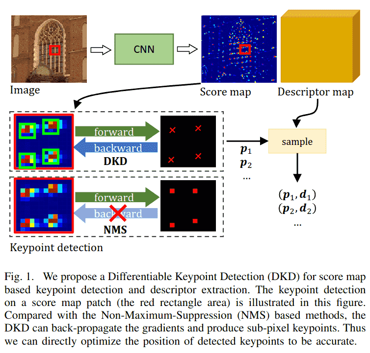

---

## **II. 相关工作**

基于深度学习的方法大致可分为三类：基于图像块的方法、基于得分图的方法以及描述与检测方法。

### **A. 基于图像块的方法**

早期的基于图像块的方法仅从图像块中提取描述符。Matchnet[32]估计描述符的相似性，并使用交叉熵损失训练它们。之后，TFeat[33]引入了用于图像块描述符的三元组损失。随后它被广泛用于后来的基于图像块的方法[9]-[11],[16]。L2-Net[9]提出了一种渐进式采样策略用于三元组采样。LIFT[16]模仿了 SIFT[6]。HardNet[10]和 SOSNet[11]引入了最困难负样本三元组和描述符的二阶相似性。然而，基于图像块的方法仅关注描述符提取，并且其感受野局限于图像块内。

### **B. 基于得分图的方法**

这些方法估计一个得分图和一个描述符图，其中得分图表示关键点概率。Tilde[18]首先在网络摄像头数据集上以 SIFT[6]关键点作为真实值训练得分图。Quad-networks[19]通过排序得分来训练得分图，以消除对真实标注的需求。KeyNet[34]使用手工设计和学习到的特征来估计得分图，并使用 softargmax[23]从得分图中提取关键点。除了纯关键点检测，最近的方法同时估计得分图和描述符图。LFNet[17]也使用 softargmax[23]，但它仍然在得分图上训练而不是在关键点上。SuperPoint[12]首先在合成数据集上训练一个 MagicPoint 模型，然后通过单应性自适应策略在真实图像上引导得分图，其描述符使用三元组损失训练。该策略也被 MLIFeat[31]和 SEKD[20]采用。R2D2[13]将关键点识别为图像中可靠且可重复的位置，并通过 AP 损失[35]训练可靠性。HDD-Net[36]在网格中使用 softargmax 得分对特征进行加权，以同时训练得分图和特征图。此外，DISK[37]和 reinforced SP[38]将关键点检测和描述符匹配放宽为概率过程，并使用强化学习训练网络。

然而，除了 KeyNet[34]之外，所有这些方法都在中间得分图上训练而不是直接在关键点上训练，因为它们使用不可微分的 NMS 提取关键点。我们的 DKD 与 KeyNet[34]最为相似，也利用了 softargmax。但我们的方法不需要手工特征和任何伪关键点标注。KeyNet[34]在固定块上检测关键点，无法处理块边界上的关键点，而我们的关键点从灵活的可能位置提取，因此没有边界问题。除了关键点训练，先前工作主要采用三元组损失训练描述符，这在我们的实验中被证明对于亚像素描述符是不稳定的。受稀疏到稠密匹配[27]-[29]的启发，我们利用 NRE 损失[29]来训练亚像素描述符。

### **C. 描述与检测方法**

与基于得分图的方法（先检测后描述）不同，描述与检测方法将关键点识别为图像中的显著位置，并通过计算描述符图或特征图的独特性来生成得分图。D2Net[14]首次提出这一概念，它在描述符图上应用通道间比率最大化（ratio-to-max）和空间维度的 softmax 来计算得分图。ASLFeat[15]通过在多层级特征图上使用通道维和空间维的峰值度（peakiness）改进了它。UR2KiD[22]使用特征的 L2 响应计算得分图。D2D[21]从特征图中选择绝对和相对显著点作为关键点。然而，它们也必须监督计算出的得分图而不是直接在关键点上监督，因为它们也使用不可微分的 NMS 来检测关键点。

---

## *III. 方法**

遵循基于得分图的方法[12],[13]，对于输入图像 $I\in R^{H\times W\times 3}$，网络首先估计一个得分图 $S\in R^{H\times W}$ 和一个描述符图 $D\in R^{H\times W\times d i m}$。然后使用 DKD 从得分图 S 中检测亚像素关键点 $\left\{p=[u, v]^{T}\right\}$，并从 D 中采样它们对应的描述符 $\left\{d\in R^{\text{dim}}\right\}$。接下来，我们首先介绍网络架构和 DKD 模块。然后介绍用于精确关键点和判别性描述符的训练损失。

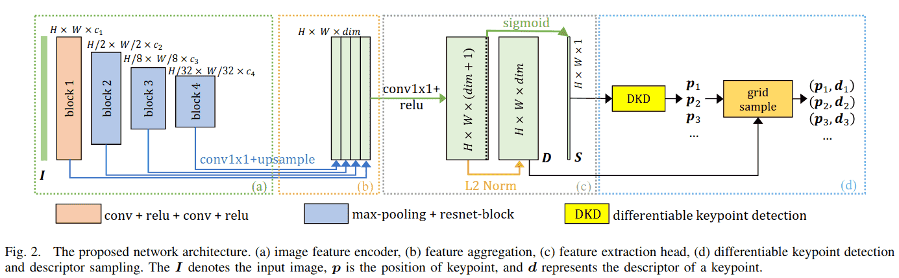

### **A. 网络架构**

如图 2 所示，网络被设计得尽可能轻量。它只有一个用于特征提取的基础编码器。然后特征聚合模块组装多层级特征[15],[20],[31]以保留定位和表示能力。为了获得精确的定位性能，特征提取头在原始图像分辨率下估计得分图 S 和描述符图 D。每个部分的细节如下：
(a) **图像特征编码器** 将输入图像 $I\in R^{H\times W\times 3}$ 编码为特征图。它包含四个块。第一个块是一个两层的 $3\times 3$ 卷积，带有"ReLU"激活[40]，最后三个块包含一个最大池化层和一个 $3\times 3$ 的基础 ResNet 块[41]。第 i 个模块的输出特征数量记为 $c_i$。块 2 中最大池化的下采样率为 $1/ 2$，块 3 和 4 中为 $1/ 4$。在这种配置下，图像上的最大感受野为 $204\times 204$。
(b) **特征聚合模块** 聚合来自编码器的多层级特征。首先使用 $1\times 1$ 卷积和双线性上采样来调整通道数，然后将它们简单地拼接在一起。
(c) **特征提取头** 输出一个 $H\times W\times($ dim+ 1) 的特征图，其中前 dim 个通道经过 L2 归一化作为描述符图 D，最后一个通道通过"Sigmoid"激活函数归一化作为得分图 S。
(d) **可微分关键点检测和描述符采样** 首先从得分图 S 中检测亚像素关键点（第 III-B 节），然后从稠密描述符图 D 中采样它们的描述符。

### **B. 可微分关键点检测模块**
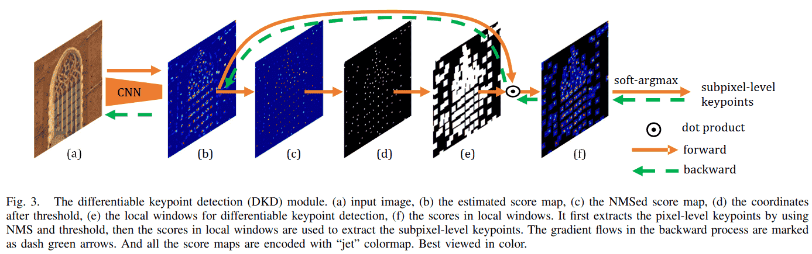

为了在得分图 S 中检测关键点，一种广泛使用的方法是使用 NMS 在局部 $N\times N$ 窗口中找到最大得分位置：
$$[\hat{i},\hat{j}]_{N M S}^T=\arg\max_{i, j}\{s(i, j)\mid 0\leq i, j<N\},$$
其中 s(i, j)表示局部位置(i, j)的得分。然而，在这个公式中，输出位置与得分图解耦，因此这是一个不可微分的操作，无法利用深度学习的能力。

为了使关键点与得分图耦合，我们提出使用 softargmax 从局部窗口中提取可微分关键点。形式上，首先通过抑制局部 $N\times N$ 窗口中的非极大值得分 $s=S(u, v)$ 来获得 NMS 处理后的得分图（图 3(c)）：
$$ s=\begin{cases}s*{\max}& s=s*{\max}\\ 0&\text{ others}\end{cases},$$
其中 $s_{\max}=\max s(i, j)$ 是局部最大得分。然后，对 NMS 处理后的得分图应用阈值 th 以过滤掉低响应得分（图 3(d)）。在基于 NMS 的方法中，关键点 $\left\{[u, v]_{N M S}^{T}\right\}$ 在此步骤中被提取。我们更进一步，查看以 NMS 关键点 $\left\{[u, v]_{N M S}^T\right\}$ 为中心的局部窗口（图 3(f)）中的得分，并使用 softargmax 提取局部软坐标 $\left\{[\hat{i},\hat{j}]_{\text{soft}}^{T}\right\}$。

考虑一个局部 $N\times N$ 窗口，其得分使用 softmax 进行归一化：
$$ s^{\prime}(i, j)=\operatorname{softmax}\left(\frac{s(i, j)-s*{\max}}{t*{\text{det}}}\right),\qquad(3)$$
其中 $t_{\text{det}}$ 是控制归一化“锐度”的温度参数。softmax将x归一化为 $\operatorname{softmax}(x)=\frac{\exp(x)}{\sum\exp(x)}$。$s^{\prime}(i, j)$ 表示 $[i, j]^{T}$ 是关键点的概率。因此，局部窗口中关键点的期望位置可以通过积分回归[24],[25]给出：
$$[\hat{i},\hat{j}]_{\text{soft}}^{T}=\sum_{0\leq i, j<N} s^{\prime}(i, j)[i, j]^{T}.\qquad(5)$$
最终的关键点位置是NMS位置和软偏移量的和：
$$p=[u, v]_{\text{soft}}^{T}=[u, v]_{N M S}^{T}+[\hat{i},\hat{j}]\_{\text{soft}}^{T}.\qquad(6)$$

在这种形式下，第一个 NMS 项 $[u, v]_{N M S}^T$ 表示像素级关键点位置，是不可微分的。而第二个局部软坐标项 $[\hat{i},\hat{j}]_{\text{soft}}^{T}$ 表示对 $[u, v]_{N M S}^{T}$ 的偏移，并与局部 $N\times N$ 窗口中的得分耦合，使其在该窗口内可微分。因此，整个模块在技术上是部分可微分的。在反向传播中，梯度通过第二项流向局部窗口中的得分，因此优化输出关键点位置 $[u, v]_{\text{soft}}^{T}$ 等价于优化局部窗口中的得分。因为有很多关键点，得分图在各自的局部窗口内被稀疏地优化。这类似于强化方法[37],[38]中的采样过程，不同之处在于梯度可以流回这些窗口中的得分。

### **C. 学习精确关键点**

精确的关键点应精确定位在可重复的位置（例如角点）。为此，我们提出了重投影损失和分散峰值损失。重投影损失直接优化关键点的位置，分散峰值损失确保得分在关键点位置最大，从而产生精确的关键点。

对于两幅图像 $I_A$ 和 $I_B$，网络估计它们的得分图 $S_{A}$ 和 $S_{B}$，DKD 模块提取关键点 $p_{A}$ 和 $p_{B}$。然后将 $p_{A}$ 通过一个可微分的变换函数 $\operatorname{warp}_{A B}$ 变换到图像 $I_{B}$：
$$ p*{A B}=\operatorname{warp}*{A B}\left(p*A\right),\qquad(7)$$
其中 $\operatorname{warp}*{A B}$ 可以是任何将关键点从图像 A 投影到图像 B 的可微分变换函数，例如单应性投影、3D 透视投影，甚至是光流。单应性投影由下式给出：
$$\left[p_{A B}^{T},1\right]^{T}=H_{A B}\left[p_{A}^{T},1\right]^{T},\qquad(8)$$
其中 $H_{A B}$ 表示 $3\times 3$ 单应性矩阵。3D 透视投影为：
$$ p*{A B}=\pi\left(d_A R*{A B}\pi^{-1}\left(p*A\right)+t*{A B}\right),\qquad(9)$$
其中 $\pi(P)=K P/ Z$ 将相机坐标系中的 3D 点 $P=[X, Y, Z]^T$ 投影到图像平面上的像素坐标，$K\in R^{2\times 3}$ 是相机内参；$R_{A B}$ 和 $t_{A B}$ 分别是从图像 A 到 B 的 3D 点的旋转和平移；$d_A$ 表示关键点 $p_A$ 的深度。

**1) 重投影损失：** 对于一个变换后的关键点 $p_{A B}$，我们在 $t h_{g t}$ 像素距离内找到其最近的检测关键点 $p_{B}$ 作为其对应点。$p_{A B}$ 和 $p_{B}$ 之间的距离定义为：
$$\operatorname{dist}_{A B}=\left\|p_{A B}-p_B\right\|_p,\qquad(10)$$
其中 p 是范数因子。受对称极线距离的启发，重投影损失以对称方式给出：
$$\mathcal{L}_{r p}=\frac{1}{2}\left(\operatorname{dist}_{A B}+\operatorname{dist}_{B A}\right).\qquad(11)$$
如图 4 所示，重投影损失的最小化通过调整关键点的位置来拉近变换关键点与其对应点。由于关键点是使用可微分的 DKD 从得分图中提取的，关键点位置可以通过优化与单个关键点对应的局部 $N\times N$ 窗口内的得分，在单个优化步骤中进行调整。它隐式地提供了关键点可重复性[42]，因为位于不可重复区域的关键点会导致较大的重投影误差。因此，不再需要其他相似性度量，如得分差异[34]、余弦相似度[13]或 Kullback-Leibler 散度[20]。

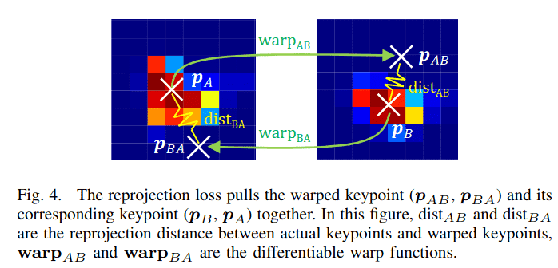

**2) 分散峰值损失：** 重投影损失的最小化通过方程(6)中的软项 $[\hat{i},\hat{j}]_{\text{soft}}^{T}$ 优化局部窗口中的得分。然而，改善 $[\hat{i},\hat{j}]_{\text{soft}}^{T}$ 的梯度步骤可能会影响 $[u, v]_{N M S}^{T}$。为了使它们的优化方向一致，我们对局部窗口中的得分进行正则化，使其“尖锐”：即关键点处得分高，局部窗口内周围得分低。在这种情况下，即使以 $[u, v]_{N M S}^{T}$ 为中心的局部窗口轻微移动，它仍然包含关键点，并且 $[\hat{i},\hat{j}]_{\text{soft}}^{T}$ 将被调整到相对于新窗口中心的新软偏移，使得关键点位置保持稳定。在先前的工作[13],[20]中，这个特性通过局部窗口中最大得分与平均得分之差来正则化，但这只考虑了得分块的统计特性，忽略了得分的空间分布。为了迫使得分块在关键点处精确地“尖锐”，我们提出了得分分散峰值损失（图 5）。它考虑了得分的空间分布，从而在关键点处产生更高的得分，在远离关键点处产生更低的得分。

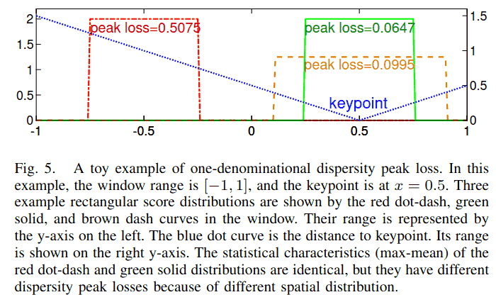

考虑一个 $N\times N$ 的得分块，块中每个像素 $[i, j]^{T}$ 到软检测关键点 $[\hat{i},\hat{j}]_{\text{soft}}^{T}$ 的距离为：
$$ d(i, j)=\left\{\left\|[i, j]-[\hat{i},\hat{j}]_{\text{soft}}\right\|\_p\mid 0\leq i, j<N\right\}.\qquad(12)$$
该块的分散峰值损失定义为：
$$\mathcal{L}_{p k}=\frac{1}{N^{2}}\sum\_{0\leq i, j<N} d(i, j) s^{\prime}(i, j),\qquad(13)$$
其中 $s^{\prime}$ 是方程(4)中的 softmax 得分。

好的，我们来重新翻译 **D. Learning discriminative descriptor** 这一节，并提供更丰富的结构和上下文。

### **D. 学习判别性描述符**

同一关键点（在不同图像中）的描述符应彼此相似，而不同关键点的描述符则应有所区别。这一特性被称为描述符的**判别性**。此前，判别性通常通过**三元组损失** 进行训练[10]-[12],[14],[15],[20],[33]。

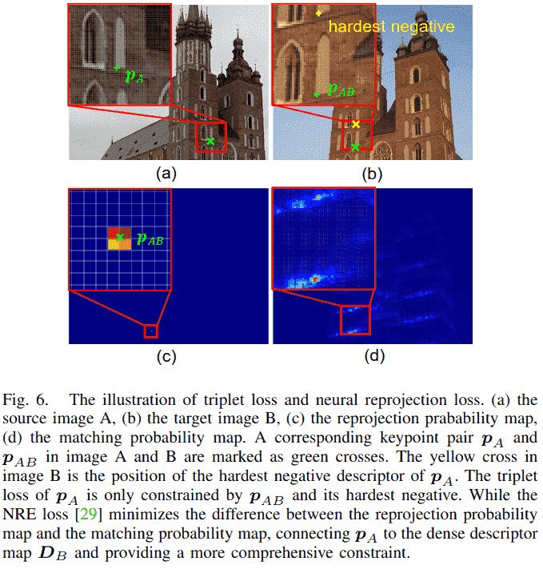

**1. 三元组损失的局限性**
然而，三元组损失仅针对从已检测到的关键点采样得到的**稀疏描述符**进行优化。这意味着，描述符图中未被选为关键点的位置所对应的描述符，在训练过程中并未受到直接约束。如图 6(b)所示，对于关键点 $p_A$，三元组损失仅利用了两个点的描述符：其对应点 $p_{AB}$ 的描述符以及最难负样本点（Hardest Negative）的描述符。因此，整个**稠密描述符图** 无法受到充分、全面的约束。

**2. 神经重投影误差损失的引入**
我们的实验表明，使用三元组损失来训练亚像素关键点对应的描述符是棘手且不稳定的。为了解决这一问题，并受到稀疏到稠密匹配方法[26]-[29]的启发，我们采用了新近提出的**神经重投影误差损失**[29]。该损失通过最小化**稠密重投影概率图** 与**稠密匹配概率图** 之间的差异，为整个稠密描述符图提供了全面的约束，从而带来了更稳定的训练过程（详见第 IV-D2 节）。

**3. NRE 损失的工作原理**
如图 6 所示，其核心思想如下：

- 对于图像 A 中的一个关键点 $p_A$ 及其通过变换函数 $\operatorname{warp}_{AB}$ 投影到图像 B 中的位置 $p_{AB}$，我们首先定义一个基于 $p_{AB}$ 的**重投影概率图** $q_r$（图 6c）。这个概率图使用双线性插值构建，在 $p_{AB}$ 周围的四个像素点上有非零值（$w_{00}$, $w_{01}$, $w_{10}$, $w_{11}$），其他位置为零。这模拟了 $p_A$ 在图像 B 中的理想对应点位置的不确定性（在亚像素级别）。
  $$\begin{align*} q_r\left(p_B\mid\right.\text{ warp}_{A B},\left.p_A\right):=& w_{00}[[ p_B=\left\lfloor p_{A B}\right\rfloor]]+\\ & w_{01}[[ p_B=\left\lfloor p_{A B}\right\rfloor+\left[0,1\right]^T]]+\\ & w_{10}[[ p_B=\left\lfloor p_{A B}\right\rfloor+\left[1,0\right]^T]]+\\ & w_{11}[[ p_B=\left\lfloor p_{A B}\right\rfloor+\left[1,1\right]^T]],\end{align*}\qquad(14)$$
  其中 $[[\cdot]]$ 是艾弗森括号，$\lfloor\cdot\rfloor$ 是向下取整函数。
- 同时，我们计算关键点 $p_A$ 的描述符 $d_{p_A}$ 与图像 B 的整个稠密描述符图 $D_B$ 的**相似度图** $C_{d_{p_A}, D_B}$（通过点积计算）：
  $$ C*{d*{p*A}, D_B}=D_B d*{p_A}.\qquad(15)$$
- 然后，将此相似度图通过一个带温度参数 $t_{des}$ 的 softmax 函数进行归一化，得到一个**匹配概率图** $q_m$（图 6d）。这个概率图表示，对于 $p_A$ 的描述符，图像 B 中每个像素点的描述符是它正确匹配对象的概率。
  $$ q*m\left(p_B\mid d*{p*A}, D_B\right):=\operatorname{softmax}\left(\frac{\overline{C}*{d*{p_A}, D_B}-1}{t*{d e s}}\right),\qquad(16)$$

**4. 损失函数定义**
NRE 损失的目标是让“网络预测的匹配概率图” $q_m$ 尽可能接近“由几何变换确定的真实重投影概率图” $q_r$。这通过最小化两者之间的**交叉熵** 来实现：
$$\begin{align*}& N R E\left(p_{A},\operatorname{warp}_{A B}, d_{p_{A}}, D_{B}\right)\\ &:=C E\left(q_{r}\left(p_{B}\mid\operatorname{warp}_{A B}, p_{A}\right)\| q_{m}\left(p_{B}\mid d_{p_{A}}, D_{B}\right)\right)\\ &=-\sum_{p_{B}\in\left\{I_{B},\text{ out}\right\}} q_{r}\left(p_{B}\mid p_{A B}\right)\ln\left(q_{m}\left(p_{B}\mid d_{p_{A}}, D_{B}\right)\right)\\ &=-\ln\left(q_{m}\left(p_{A B}\mid d_{p_{A}}, D_{B}\right)\right).\end{align*}\qquad(17)$$

最终，我们以对称的方式定义描述符损失函数，同时考虑从图像 A 到图像 B 和从图像 B 到图像 A 的匹配：
$$\begin{align*}\mathcal{L}_{d e}&=\frac{1}{N_A+N_B}*\\ &\left(\sum_{p_A\in I_A} N R E\left(p_A,\operatorname{warp}_{A B}, d_{p_A}, D_B\right)+\right.\\ &\left.\sum_{p_B\in I_B} N R E\left(p_B,\operatorname{warp}_{B A}, d_{p_B}, D_A\right)\right),\end{align*}\qquad(18)$$
其中 $N_{A}$ 和 $N_{B}$ 分别是图像 A 和 B 中的关键点数量。

### **E. 学习可靠关键点**

重投影损失和分散峰值损失提供了精确且可重复的关键点。然而，描述符图的空间特性未被考虑，因此关键点可能不可靠[13]，例如，关键点可能位于非判别性的低纹理区域。为了解决这个问题，我们基于NRE损失[29]中的匹配概率图引入了一个可靠性损失。

首先，通过归一化方程(15)中的相似性图 $C_{d_{p_{A}}, D_{B}}\in R^{H\times W}$ 得到匹配概率图：
$$\widetilde{C}_{d_{p_{A}}, D_{B}}=\exp\left(\frac{C_{d_{p_{A}}, D_{B}}-1}{t_{r e l}}\right),\qquad(19)$$
其中 $t_{r e l}$ 控制锐度。然后，关键点 $p_{A}$ 的可靠性定义为：
$$ r_{p_A}=\text{ bisampling}\left(\widetilde{C}_{d_{p_A}, D_B}, p_{A B}\right),\qquad(20)$$
其中 bisampling $(M, p)$ 是在位置 $p\in R^{2}$ 处对概率图 $M\in R^{H\times W}$ 进行双线性采样。

直观地说，$r_{p_A}$ 评估了 $p_A$ 的匹配质量。如果 $p_A$ 位于不可靠的低纹理或重复区域，该区域的整体相似度会较高。因此，归一化后的相似性图 $\widetilde{C}_{d_{p_{A}}, D_{B}}$ 的值较低，采样得到的分数 $r_{p_{A}}$ 也较小，表明 $p_{A}$ 不可靠。

考虑图像A中所有有效的关键点，我们以类似于D2Net[14]和ASLFeat[15]的方式定义它们的可靠性损失：
$$\mathcal{L}_{\text{reliability}}^A=\frac{1}{N_A}\sum_{\begin{subarray}{c}p_A\in I_A,\\ p_{A B}\in I_B\end{subarray}}\frac{s_{p_A} s_{p_{A B}}}{\sum_{p_{A}^{\prime}\in I_A,} s_{p_A^{\prime}} s_{p_{A B}^{\prime}}}\left(1-r_{p_A}\right),\qquad(21)$$
其中 $N_{A}$ 是图像A中的关键点数量。对于图像 $A$ 中的每个关键点 $p_{A}$，$p_{A B}$ 是其在图像B中的对应投影关键点（方程(7)）。$s_{p}$ 表示关键点p在其对应图像中的得分值。类似地，可靠性损失也以对称方式给出：
$$\mathcal{L}_{r l}=\frac{1}{2}\left(\mathcal{L}_{\text{reliability}}^{A}+\mathcal{L}_{\text{reliability}}^{B}\right).\qquad(22)$$

---

## **IV. 实验**

在本节中，我们首先介绍数据集、训练细节和评估指标。为了分析所提出的方法，对网络架构和损失项进行了消融研究。最后，我们报告了在单应性估计、相机姿态估计和视觉（重）定位任务上与最先进方法的比较结果。

#### **表I: 网络配置**
此表详细列出了ALIKE不同大小模型的具体配置参数。

| Models | $c_{1}$ | $c_{2}$ | $c_{3}$ | $c_{4}$ | dim | $N_{\text{head}}$ | MP | GFLOPs |
| :--- | :---: | :---: | :---: | :---: | :---: | :---: | :---: | :---: |
| **Tiny** | 8 | 16 | 32 | 64 | 64 | 1 | 0.080 | 2.109 |
| **Small** | 16 | 16 | 48 | 96 | 96 | 1 | 0.142 | 3.893 |
| **Normal** | 16 | 32 | 64 | 128 | 128 | 1 | 0.318 | 7.909 |
| **Large** | 32 | 64 | 128 | 128 | 128 | 2 | 0.653 | 19.685 |

*注: $c_i$ 为各模块通道数，dim为描述符维度，$N_{head}$ 为特征提取头层数，MP为参数量（百万），GFLOPs为在640x480图像上的计算量。*

### **A. 数据集**

*   **MegaDepth**[43] 数据集包含著名地标的旅游照片及其每张图像的深度和相机姿态，这使我们能够在图像之间建立密集的对应关系。我们采用DISK[37]中生成的图像对来训练我们的模型。通过共可见性启发式方法，它从与IMW2020[45]验证集和测试集不重叠的场景中生成图像对，最终得到总共63k张图像的135个场景。
*   **HPatches**[46] 数据集包含57个光照场景和59个视角场景的平面图像。每个场景有5个具有真实单应性矩阵的图像对。遵循D2Net[14]，排除了八个不可靠的场景。我们在此数据集上进行了消融研究和单应性估计。
*   **IMW2020**[45] 同样是使用COLMAP[44]通过旅游照片构建的。它提供了一个用于相机姿态估计的标准流程，我们用它来比较所提方法与现有方法。
*   **Aachen Day-Night**[47] 数据集使我们能够评估描述符在视觉（重）定位任务上的有效性。它试图基于白天图像预建的3D模型来定位98张在夜间拍摄的查询图像。

### **B. 训练细节**

1.  **损失计算细节**：我们使用窗口大小 $N=5$ 的DKD来检测400个关键点，并在非显著位置随机采样另外400个关键点。在重投影损失中，$t h_{g t}=5$，范数因子 $p=1$。总体损失为：
    $$\mathcal{L}=w_{r p}\mathcal{L}_{r p}+w_{p k}\mathcal{L}_{p k}+w_{r l}\mathcal{L}_{r l}+w_{d e}\mathcal{L}_{d e}.\qquad(23)$$
    在我们的实验中，$w_{r p}=1, w_{p k}=1, w_{r l}=1$，$w_{d e}=5$。我们将归一化温度设置为 $t_{d e t}=0.1, t_{r e l}=1$，和 $t_{d e s}=0.02$。
2.  **训练设置**：训练中图像被裁剪并调整大小为 $480\times 480$。网络使用ADAM优化器[48]进行训练，学习率从零开始，在500步内预热到 $3 e^{-3}$，然后保持在 $3 e^{-3}$。我们将批大小设置为1，但在16个批次上累积梯度。在这些设置下，所提出的模型在NVIDIA Titan RTX上大约两天收敛。

### **C. 评估指标**

假设图像A和图像B分别有 $N_{A}^{\prime}$ 和 $N_{B}^{\prime}$ 个共可见关键点，则共可见关键点的数量定义为 $N_{cov}=(N_{A}^{\prime}+N_{B}^{\prime})/2$。其中，我们得到 $N_{gt}$ 个重投影距离小于3个像素的真实关键点对。另一方面，通过描述符的相互最近邻匹配得到 $N_{\text{putative}}$ 个初始匹配。并通过评估重投影距离在不同像素阈值下获得 $N_{inlier}$ 个内点匹配。遵循先前的工作[12],[46]，我们采用以下指标：
1.  **关键点可重复性** 表示为 $Rep=N_{gt}/N_{cov}$。
2.  **匹配分数** 表示为 $MS= N_{inlier}/N_{cov}$。
3.  **平均匹配准确率（MMA）** 表示所有图像对匹配准确率的平均值，表示为 $N_{inlier}/N_{putative}$。
4.  **平均单应性准确率（MHA）** 表示所有图像对单应性准确率的平均值，定义为使用估计的单应性矩阵计算出的正确图像角点的百分比。

#### **表II: 网络架构消融研究（在HPatches数据集上）**
此表展示了不同大小模型的性能对比，帮助选择最佳权衡模型。

| Models | Rep | MS | MMA@3 | MHA@3 |
| :--- | :---: | :---: | :---: | :---: |
| **Tiny** | 56.19% | 32.54% | 63.92% | 70.56% |
| **Small** | 58.25% | 34.96% | 67.61% | 73.52% |
| **Normal** | 54.93% | 38.58% | 70.78% | 75.74% |
| **Large** | 53.70% | 39.80% | 70.50% | 76.85% |

*注: Rep为重复性，MS为匹配分数，MMA@3为3像素阈值下的平均匹配精度，MHA@3为3像素阈值下的平均单应性估计精度。*

#### **表III: 损失函数消融研究**
此表通过控制变量法验证了各个损失函数的有效性。

| RP | PK | RL | DE | Tri | Rep | MS | MMA@3 | MHA@3 |
| :---: | :---: | :---: | :---: | :---: | :---: | :---: | :---: | :---: |
| | | √ | √ | | 59.26% | 34.55% | 71.83% | 67.22% |
| | √ | √ | √ | | 48.75% | 30.88% | 62.95% | 72.59% |
| √ | | √ | √ | | 65.77% | 38.12% | 74.44% | 70.74% |
| √ | √ | | √ | | 51.11% | 33.77% | 65.23% | 74.44% |
| **√** | **√** | **√** | **√** | | **54.93%** | **38.58%** | **70.78%** | **75.74%** |
| √ | √ | √ | | √ | 57.91% | 14.13% | 39.38% | 60.74% |

*注: RP=重投影损失, PK=分散峰值损失, RL=可靠性损失, DE=描述符损失(NRE), Tri=三元组损失。加粗行为最终采用的损失组合。*

---

### **D. 消融研究**

我们在HPatches数据集[46]上进行了单尺度的消融研究。DKD模块中的得分阈值th为0.2。最多检测5000个关键点。我们在不失一般性的情况下评估了MMA@3和MHA@3。

1.  **网络架构消融研究**：轻量级网络可以提高运行效率，但性能较差。为了选择一个能够实时运行且性能没有显著下降的网络，我们研究了四种网络变体（表I）。如表II所示，与“Tiny”网络相比，“Normal”网络的匹配分数、匹配准确率和单应性准确率提高了约6%。然而，尽管复杂度翻倍，“Large”网络与“Normal”网络相比仅提高了约1%，边际效益递减。因此，我们使用“Normal”网络以保持实时性能。
    

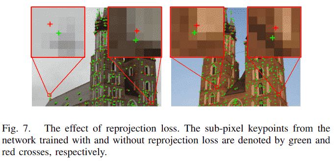

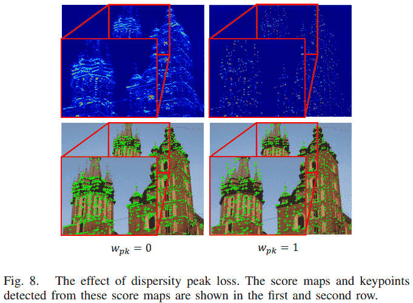

2.  **损失函数消融研究**：为了研究损失函数，我们使用不同的损失配置训练“Normal”网络（表III）。

    *   **重投影损失** 直接优化关键点位置，应产生精确的关键点。图7中，使用和不使用重投影损失训练的网络所提取的关键点视觉比较验证了这一预期：使用重投影损失训练的网络的关键点（绿色十字）比不使用重投影损失的关键点（红色十字）更精确。表III显示了定量比较：与第二行相比，第五行以及第三行相比，重投影损失提高了所有指标。
    

    *   **分散峰值损失** 正则化得分块的形状。表III说明了一个有趣的现象：分散峰值损失提高了单应性准确率，但降低了可重复性和匹配准确率（第二行与第一行比较，第五行与第三行比较）。为了研究这一现象，图8可视化了使用和不使用分散峰值损失训练的网络所生成的得分图和关键点。使用分散峰值损失后，得分图变得“尖锐”，这提高了定位确定性和单应性准确率。而不使用分散峰值损失时，得分图不那么“尖锐”，关键点更可能拥挤在一起。这增加了在拥挤区域找到匹配的概率，因此有利于可重复性和匹配准确率。由于下游任务（本例中为单应性估计）的准确性更为重要，我们保留分散峰值损失作为得分图的正则化项。
    

    *   **描述符损失** 通过比较NRE损失[29]和三元组损失[33]进行研究。对于三元组损失，负描述符从关键点中挖掘（图6(b)），三元组边界（margin）为0.5。图9显示了使用亚像素关键点时三元组损失的训练过程。它陷入了一个局部最小值，损失接近但未超过三元组边界（所有描述符变得相同）。因此其性能极差（表III最后一行）。我们发现调整三元组损失的超参数非常棘手，因此我们采用NRE损失[29]，因为它具有稳定的收敛性，尽管由于方程(15)中密集相似性图的计算需要更多的GPU内存和训练时间。
    

    *   **可靠性损失** 确保关键点位于描述符具有判别性的区域。更可靠的关键点会产生更少的错误匹配，从而获得更高的匹配分数和准确率，如表III第四行和第五行所示。

#### **表IV: 在HPatches上的单应性估计结果对比**
此表将ALIKE与同期最先进方法进行了全面对比，包括复杂度、速度和精度。

| Models | Params/M | GFLOPs | FPS | MMA@1 | MMA@2 | MMA@3 | MHA@1 | MHA@2 | MHA@3 |
| :--- | :---: | :---: | :---: | :---: | :---: | :---: | :---: | :---: | :---: |
| D2-Net(MS)[14] | 7.635 | 889.40 | 6.60 | 9.78% | 23.52% | 37.29% | 5.19% | 21.30% | 38.33% |
| LF-Net(MS)[17] | 2.642 | 24.37 | 29.88 | 19.94% | 41.98% | 55.60% | 17.41% | 42.41% | 42.41% |
| SuperPoint[12] | 1.301 | 26.11 | 45.87 | 34.27% | 54.94% | 65.37% | **35.00%** | 58.33% | 70.19% |
| R2D2(MS)[13] | 0.484 | 464.55 | 8.70 | 33.31% | **62.17%** | **75.77%** | 35.74% | 59.44% | 71.48% |
| ASLFeat(MS)[15] | 0.823 | 44.24 | 8.96 | 39.16% | 61.07% | 72.44% | 37.22% | 61.67% | 73.52% |
| DISK[37] | 1.092 | 98.97 | 15.73 | **43.71%** | 66.98% | 77.59% | 34.07% | 57.59% | 70.56% |
| **ALIKE-N** | **0.318** | **7.91** | **95.19** | 43.52% | 63.14% | 70.78% | 42.04% | **62.78%** | **75.74%** |
| **ALIKE-L** | 0.653 | 19.68 | 68.18 | 43.90% | 63.11% | 70.50% | **45.00%** | 65.93% | 65.93% |
| **ALIKE-N(MS)** | **0.318** | 25.97 | 41.48 | 44.06% | 65.56% | 74.05% | 44.07% | 65.37% | 65.37% |
| **ALIKE-L(MS)** | 0.653 | 64.63 | 29.15 | 44.97% | 66.21% | 74.51% | **45.00%** | 65.37% | **65.37%** |

*注: 红色、绿色、蓝色分别标记前三名结果。ALIKE在保持极高速度(FPS)的同时，在衡量下游任务性能的MHA指标上表现优异。*

#### **表V: 在IMW2020上的相机姿态估计结果对比**
此表展示了方法在更复杂的真实世界姿态估计任务中的性能。

**立体任务 (Stereo)**
| Methods | GFLOPs | NF | Rep | MS | mAA(5°) | mAA(10°) | PPC |
| :--- | :---: | :---: | :---: | :---: | :---: | :---: | :---: |
| D2-Net(MS)[14] | 889.40 | 2046 | 16.80% | 29.30% | 6.06% | 12.27% | 0.0138 |
| SuperPoint[12] | 26.11 | 2048 | 36.40% | 63.00% | 19.71% | 28.97% | 1.1093 |
| R2D2(MS)[13] | 464.55 | 2048 | 42.90% | 74.60% | 27.20% | 39.02% | 0.0840 |
| ASLFeat(MS)[15] | 77.58 | 2043 | 43.10% | 74.90% | 22.62% | 33.65% | 0.4337 |
| DISK[37] | 98.97 | 2048 | **44.80%** | **85.20%** | **38.72%** | 51.22% | 0.5175 |
| **ALIKE-N** | **7.91** | 1803 | 43.30% | 81.10% | 35.12% | **47.18%** | **5.9652** |
| **ALIKE-L** | 19.68 | 1771 | 42.90% | 82.20% | 37.24% | 49.58% | 2.5187 |

**多视图任务 (Multiview)**
| Methods | NM | NL | TL | mAA(5°) | mAA(10°) |
| :--- | :---: | :---: | :---: | :---: | :---: |
| D2-Net(MS)[14] | 2045.60 | 1999.37 | 3.01 | 17.77% | 17.77% |
| SuperPoint[12] | 2048.00 | 1185.38 | 4.33 | 44.35% | 2.0935 |
| R2D2(MS)[13] | 2048.00 | 1225.85 | 4.28 | 53.13% | 53.13% |
| ASLFeat(MS)[15] | 157.51 | 1106.59 | 4.42 | 45.28% | 0.7168 |
| DISK[37] | 526.35 | **2424.80** | **5.50** | **63.25%** | **2.96%** |
| **ALIKE-N** | 276.48 | 1644.20 | 4.97 | 59.18% | 69.21% |
| **ALIKE-L** | **298.30** | 1693.31 | 5.02 | **60.30%** | 0.30% |

*注: NF=特征数，NM=匹配数，NL=三维路标点数，TL=轨迹长度，PPC=性能成本比。ALIKE在计算效率(PPC)上优势巨大。*

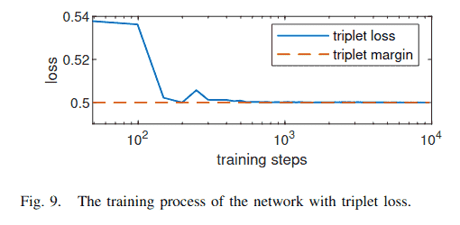

### **E. 与最先进方法的比较**

将所提出的方法与最先进方法在单应性估计、相机姿态估计和视觉（重）定位任务上进行比较。我们将所提出的方法表示为“ALIKE-[T/S/N/L][(MS)]”，其中“[T/S/N/L]”是模型大小（表I），“MS”表示多尺度关键点检测。

1.  **网络复杂度**：表IV报告了不同方法的复杂度，包括参数数量、GFLOPs（十亿次浮点运算）和推理FPS。可以看出，ALIKE-N的参数最少（318K），其次是R2D2[13]（484K）和ALIKE-L（653K）。然而，参数少的网络并不意味着计算量小，因为存在非参数化操作。例如，R2D2[13]尽管只有484K参数，但计算成本高达464.55 GFLOPs。而ALIKE-N（318K）和ALIKE-L（653K）分别只有7.91和19.68 GFLOPs。为了更直观的比较，表IV也报告了推理FPS。ALIKE-N、ALIKE-L和SuperPoint[12]是最快的，分别可以达到95.19、68.18和45.87 FPS。考虑到匹配性能，所提出的方法在提供精确变换估计的同时，推理时间也更短。
2.  **单应性估计**：遵循先前的工作[13]-[15]，我们在HPatches数据集[46]上进行了单应性估计。先前的工作侧重于匹配准确率（MMA），但我们认为这只是一个中间指标，因为关键点匹配的目标是下游的单应性估计。为了获得更好的单应性估计准确率，在更严格阈值下的MMA和单应性准确率（MHA）更为重要。因此，我们在表IV中报告了在更严格阈值下的MMA和MHA。由于DKD模块和提出的损失函数，所提出的方法在更严格阈值下的MMA远优于先前的工作。这表明通过所提出的方法获得了更精确的关键点。更重要的是，对于单应性准确率MHA，所提出的方法优于SOTA方法。与MHA@3最高的方法ASLFeat(MS)[15]相比，提出的ALIKE-N和ALIKE-L分别将MHA@3提高了2.22%和3.33%，同时将计算复杂度降低了约5.6倍和2.2倍。
3.  **相机姿态估计**：IMW2020[45]包括用于姿态估计的立体和多视图任务。为了公平比较，我们为每种方法使用最佳配置，并使用内置的相互最近邻匹配检测最多2048个关键点。平均准确率（mAA）通过积分平移和旋转向量误差到5°和10°得到。由于实时性能对实际应用也很重要，表V中也报告了GFLOPs和性能成本比（PPC）[49]，其中PPC = mAA(10°)/GFLOPs。
    表V展示了定量评估结果。在不考虑PPC的情况下，所提出的ALIKE优于除DISK[37]之外的所有先前方法。然而，DISK需要98.97 GFLOPs的计算成本，而ALIKE-L和ALIKE-N分别只需要19.68和7.91 GFLOPs。考虑到PPC，ALIKE-N和ALIKE-L的效率分别比DISK高出约10倍和5倍。总之，所提出的ALIKE既准确又轻量，使其成为实时应用的理想选择。
    为了检查每种方法，图10可视化了检测到的关键点和估计的匹配。D2-Net[14]和ASLFeat[15]从低分辨率特征图中提取关键点，其关键点精度较低，导致一些错误匹配（红线）。对于LF-Net[17]、R2D2[13]和DISK[37]，许多错误关键点位于无纹理的建筑边界。R2D2[13]的关键点倾向于挤在一起，而DISK[37]的关键点几乎都在建筑物上。SuperPoint[12]生成的关键点最稀疏，其中一些位于不可靠的天空中。而所提出方法的大多数关键点位于图像角点和边缘，并且包含的错误匹配较少。
    
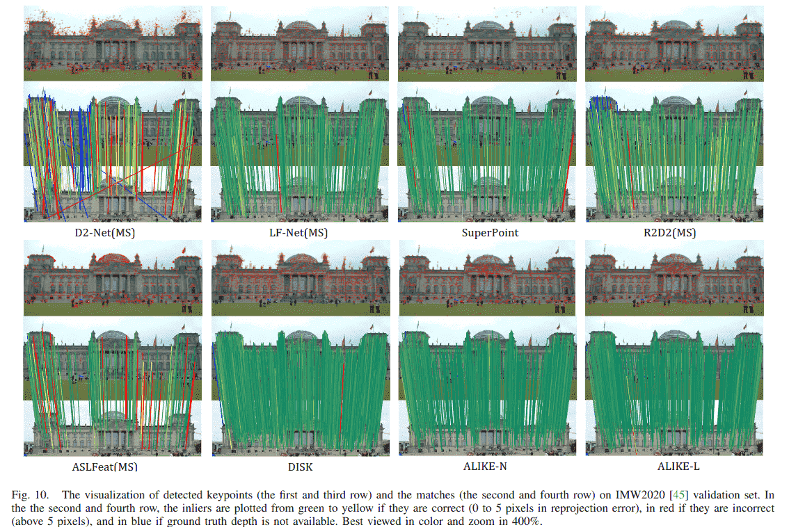

4.  **视觉（重）定位**：所提出的方法在Aachen Day-Night视觉（重）定位基准[47]上使用默认配置进行了测试。它基于图像关键点构建3D地图，将查询图像注册到地图，并使用在三个误差容限（即(0.25m,2°)/(0.5m,5°)/(5m,10°)）下正确注册图像的百分比作为评估指标。我们在表VI中报告了使用有限（最多2048个）和无限数量特征时的性能。
    除了SEKD[20]，大多数方法在使用无限数量关键点时表现良好。但实际应用通常使用有限数量的关键点，D2-Net(MS)[14]、ASLFeat[15]和DISK[37]在这种情况下性能急剧下降。ALIKE-L即使在没有启发式微调配置的情况下，使用更少的关键点也实现了卓越的性能，证明了其在资源受限应用中所需的有效性。此外，普通模型（ALIKE-N）在使用更少计算资源的同时，实现了相当的定位精度。

#### **表VI: 在Aachen Day-Night上的视觉定位结果对比**
此表展示了方法在具有挑战性的视觉重定位任务中的性能。

**使用2048个关键点**
| Methods | 0.25m, 2° | 0.5m, 5° | 5m, 10° |
| :--- | :---: | :---: | :---: |
| D2-Net(SS)[14] | 74.5 | 85.7 | 96.9 |
| D2-Net(MS)[14] | 61.2 | 81.6 | 94.9 |
| SEKD(SS)[17] | 42.9 | 51.0 | 57.1 |
| SEKD(MS)[17] | 50.0 | 63.3 | 70.4 |
| SuperPoint[12] | 72.4 | 79.6 | 88.8 |
| R2D2(MS)[13] | 63.3 | 78.6 | 87.8 |
| ASLFeat(SS)[15] | 54.1 | 67.3 | 76.5 |
| ASLFeat(MS)[15] | 49.0 | 59.2 | 69.4 |
| DISK[37] | 70.4 | 82.7 | 94.9 |
| **ALIKE-N** | 68.4 | **84.7** | **96.9** |
| **ALIKE-L** | **74.5** | **87.8** | **98.0** |

**使用无限制关键点**
| Methods | 0.25m, 2° | 0.5m, 5° | 5m, 10° |
| :--- | :---: | :---: | :---: |
| D2-Net(SS)[14] | 78.6 | 88.8 | 100.0 |
| D2-Net(MS)[14] | 79.6 | 86.7 | 100.0 |
| SEKD(SS)[17] | 54.1 | 65.3 | 74.5 |
| SEKD(MS)[17] | 59.2 | 72.4 | 82.7 |
| SuperPoint[12] | 73.5 | 81.6 | 93.9 |
| R2D2(MS)[13] | 71.4 | 85.7 | 99.0 |
| ASLFeat(SS)[15] | 77.6 | 88.8 | 100.0 |
| ASLFeat(MS)[15] | 77.6 | 90.8 | 100.0 |
| DISK[37] | **84.7** | **90.8** | 100.0 |
| **ALIKE-N** | 77.6 | 87.8 | **100.0** |
| **ALIKE-L** | 79.6 | 86.7 | **100.0** |

*注: ALIKE-L在使用有限关键点的严格指标下取得了最佳或接近最佳的性能，非常适用于资源受限的实际应用。*

### **F. 所提方法的局限性**

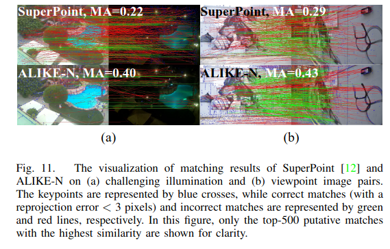

我们在使用所提出的关键点和描述符进行图像匹配时观察到两种失败情况：具有极端光照变化和大视角差异的图像（如图11所示），这也是图像匹配任务中最困难的两个挑战。从技术上讲，我们的轻量级网络使用了浅层架构（表I），在提取更多高层描述符方面会受到限制，这牺牲了一些表示能力。因此，在极端场景下的匹配性能将具有挑战性。然而，在随机选择的挑战性案例中，ALIKE-N的匹配准确率（MA，正确匹配数/初始匹配数）是SuperPoint[12]的两倍，后者是除我们之外FPS和PPC最高的方法，但GFLOPs是ALIKE-N的三倍（图11）。

## **V. 结论**

在本文中，我们提出了ALIKE，一种端到端的精确且轻量的关键点检测和描述符提取网络。它使用可微分关键点检测模块来检测精确的亚像素关键点。然后使用提出的重投影损失和分散峰值损失来训练关键点。除了关键点，还使用NRE损失来训练判别性描述符，并提出了可靠性损失来迫使关键点可靠。与最先进的方法相比，所提出的方法在单应性估计、相机姿态估计和视觉（重）定位任务上取得了相当或更优的结果，同时运行时间显著减少。ALIKE-N和ALIKE-L在NVIDIA TITAN X (Pascal)上对640x480图像分别可以达到95 FPS和68 FPS的运行速度。我们未来的工作包括利用高层语义信息或强化学习来增强检测关键点的可靠性和准确性，以及将所提出的模型集成到实际的SLAM和HDR应用中。

**参考文献**

[1] C.-R. Huang, H.-P. Lee, and C.-S. Chen, "Shot change detection via local keypoint matching," *IEEE Transactions on Multimedia*, vol. 10, no. 6, pp. 1097–1108, 2008.

[2] R. Mur-Artal and J. D. Tardós, "Orb-slam2: An open-source slam system for monocular, stereo, and rgb-d cameras," *IEEE transactions on robotics*, vol. 33, no. 5, pp. 1255–1262, 2017.

[3] X. Yang, Z. Yuan, D. Zhu, C. Chi, K. Li, and C. Liao, "Robust and efficient rgb-d slam in dynamic environments," *IEEE Transactions on Multimedia*, pp. 1–1, 2020.

[4] F. Kou, Z. Wei, W. Chen, X. Wu, C. Wen, and Z. Li, "Intelligent detail enhancement for exposure fusion," *IEEE Transactions on Multimedia*, vol. 20, no. 2, pp. 484–495, 2017.

[5] J. Zheng, Z. Li, Z. Zhu, S. Wu, and S. Rahardja, "Hybrid patching for a sequence of differently exposed images with moving objects," *IEEE transactions on image processing*, vol. 22, no. 12, pp. 5190–5201, 2013.

[6] D. G. Lowe, "Distinctive image features from scale-invariant keypoints," *International journal of computer vision*, vol. 60, no. 2, pp. 91–110, 2004.

[7] E. Rublee, V. Rabaud, K. Konolige, and G. Bradski, "ORB: An efficient alternative to SIFT or SURF," in *2011 International conference on computer vision*, 2011, pp. 2564–2571.

[8] M. Karpushin, G. Valenzise, and F. Dufaux, "Keypoint detection in rgbd images based on an anisotropic scale space," *IEEE Transactions on Multimedia*, vol. 18, no. 9, pp. 1762–1771, 2016.

[9] Y. Tian, B. Fan, and F. Wu, "L2-Net: Deep Learning of Discriminative Patch Descriptor in Euclidean Space," in *2017 IEEE Conference on Computer Vision and Pattern Recognition*, Honolulu, HI, Jul. 2017, pp. 6128–6136.

[10] A. Mishchuk, D. Mishkin, F. Radenovic, and J. Matas, "Working hard to know your neighbor's margins: Local descriptor learning loss," in *Advances in Neural Information Processing Systems*, Jan. 2018.

[11] Y. Tian, X. Yu, B. Fan, F. Wu, H. Heijnen, and V. Balntas, "SOSNet: Second Order Similarity Regularization for Local Descriptor Learning," in *Conference on Computer Vision and Pattern Recognition*, Dec. 2019.

[12] D. DeTone, T. Malisiewicz, and A. Rabinovich, "SuperPoint: Self-Supervised Interest Point Detection and Description," in *Proceedings of the IEEE Conference on Computer Vision and Pattern Recognition Workshops*, 2018, pp. 224–236.

[13] J. Revaud, P. Weinzaepfel, C. D. Souza, N. Pion, G. Csurka, Y. Cabon, and M. Humenberger, "R2D2: Repeatable and Reliable Detector and Descriptor," in *NeurIPS*, 2019, p. 12.

[14] M. Dusmanu, I. Rocco, T. Pajdla, M. Pollefeys, J. Sivic, A. Torii, and T. Sattler, "D2-Net: A Trainable CNN for Joint Description and Detection of Local Features," in *2019 IEEE/CVF Conference on Computer Vision and Pattern Recognition*, Long Beach, CA, USA, Jun. 2019, pp. 8084–8093.

[15] Z. Luo, L. Zhou, X. Bai, H. Chen, J. Zhang, Y. Yao, S. Li, T. Fang, and L. Quan, "ASLFeat: Learning Local Features of Accurate Shape and Localization," in *Proceedings of the IEEE/CVF Conference on Computer Vision and Pattern Recognition*, Apr. 2020.

[16] K. M. Yi, E. Trulls, V. Lepetit, and P. Fua, "LIFT: Learned Invariant Feature Transform," in *European Conference on Computer Vision*, vol. 9910. Cham: Springer, 2016, pp. 467–483.

[17] Y. Ono, E. Trulls, P. Fua, and K. M. Yi, "LF-Net: Learning Local Features from Images," in *Advances in Neural Information Processing Systems 31*. Curran Associates, Inc., 2018, pp. 6234–6244.

[18] Y. Verdie, K. Yi, P. Fua, and V. Lepetit, "Tilde: A temporally invariant learned detector," in *Proceedings of the IEEE Conference on Computer Vision and Pattern Recognition*, 2015, pp. 5279–5288.

[19] N. Savinov, A. Seki, L. Ladicky, T. Sattler, and M. Pollefeys, "Quad-networks: unsupervised learning to rank for interest point detection," in *Proceedings of the IEEE conference on computer vision and pattern recognition*, 2017, pp. 1822–1830.

[20] Y. Song, L. Cai, J. Li, Y. Tian, and M. Li, "SEKD: Self-Evolving Keypoint Detection and Description," *arXiv:2006.05077 [cs]*, Jun. 2020.

[21] Y. Tian, V. Balntas, T. Ng, A. Barroso-Laguna, Y. Demirs, and K. Mikolajczyk, "D2D: Keypoint Extraction with Describe to Detect Approach," in *Proceedings of the Asian Conference on Computer Vision*, 2020.

[22] T.-Y. Yang, D.-K. Nguyen, H. Heijnen, and V. Balntas, "UR2KiD: Unifying Retrieval, Keypoint Detection, and Keypoint Description without Local Correspondence Supervision," *arXiv:2001.07252 [cs]*, Jan. 2020.

[23] O. Chapelle and M. Wu, "Gradient descent optimization of smoothed information retrieval metrics," *Information retrieval*, vol. 13, no. 3, pp. 216–235, 2010.

[24] X. Sun, B. Xiao, F. Wei, S. Liang, and Y. Wei, "Integral human pose regression," in *Proceedings of the European Conference on Computer Vision (ECCV)*, 2018, pp. 529–545.

[25] K. Gu, L. Yang, and A. Yao, "Removing the bias of integral pose regression," in *Proceedings of the IEEE/CVF International Conference on Computer Vision*, 2021, pp. 11067–11076.

[26] H. Germain, G. Bourmaud, and V. Lepetit, "Sparse-to-dense hypercolumn matching for long-term visual localization," in *2019 International Conference on 3D Vision (3DV)*. IEEE, 2019, pp. 513–523.

[27] H. Germain, G. Bourmaud, and V. Lepetit, "S2DNet: Learning Accurate Correspondences for Sparse-to-Dense Feature Matching," in *European Conference on Computer Vision*, Apr. 2020.

[28] Q. Wang, X. Zhou, B. Hariharan, and N. Snavely, "Learning feature descriptors using camera pose supervision," in *European Conference on Computer Vision*. Springer, 2020, pp. 757–774.

[29] H. Germain, V. Lepetit, and G. Bourmaud, "Neural reprojection error: Merging feature learning and camera pose estimation," in *Proceedings of the IEEE/CVF Conference on Computer Vision and Pattern Recognition*, June 2021, pp. 414–423.

[30] G. Droge, "Dual-mode dynamic window approach to robot navigation with convergence guarantees," *Journal of Control and Decision*, vol. 8, no. 2, pp. 77–88, 2021.

[31] Y. Zhang, J. Wang, S. Xu, X. Liu, and X. Zhang, "MLIFeat: Multi-level information fusion based deep local features," in *Proceedings of the Asian Conference on Computer Vision*, 2020.

[32] X. Han, T. Leung, Y. Jia, R. Sukthankar, and A. C. Berg, "Matchnet: Unifying feature and metric learning for patch-based matching," in *Proceedings of the IEEE Conference on Computer Vision and Pattern Recognition*, 2015, pp. 3279–3286.

[33] V. Balntas, E. Riba, D. Ponsa, and K. Mikolajczyk, "Learning local feature descriptors with triplets and shallow convolutional neural networks," in *BMVC*, vol. 1, 2016, p. 3.

[34] A. Barroso-Laguna, E. Riba, D. Ponsa, and K. Mikolajczyk, "Key.net: Keypoint detection by handcrafted and learned cnn filters," in *Proceedings of the IEEE International Conference on Computer Vision*, 2019, pp. 5836–5844.

[35] K. He, Y. Lu, and S. Sclaroff, "Local Descriptors Optimized for Average Precision," in *Proceedings of the IEEE Conference on Computer Vision and Pattern Recognition*, 2018, pp. 596–605.

[36] A. Barroso-Laguna, Y. Verdie, B. Busam, and K. Mikolajczyk, "Hdd-net: Hybrid detector descriptor with mutual interactive learning," in *Proceedings of the Asian Conference on Computer Vision*, November 2020.

[37] M. J. Tyszkiewicz, P. Fua, and E. Trulls, "DISK: Learning local features with policy gradient," in *Neural IPS*, Jun. 2020.

[38] A. Bhowmik, S. Gumhold, C. Rother, and E. Brachmann, "Reinforced Feature Points: Optimizing Feature Detection and Description for a High-Level Task," in *2020 IEEE/CVF Conference on Computer Vision and Pattern Recognition*, Seattle, WA, USA, Jun. 2020, pp. 4947–4956.

[39] A. Rana, G. Valenzise, and F. Dufaux, "Learning-based tone mapping operator for efficient image matching," *IEEE Transactions on Multimedia*, vol. 21, no. 1, pp. 256–268, 2019.

[40] V. Nair and G. E. Hinton, "Rectified linear units improve restricted boltzmann machines," in *Icml*, 2010.

[41] K. He, X. Zhang, S. Ren, and J. Sun, "Deep residual learning for image recognition," in *Proceedings of the IEEE conference on computer vision and pattern recognition*, 2016, pp. 770–778.

[42] K. Mikolajczyk and C. Schmid, "A performance evaluation of local descriptors," *IEEE Transactions on Pattern Analysis and Machine Intelligence*, vol. 27, no. 10, pp. 1615–1630, Oct. 2005.

[43] Z. Li and N. Snavely, "Megadeth: Learning single-view depth prediction from internet photos," in *Proceedings of the IEEE Conference on Computer Vision and Pattern Recognition*, 2018, pp. 2041–2050.

[44] J. L. Schonberger and J.-M. Frahm, "Structure-from-motion revisited," in *Conference on Computer Vision and Pattern Recognition*, 2016.

[45] Y. Jin, D. Mishkin, A. Mishchuk, J. Matas, P. Fua, K. M. Yi, and E. Trulls, "Image matching across wide baselines: From paper to practice," *International Journal of Computer Vision*, vol. 129, no. 2, pp. 517–547, 2021.

[46] V. Balntas, K. Lenc, A. Vedaldi, and K. Mikolajczyk, "HPatches: A benchmark and evaluation of handcrafted and learned local descriptors," in *Proceedings of the IEEE Conference on Computer Vision and Pattern Recognition*, 2017, pp. 5173–5182.

[47] T. Sattler, W. Maddern, C. Toft, A. Torii, L. Hammastrand, E. Stenborg, D. Safari, M. Okutomi, M. Pollefeys, J. Sivic et al., "Benchmarking 6dof outdoor visual localization in changing conditions," in *Proceedings of the IEEE Conference on Computer Vision and Pattern Recognition*, 2018, pp. 8601–8610.

[48] D. P. Kingma and J. Ba, "Adam: A Method for Stochastic Optimization," in *ICLR*, 2015.

[49] Z. Mubariz, G. Sourav, M. Michael, K. Julian, F. David, M.-M. Klaus, and E. Shoaib, "VPR-Bench: An open-source visual place recognition evaluation framework with quantifiable viewpoint and appearance change," *International Journal of Computer Vision*, vol. 129, pp. 2136–2174, 2021.

---