# ALIKED：通过可变形变换实现更轻量的关键点和描述符提取网络

## 摘要
图像关键点和描述符在许多视觉测量任务中起着至关重要的作用。近年来，深度神经网络已被广泛用于提高关键点和描述符提取的性能。然而，传统的卷积操作无法提供描述符所需的几何不变性。为了解决这个问题，我们提出了稀疏可变形描述符头（SDDH），它学习每个关键点的支持特征的可变形位置，并构建可变形描述符。此外，SDDH在稀疏关键点处提取描述符，而不是生成密集的描述符图，从而能够高效提取具有强表达能力的描述符。另外，我们将神经重投影误差（NRE）损失从密集形式放宽到稀疏形式，以训练提取的稀疏描述符。实验结果表明，所提出的网络在各种视觉测量任务（包括图像匹配、三维重建和视觉重定位）中既高效又强大。

**索引术语**：关键点，描述符，可变形，局部特征，图像匹配

---

## 一、引言
高效鲁棒的图像关键点和描述符提取对于许多资源受限的视觉测量应用至关重要，例如同步定位与建图（SLAM）[1]、计算摄影[2]和视觉位置识别[3]。早期的关键点检测和描述符提取方法依赖于人工启发式方法[4]-[6]。然而，这些手工制作的方法不够高效和鲁棒。为了解决这些问题，近年来出现了许多基于深度神经网络（DNN）的数据驱动方法。最初，DNN被用于在预定义的关键点上提取图像块的描述符[7]。随后，主流方法发展为使用单一网络提取关键点和描述符[8]-[10]，这通常比手工方法能提取出更鲁棒的关键点和更具区分度的描述符[11]。我们将这些方法称为基于图的方法，因为它们使用两个头（得分图头SMH和描述符图头DMH）来估计得分图和描述符图，然后分别从得分图和描述符图中提取关键点和描述符。

现有的基于图的方法使用固定大小的标准卷积来编码图像，这缺乏对图像匹配性能至关重要的几何不变性。这个问题可以通过估计描述符在图像上的尺度和方向来缓解[9], [12]-[14]。然而，尺度和方向只能模拟图像特征的仿射变换，而不能模拟图像特征的任意几何变换。我们观察到，可变形卷积网络（DCN）[15]可以通过调整卷积中每个像素的偏移来模拟任何几何变换，从而提高描述符的表示能力。不幸的是，DCN[15]在计算密集描述符图时引入了额外的计算，降低了运行速度。为了提高像DCN[15]这样提取可变形描述符时的运行速度，我们提出了稀疏可变形描述符头（SDDH）。我们研究了现有的基于图的方法，发现DMH在没有关键点的区域存在许多冗余卷积，导致描述符提取的计算成本很高。SDDH仅在检测到的关键点处提取可变形描述符，而不是在整个密集特征图上进行，这使得它更加高效，因为关键点的数量通常少于密集图像特征。此外，受可变形图像对齐[16]的启发，SDDH在M个采样位置估计偏移，而不是像DCN[15]那样使用固定大小的卷积网格。估计的偏移用于构建描述符，M可以是任何正整数，使得SDDH在建模可变形描述符时更加灵活和高效。

在此基础上，我们提出了使用SDDH的、带有可变形变换的轻量级关键点和描述符提取网络（ALIKED）用于视觉测量。然而，SDDH只提取稀疏描述符，这意味着没有描述符图来构建神经重投影误差（NRE）损失[10], [17]。为了应对这一挑战，我们提出了一种优雅的解决方案，将NRE损失从密集形式放宽到稀疏形式。我们不构建密集的概率图，而是为稀疏描述符构建稀疏概率向量，并最小化稀疏匹配概率向量和重投影概率向量之间的距离。这种方法不仅克服了缺乏密集描述符图的挑战，还减少了网络训练期间的冗余计算，从而显著节省了图形处理器（GPU）的内存。

总的来说，本文的主要贡献如下：
- 我们提出了SDDH，用于高效提取可变形描述符，大大减少了冗余计算，并允许对任何几何变换进行建模。
- 我们开发了使用SDDH的ALIKED网络用于视觉测量，其中包括一种将NRE损失从密集放宽到稀疏的优雅解决方案，允许使用NRE损失训练稀疏描述符，并减少了网络训练期间的冗余计算。
- 实验结果表明，ALIKED网络在各种视觉测量任务中，包括图像匹配、三维重建和视觉定位，都取得了优异的性能。

为便于快速查阅，表I列出了本文最常用的缩写。论文其余部分组织如下：第二部分回顾了基于深度学习的关键点和描述符提取方法在视觉测量中的应用。第三部分首先介绍整体网络架构，然后第四部分和第五部分分别介绍SDDH和损失函数。第六部分展示了与最先进（SOTA）方法的比较和消融研究，第七部分总结了我们的工作。

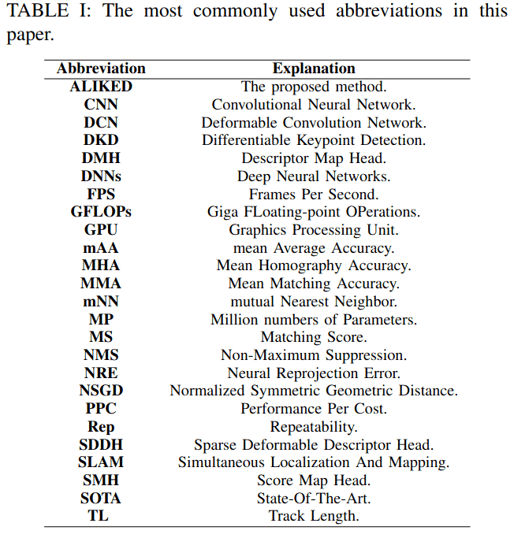

---

## 二、相关工作
在本节中，我们回顾了描述符提取的几何建模、视觉测量系统中使用的基于深度学习的关键点提取网络，以及可变形卷积在神经网络中的应用。

### A. 几何不变描述符提取
在手工方法中，描述符的几何不变性通常从两个方面定义：尺度不变性和方向不变性。例如，SIFT[4]在尺度空间中估计每个检测到的关键点的尺度，并根据图像梯度的直方图计算关键点方向。SIFT还使用估计的尺度和方向提取图像块，并基于这些图像块构建描述符。另一方面，ORB[5]特征为了效率，只计算质心关键点的方向，然后旋转图像块以实现方向不变性。

在学习方法方面，主要有两种方法：基于块的描述符提取方法和联合关键点与描述符学习方法。基于块的方法[7], [18]-[21]以及大多数联合关键点与描述符学习方法[8], [22], [23]依赖于数据增强来实现尺度和方向不变性。一些联合学习方法显式地建模关键点的方向和尺度。例如，LIFT[12]通过不同的神经网络检测关键点、估计其方向和提取描述符，模仿了SIFT[4]的流程。类似地，AffNet[24]、UCN[25]和LF-Net[14]估计仿射参数，并使用空间变换网络（STN）[26]对图像特征应用仿射变换，以提取仿射不变描述符。GIFT[13]首先生成具有不同尺度和方向的图像组，然后从这些图像中提取特征以产生尺度和方向不变的描述符。HDD-Net[27]建议旋转卷积核而不是特征来提取旋转不变描述符。

在上述方法中，几何变换被预定义为仿射变换。受ASLFeat[9]的启发，我们提出的网络ALIKED也采用DCN来提取几何不变特征。此外，基于DCN[15]的可变形思想，我们设计了SDDH模块来高效提取几何不变描述符。

### B. 联合关键点与描述符学习
许多研究提出联合估计得分图和描述符图，从得分图中检测关键点，并从描述符图中采样描述符。SuperPoint[8]提出了一种轻量级网络，通过单应性自适应生成的单应性图像对进行训练。R2D2[28]计算关键点检测的可重复性和可靠性图，并使用AP损失训练描述符。Suwichaya最近在R2D2中增加了低级特征（LLF）检测器以提高关键点准确性[29]。DISK[22]使用强化学习来训练得分图和描述符图。ALIKE[10]具有一个可微分的关键点检测模块，用于精确的关键点训练，并且拥有最轻量的网络，从而可以应用于实时视觉测量应用。D2-Net[23]不使用网络估计得分图，而是通过特征图上的通道和空间最大值来检测关键点。然而，由于它从低分辨率特征图提取关键点，D2-Net[23]在关键点定位上缺乏准确性。ASLFeat[9]使用多级特征检测关键点，并使用可变形卷积对局部形状进行建模，以提高定位精度和描述符。D2D[30]受D2-Net[23]启发，在特征图上使用描述符图以及绝对和相对显著性来检测关键点。Rao等人提出了用于通用特征描述符的分层视图一致性[31]，用于视觉测量。

尽管联合关键点与描述符学习取得了显著进展，但其复杂性仍然是视觉测量应用的主要障碍。大多数这些方法提取密集但昂贵的描述符图以提高匹配性能，这在计算上成本很高。为了解决这个问题，我们为每个稀疏关键点在可变形局部特征上提取描述符，而不是提取密集描述符图。因此，我们改进了轻量级的ALIKE[10]，并利用节省的计算预算，提出了具有可变形特征和描述符提取的ALIKED。

### C. 神经网络中的可变形卷积
常规CNN具有固定的卷积核，这限制了利用长距离信息的能力。为了解决这个问题，可变形卷积为卷积核引入了可学习的偏移[15], [32]。这种方法已被证明在高级任务中有效，例如目标检测[33]、语义分割[32]、动作识别[34]和人体姿态估计[35]。它也被广泛应用于低级任务，包括视频超分辨率[36]、高动态范围图像[37]和视频帧插值[38]。DCN也被用于ASLFeat进行描述符提取[9]。然而，ASLFeat仅使用DCN计算密集特征，而提出的SDDH是专门为高效的稀疏描述符提取而设计的。

近年来，视觉Transformer[39]因其令人印象深刻的性能而受到相当多的关注。然而，该模型继承了多头自注意力机制[40]，导致图像特征提取过程中计算负担很高。为了解决这个问题，可变形DETR模型提出了使用DCN来关注一小组采样位置[41]。最近，InternImage引入了DCNv3[42]，它不仅减轻了视觉Transformer的计算负担，而且在基本视觉任务上实现了最先进的性能。我们的方法遵循与InternImage[42]相似的思路。我们仅在稀疏关键点上计算描述符，从而同时提高了计算效率和性能。

---

## 三、ALIKED的网络架构
在本节中，我们将首先介绍ALIKED的整体架构。如图1所示，ALIKED由三个部分组成：特征编码、特征聚合以及关键点和描述符提取。然后，在下一节中，我们将介绍ALIKED中SDDH的灵感来源和设计考虑。

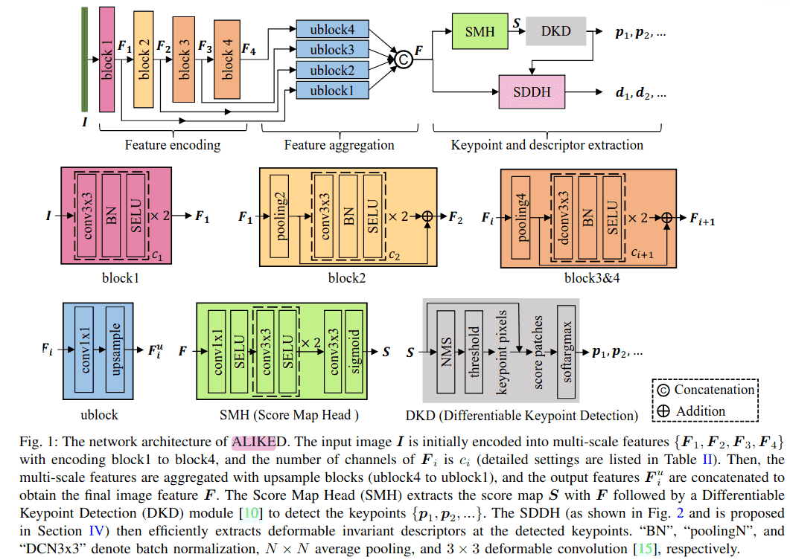

### A. 特征编码
特征编码器将输入图像 I ∈ R^(H×W×3) 转换为多尺度特征 F₁, F₂, F₃, F₄，使用四个编码块，每个块的通道数从 c₁ 到 c₄（详细设置见表II）。如图1所示，第一个块由两个卷积组成，用于提取低级图像特征 F₁。为了覆盖更大的感受野并提高计算效率，第二个块使用2×2平均池化对 F₁ 进行下采样。第三和第四个块首先使用4×4平均池化对特征进行下采样，然后使用带有3×3 DCNs[15]的残差块提取图像特征（见第四部分）。为了提高收敛性，ALIKED模型使用SELU[43]激活函数而不是ReLU[44]。

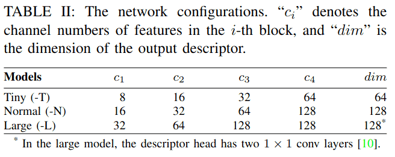

### B. 特征聚合
特征聚合部分负责聚合多尺度特征 {F₁, F₂, F₃, F₄}，以获得定位和表示能力。如图1所示，使用四个上采样块（ublock）来聚合这些特征。每个ublock包含一个1×1卷积和一个上采样层，以对齐多尺度特征的维度和分辨率。通过拼接这些对齐后的特征 {F₁ᵘ, F₂ᵘ, F₃ᵘ, F₄ᵘ}，我们得到聚合后的图像特征F。

### C. 可微分关键点检测
对于关键点检测，得分图头（SMH）使用聚合特征F估计得分图 S ∈ R^(H×W)。如图1所示，SMH首先使用一个1×1卷积层将特征通道减少到8，然后是两个3×3卷积层进行特征编码。最后，使用一个3×3卷积层和一个Sigmoid激活层来获得得分图S。

ALIKED使用可微分关键点检测（DKD）[10]来检测可训练的可微分关键点。如图1所示，DKD模块首先对得分图S应用非极大值抑制（NMS）来识别局部最大值。然后通过为局部最大值分数设置阈值来确定像素级关键点。DKD模块进一步通过在局部块上使用softargmax来细化其位置，从而提高像素级关键点的准确性，从而提取可微分的亚像素关键点 P = {p₁, p₂, …}。通过使用这些可微分关键点P，我们可以直接优化图像间对应关键点的重投影误差（如第五部分A所述）来训练得分图。

---

## 四、稀疏可变形描述符头
在本节中，我们介绍ALIKED中的稀疏可变形描述符头，如图1所示。

### A. 可变形不变描述符建模
现有的手工方法[4]通过局部图像块上的仿射变换对几何不变描述符进行建模，如公式(1)所示。不幸的是，传统卷积不能直接保持仿射不变性。为了解决这个问题，一些方法使用预定义的度数和尺度显式地旋转和缩放图像[13]或卷积核[27]。然而，图像关键点的局部形状可能比仿射变换复杂得多。因此，我们将几何变换建模为以下可变形变换（公式2）。对于局部图像块，可变形变换(2)的自由度等于像素数。因此，可变形变换可以为关键点描述符提供通用的几何不变性。

### B. 稀疏可变形描述符头的设计
大多数基于学习的关键点和描述符提取方法[8], [10], [28]首先使用卷积网络将图像编码成密集描述符图，然后从密集描述符图中采样描述符。然而，提取密集描述符图可能非常低效。基于高效和几何不变描述符提取的需求，我们设计了SDDH。

**1) DCN回顾：** DCN[15]估计卷积中的采样偏移，可用于提取可变形不变特征。考虑特征图 F ∈ R^(H×W×dim) 上的一个点p。令 pᵢ ∈ R² 表示局部特征块上用于 K×K 卷积的第i个采样位置。特征F的可变形卷积由公式(3)给出。DCN[15]使用基础卷积来估计偏移并通过堆叠多层来提取几何相关特征。因此，我们在ALIKED的block3和block4（第三部分A）中使用DCN[15]。

**2) 描述符图头回顾：** 现有方法[8], [10], [28]使用卷积层将密集特征图F编码成密集描述符图，然后从中采样描述符。我们将此模块称为DMH，如图3所示。然而，在图像分辨率级别的特征图上进行卷积计算成本很高，因此一些现有方法对特征图进行下采样[8]或使用轻量级操作[10], [28]来提取密集描述符图。因此，描述符的表示能力受到限制。相反，我们认为密集描述符图是不必要的，因为只需要稀疏关键点对应的描述符。通过消除密集描述符图，可以减少计算量，从而在节省计算的同时提取更强大的描述符。

**3) 稀疏可变形描述符头：** 尽管DCN[15]可以提取可变形不变特征，但它不能高效有效地提取稀疏描述符，因为它在特征图上执行密集且简单的卷积。为了解决这个问题，我们提出了SDDH，用于高效提取稀疏可变形描述符，它建立在DCN[15]的思想基础上，如图2所示。对于给定的关键点 p ∈ R²，SDDH首先提取一个以p为中心的、大小为 K×K 的特征块 F_K×K（图2中K=5）。然后它估计关键点p的可变形采样位置 pˢ ∈ R^(M×2)，如公式(4)所示。使用可变形采样位置 pˢ ∈ R^(M×2)，SDDH使用双线性采样在特征图上采样支持特征。然后通过公式(5)获得描述符 d ∈ R^dim。convM是加权求和操作(5)，类似于卷积，只是它在M个灵活位置上计算，而不是在 K×K 个固定位置上计算。

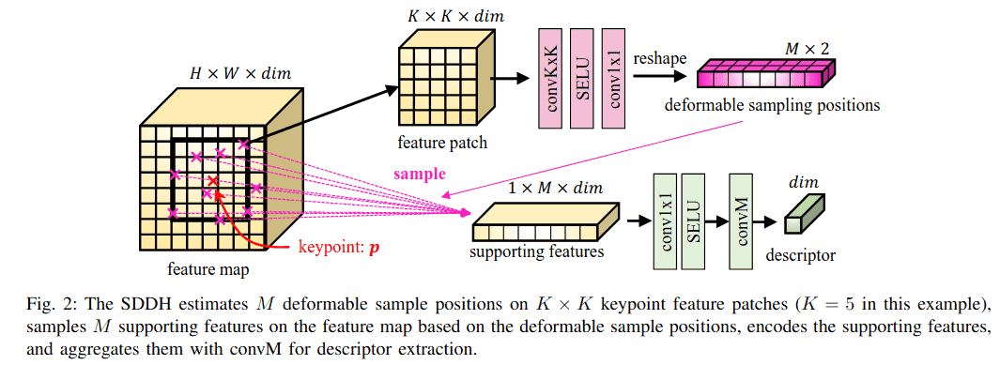

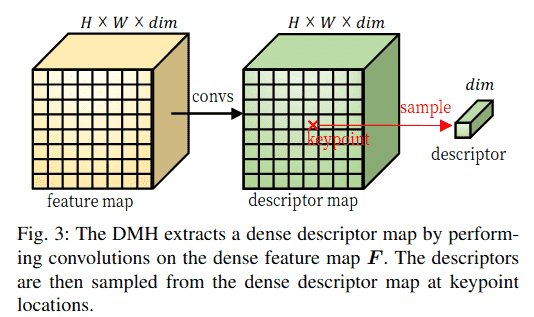

SDDH与DCN[15]在以下方面有所不同：
- DCN[15]在密集特征图上使用可变形卷积，而SDDH仅针对稀疏关键点提取可变形特征。因此，SDDH可以显著降低计算成本，因为关键点的数量通常远少于图像像素的数量。
- DCN[15]估计卷积的 K×K 个偏移（如公式(3)所示），而SDDH估计M个可变形采样位置。与DCN受限于采样位置是固定 K×K 网格不同，SDDH可以用于任何正整数值的M。这使得SDDH在性能和计算效率方面都比DCN更灵活。
- DCN[15]通常使用简单的网络并堆叠多层进行特征提取。相比之下，SDDH使用更复杂的网络来估计可变形采样的位置并直接提取可变形描述符。

### C. DMH与SDDH的效率比较
我们通过比较DMH和SDDH在具有N个关键点的 H×W×C 特征图上的计算操作来证明SDDH的效率。对于具有 convKxK(SELU(conv1x1(x))) 且卷积核大小 K=5 的DMH，等效的SDDH是 M=K² 的那个。表III显示了DMH和SDDH的理论计算复杂度和典型运行时间。对于DMH，conv5x5和conv1x1的理论计算操作分别是 HWK²C² 和 HWC²，总计为 HWC²(K²+1)。对于双线性采样，从通道数为C的描述符图中采样一个描述符的操作是4C，采样N个描述符的操作是4NC。对于SDDH，估计一个关键点的可变形采样位置的计算操作是 2M(K²C + 2M)，N个关键点的总操作是 2NM(K²C + 2M)。为N个关键点采样M个可变形特征需要 4NMC 次操作。在描述符提取阶段，conv1x1和convM的操作都是 NMC²，总计为 2NMC²。

为了提供更直观的比较，我们在特征图为 480×640×128 时，报告了两种配置（K=5, N=5000）和（K=3, N=1000）的典型复杂度和运行时间，如表III所示。运行时间是在中端GPU（NVIDIA GeForce RTX 2060）上评估的。在两种情况下，DMH在卷积上花费了大量计算资源来提取密集描述符图。相比之下，SDDH仅在稀疏关键点块上执行计算，使其比DMH高效得多。对于较小的块大小和较少的关键点，SDDH的优越性更加明显。

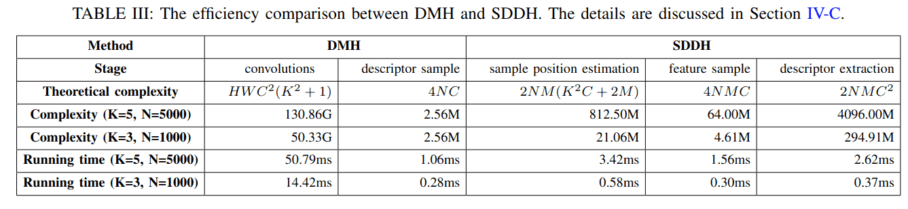

---

## 五、损失函数
在本节中，我们介绍用于训练ALIKED的损失函数。为了监督关键点，我们采用了最初在ALIKE[10]中提出的重投影损失和分散峰值损失。由于没有密集描述符图可用于计算匹配概率图，我们提出将神经重投影误差（NRE）损失[10], [17]从密集形式放宽到稀疏形式。此外，我们引入了一个基于稀疏描述符相似性的可靠性损失。

考虑一个图像对 (Iᴬ, Iᴮ)，网络从图像对 (Iᴬ, Iᴮ) 中提取得分图 Sᴬ 和 Sᴮ，DKD模块然后检测关键点 Pᴬ ∈ R^(Nᴬ×2) 和 Pᴮ ∈ R^(Nᴮ×2)。Pᴬ 和 Pᴮ 的对应描述符分别表示为 Dᴬ ∈ R^(Nᴬ×dim) 和 Dᴮ ∈ R^(Nᴮ×dim)。我们定义所有损失函数如下：

### A. 重投影损失
由于从ALIKED提取的关键点是可微分的，我们可以直接使用重投影距离[10]训练关键点的位置。首先，对于关键点 pᴬ ∈ Pᴬ，我们使用3D透视变换（公式6）将其扭曲到图像 Iᴮ。在 Iᴮ 中，我们搜索距离 pᴬᴮ 最近的关键点，并且它们的距离必须小于 th_gt 像素。这个关键点 pᴮ 被认为是匹配关键点。类似地，我们也将 pᴮ 投影回 Iᴬ 得到 p_BAˣ。关键点对 (pᴬ, pᴮ) 的重投影损失定义为公式(7)。总的重投影损失 L_rp 是两幅图像中所有匹配关键点的平均重投影损失。

### B. 分散峰值损失
分散峰值损失旨在最大化关键点处的得分[10]。在DKD模块中，假设窗口大小为W，我们可以获得与关键点p对应的得分图S上的一个 W×W 得分块 S_p。分散峰值损失定义为该块的softmax得分与块中每个坐标c到关键点距离的乘积，如公式(8)所示。总的分散峰值损失 L_pk 是两幅图像中所有关键点的平均分散峰值损失。

### C. 稀疏神经重投影误差损失
理论上，不同图像中的匹配关键点应具有相同的描述符。相反，非匹配关键点的描述符应不同。实现此属性的一种方法是使用密集NRE损失，它使用交叉熵损失来最小化重投影概率图和匹配概率图之间的差异[10]。然而，SDDH只产生稀疏描述符，并且没有描述符图来生成匹配概率图。为了克服这个限制，我们将概率图从密集形式放宽到稀疏形式。

令 pᴬ 的描述符为 dᴬ。没有密集描述符图，我们仍然可以为 pᴬ 定义一个关于 Pᴮ 的重投影概率向量 q_r(pᴬ, Pᴮ)，它是一个二元向量，其中真值元素表示 pᴬ 在 Pᴮ 中的匹配关键点。类似地，我们也可以构建 dᴬ 和 Dᴮ 的匹配相似度向量，如公式(9)所示。然后匹配概率向量如公式(10)所示。然后，我们可以将稀疏NRE损失定义为重投影概率向量 q_r(pᴬ, Pᴮ) 和匹配概率向量 q_m(dᴬ, Dᴮ) 之间的交叉熵（CE），如公式(11)所示。我们可以以同样的方式获得关键点 pᴮ 的稀疏NRE损失 L_ds(pᴮ, Iᴬ)。总的稀疏NRE损失 L_ds 是两幅图像中所有描述符的平均稀疏NRE损失。

### D. 可靠性损失
得分图显示了像素成为关键点的概率，但也应考虑可靠性，如R2D2[28]所建议的。低纹理且不具区分性的区域是不可靠的，不应被视为关键点。为了考虑这些特性，我们使用可靠性损失来约束得分图。我们基于匹配相似度向量(9)定义 pᴬ 关于 Iᴮ 的可靠性，如公式(12)所示。得分图 Sᴬ 关于 Iᴮ 的可靠性损失然后定义为公式(13)。与ALIKE[10]不同，我们只使用 r(pᴬ, Iᴮ) 来约束 sᴬ，因为它只模拟 pᴬ 的可靠性。在这个公式中，除以总得分 Ŝᴬ 对加权得分的和进行了归一化。为了获得较低的损失值，权重 (1 - r(pᴬ, Iᴮ)) 较低的得分应具有较高的值，这意味着当可靠性较高时，得分 sᴬ 应该高，反之亦然。可以以相同的方式获得 L_re(Sᴮ, Iᴬ)。L_re(Sᴬ, Iᴮ) 和 L_re(Sᴮ, Iᴬ) 分别总结了关键点 pᴬ 和 pᴮ 的所有可靠性损失。因此，总的可靠性损失 L_re 是所有关键点可靠性损失的平均值。

### E. 总损失
训练ALIKED的总损失函数定义为上述四个损失函数的加权和，如公式(14)所示。在网络训练期间，最小化分散峰值损失很简单，因为它只涉及一维得分图。然而，最小化匹配损失更具挑战性，因为它涉及高维描述符。因此，我们设置 ω_pk = 0.5 和 ω_ds = 5 以在训练过程中补偿这些损失。其余两个权重在训练期间都设置为1。

---

# 六、实验

在本节中，我们将提出的方法与广泛应用于视觉测量任务的最先进（SOTA）方法进行比较，包括图像匹配、三维重建和视觉重定位。我们还进行了消融研究，并分析了所提出网络的局限性。

通过调整通道数（cᵢ），我们设计了三种不同计算成本的网络，如表II所示。我们以ALIKE-N[10]作为基线网络，因为它在运行时间和匹配性能之间取得了良好的平衡。DKD模块的半径设置为2个像素，在训练过程中，重投影距离小于5个像素的关键点对被视作真实关键点对。归一化温度设置为t_det=0.1、t_des=0.1和t_rel=1，这些温度值针对不同任务进行了精心调整，以确保归一化分布既不会过于平坦也不会过于尖锐。我们使用Adam优化器[45]，beta值设置为0.9和0.999来训练网络。为了训练得分图，使用DKD检测前400个关键点，并随机采样另外400个点。

为了避免在同一区域出现重复关键点，我们对这些关键点应用非极大值抑制（NMS），并使用剩余的点构建损失函数。在训练过程中，图像被调整为800×800分辨率，批大小为2，并在6个批次中累积梯度。我们使用透视变换和单应性变换数据集共同训练所提出的网络：

- **MegaDepth数据集[46]**用于训练透视图像对。该数据集收集了著名地标的游客照片，并使用COLMAP[47]重建了每张图像的深度和姿态。我们使用DISK[22]中采样的图像对，其中排除了来自IMW2020验证集和测试集[11]的场景。该数据集总共包含135个场景，每个场景有10k个图像对。
- **R2D2数据集[28]**也用于训练单应性图像对。我们使用Oxford和Paris检索数据集[48]以及Aachen数据集[49]上的合成图像对，以及Aachen数据集[49]上的合成风格迁移图像对。

我们使用ALIKED-M来表示所提出的普通/微小（表II）网络，其中M个采样位置（且K=3）。我们训练了三个网络：微型ALIKED-T(16)用于实时性能，ALIKED-N(16)用于在运行时间和匹配性能之间取得最佳平衡，ALIKED-N(32)用于获得更好的匹配性能。我们将这些网络训练了100K步，并根据它们在验证数据集上的匹配性能选择最佳模型。

### A. 实施细节

ALIKED使用PyTorch实现。在训练和评估过程中，输入图像被归一化到[0,1]范围。遵循ALIKE[10]的设置，特征编码块（block1到block4）的通道数c₁到c₄分别设置为{16,32,64,128}，描述符维度为128。对于ALIKED-T，这些通道数减半以降低计算成本。对于ALIKED-L，block3和block4的通道数设置为128，描述符头使用两个1×1卷积层[10]来增加容量。

在训练过程中，我们使用AdamW优化器，权重衰减为1e-4。初始学习率设置为1e-3，并在训练过程中使用余弦退火调度。数据增强包括随机水平翻转、颜色抖动和模糊。每个训练批次包含2张图像，在6个累积步骤后更新梯度。

在推理过程中，图像被调整为800×800分辨率，使用DKD模块检测关键点，得分阈值设置为0.1。描述符在检测到的关键点位置使用SDDH提取。为了公平比较，所有方法都提取最多1024个关键点进行评估。

### B. 与最先进方法的比较

为了评估所提出方法的性能，我们使用Intel i7-10700F CPU和NVIDIA GeForce RTX 2060 GPU，以及CUDA 10.2和PyTorch 1.11.0作为软件工具。我们将ALIKED与以下SOTA关键点和描述符提取网络进行比较：

- **D2-Net[23]**：从密集特征图中同时执行描述和检测的网络
- **LF-Net[14]**：在双分支设置中使用虚拟目标训练的网络
- **SuperPoint[8]**：通过单应性自适应策略训练的轻量级网络
- **R2D2[28]**：联合学习关键点检测的可重复性和可靠性图的网络
- **ASLFeat[9]**：提高D2-Net定位精度和几何不变性的网络
- **DISK[22]**：使用强化学习训练关键点和描述符提取网络的方法
- **ALIKE[10]**：具有可微分关键点检测模块的轻量级网络

#### 1) 实时性能
如表IV所示，ALIKED-T(16)仅有0.192M参数。为了评估计算复杂度，我们在640×480图像上测试不同方法的GFLOPs。由于采用稀疏描述符提取策略，与现有方法相比，ALIKED网络具有最低的GFLOPs。为了比较运行速度，我们在640×480图像上测试提取1K关键点时的帧率。尽管ALIKED-N(16)的GFLOPs低于ALIKE-N[10]，但其帧率为77.40FPS，略低于ALIKE-N(84.96FPS)，这是因为图像块收集不是标准操作且未完全优化（在我们的实现中约需1ms）。这个非计算操作可以通过底层技术进一步优化。尽管如此，ALIKED-T(16)实现了125.87 FPS的运行速度，且匹配性能与现有方法相当。

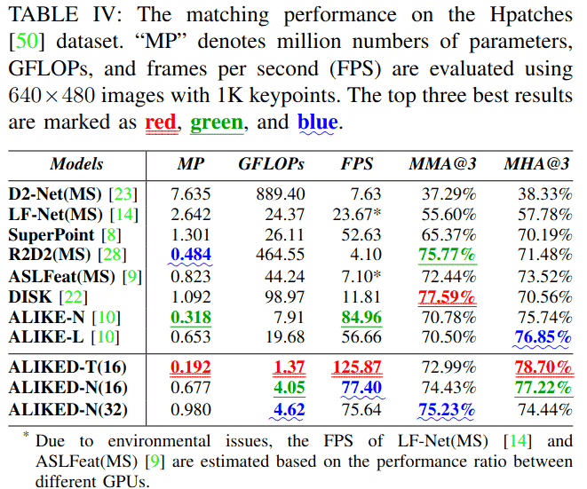

#### 2) 单应性图像匹配
我们在Hpatches数据集[50]上比较不同方法的图像匹配性能，该数据集包含57个光照场景和79个视角场景的平面单应性图像。每个场景包含5个具有真实单应性矩阵的图像对。根据D2Net[23]，排除了8个不可靠场景。我们在得分图上以0.2的阈值提取最多5000个关键点，并使用相互最近邻（mNN）匹配器匹配它们的描述符。既不包含学习型匹配器[51],[52]，也不包含直接图像匹配器[53]-[55]，因为它们超出了我们的研究范围且与所提方法不可比。遵循先前工作[8],[10],[22]，使用3像素误差阈值（下文中用@3表示）评估以下指标：

- **MMA（平均匹配精度）**：正确匹配数与所有估计的候选匹配数的百分比
- **MHA（平均单应性精度）**：使用估计的单应性矩阵扭曲图像后，正确图像角的百分比
- **MS（匹配分数）**：正确匹配数与所有共视关键点的百分比

表IV报告了Hpatches数据集[50]上的MMA@3和MHA@3。由于图像匹配的目标是估计准确的几何变换，因此MHA比MMA更重要。尽管DISK[22]实现了最高的MMA，但其MHA低于ALIKE[10]和ALIKED。在MHA方面，ALIKED-T(16)的值最高，为78.70%，其次是ALIKE-N(16)(77.22%)和ALIKE-L(76.85%)。尽管是一个很小的网络，ALIKED-T(16)具有最佳的MHA和略低于ALIKE-N的MMA，表明ALIKED-T(16)在性能和速度之间取得了良好平衡。

#### 3) 姿态估计和3D重建
我们在IMW基准测试[11]上评估立体姿态估计和3D重建的性能，该基准图像由访客在不同时间、地点使用不同设备拍摄。因此，这些图像的外观各不相同。我们使用得分图上0.1的阈值对这些图像提取最多2048个关键点。该基准计算估计平移和旋转向量与真实值之间的角度差，并取两者中较大的一个作为姿态误差。然后对角度误差进行阈值处理以计算平均精度。mAA(5°)和mAA(10°)定义为角度误差小于5°和10°时的平均精度。

表V显示了不同学习方法在测试集上的结果，包括可重复性、匹配分数、mAA和性能成本比（PPC）。PPC指标定义为mAA(10°)与GFLOPs的比率，用于评估每种方法计算成本与性能之间的权衡。对于立体匹配任务，ALIKED-N(16)在Rep、mAA(5°)和mAA(10°)方面分别比当前SOTA方法DISK[22]高出1.5%、0.81%和1.06%。这一改进归因于对可变形特征建模的能力，从而产生更好的描述符。对于多视图3D重建任务，ALIKED-N(32)的性能优于大多数现有方法，但DISK[22]除外。这是因为DISK产生的匹配数（NM）比ALIKED多，这在光束法平差过程中提供了额外的约束，从而可以实现更好的姿态优化结果。然而，我们观察到ALIKED-N(32)在立体匹配和3D重建任务上的性能与ALIKED-N(16)相似，可能是因为在整体性能上，将采样位置数量增加到16个以上会产生边际效应。此外，尽管是一个很小的网络，ALIKED-T(16)在立体匹配和多视图重建任务上的性能仅略低于最好的现有方法。ALIKED-T(16)在这些任务上的PPC分别达到36.77和51.74，比最好的现有方法ALIKE-N[10]高出约六倍。

为了更直观的比较，图4可视化了不同方法的匹配和重建结果。SuperPoint[8]、LF-Net[14]和D2-Net[23]在存在较大视角差异时都具有较差的匹配性能。对于D2-Net，关键点分布分散，导致定位精度较低且匹配误差较大（更多红色匹配线）。DISK[22]的关键点均匀分布在建筑物上，导致更容易出错的匹配（黄色匹配线）。ALIKED的关键点继承了ALIKE[10]的特性，更集中在关键区域，如建筑物边缘和角落。与DISK[22]相比，ALIKED包含更少的错误匹配；与ALIKE[10]相比，ALIKED恢复了更多的匹配。这些匹配有助于提高匹配和重建精度。

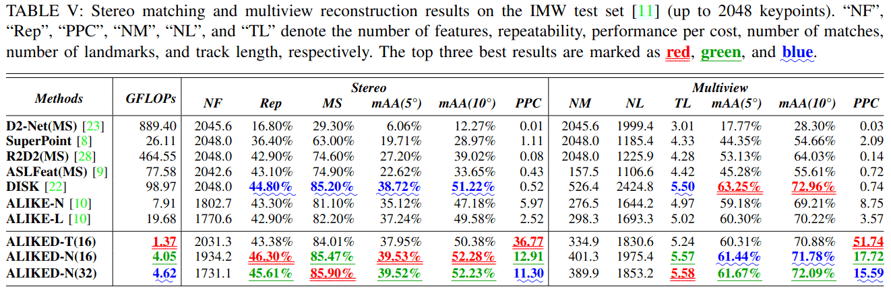

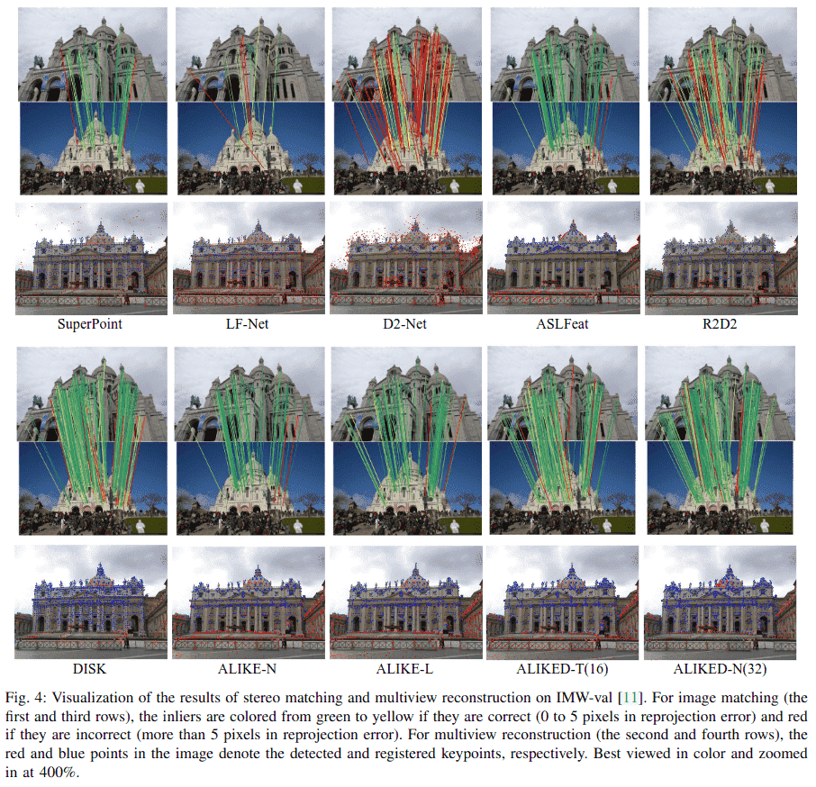

我们还在FM-Bench[56]上进行了比较，该基准在四个数据集上评估提取的局部特征：TUM SLAM数据集[57]、KITTI驾驶数据集[58]、Tanks and Temples (T&T)数据集[59]和社区照片集（CPC）数据集[60]。评估图像对的归一化对称几何距离（NSGD），其阈值默认设置为0.05以进行召回率计算。表VI报告了评估结果。在实验中，我们在TUM数据集[57]中发现了一个典型的失败案例，该数据集包含一些具有不均匀纹理分布（图5）和背景上有许多纹理的图像对。由于ALIKED检测的关键点主要位于纹理丰富区域，尽管匹配结果正确，但这些匹配的关键点不足以建立几何约束，这对于估计基本矩阵无效。尽管如此，如表VI所示，ALIKED-N(16)在TUM[57]和T&T[59]数据集上实现了最佳召回率，而ALIKED-N(32)在KITTI数据集[58]上实现了最佳召回率。综合考虑所有指标，ALIKED-N(32)实现了最佳的整体匹配性能。ALIKED-T(16)的匹配性能也与现有方法相当，尽管其计算需求较低。

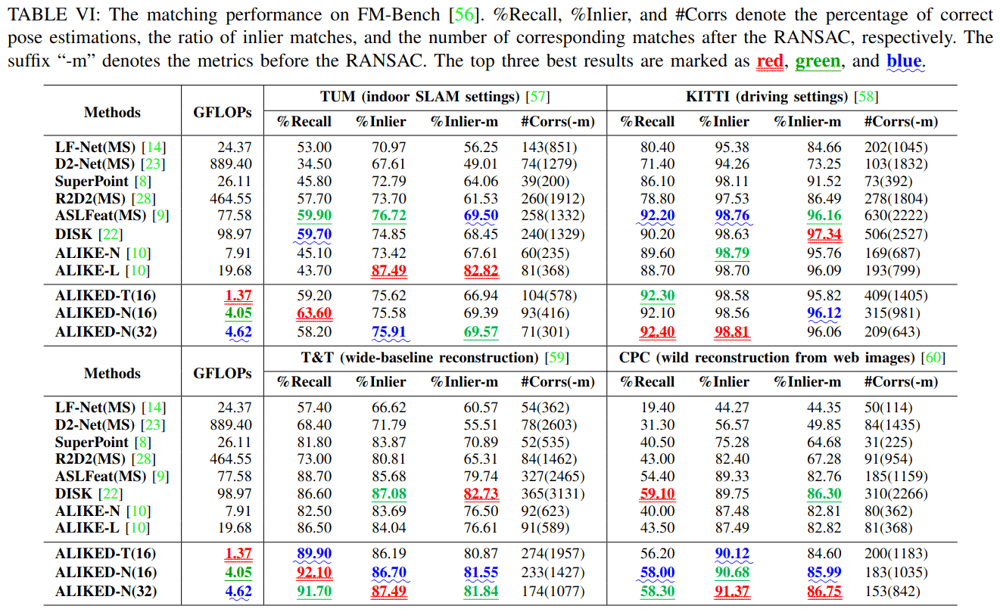

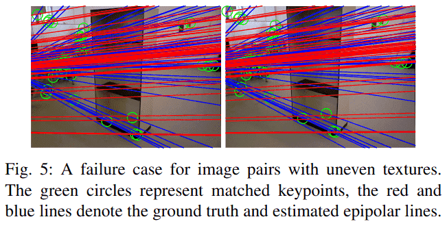

#### 4) 视觉（重）定位
我们在Aachen Day-Night基准测试[49]上测试ALIKED，使用默认配置，提取得分阈值为0.1的关键点，并测试最多1024和2048个关键点的重定位性能。该基准首先使用白天图像检测到的关键点和描述符创建3D地图，然后使用查询夜间图像检测到的关键点和描述符匹配3D地图，并评估三个误差阈值（即(0.25m,2°)/(0.5m,5°)/(5m,10°)）下正确匹配图像的百分比。如表VII所示，ALIKED-N(32)在使用最多1024和2048个关键点时具有最佳的视觉重定位性能。当使用最多1024个点而不是2048个点时，ALIKED-N(32)的重定位性能略有下降，表明ALIKED-N提取的关键点和描述符非常鲁棒。此外，尽管ALIKED-T(16)的描述符只有64维，但其性能仍优于其他方法，尤其是在仅使用最多1024个关键点时。

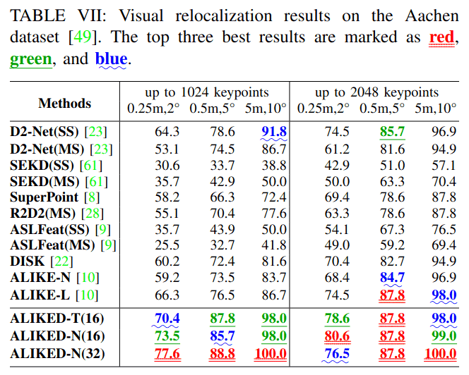

### C. 可变形不变性评估
为了评估提取描述符的可变形不变性，我们基于Hpatches[50]生成旋转和缩放图像。选择59个视角场景中的参考图像，以3°为步长从0°旋转到45°，产生总共840个旋转图像对。参考图像按2^(-s)缩放，s在0到3之间，步长为0.3，产生总共560个缩放图像对。我们在这些图像对上比较ALIKED-N(16)与现有方法的匹配精度。

#### 1) 旋转不变性
如图6上部图表所示，ALIKED-N(16, rot)实现了最佳的旋转不变性，其中ALIKED-N(16, rot)是使用旋转图像对增强训练的ALIKED-N(16)。SuperPoint[8]也实现了良好的旋转不变性，因为它使用单应性增强进行训练。尽管ALIKED-N(16, rot)具有良好的旋转不变性，但它在3D重建中的性能略差于ALIKED-N(16)，这可能是因为图像方向是3D重建中的重要线索（人类也能感知方向），并且我们的网络隐式学习编码这种方向。因此，在其他网络的训练中未使用旋转增强。尽管如此，ALIKED-N(16)在旋转不变性方面仍优于除SuperPoint[8]之外的其他方法。

#### 2) 尺度不变性
如图6下部图表所示，在所有单尺度匹配方法中，ALIKED-N(16)具有最佳的匹配精度。然而，当尺度差异大于4时，所有单尺度方法都降至0，表明它们无法处理大尺度差异。对于多尺度（MS）图像匹配，我们使用与R2D2(MS)[28]相同的多尺度匹配策略。当尺度差异大到8时，ALIKED-N(16, MS)性能下降，这比R2D2(MS)[28]好得多，因为缩放后的图像通常无法完美匹配多尺度匹配中的目标尺度差异图像。因此，小尺度差异下的尺度不变性可以提高多尺度匹配性能（而ALIKED-N(16)在小尺度差异下具有良好的尺度不变性）。

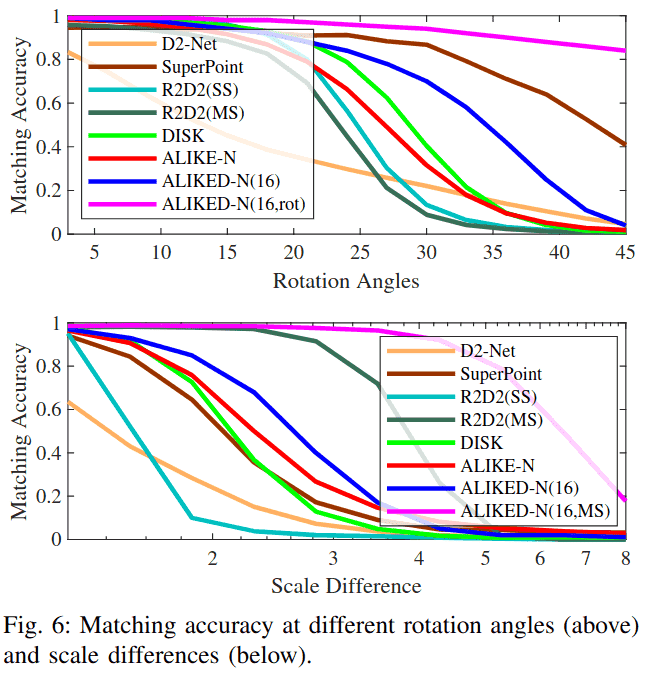

#### 3) 可变形描述符的可视化
我们在图7中可视化了四个不同图像对中对应关键点的可变形区域。网络在不同图像中聚焦于对应关键点的相同局部结构。在图7(a)中，网络聚焦于船的主要结构并随图像旋转。在图7(b)中，网络在不同图像中未改变聚焦区域。因此，小尺寸图像中的相对感受野大于大图像中的感受野。尽管如此，SDDH的采样位置随尺度变化，这可以提供一定的尺度不变性。图7(c)和7(d)分别说明了真实世界单应性和透视图像对中对应关键点的聚焦区域。所提出的网络可以对对应关键点的聚焦区域进行建模。

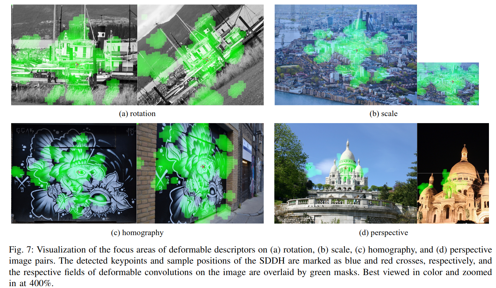

### D. 消融研究
在消融研究中，我们使用不同配置训练网络10K步，并在Hpatches数据集[50]和IMW验证集[11]上评估最后一个检查点。

#### 1) NRE损失和训练数据的消融研究
我们使用不同设置训练基线网络以研究NRE损失和训练数据。如表VIII所示，密集NRE损失优于稀疏NRE损失。然而，由于SDDH仅提取稀疏描述符，我们只能在训练中使用稀疏NRE损失。幸运的是，稀疏NRE损失比密集NRE损失使用的GPU内存显著减少。为了补偿使用稀疏NRE损失带来的性能下降，我们将图像分辨率从480×480增加到800×800，这提高了IMW验证集[11]上的性能，如第三行所示。为了进一步提高单应性图像对上的匹配性能，我们加入了单应性数据集[28]，这提高了Hpatches[50]上的MMA和MS，但由于基线网络不够强大，无法同时对单应性和透视图像的特征进行建模，导致IMW验证[11]上的性能下降。

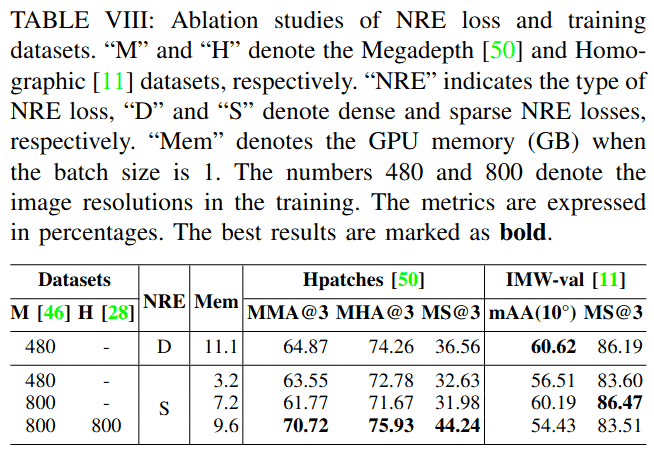

#### 2) 网络架构的消融研究
我们从三个角度改进基线网络：

**特征提取**：为了进行精确的视觉测量，提取的图像特征应具有良好的定位性能和大感受野，以实现鲁棒的描述符提取。我们期望通过改进基线网络ALIKE-N[10]来实现这些目标。如表IX的前两行所示，我们首先将最大池化改为平均池化（AVG），将ReLU改为SELU[43]。这些变化将IMW验证[11]上的mAA(10°)提高了3.43%，但对其他指标的改进有限。此外，为了几何不变特征提取，我们将最后两个块中的普通卷积替换为DCN[15]，如表IX的第六和第七行所示。与使用普通卷积的网络（第五行）相比，在最后两个块中使用DCN[15]（2xDCN）的网络仅增加了0.1 GFLOPs的计算量和0.8 ms的运行时间。除了将Hpatches[50]上的MS@3提高了2.81%之外，这一变化还将IMW验证[11]上的mAA(10°)和MS@3分别提高了4.36%和3.28%。由于前两个块具有更高的特征分辨率，使用DCN[15]将显著增加计算成本。此外，由于前面的块负责低级特征提取，使用DCN[15]可能会降低性能。因此，我们仅在最后两个块中使用DCN[15]。

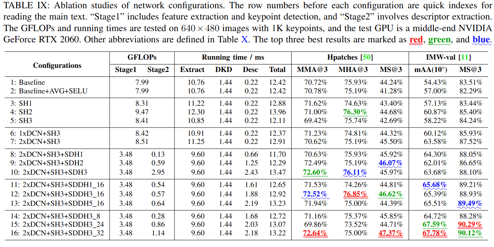

**得分头**：由于计算成本考虑，基线网络使用简单的1×1卷积层来估计得分图。在本文中，我们提出了一种高效的描述符提取流程，不需要提取密集描述符图，而是在关键点位置提取描述符，从而大大降低了计算成本。因此，我们可以使用更复杂的得分头（SH1-SH3）。如表X所示，我们首先将卷积核大小增加到3（SH1）。这一简单修改将Hpatches[50]上的MMA@3和MS@3分别提高了0.84%和2.12%，将IMW验证[11]上的MS@3提高了1.15%。我们还设计了具有更深层的SH2。如表IX的第八和第九行所示，SH2将Hpatches[50]上的MHA@3和MS@3分别提高了1.67%和1.28%，将IMW验证[11]上的mAA(10°)和MS@3分别提高了3.71%和1.96%。然而，与基线相比，SH2将GFLOPs和运行时间分别增加了1.41和1.54 ms。通过仔细检查，我们发现第一个3×3卷积对计算成本贡献最大。因此，我们设计了SH3，它在估计得分图之前执行1×1卷积将特征通道减少到8。如表IX所示，与SH2相比，SH3节省了1.06 GFLOPs，且具有相似的匹配性能。

**描述符头**：在基线网络中，描述符头是一个简单的1×1卷积层。为了提高效率，我们从特征图中采样特征块，然后使用这些特征块提取稀疏描述符。表X展示了我们如何开发稀疏描述符头SDH1-SDH3和SDDH。SDH1使用两个1×1卷积层，SDH2使用一个3×3卷积层以获得更大的感受野，SDH3采用两个3×3卷积层。对于SDH，由于只提取关键点位置的描述符，计算成本与关键点数量成正比。为了评估其效率，我们将网络分为两个阶段，第一阶段包括特征提取和DKD，第二阶段包括描述符提取。如表IX所示，使用1K关键点测试每个步骤的GFLOPs和运行时间。更深入和更宽泛的描述符头带来更好的整体性能。具体来说，与SDH1相比，SDH3将Hpatches[50]上的MMA@3和MHA@3分别提高了1.97%和0.19%，将IMW验证[11]上的mAA(10°)和MS@3分别提高了1.68%和1.45%。然而，与SDH1相比，SDH3每1K关键点增加了2.82 GFLOPs的计算成本和1.77 ms的运行时间。此外，SDH仍然使用传统卷积，不能提供几何不变性。为了解决这些问题，我们在第四部分B中提出了SDDH，它通过估计的采样位置提供局部几何不变性。为了找到SDDH的合适配置，我们改变其核大小K（1,3,5）和采样位置数量M（8,16,24,32），如表IX所示。核大小K略微提高了匹配性能，随着M的增加，描述符具有更大的感受野，从而使网络能够在特征图上找到更多的支持特征，从而产生更强大的描述符。因此，我们确定K=3和M=16是运行时和性能之间的最佳权衡，并使用M=32的更大网络以获得更好的性能。

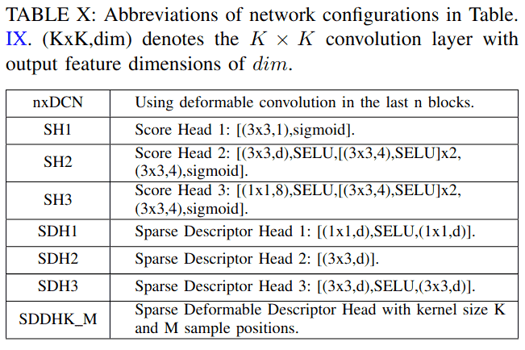

### E. ALIKED的局限性
尽管ALIKED在各种视觉测量任务中表现良好，但它仍有一些局限性。首先，对于涉及尺度和视角都有显著差异的图像匹配任务，ALIKED可能难以获得正确匹配，如图8所示。然而，需要注意的是，这一挑战并非ALIKED独有，其他SOTA关键点描述符方法如ALSFeat[9]、DISK[22]和ALIKE[10]也面临同样问题。ALSFeat由于其多尺度匹配策略可以恢复几个匹配，而ALIKED由于其可变形描述符也可以恢复一些正确匹配。然而，为了节省计算量，ALIKED中的SDDH只有一层用于可变形位置估计，因此在模拟图像变形方面存在局限性。因此，在尺度和视角都有显著差异的情况下，它可能会失败。为了克服这一限制，一个可能的解决方案是使用基于学习的匹配器[51],[52]而不是简单的mNN匹配器。我们在研究中选择使用mNN匹配器，因为我们专注于纯关键点描述符的性能。其次，ALIKED使用网格采样并产生32位浮点描述符，这可能不适用于移动平台。因此，我们未来的研究目标之一是基于ALIKED开发硬件友好的关键点描述符提取网络。

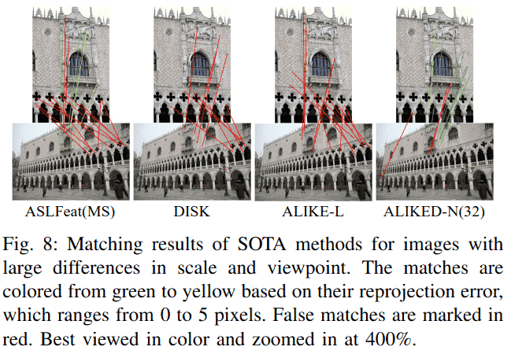

## 七、结论
在本文中，我们提出了SDDH（稀疏可变形描述符头）并设计了ALIKED（基于可变形变换的轻量级关键点和描述符提取网络）。与现有的关键点和描述符提取网络不同，所提出的方法将可变形变换纳入描述符，使其更加鲁棒。此外，SDDH仅在稀疏关键点上提取描述符，这消除了描述符图提取中的冗余卷积，减少了运行时间。为了训练从所提出网络获得的稀疏可变形描述符，我们进一步将神经重投影误差损失从密集形式放宽到稀疏形式。实验表明，所提出的网络在重要的视觉测量任务（包括图像匹配、3D重建和视觉重定位）中均取得了优异的性能。在我们未来的工作中，我们计划同时训练关键点描述符提取和匹配网络，开发硬件友好的关键点描述符网络，并进一步提高网络性能。

## 参考文献（References）

以下是本文中引用的所有参考文献的完整列表，按在文中出现的顺序整理为Markdown格式：

### 计算机视觉与SLAM基础
1. **Y. Ding, Z. Xiong, J. Xiong, Y. Cui, and Z. Cao**, "Ogi-slam2: A hybrid map slam framework grounded in inertial-based slam," *IEEE Transactions on Instrumentation and Measurement*, vol. 71, pp. 1-14, 2022.
2. **Y. Xu, Z. Li, W. Chen, and C. Wen**, "Novel intensity mapping functions: Weighted histogram averaging," in *2022 IEEE 17th Conference on Industrial Electronics and Applications (ICIEA)*. IEEE, 2022, pp. 1157-1161.
3. **H. Yue, J. Miao, W. Chen, W. Wang, F. Guo, and Z. Li**, "Automatic vocabulary and graph verification for accurate loop closure detection," *Journal of Field Robotics*, 2021.

### 传统特征提取方法
4. **D. G. Lowe**, "Distinctive image features from scale-invariant keypoints," *International journal of computer vision*, vol. 60, no. 2, pp. 91-110, 2004.
5. **E. Rublee, V. Rabaud, K. Konolige, and G. Bradski**, "ORB: An efficient alternative to SIFT or SURF," in *2011 International conference on computer vision*, 2011, pp. 2564-2571.
6. **H. Zhang, Z. Tang, Y. Xie, and W. Gui**, "Rpi-surf: A feature descriptor for bubble velocity measurement in froth flotation with relative position information," *IEEE Transactions on Instrumentation and Measurement*, vol. 70, pp. 1-14, 2021.

### 深度学习特征学习方法
7. **A. Mishchuk, D. Mishkin, F. Radenovic, and J. Matas**, "Working hard to know your neighbor's margins: Local descriptor learning loss," in *Advances in Neural Information Processing Systems*, Jan. 2018.
8. **D. DeTone, T. Malisiewicz, and A. Rabinovich**, "SuperPoint: Self-Supervised Interest Point Detection and Description," in *Proceedings of the IEEE Conference on Computer Vision and Pattern Recognition Workshops*, 2018, pp. 224-236.
9. **Z. Luo, L. Zhou, X. Bai, H. Chen, J. Zhang, Y. Yao, S. Li, T. Fang, and L. Quan**, "ASLFeat: Learning Local Features of Accurate Shape and Localization," in *Proceedings of the IEEE/CVF Conference on Computer Vision and Pattern Recognition*, Apr. 2020.
10. **X. Zhao, X. Wu, J. Miao, W. Chen, P. C. Y. Chen, and Z. Li**, "ALIKE: Accurate and lightweight keypoint detection and descriptor extraction," *IEEE Transactions on Multimedia*, Mar. 2022.

### 特征匹配与图像匹配综述
11. **J. Ma, X. Jiang, A. Fan, J. Jiang, and J. Yan**, "Image Matching from Handcrafted to Deep Features: A Survey," *International Journal of Computer Vision*, Aug. 2020.

### 几何不变特征学习
12. **K. M. Yi, E. Trulls, V. Lepetit, and P. Fua**, "LIFT: Learned Invariant Feature Transform," in *European Conference on Computer Vision*, vol. 9910. Cham: Springer, 2016, pp. 467-483.
13. **Y. Liu, Z. Shen, Z. Lin, S. Peng, H. Bao, and X. Zhou**, "GIFT: Learning transformation-invariant dense visual descriptors via group cnns," *Advances in Neural Information Processing Systems*, vol. 32, 2019.
14. **Y. Ono, E. Trulls, P. Fua, and K. M. Yi**, "LF-Net: Learning Local Features from Images," in *Advances in Neural Information Processing Systems 31*. Curran Associates, Inc., 2018, pp. 6234-6244.
24. **D. Mishkin, F. Radenovic, and J. Matas**, "Repeatability is not enough: Learning affine regions via discriminability," in *Proceedings of the European Conference on Computer Vision (ECCV)*, 2018, pp. 284-300.

### 可变形卷积网络
15. **J. Dai, H. Qi, Y. Xiong, Y. Li, G. Zhang, H. Hu, and Y. Wei**, "Deformable convolutional networks," in *Proceedings of the IEEE international conference on computer vision*, 2017, pp. 764-773.
32. **X. Zhu, H. Hu, S. Lin, and J. Dai**, "Deformable convnets v2: More deformable, better results," in *Proceedings of the IEEE/CVF conference on computer vision and pattern recognition*, 2019, pp. 9308-9316.
33. **G. Bertasius, L. Torresani, and J. Shi**, "Object detection in video with spatiotemporal sampling networks," in *Proceedings of the European Conference on Computer Vision (ECCV)*, 2018, pp. 331-346.

### 特征检测与描述符网络
16. **K. C. Chan, X. Wang, K. Yu, C. Dong, and C. C. Loy**, "Understanding deformable alignment in video super-resolution," in *Proceedings of the AAAI conference on artificial intelligence*, vol. 35, no. 2, 2021, pp. 973-981.
17. **H. Germain, V. Lepetit, and G. Bourmaud**, "Neural reprojection error: Merging feature learning and camera pose estimation," in *Proceedings of the IEEE/CVF Conference on Computer Vision and Pattern Recognition*, June 2021, pp. 414-423.
18. **X. Han, T. Leung, Y. Jia, R. Sukthankar, and A. C. Berg**, "MatchNet: Unifying feature and metric learning for patch-based matching," in *Proceedings of the IEEE Conference on Computer Vision and Pattern Recognition*, 2015, pp. 3279-3286.
19. **V. Balntas, E. Riba, D. Ponsa, and K. Mikolajczyk**, "Learning local feature descriptors with triplets and shallow convolutional neural networks," in *BMVC*, vol. 1, 2016, p. 3.
20. **Y. Tian, B. Fan, and F. Wu**, "L2-Net: Deep Learning of Discriminative Patch Descriptor in Euclidean Space," in *2017 IEEE Conference on Computer Vision and Pattern Recognition*, Honolulu, HI, Jul. 2017, pp. 6128-6136.
21. **Y. Tian, X. Yu, B. Fan, F. Wu, H. Heijnen, and V. Balntas**, "SOSNet: Second Order Similarity Regularization for Local Descriptor Learning," in *Conference on Computer Vision and Pattern Recognition*, Dec. 2019.

### 强化学习与先进方法
22. **M. J. Tyszkiewicz, P. Fua, and E. Trulls**, "DISK: Learning local features with policy gradient," in *Neural IPS*, Jun. 2020.
23. **M. Dusmanu, I. Rocco, T. Pajdla, M. Pollefeys, J. Sivic, A. Torii, and T. Sattler**, "D2-Net: A Trainable CNN for Joint Description and Detection of Local Features," in *2019 IEEE/CVF Conference on Computer Vision and Pattern Recognition*, Long Beach, CA, USA, Jun. 2019, pp. 8084-8093.
25. **B. Choy, J. Gwak, S. Savarese, and M. Chandraker**, "Universal correspondence network," *Advances in neural information processing systems*, vol. 29, 2016.

### 空间变换与注意力机制
26. **M. Jaderberg, K. Simonyan, A. Zisserman et al.**, "Spatial transformer networks," *Advances in neural information processing systems*, vol. 28, 2015.
27. **A. Barroso-Laguna, Y. Verdie, B. Busam, and K. Mikolajczyk**, "HDD-net: Hybrid detector descriptor with mutual interactive learning," in *Proceedings of the Asian Conference on Computer Vision*, November 2020.
28. **J. Revaud, P. Weinzaepfel, C. D. Souza, N. Pion, G. Csurka, Y. Cabon, and M. Humenberger**, "R2D2: Repeatable and Reliable Detector and Descriptor," in *NeurIPS*, 2019, p. 12.

### 视频处理与时间建模
34. **Y. Zhao, Y. Xiong, and D. Lin**, "Trajectory convolution for action recognition," *Advances in neural information processing systems*, vol. 31, 2018.
36. **Y. Tian, Y. Zhang, Y. Fu, and C. Xu**, "TDAN: Temporally-deformable alignment network for video super-resolution," in *Proceedings of the IEEE/CVF conference on computer vision and pattern recognition*, 2020, pp. 3360-3369.
37. **Z. Liu, W. Lin, X. Li, Q. Rao, T. Jiang, M. Han, H. Fan, J. Sun, and S. Liu**, "ADNet: Attention-guided Deformable Convolutional Network for High Dynamic Range Imaging," in *2021 IEEE/CVF Conference on Computer Vision and Pattern Recognition Workshops (CVPRW)*. Nashville, TN, USA: IEEE, Jun. 2021, pp. 463-470.
38. **Z. Shi, X. Liu, K. Shi, L. Dai, and J. Chen**, "Video Frame Interpolation via Generalized Deformable Convolution," *IEEE Transactions on Multimedia*, vol. 24, pp. 426-439, 2022.

### Transformer与注意力网络
39. **A. Dosovitskiy, L. Beyer, A. Kolesnikov, D. Weissenborn, X. Zhai, T. Unterthiner, M. Dehghani, M. Minderer, G. Heigold, S. Gelly et al.**, "An image is worth 16x16 words: Transformers for image recognition at scale," *arXiv preprint arXiv:2010.11929*, 2020.
40. **A. Vaswani, N. Shazeer, N. Parmar, J. Uszkoreit, L. Jones, A. N. Gomez, L. Kaiser, and I. Polosukhin**, "Attention is all you need," in *Proceedings of the 31st International Conference on Neural Information Processing Systems*, ser. NIPS'17. Red Hook, NY, USA: Curran Associates Inc., 2017, p. 6000-6010.
41. **X. Zhu, W. Su, L. Lu, B. Li, X. Wang, and J. Dai**, "Deformable DETR: Deformable Transformers for End-to-End Object Detection," *arXiv:2010.04159 [cs]*, Oct. 2020.

### 激活函数与优化器
43. **G. Klambauer, T. Unterthiner, A. Mayr, and S. Hochreiter**, "Self-normalizing neural networks," *Advances in neural information processing systems*, vol. 30, 2017.
44. **V. Nair and G. E. Hinton**, "Rectified linear units improve restricted boltzmann machines," in *Icml*, 2010.
45. **D. P. Kingma and J. Ba**, "Adam: A Method for Stochastic Optimization," in *ICLR*, 2015.

### 数据集与评估基准
46. **Z. Li and N. Snavely**, "Megadepth: Learning single-view depth prediction from internet photos," in *Proceedings of the IEEE Conference on Computer Vision and Pattern Recognition*, 2018, pp. 2041-2050.
47. **J. L. Schnberger and J.-M. Frahm**, "Structure-from-motion revisited," in *Conference on Computer Vision and Pattern Recognition*, 2016.
48. **F. Radenovi, A. Iscen, G. Tolias, Y. Avrithis, and O. Chum**, "Revisiting oxford and paris: Large-scale image retrieval benchmarking," in *Proceedings of the IEEE conference on computer vision and pattern recognition*, 2018, pp. 5706-5715.
49. **T. Sattler, W. Maddern, C. Toft, A. Torii, L. Hammarstrand, E. Stenborg, D. Safari, M. Okutomi, M. Pollefeys, J. Sivic et al.**, "Benchmarking 6dof outdoor visual localization in changing conditions," in *Proceedings of the IEEE Conference on Computer Vision and Pattern Recognition*, 2018, pp. 8601-8610.
50. **V. Balntas, K. Lenc, A. Vedaldi, and K. Mikolajczyk**, "HPatches: A benchmark and evaluation of handcrafted and learned local descriptors," in *Proceedings of the IEEE Conference on Computer Vision and Pattern Recognition*, 2017, pp. 5173-5182.

### 图匹配与对应关系
51. **X. Zhao, J. Liu, X. Wu, W. Chen, F. Guo, and Z. Li**, "Probabilistic spatial distribution prior based attentional keypoints matching network," *IEEE Transactions on Circuits and Systems for Video Technology*, vol. 32, no. 3, pp. 1313-1327, 2021.
52. **P.-E. Sarlin, D. DeTone, T. Malisiewicz, and A. Rabinovich**, "SuperGlue: Learning Feature Matching with Graph Neural Networks," in *Proceedings of the IEEE/CVF Conference on Computer Vision and Pattern Recognition*, Mar. 2020, pp. 4938-4947.

### 无检测器匹配与Transformer
53. **J. Sun, Z. Shen, Y. Wang, H. Bao, and X. Zhou**, "LoFTR: Detector-free local feature matching with transformers," in *Proceedings of the IEEE/CVF conference on computer vision and pattern recognition*, 2021, pp. 8922-8931.
54. **W. Jiang, E. Trulls, J. Hosang, A. Tagliasacchi, and K. M. Yi**, "CoTR: Correspondence transformer for matching across images," in *Proceedings of the IEEE/CVF International Conference on Computer Vision*, 2021, pp. 6207-6217.
55. **J. Revaud, V. Leroy, P. Weinzaepfel, and B. Chidlovskii**, "PUMP: Pyramidal and uniqueness matching priors for unsupervised learning of local descriptors," in *Proceedings of the IEEE/CVF Conference on Computer Vision and Pattern Recognition*, 2022, pp. 3926-3936.

### 评估指标与基准测试
56. **J.-W. Bian, Y.-H. Wu, J. Zhao, Y. Liu, L. Zhang, M.-M. Cheng, and I. Reid**, "An Evaluation of Feature Matchers for Fundamental Matrix Estimation," in *British Machine Vision Conference (BMVC)*, 2019, p. 14.
57. **J. Sturm, N. Engelhard, F. Endres, W. Burgard, and D. Cremers**, "A benchmark for the evaluation of RGB-D SLAM systems," in *2012 IEEE/RSJ International Conference on Intelligent Robots and Systems*, Oct. 2012, pp. 573-580.
58. **A. Geiger, P. Lenz, and R. Urtasun**, "Are we ready for autonomous driving? The KITTI vision benchmark suite," in *Proceedings of the IEEE/CVF Conference on Computer Vision and Pattern Recognition*. IEEE, Jun. 2012, pp. 3354-3361.
59. **A. Knapitsch, J. Park, Q.-Y. Zhou, and V. Koltun**, "Tanks and temples: Benchmarking large-scale scene reconstruction," *ACM Transactions on Graphics (ToG)*, vol. 36, no. 4, pp. 1-13, 2017.
60. **K. Wilson and N. Snavely**, "Robust global translations with 1dsfm," in *European conference on computer vision*. Springer, 2014, pp. 61-75.
61. **Y. Song, L. Cai, J. Li, Y. Tian, and M. Li**, "SEKD: Self-Evolving Keypoint Detection and Description," *arXiv:2006.05077 [cs]*, Jun. 2020.

### 分类说明
本参考文献列表涵盖了计算机视觉、深度学习、特征提取、图像匹配、三维重建等多个重要领域的研究成果，反映了该领域从传统方法到深度学习的最新发展历程。