# NeRF：将场景表示为用于视图合成的神经辐射场

## 摘要

我们提出了一种方法，通过使用一组稀疏的输入视图优化底层连续体积场景函数，在合成复杂场景的新视图方面取得了最先进的结果。我们的算法使用完全连接（非卷积）深度网络表示场景，其输入是单个连续的 5D 坐标（空间位置（x，y，z）和观察方向（θ，φ）），其输出是该空间位置的体积密度和与视图相关的发射辐射。我们通过查询沿相机光线的 5D 坐标来合成视图，并使用经典的体积渲染技术将输出颜色和密度投影到图像中。因为体积渲染具有天然可微分的特性，所以优化我们的表示所需的唯一输入是一组已知相机姿势的图像。我们描述了如何有效地优化神经辐射场以渲染具有复杂几何和外观的场景的真实感新视图，并展示了优于先前神经渲染和视图合成工作的结果。视图合成结果最好以视频形式观看，因此我们敦促读者观看我们的补充视频以进行令人信服的比较。
关键词：场景表示、视图合成、基于图像的渲染、体积渲染、3D 深度学习

## 1 简介

在这项工作中，我们通过直接优化连续 5D 场景表示的参数来最小化渲染一组捕获图像的误差，以新的方式解决了长期存在的视图合成问题。我们将静态场景表示为一个连续的 5D 函数，该函数输出空间中每个点 (x, y, z) 在每个方向 (θ, φ) 发射的辐射度，以及每个点的密度，该密度的作用类似于差分不透明度，控制穿过 (x, y, z) 的射线累积的辐射度。我们的方法优化了一个没有任何卷积层的深度全连接神经网络（通常称为多层感知器或 MLP）来表示此函数，方法是从单个 5D 坐标 (x, y, z, θ, φ) 回归到单个体积密度和视图相关的 RGB 颜色。
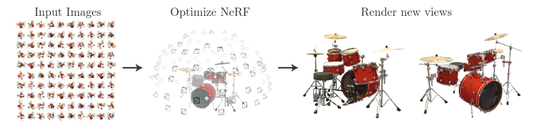

图 1：我们提出了一种方法，该方法从一组输入图像中优化场景的连续 5D 神经辐射场表示（任何连续位置的体积密度和视图相关颜色）。我们使用体积渲染技术沿光线累积此场景表示的样本，以从任何视点渲染场景。在这里，我们可视化在周围半球上随机捕获的合成鼓场景的 100 个输入视图集，并展示从我们优化的 NeRF 表示渲染的两个新视图。

为了从特定视角渲染这个神经辐射场 (NeRF)，我们：1）将相机光线穿过场景以生成一组采样的 3D 点，2）使用这些点及其对应的 2D 观看方向作为神经网络的输入以产生一组颜色和密度的输出，以及 3）使用经典的体积渲染技术将这些颜色和密度累积到 2D 图像中。由于这个过程具有天然的可微性，我们可以使用梯度下降法来优化该模型，即最小化每幅观测图像与由我们的表征渲染出的相应视图之间的误差。最小化跨多个视图的误差，可以促使网络通过为包含真实底层场景内容的位置分配高体积密度和精确色彩，从而预测出一个连贯的场景模型。图 2 可视化了整个流程。

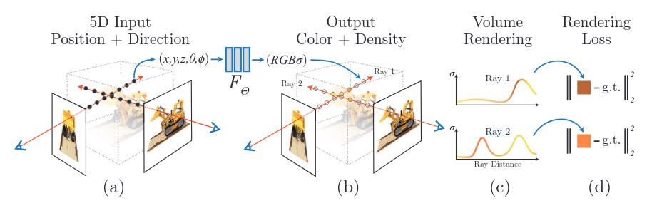
图 2：我们的神经辐射场场景表示和可微渲染过程的概述。我们通过沿相机光线 (a)采样 5D 坐标（位置和观察方向）来合成图像，并将这些位置输入到放入 MLP 中生成颜色和体积密度 (b)，并使用体积渲染技术将这些值合成图像 (c)。此渲染函数可微分，因此我们可以通过最小化合成图像和真实观测图像之间的残差来优化场景表示 (d)。

我们发现，针对复杂场景优化神经辐射场表征的基本实现无法收敛到足够高分辨率的表征，并且在每个摄像头光线所需的采样数量方面效率低下。我们通过使用位置编码来转换输入的五维坐标来解决这些问题，从而使 MLP 能够表示更高频率的函数，并且我们提出了一种分层采样程序来减少充分采样这种高频场景表征所需的查询次数。
我们的方法继承了体积表征的优势：两者都可以表示复杂的现实世界几何形状和外观，并且非常适合使用投影图像进行基于梯度的优化。至关重要的是，我们的方法克服了离散体素网格在高分辨率建模复杂场景时高昂的存储成本。总而言之，我们的技术贡献如下：

- 将材料表征为 5D 神经辐射场，并参数化为基本的多层感知器（MLP）网络。
- 基于经典体积渲染技术的可微分渲染程序，我们利用该程序优化标准 RGB 图像的表征。这包括一种分层采样策略，用于将 MLP 的容量分配到具有可见场景内容的空间。
- 一种位置编码，用于将每个输入的 5D 坐标映射到更高维空间，这使我们能够成功优化神经辐射场以表示高频场景内容。
  我们证明，我们得到的神经辐射场方法在数量和质量上均优于最先进的视图合成方法，包括将神经 3D 表征与场景拟合的方法，以及训练深度卷积网络以预测采样体积表征的方法。据我们所知，本文提出了第一个连续神经场景表征，它能够从自然环境中捕获的 RGB 图像渲染出真实物体和场景的高分辨率、逼真的全新视图。

## 2 相关工作

计算机视觉领域中一个很有前途的新方向是将物体和场景编码到 MLP 的权重中，MLP 可以直接从 3D 空间位置映射到形状的隐式表示，例如该位置的有符号距离 [6]。然而，到目前为止，这些方法还无法像使用离散表示（如三角形网格或体素网格）
表示场景的技术那样，以相同的保真度重现具有复杂几何形状的真实场景。在本节中，我们回顾这两条工作路线，并将它们与我们的方法进行对比，这增强了神经场景表示的能力，可以在渲染复杂的真实场景时产生最先进的结果。

使用 MLP 将低维坐标映射到颜色的类似方法也已用于表示其他图形功能，如图像 [44]、纹理材质 [12,31,36,37] 和间接照明值 [38]。

**神经 3D 形状表示**。近期研究通过优化深度网络（将 xyz 坐标映射到有符号距离函数 [15,32] 或占用场 [11,27]），探索了将连续 3D 形状隐式表示为水平集的方法。然而，这些模型受限于对真实 3D 几何图形的访问要求，而这些几何图形通常来自 ShapeNet [3] 等合成 3D 形状数据集。后续研究放宽了这一要求，通过制定可微分的渲染函数，仅使用二维图像即可优化神经隐式形状表示，从而实现真实三维形状的绘制。Niemeyer 等人 [29] 将表面表示为三维占用场，并使用数值方法找到每条射线的表面交点，然后使用隐式微分计算精确导数。每条射线的交点位置都作为神经三维纹理场的输入，该纹理场预测该点的漫反射颜色。Sitzmann 等人 [42] 使用一种不太直接的神经三维表示，它只是在每个连续的三维坐标上输出一个特征向量和 RGB 颜色，并提出了一个可微分的渲染函数，该函数由一个循环神经网络组成，该神经网络沿着每条射线行进以确定表面的位置。

虽然这些技术可以潜在地表示复杂且高分辨率的几何形状，但迄今为止，它们仅限于几何复杂度较低的简单形状，导致渲染过于平滑。我们证明了一种替代策略，即优化网络以编码 5D 辐射场（具有 2D 视图相关外观的 3D 体积和外观，从而渲染复杂场景的照片般逼真的新颖视图。

**视图合成和基于图像的渲染**。给定一个密集的视图采样，可以通过简单的光场样本插值技术重建照片般逼真的新颖视图 [21,5,7]。对于使用稀疏视图采样的新颖视图合成，计算机视觉和图形学界通过从观察到的图像中预测传统的几何和外观表示取得了重大进展。一类流行的方法是使用基于网格的场景表示，其外观要么是漫反射 [48]，要么是视图相关 [2,8,49]。可微分光栅化器 [4,10,23,25] 或路径追踪器 [22,30] 可以直接优化网格表示，以使用梯度下降重现一组输入图像。然而，基于图像重投影的梯度网格优化通常很困难，这可能是因为局部最小值或损失图景条件不佳。此外，该策略需要在优化前提供一个具有固定拓扑的模板网格作为初始化 [22]，而这在无约束的真实场景中通常是无法实现的。

另一类方法使用体积表示来解决从一组输入 RGB 图像中合成高质量真实感视图的任务。体积方法能够真实地表示复杂形状和材料，非常适合基于梯度的优化，并且比基于网格的方法产生的视觉干扰伪影更少。早期的体积方法使用观察到的图像直接为体素网格着色 [19,40,45]。最近，一些方法 [9,13,17,28,33,43,46,52] 使用多个场景的大型数据集来训练深度网络，该网络从一组输入图像中预测采样的体积表示，然后使用 alpha 合成 [34] 或沿光线学习的合成在测试时渲染新的视图。其他工作针对每个特定场景优化了卷积网络 (CNN) 和采样体素网格的组合，使得 CNN 可以补偿低分辨率体素网格的离散化伪影 [41] 或允许预测的体素网格根据输入时间或动画控制而变化 [24]。虽然这些体积技术在新型视图合成方面取得了令人瞩目的成果，但它们扩展到更高分辨率图像的能力从根本上受到离散采样导致的时间和空间复杂度较低的限制——渲染更高分辨率的图像需要对 3D 空间进行更精细的采样。我们通过在深度全连接神经网络的参数内编码连续体积来解决这个问题，这不仅可以产生比以前的体积方法更高质量的渲染，而且只需要那些采样体积表示的存储成本的一小部分。

## 3 神经辐射场场景表示

我们将连续场景表示为 5D 矢量值函数，其输入是 3D 位置 x = (x, y, z) 和 2D 观看方向 (θ, φ)，其输出是发射颜色 c = (r, g, b) 和体积密度 σ。在实践中，我们表达方向作为 3D 笛卡尔单位向量 d。我们用 MLP 网络 FΘ : (x, d) → (c, σ) 近似这个连续的 5D 场景表示，并优化其权重 Θ 以从每个输入的 5D 坐标映射到其对应的体积密度和方向发射颜色。我们通过限制网络仅根据位置 x 预测体积密度 σ，同时允许根据位置和观察方向预测 RGB 颜色 c，来确保表示具有多视图一致性。为此，MLP FΘ 首先使用 8 个全连接层（使用 ReLU 激活，每层 256 个通道）处理输入的 3D 坐标 x ，并输出 σ 和一个 256 维特征向量。然后将此特征向量与相机光线的观察方向连接起来，并传递到一个额外的全连接层（使用 ReLU 激活和 128 个通道），该层输出与视图相关的 RGB 颜色。

有关我们的方法如何使用输入观察方向来表示非朗伯效应的示例，请参见图 3。如图 4 所示，不依赖于视图（仅 x 作为输入）训练的模型难以表示镜面反射。

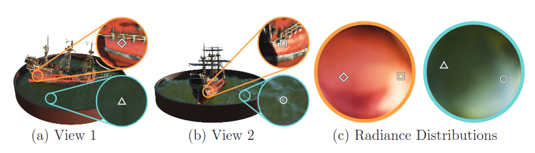
图 3：视图相关发射辐射的可视化。我们的神经辐射场表示将 RGB 颜色输出为空间位置和时间的 5D 函数 x 和视角 d。在这里，我们可视化了船舶场景神经表征中两个空间位置的示例方向颜色分布。在 (a) 和 (b) 中，我们展示了来自两个不同摄像机位置的两个固定 3D 点的外观：一个在船侧（橙色插图），一个在水面上（蓝色插图）。我们的方法预测了这两个 3D 点不断变化的镜面外观，在 (c) 中，我们展示了这种行为如何在整个视角半球上连续推广。

图 4：这里我们直观地展示了我们的完整模型如何从表示与视图相关的发射辐射以及通过高频位置编码传递输入坐标中受益。消除视图依赖性可防止模型在推土机胎面上重新创建镜面反射。删除位置编码会大大降低模型表示高频几何和纹理的能力，导致外观过度平滑。

## 4 使用辐射场的体积渲染

我们的 5D 神经辐射场将场景表示为空间中任何一点的体积密度和定向发射辐射。我们使用经典体积渲染的原理来渲染穿过场景的任何光线的颜色 [16]。体积密度 σ(x) 可以解释为射线终止于位置 x 处的无穷小粒子的微分概率。相机光线 r(t) = o + td 的预期颜色 C(r)，近界和远界分别为 tn 和 tf 为：
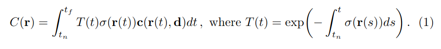

函数 T(t) 表示从 tn 到 t 的射线的累积透射率，即射线从 tn 传播到 t 而没有碰到任何其他粒子的概率。从我们的连续神经辐射场渲染视图需要估计穿过所需虚拟摄像机每个像素的摄像机射线的积分 C(r) 。

我们使用求积法在数值上估计这个连续积分。确定性求积法通常用于渲染离散体素网格，但它会有效地限制我们表示的分辨率，因为 MLP 只能在一组固定的离散位置上进行查询。因此，我们使用分层
采样方法，将 [tn, tf] 划分为 N 个等距的区间，然后从每个区间中均匀随机地抽取一个样本：

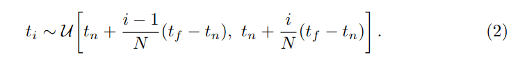

尽管我们使用离散样本集来估计积分，但分层采样使我们能够表示连续的场景表示，因为它会导致在优化过程中在连续位置评估 MLP 。我们使用这些样本通过 Max [26] 在体积渲染评论中讨论的求积规则来估计 C(r) ：

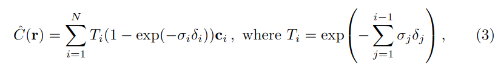

其中 δi = ti+1 − ti 是相邻样本之间的距离。这个从 (ci , σi ) 值集计算 Ĉ(r) 的函数是可微分的，并且简化为传统的 alpha 合成，其中 alpha 值为 αi = 1 − exp(−σi δi)。

## 5 优化神经辐射场

在上一节中，我们描述了将场景建模为神经辐射场并从该表示中渲染新视图所需的核心组件。然而，我们观察到这些组件不足以达到最先进的质量，如第 6.4 节所示。我们引入了两项改进来实现高分辨率复杂场景的表示。第一个是对输入坐标的位置编码，它帮助 MLP 表示高频函数；第二个是分层采样程序，它使我们能够有效地对这种高频表示进行采样。

### 5.1 位置编码

尽管神经网络是通用函数逼近器 [14]，但我们发现，直接对 xyzθφ 输入坐标进行网络 FΘ 运算，会导致渲染效果在表示颜色和几何形状的高频变化方面表现不佳。这与 Rahaman 等人 [35] 的最新研究一致，该研究表明深度网络偏向于学习低频函数。他们还表明，在将输入传递到网络之前，使用高频函数将其映射到更高维空间，可以更好地拟合包含高频变化的数据。我们将这些发现应用于神经场景表征，并表明将 FΘ 重新表述为两个函数 FΘ = FΘ0 ◦ γ（一个经过学习，一个未经学习）的组合，可以显著提高性能（见图 4 和表 2）。其中 γ 是从 R 到更高维空间 R2L 的映射，而 FΘ0 仍然只是一个普通的 MLP。正式来说，我们使用的编码函数为：

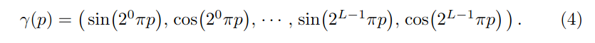

该函数 γ(·) 分别应用于 x 中的三个坐标值（标准化为位于 [−1, 1] 内）和笛卡尔视角方向单位向量 d（构造上位于 [−1, 1] 之间）。在我们的实验中，我们设置 γ(x) 的 L = 10，γ(d) 的 L = 4。

流行的 Transformer 架构 [47] 中使用了类似的映射，它被称为位置编码。然而，Transformer 使用它的另一个目的是将序列中 token 的离散位置作为输入提供给不包含任何顺序概念的架构。相反，我们使用这些函数将连续的输入坐标映射到更高维空间，以使我们的 MLP 更容易近似更高频率的函数。同时开展的相关工作是从投影建模 3D 蛋白质结构 [51] 也使用了类似的输入坐标映射。

### 5.2 分层体积采样

我们的渲染策略是沿着每条摄像机光线在 N 个查询点处密集地评估神经辐射场网络，这种策略效率低下：对渲染图像没有贡献的自由空间和遮挡区域仍然会被重复采样。我们从早期体积渲染 [20] 的工作中汲取灵感，并提出一种分层表示，通过按比例分配与最终渲染的预期效果相关的样本来提高渲染效率。

我们不是只使用一个网络来表示场景，而是同时优化两个网络：一个“粗”网络和一个“细”。我们首先使用分层采样对一组 Nc 个位置进行采样，然后按照公式 2 和 3 的描述评估这些位置的“粗”网络。给定这个“粗”网络的输出，我们会对每条射线上的点进行更有根据的采样，其中样本偏向体积的相关部分。为此，我们首先将公式 3 中粗网络 Ĉc (r) 的 alpha 合成颜色重写为沿射线的所有采样颜色 ci 的加权和：

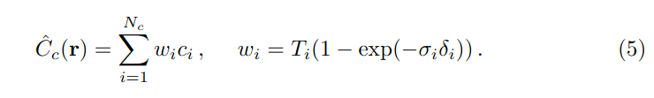

将这些权重归一化为$\hat{w}_i = w_i / \sum_{j=1}^{N_c} w_j$沿射线方向生成一个分段常数概率密度函数。我们使用逆变换采样从该分布中采样第二组 Nf 个位置，在第一组和第二组样本的并集处评估我们的“精细”网络，并使用公式 3（但使用所有 Nc + Nf 个样本）计算射线的最终渲染颜色 Ĉf (r)。此过程为我们预期包含可见内容的区域分配了更多样本。这解决了类似的问题目标作为重要性采样，但我们将采样值用作整个积分域的非均匀离散化，而不是将每个样本视为整个积分的独立概率估计。

### 5.3 实现细节

我们为每个场景优化一个单独的神经连续体积表示网络 。这只需要一个捕获的场景 RGB 图像的数据集、相应的相机姿势和内在参数以及场景边界（我们对合成数据使用真实相机姿势、内在参数和边界，
并使用 COLMAP 运动结构包 [39] 来估计真实数据的这些参数）。在每次优化迭代中，我们从数据集中的所有像素集中随机采样一批相机光线，然后按照第 5.2 节中描述的分层采样从粗网络中查询 Nc 个样本，从细网络中查询 Nc + Nf 个样本。然后我们使用第 4 节中描述的体积渲染过程渲染两组样本中每条光线的颜色。我们的损失函数就是粗略渲染和精细渲染中渲染像素颜色与真实像素颜色之间的总平方误差：

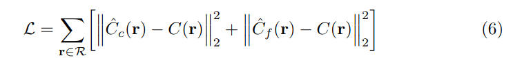

其中 R 是每个批次中的光线集合，C(r)、Ĉc (r) 和 Ĉf (r) 分别是光线 r 的真实值、粗体积预测值和细体积预测值的 RGB 颜色。请注意，即使最终渲染来自 Ĉf (r)，我们也将 Ĉc (r) 的损失最小化，以便粗网络的权重分布可用于在细网络中分配样本。在我们的实验中，我们使用 4096 条光线的批次大小，每条光线在粗体积中的 Nc = 64 坐标处采样，在细体积中的 Nf = 128 个额外坐标处采样
。我们使用 Adam 优化器 [18]，其学习率从 5 × 10−4 开始，并在优化过程中指数衰减至 5 × 10−5 （其他 Adam 超参数保留为默认值 β1 = 0.9、β2 = 0.999 和 = 10−7）。单个场景的优化通常需要大约 100–300k 次迭代才能在单个 NVIDIA V100 GPU 上收敛（大约 1-2 天）。

## 6 结果

我们定量（表 1）和定性（图 8 和 6）表明我们的方法优于先前的工作，并提供了广泛的消融研究来验证我们的设计选择（表 2）。我们强烈建议读者观看我们的补充视频，以更好地理解我们的方法在渲染新视图的平滑路径时相对于基线方法的显着改进。

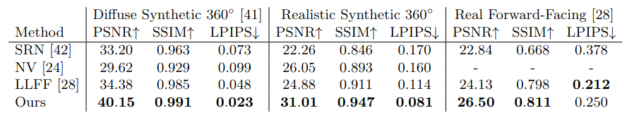
表 1：我们的方法在合成和真实图像的数据集上定量优于先前的工作。我们报告了 PSNR/SSIM（越高越好）和 LPIPS [50]（越低越好）。DeepVoxels [41] 数据集由 4 个具有简单几何形状的漫反射对象组成。我们的真实合成数据集由 8 个几何复杂物体的路径追踪渲染组成，这些物体具有复杂的非朗伯材料。真实数据集包括 8 个真实场景的手持式前向捕获（无法在此数据上评估 NV，因为它仅在有界体积内重建对象）。虽然 LLFF 实现了稍好的 LPIPS，但我们强烈建议读者观看我们的补充视频，其中我们的方法实现了更好的多视图一致性，并且产生的伪影比所有基线都要少。

### 6.1 数据集

**物体的合成渲染** 我们首先展示两个物体合成渲染数据集的实验结果（表 1，“漫反射合成 360◦”和“逼真的合成 360◦”）。DeepVoxels [41] 数据集包含四个具有简单几何形状的 Lambertian 对象。每个对象以 512×512 像素渲染，从上半球采样的视点（479 个作为输入，1000 个用于测试）。我们另外生成了我们自己的数据集，其中包含八个物体的路径追踪图像，这些物体表现出复杂的几何形状和逼真的非朗伯材质。其中六个是从上半球采样的视点渲染的，两个是从整个球体上采样的视点渲染的。我们将每个场景的 100 个视图渲染为输入，并将 200 个视图用于测试，所有视图均为 800 × 800 像素。

**复杂场景的真实图像** 我们展示了使用大致面向前方的图像捕获的复杂真实世界场景的结果（表 1，“Real ForwardFacing”）。该数据集包含用手持手机拍摄的 8 个场景（5 个取自 LLFF 论文，3 个是我们捕获的），用 20 到 62 张图像捕获，并将其中的 1/8 保留用于测试集。所有图像均为 1008×756 像素。

### 6.2 对比

为了评估我们的模型，我们将其与当前表现最佳的视图合成技术进 ​​ 行比较，详述如下。所有方法都使用相同的输入视图集为每个场景训练一个单独的网络，但局部光场融合 [28] 除外，它在大型数据集上训练单个 3D 卷积网络，然后在测试时使用相同的训练网络处理新场景的输入图像。

**神经体积 (NV)** [24] 可合成全新视图，这些对象完全位于独特背景（必须在没有感兴趣对象的情况下单独捕获）前方的有界体积内。它优化了一个深度 3D 卷积网络，以预测具有 1283 个样本的离散 RGBα 体素网格以及具有 323 个样本的 3D 扭曲网格。该算法通过将相机光线穿过扭曲的体素网格来渲染全新视图。

**场景表示网络 (SRN)** [42] 将连续场景表示为不透明表面，由 MLP 隐式定义，MLP 将每个 (x, y, z) 坐标映射到一个特征向量。它们训练一个循环神经网络，通过使用任意 3D 坐标处的特征向量来预测沿光线的下一步步长，使该网络沿着光线穿过场景表示。最后一步的特征向量被解码为表面上该点的单一颜色。请注意，SRN 是同一作者提出的 DeepVoxels [41] 的更好后续成果，这就是我们不包括与 DeepVoxels 进行比较的原因。
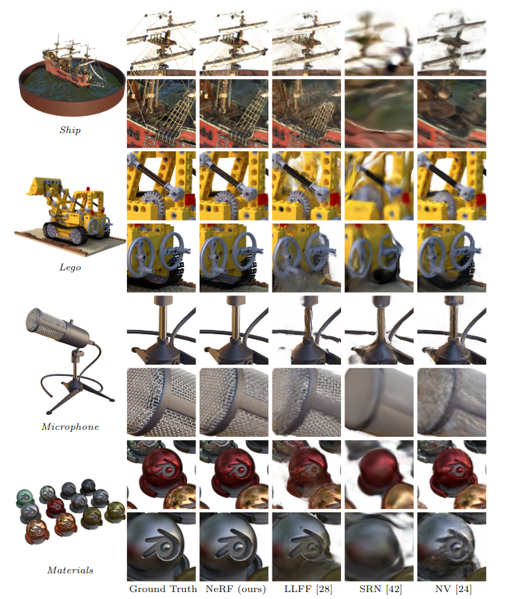

图 5：使用基于物理的渲染器生成的新合成数据集中的场景的测试集视图比较。我们的方法能够恢复几何和外观上的精细细节，例如船的索具、乐高的齿轮和履带、麦克风的闪亮支架和网格栅以及材料的非朗伯反射率。LLFF 在麦克风上表现出带状伪影支架和材质的物体边缘以及船桅杆和乐高物体内部的重影伪影。SRN 在每种情况下都会产生模糊和扭曲的渲染。神经体积无法捕捉麦克风格栅或乐高齿轮上的细节，也完全无法恢复船索具的几何形状。
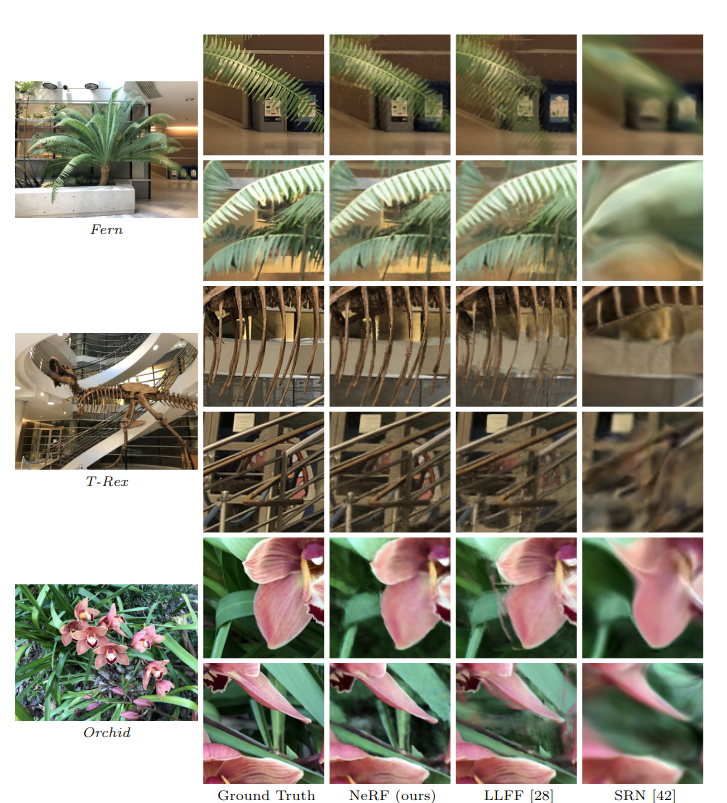
图 6：现实世界场景的测试集视图比较。LLFF 专为这种用例（真实场景的前向捕获）而设计。与 LLFF 相比，我们的方法能够在渲染视图中更一致地表示精细的几何形状，如 Fern 的叶子和 T-rex 的骨架肋骨和栏杆所示。我们的方法还正确重建了 LLFF 难以清晰渲染的部分遮挡区域，例如底部蕨类植物裁剪图叶子后面的黄色架子和底部兰花裁剪图背景中的绿叶。混合多个渲染也会导致 LLFF 中的边缘重复，如顶部兰花裁剪图所示。SRN 捕捉每个场景中的低频几何和颜色变化，但无法重现任何精细细节。

**局部光场融合 (LLFF)** [28] LLFF 旨在为经过良好采样的前向场景生成逼真的新颖视图。它使用经过训练的 3D 卷积网络直接预测每个输入视图的离散化平截头体采样 RGBα 网格（多平面图像或 MPI [52]），然后通过 alpha 合成和将附近的 MPI 混合到新视点中来渲染新视图。

### 6.3 讨论

我们在所有场景中都彻底超越了每个场景（NV 和 SRN）单独优化网络的两个基线。此外，与 LLFF 相比，我们在仅使用其输入图像作为我们的整个训练集的情况下，在质量和数量上都产生了更优的渲染（除一个指标外）。

SRN 方法会产生高度平滑的几何形状和纹理，并且由于每个摄像机光线仅选择一个深度和颜色，其视图合成的表示能力受到限制。NV 基线能够捕获相当详细的体积几何形状和外观，但它使用底层的显式 1283 体素网格使其无法缩放以表示高分辨率的精细细节。LLFF 特别提供了一个“采样指南”，即不超过 64 输入视图之间的视差像素，因此它经常无法在包含高达 400-500 像素视差的合成数据集中估计正确的几何形状。此外，LLFF 混合了不同的场景表示来渲染不同的视图，导致感知上分散的不一致性，这在我们的补充视频中很明显。

这些方法之间最大的实际权衡是时间与空间。所有比较的单场景方法每个场景至少需要 12 个小时来训练。相比之下
，LLFF 可以在 10 分钟内处理一个小的输入数据集。然而，LLFF 为每个输入图像生成一个大的 3D 体素网格，导致巨大的存储需求（一个“真实合成”场景超过 15GB）。我们的方法只需要 5 MB 的网络权重（与 LLFF 相比相对压缩了 3000 倍），这比我们任何数据集中单个场景的输入图像所需的内存还要少。

### 6.4 消融研究

我们在表 2 中通过广泛的消融研究验证了我们算法的设计选择和参数。我们展示了“真实的合成 360◦”场景的结果。第 9 行显示了我们的完整模型作为参考点。第 1 行展示了我们模型的极简版本，没有位置编码（PE）、视图依赖性（VD）或分层采样（H）。在第 2-4 行中，我们从完整模型中一次删除一个这三个组件，观察到位置编码（第 ​​ 2 行）和视图依赖性（第 3 行）提供了最大的定量优势，其次是分层采样（第 4 行）。第 5-6 行显示了随着输入图像数量的减少，我们的性能如何下降。请注意，当为 NV、SRN 和 LLFF 提供 100 张图像时，我们的方法仅使用 25 张输入图像的性能仍然超过所有指标。在第 7-8 行中，我们验证我们选择的在 x 的位置编码中的最大频率 L（d 使用的最大频率按比例缩放）。只使用 5 个频率会降低性能，但将频率数量从 10 增加到 15 并不会提高性能。我们认为，一旦 2L 超过采样输入图像中存在的最大频率（在我们的数据中大约为 1024），增加 L 的好处就会受到限制。

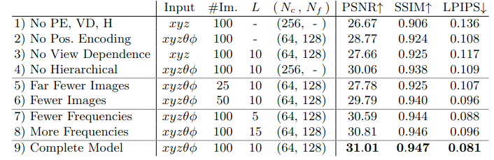

表 2：我们模型的消融研究。指标是对我们真实合成数据集中的 8 个场景的平均值。详细说明见 6.4 节。

## 7 结论

我们的工作直接解决了使用 MLP 将物体和场景表示为连续函数的先前工作的不足之处。我们证明，将场景表示为 5D 神经辐射场（一种输出体积密度和视图相关发射辐射作为 3D 位置和 2D 观看方向的函数的 MLP）比以前主要的训练深度卷积网络输出离散体素表示的方法产生更好的渲染。

尽管我们提出了一种分层采样策略来提高渲染的采样效率（对于训练和测试而言），但在研究有效优化和渲染神经辐射场的技术方面仍有很大的进步空间。未来工作的另一个方向是可解释性：体素网格和网格等采样表示可以推理渲染视图的预期质量和故障模式，但当我们在深度神经网络的权重中编码场景时，如何分析这些问题尚不清楚。我们相信这项工作朝着基于真实世界图像的图形管道迈进了一步，其中复杂场景可以由根据实际物体和场景图像优化的神经辐射场组成。

**致谢** 我们感谢 Kevin Cao、Guowei Frank Yang 和 Nithin Raghavan 的评论和讨论。RR 承认来自 ONR 拨款 N000141712687 和 N000142012529 以及 Ronald L. Graham 主席的资助。BM 由赫兹基金会奖学金资助，MT 由美国国家科学基金会研究生奖学金资助。谷歌通过 BAIR Commons 项目慷慨捐赠了云计算积分。我们感谢以下 Blend Swap 用户为我们在逼真的合成数据集中使用的模型：gregzaal （船）、1DInc（椅子）、bryanajones（鼓）、Herberhold（榕树）、erickfree（热狗）、Heinzelnisse（乐高）、elbrujodelatribu（材料）和 up3d.de（麦克风）。

## 参考文献

References

1. Abadi, M., Agarwal, A., Barham, P., Brevdo, E., Chen, Z., Citro, C., Corrado,
   G.S., Davis, A., Dean, J., Devin, M., Ghemawat, S., Goodfellow, I., Harp, A.,
   Irving, G., Isard, M., Jia, Y., Jozefowicz, R., Kaiser, L., Kudlur, M., Levenberg,
   J., Mané, D., Monga, R., Moore, S., Murray, D., Olah, C., Schuster, M., Shlens, J.,
   Steiner, B., Sutskever, I., Talwar, K., Tucker, P., Vanhoucke, V., Vasudevan, V.,
   Viégas, F., Vinyals, O., Warden, P., Wattenberg, M., Wicke, M., Yu, Y., Zheng,
   X.: TensorFlow: Large-scale machine learning on heterogeneous systems (2015)
2. Buehler, C., Bosse, M., McMillan, L., Gortler, S., Cohen, M.: Unstructured lumigraph rendering. In: SIGGRAPH (2001)
3. Chang, A.X., Funkhouser, T., Guibas, L., Hanrahan, P., Huang, Q., Li, Z.,
   Savarese, S., Savva, M., Song, S., Su, H., et al.: Shapenet: An information-rich
   3d model repository. arXiv:1512.03012 (2015)
4. Chen, W., Gao, J., Ling, H., Smith, E.J., Lehtinen, J., Jacobson, A., Fidler, S.:
   Learning to predict 3D objects with an interpolation-based differentiable renderer.
   In: NeurIPS (2019)
5. Cohen, M., Gortler, S.J., Szeliski, R., Grzeszczuk, R., Szeliski, R.: The lumigraph.
   In: SIGGRAPH (1996)
6. Curless, B., Levoy, M.: A volumetric method for building complex models from
   range images. In: SIGGRAPH (1996)
7. Davis, A., Levoy, M., Durand, F.: Unstructured light fields. In: Eurographics (2012)
8. Debevec, P., Taylor, C.J., Malik, J.: Modeling and rendering architecture from photographs: A hybrid geometry-and image-based approach. In: SIGGRAPH (1996)
9. Flynn, J., Broxton, M., Debevec, P., DuVall, M., Fyffe, G., Overbeck, R., Snavely,
   N., Tucker, R.: DeepView: view synthesis with learned gradient descent. In: CVPR
   (2019)
10. Genova, K., Cole, F., Maschinot, A., Sarna, A., Vlasic, D., , Freeman, W.T.: Unsupervised training for 3D morphable model regression. In: CVPR (2018)
11. Genova, K., Cole, F., Sud, A., Sarna, A., Funkhouser, T.: Local deep implicit
    functions for 3d shape. In: CVPR (2020)
12. Henzler, P., Mitra, N.J., Ritschel, T.: Learning a neural 3d texture space from 2d
    exemplars. In: CVPR (2020)
13. Henzler, P., Rasche, V., Ropinski, T., Ritschel, T.: Single-image tomography: 3d
    volumes from 2d cranial x-rays. In: Eurographics (2018)
14. Hornik, K., Stinchcombe, M., White, H.: Multilayer feedforward networks are universal approximators. Neural Networks (1989)
15. Jiang, C., Sud, A., Makadia, A., Huang, J., Nießner, M., Funkhouser, T.: Local
    implicit grid representations for 3d scenes. In: CVPR (2020)
16. Kajiya, J.T., Herzen, B.P.V.: Ray tracing volume densities. Computer Graphics
    (SIGGRAPH) (1984)
17. Kar, A., Häne, C., Malik, J.: Learning a multi-view stereo machine. In: NeurIPS
    (2017)
18. Kingma, D.P., Ba, J.: Adam: A method for stochastic optimization. In: ICLR(2015)
19. Kutulakos, K.N., Seitz, S.M.: A theory of shape by space carving. International
    Journal of Computer Vision (2000)
20. Levoy, M.: Efficient ray tracing of volume data. ACM Transactions on Graphics
    (1990)
21. Levoy, M., Hanrahan, P.: Light field rendering. In: SIGGRAPH (1996)
22. Li, T.M., Aittala, M., Durand, F., Lehtinen, J.: Differentiable monte carlo ray
    tracing through edge sampling. ACM Transactions on Graphics (SIGGRAPH Asia)
    (2018)
23. Liu, S., Li, T., Chen, W., Li, H.: Soft rasterizer: A differentiable renderer for imagebased 3D reasoning. In: ICCV (2019)
24. Lombardi, S., Simon, T., Saragih, J., Schwartz, G., Lehrmann, A., Sheikh, Y.:
    Neural volumes: Learning dynamic renderable volumes from images. ACM Transactions on Graphics (SIGGRAPH) (2019)
25. Loper, M.M., Black, M.J.: OpenDR: An approximate differentiable renderer. In:
    ECCV (2014)
26. Max, N.: Optical models for direct volume rendering. IEEE Transactions on Visualization and Computer Graphics (1995)
27. Mescheder, L., Oechsle, M., Niemeyer, M., Nowozin, S., Geiger, A.: Occupancy
    networks: Learning 3D reconstruction in function space. In: CVPR (2019)
28. Mildenhall, B., Srinivasan, P.P., Ortiz-Cayon, R., Kalantari, N.K., Ramamoorthi,
    R., Ng, R., Kar, A.: Local light field fusion: Practical view synthesis with prescriptive sampling guidelines. ACM Transactions on Graphics (SIGGRAPH) (2019)
29. Niemeyer, M., Mescheder, L., Oechsle, M., Geiger, A.: Differentiable volumetric
    rendering: Learning implicit 3D representations without 3D supervision. In: CVPR
    (2019)
30. Nimier-David, M., Vicini, D., Zeltner, T., Jakob, W.: Mitsuba 2: A retargetable
    forward and inverse renderer. ACM Transactions on Graphics (SIGGRAPH Asia)
    (2019)
31. Oechsle, M., Mescheder, L., Niemeyer, M., Strauss, T., Geiger, A.: Texture fields:
    Learning texture representations in function space. In: ICCV (2019)
32. Park, J.J., Florence, P., Straub, J., Newcombe, R., Lovegrove, S.: DeepSDF: Learning continuous signed distance functions for shape representation. In: CVPR (2019)
33. Penner, E., Zhang, L.: Soft 3D reconstruction for view synthesis. ACM Transactions
    on Graphics (SIGGRAPH Asia) (2017)
34. Porter, T., Duff, T.: Compositing digital images. Computer Graphics (SIGGRAPH) (1984)
35. Rahaman, N., Baratin, A., Arpit, D., Dräxler, F., Lin, M., Hamprecht, F.A., Bengio, Y., Courville, A.C.: On the spectral bias of neural networks. In: ICML (2018)
36. Rainer, G., Ghosh, A., Jakob, W., Weyrich, T.: Unified neural encoding of BTFs.
    Computer Graphics Forum (Eurographics) (2020)
37. Rainer, G., Jakob, W., Ghosh, A., Weyrich, T.: Neural BTF compression and
    interpolation. Computer Graphics Forum (Eurographics) (2019)
38. Ren, P., Wang, J., Gong, M., Lin, S., Tong, X., Guo, B.: Global illumination with
    radiance regression functions. ACM Transactions on Graphics (2013)
39. Schönberger, J.L., Frahm, J.M.: Structure-from-motion revisited. In: CVPR (2016)
40. Seitz, S.M., Dyer, C.R.: Photorealistic scene reconstruction by voxel coloring. International Journal of Computer Vision (1999)
41. Sitzmann, V., Thies, J., Heide, F., Nießner, M., Wetzstein, G., Zollhöfer, M.: Deepvoxels: Learning persistent 3D feature embeddings. In: CVPR (2019)
42. Sitzmann, V., Zollhoefer, M., Wetzstein, G.: Scene representation networks: Continuous 3D-structure-aware neural scene representations. In: NeurIPS (2019)
43. Srinivasan, P.P., Tucker, R., Barron, J.T., Ramamoorthi, R., Ng, R., Snavely, N.:
    Pushing the boundaries of view extrapolation with multiplane images. In: CVPR(2019)
44. Stanley, K.O.: Compositional pattern producing networks: A novel abstraction of
    development. Genetic programming and evolvable machines (2007)
45. Szeliski, R., Golland, P.: Stereo matching with transparency and matting. In: ICCV
    (1998)
46. Tulsiani, S., Zhou, T., Efros, A.A., Malik, J.: Multi-view supervision for single-view
    reconstruction via differentiable ray consistency. In: CVPR (2017)
47. Vaswani, A., Shazeer, N., Parmar, N., Uszkoreit, J., Jones, L., Gomez, A.N., Kaiser,
    L., Polosukhin, I.: Attention is all you need. In: NeurIPS (2017)
48. Waechter, M., Moehrle, N., Goesele, M.: Let there be color! Large-scale texturing
    of 3D reconstructions. In: ECCV (2014)
49. Wood, D.N., Azuma, D.I., Aldinger, K., Curless, B., Duchamp, T., Salesin, D.H.,
    Stuetzle, W.: Surface light fields for 3D photography. In: SIGGRAPH (2000)
50. Zhang, R., Isola, P., Efros, A.A., Shechtman, E., Wang, O.: The unreasonable
    effectiveness of deep features as a perceptual metric. In: CVPR (2018)
51. Zhong, E.D., Bepler, T., Davis, J.H., Berger, B.: Reconstructing continuous distributions of 3D protein structure from cryo-EM images. In: ICLR (2020)
52. Zhou, T., Tucker, R., Flynn, J., Fyffe, G., Snavely, N.: Stereo magnification: Learning view synthesis using multiplane images. ACM Transactions on Graphics (SIGGRAPH) (2018)

## A 附加实现细节

**网络架构** 图 7 详细介绍了我们简单的全连接架构。
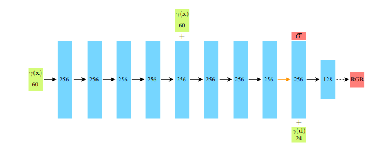
图 7：我们完全连接网络架构的可视化。输入向量以绿色显示，中间隐藏层以蓝色显示，输出向量以红色显示，每个块内的数字表示向量的维度。所有层都是标准的全连接层，黑色箭头表示具有 ReLU 激活的层，橙色箭头表示没有激活的层，虚线黑色箭头表示具有 S 形激活的层，“+”表示向量连接。输入位置的位置编码 (γ(x))经过 8 个全连接的 ReLU 层，每个层有 256 个通道。我们遵循 DeepSDF [32] 架构，并包含一个跳过连接，将此输入连接到第五层的激活。附加层输出体积密度 σ（使用 ReLU 进行校正以确保输出体积密度为非负）和 256 维特征向量。该特征向量与输入观察方向的位置编码 (γ(d)) 连接，并由另一个具有 128 个通道的全连接 ReLU 层处理。最后一层（带有 S 形激活函数）输出位置 x 处发射的 RGB 辐射度，如同方向为 d 的射线所见。

**体积边界** 我们的方法通过查询沿相机光线的连续 5D 坐标处的神经辐射场表示来渲染视图。对于使用合成图像的实验，我们缩放场景，使其位于以原点为中心的边长为 2 的立方体内，并且仅查询该边界体积内的表示。我们的真实图像数据集包含可能存在于最近点和无穷大之间的任何位置的内容，因此我们使用标准化设备坐标将这些点的深度范围映射到 [-1, 1]。这会将所有射线原点移动到场景的近平面，将相机的透视射线映射到变换体积中的平行射线，并使用视差（逆深度）而不是度量深度，因此所有坐标现在都是有界的。

**训练细节** 对于真实场景数据，我们通过在优化过程中向输出 σ 值（在将它们传递给 ReLU 之前）添加均值为零、方差为单位的随机高斯噪声来正则化我们的网络，发现这略微提高了渲染新视图的视觉性能。我们在 Tensorflow [1] 中实现我们的模型。

**渲染细节** 为了在测试时渲染新视图，我们通过粗网络对每条射线采样 64 个点，通过细网络对每条射线采样 64 + 128 = 192 个点，每条射线共进行 256 次网络查询。我们的真实合成数据集需要每张图像 640k 条射线，而我们的真实场景需要每张图像 762k 条射线，导致每张渲染图像需要 1.5 到 2 亿次网络查询。在 NVIDIA V100 上，每帧大约需要 30 秒。

## B 其他基线方法详细信息

**神经体积 (NV)** [24] 我们使用作者在 https://github.com/facebookresearch/neuralvolumes 上开源的 NV 代码，并遵循他们的程序在单个场景上进行训练，而不受时间依赖性的影响。

**场景表示网络 (SRN)** [42] 我们使用作者在 https://github.com/vsitzmann/scene-representation-ne 上开源的 SRN 代码，并遵循他们的程序在单个场景上进行训练。局部光场融合 (LLFF) [28] 我们使用作者在 https://github.com/Fyusion/LLFF 上开源的预训练 LLFF 模型。

**定量比较** 作者发布的 SRN 实现需要大量 GPU 内存，即使在 4 个 NVIDIA V100 GPU 上并行执行，图像分辨率也限制为 512 × 512 像素。我们针对合成数据集计算了 512 × 512 像素的 SRN 定量指标，针对真实数据集计算了 504 × 376 像素的 SRN 定量指标，而其他可以以更高分辨率运行的方法则分别为 800 × 800 和 1008 × 752。

## C NDC 射线空间推导

我们在通常用作三角形光栅化管道一部分的标准化设备坐标 (NDC) 空间中使用“前向”捕获重建真实场景。此空间非常方便，因为它
在将 z 轴（相机轴）转换为线性视差的同时保留了平行线。

这里我们推导出应用于光线的变换，以将它们从相机空间映射到 NDC 空间。齐次坐标的标准 3D 透视投影矩阵为：
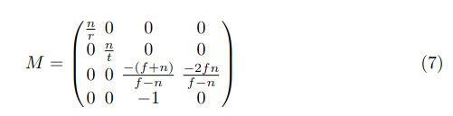

其中 n、f 分别为近裁剪平面和远裁剪平面，r 和 t 分别为近裁剪平面上场景的右边界和上边界。 （请注意，这是按照惯例
，相机朝 −z 方向看。）要投影齐次点(x, y, z, 1)> ，我们左乘以 M，然后除以第四个坐标：

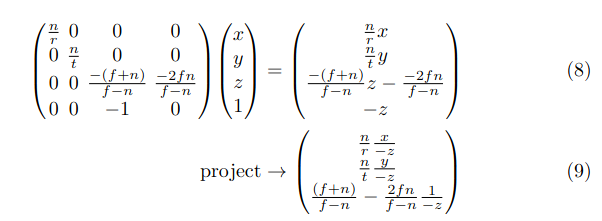

投影点现在位于归一化设备坐标 (NDC) 空间中，其中原始视锥体已映射到立方体 $[−1, 1]^3$ 。

我们的目标是取一条射线 o + td 并计算 NDC 空间中的射线原点 o0 和方向 d0 ，使得对于每个 t，存在一个新的 t0 使得 π(o + td) = o0 + t0 d0 （其中 π 是使用上述矩阵的投影）。换句话说，原始射线和 NDC 空间射线的投影会追踪相同的点
（但不一定以相同的速率）。

让我们重写方程中的投影点。 9 为$\left( \frac{a_x x}{z}, \frac{a_y y}{z}, a_z + \frac{b_z}{z} \right)^T。$新原点 o0 和方向 d0 的分量必须满足：
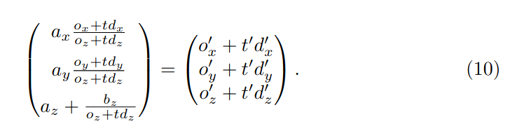

为了消除一个自由度，我们决定 t0 = 0 和 t = 0 应该映射到同一个点。代入 t = 0 和 t0 = 0 公式。 10 直接给出了我们的 NDC 空间原点 o0 ：
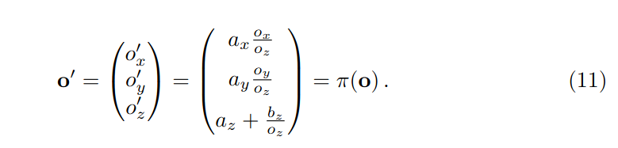

这正是原始射线原点的投影 π(o)。将其代回方程 10 对于任意 t，我们可以确定 t0 和 d0 的值：

分解出仅取决于 t 的常见表达式，我们得到：
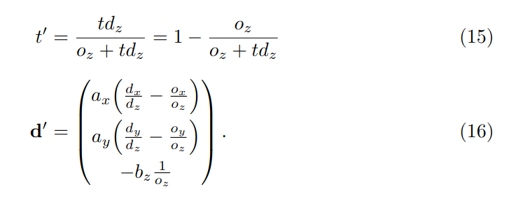

请注意，正如所期望的，当 t = 0 时，t0 = 0。此外，我们看到当
t → ∞ 时，t0 → 1。回到原始投影矩阵，我们的常数为：
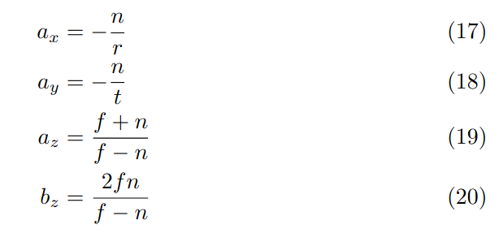

使用标准针孔相机模型，我们可以重新参数化为：
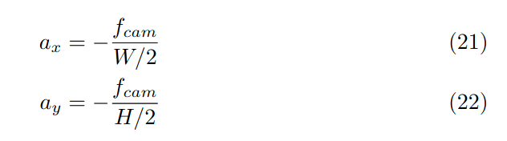

其中 W 和 H 是图像的宽度和高度（以像素为单位），fcam 是相机的焦距。

在我们真正的前向捕捉中，我们假设远场景边界是无穷大（这对我们的成本很小，因为 NDC 使用 z 维度来表示逆深度，即视差）。在这个限制下，z 常数简化为：
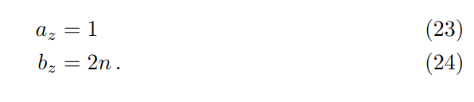

将所有东西组合在一起：
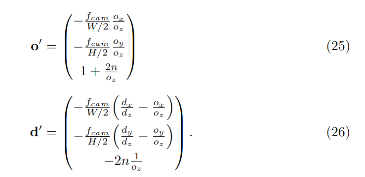

我们实现中的最后一个细节：我们将 o 移动到射线与近平面在 z = −n 处的交点（在此 NDC 转换之前），通过取 = o + tn d，
其中 tn = −(n + oz )/dz 。一旦我们转换为 NDC 射线，这允许我们简单地从 0 到 1 线性采样 t0 以便在原始空间中获得从 n 到 ∞ 的线性视差采样。

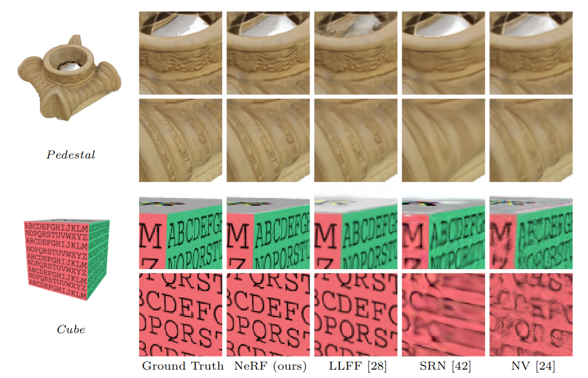
图 8：来自 DeepVoxels [41] 合成数据集的场景在测试集视图上的比较。此数据集中的对象具有简单的几何形状和完美的
漫反射。由于输入图像数量众多（479 个视图）且渲染对象简单，我们的方法和 LLFF [28]在该数据上的表现都近乎完美。LLFF 在其 3D 体积之间进行插值时仍偶尔会出现伪影，如每个对象的顶部插图所示。SRN [42]和 NV [24] 不具备呈现精细细节的表征能力。

## D 附加结果

按场景细分 表 3、4、5 和 6 将主要论文中提出的定量结果细分为按场景的指标。按场景细分与论文中提出的总体定量指标一致
，其中我们的方法在定量上优于所有基线。虽然 LLFF 实现了略好的 LPIPS 指标，但我们还是建议读者观看我们的补充视频，其中我们的方法实现了更好的多视图一致性并且产生的伪影比所有基线都少。

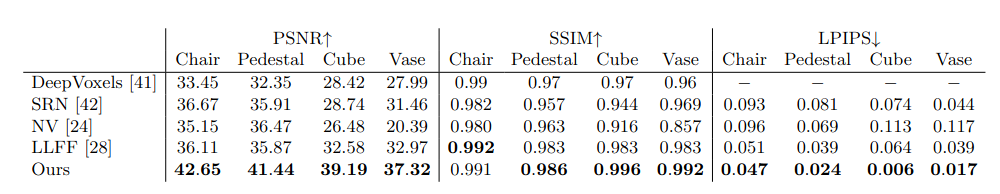

表 3：来自 DeepVoxels [41] 数据集的每个场景的定量结果。该数据集中的“场景”都是具有简单几何形状的漫反射物体，由 3D 扫描仪捕获的纹理映射网格渲染而成。 DeepVoxels 方法的指标直接取自他们的论文，该论文没有报告 LPIPS，只报告了 SSIM 的两个重要数字。

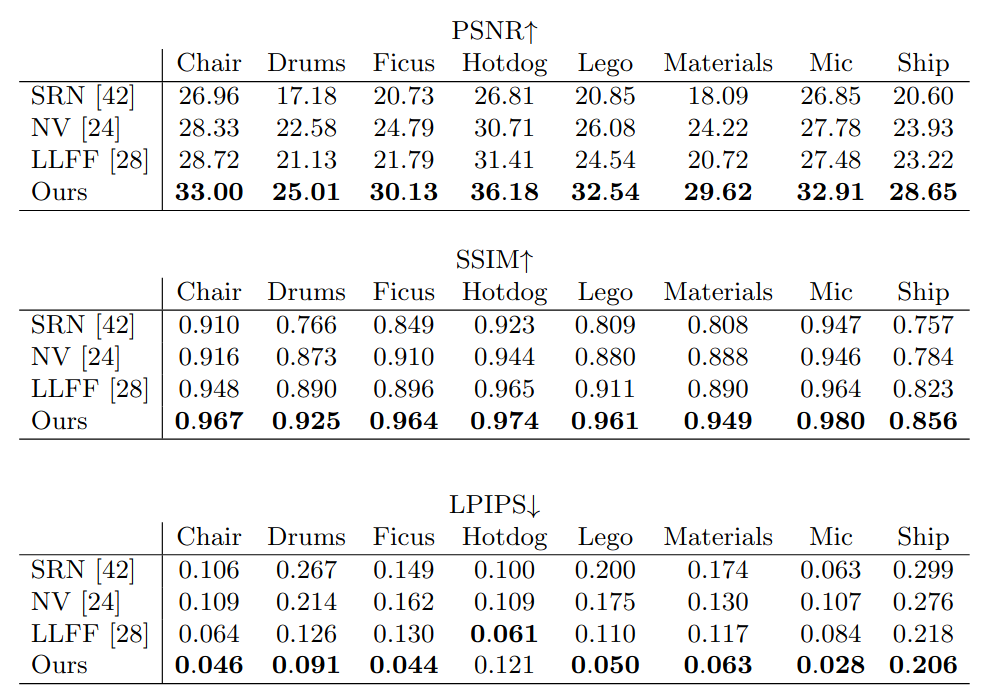

表 4：来自我们的真实合成数据集的每个场景的定量结果。该数据集中的“场景”都是具有更复杂的几何形状和非朗伯材质的对象，使用 Blender 的 Cycles 路径追踪器进行渲染。

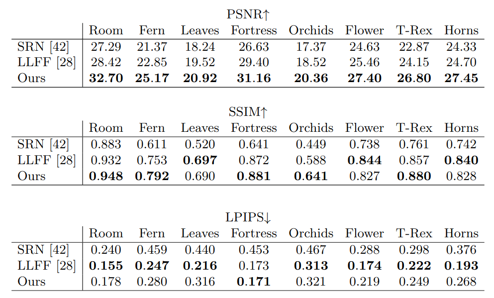

表 5：来自我们真实图像数据集的每个场景的定量结果。此数据集中的场景均使用前置手持手机拍摄。

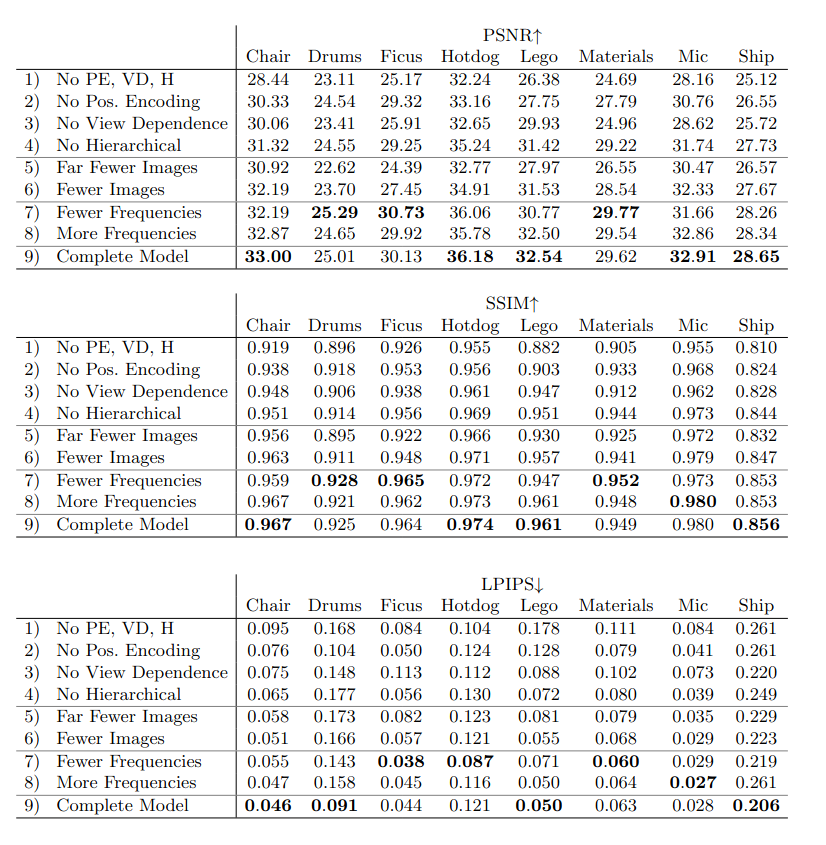

表 6：我们消融研究中每个场景的定量结果。此处使用的场景与表 4 中的相同。
