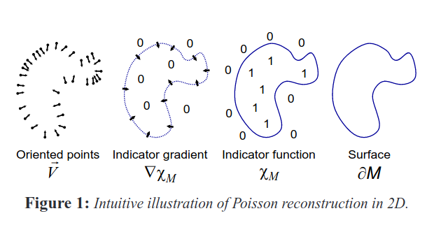
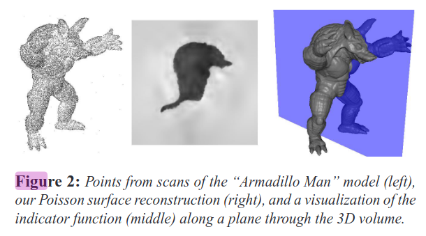
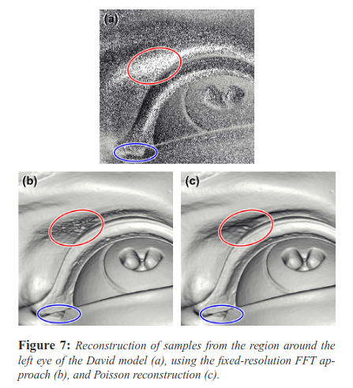
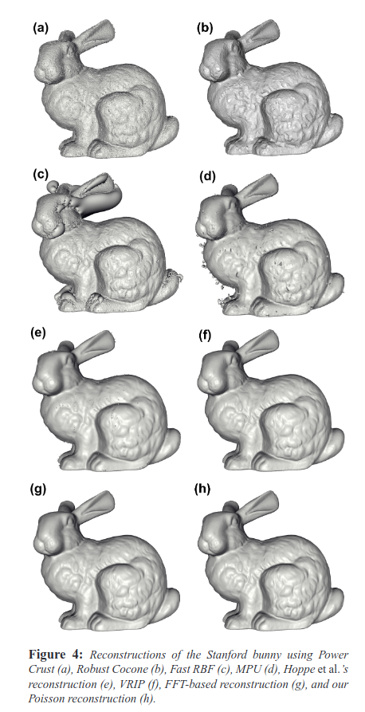
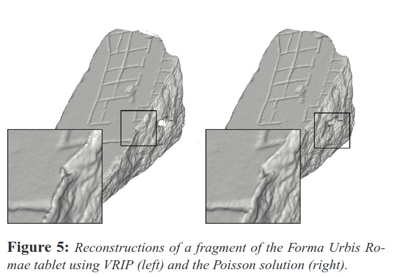
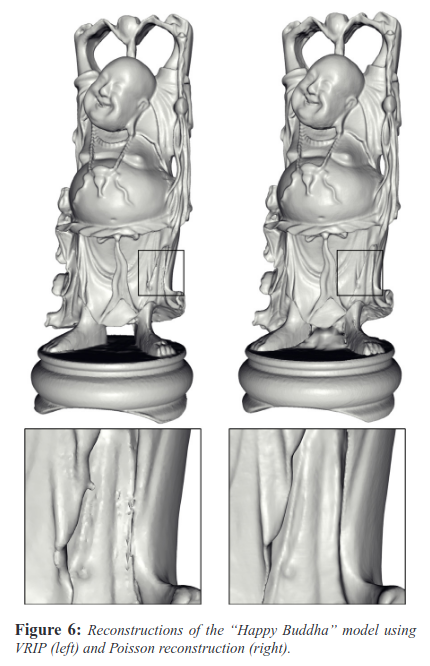
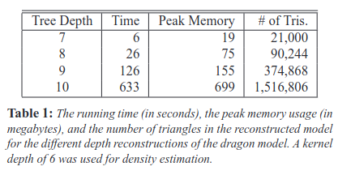
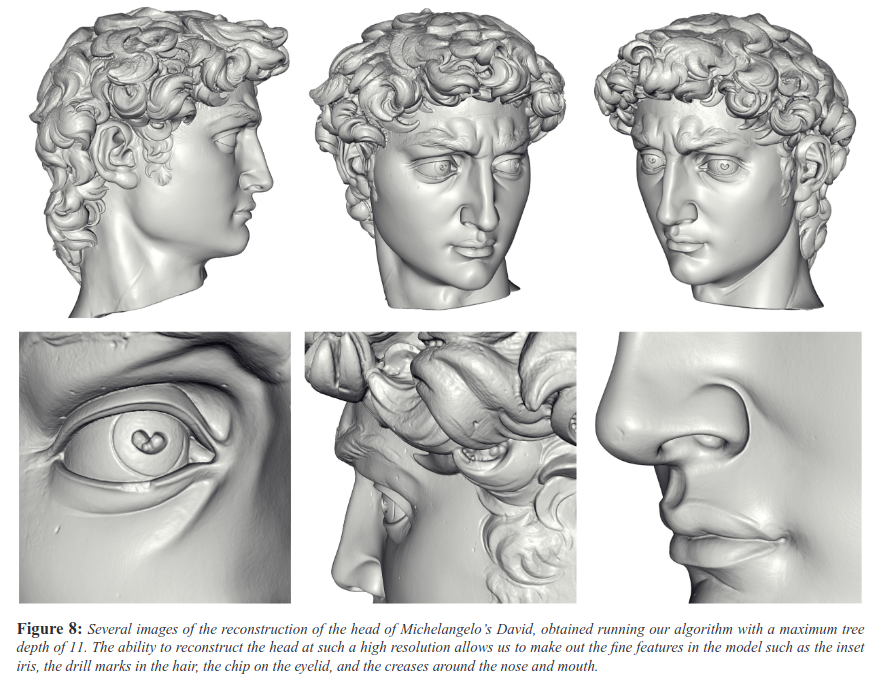
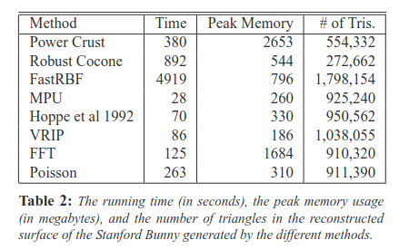

# Poisson 表面重建

Michael Kazhdan¹, Matthew Bolitho¹ 和 Hugues Hoppe²  
¹约翰霍普金斯大学，巴尔的摩，美国  
²微软研究院，雷德蒙德，美国

## 摘要

我们展示了从定向点进行表面重建可以转化为空间Poisson问题。这种Poisson公式一次性考虑所有点，无需依赖启发式的空间划分或混合，因此对数据噪声具有高度鲁棒性。与径向基函数方案不同，我们的Poisson方法允许使用局部支持的基函数层次结构，因此解简化为一个条件良好的稀疏线性系统。我们描述了一种空间自适应多尺度算法，其时间和空间复杂度与重建模型的大小成正比。通过使用公开可用的扫描数据进行实验，我们展示了比以往更详细的重建表面。

## 1. 引言

从点样本重建3D表面是计算机图形学中一个深入研究的问题。它允许拟合扫描数据、填充表面孔洞以及重新网格化现有模型。我们提供了一种新颖的方法，将表面重建表示为Poisson方程的解。

与许多先前的工作（第2节）类似，我们使用隐函数框架来处理表面重建问题。具体来说，与[Kaz05]类似，我们计算一个3D指示函数$\chi$（在模型内部定义为1，在外部定义为0），然后通过提取适当的等值面来获得重建表面。

我们的关键洞察是，从模型表面采样的定向点与模型的指示函数之间存在积分关系。具体来说，指示函数的梯度是一个几乎处处为零的向量场（因为指示函数几乎处处是常数），除了靠近表面的点，在那里它等于向内的表面法线。因此，定向点样本可以看作是模型指示函数梯度的样本（图1）。

因此，计算指示函数的问题简化为求逆梯度算子，即找到标量函数$\chi$，其梯度最好地近似于由样本定义的向量场$V$，即$\min_{\chi} \|\nabla \chi - V\|$。如果我们应用散度算子，这个变分问题就转化为标准的Poisson问题：计算标量函数$\chi$，其拉普拉斯算子（梯度的散度）等于向量场$V$的散度，$\Delta \chi \equiv \nabla \cdot \nabla \chi = \nabla \cdot V$。

我们将在第3节和第4节中精确地定义这些概念。

将表面重建表述为Poisson问题提供了许多优势。许多隐式表面拟合方法将数据分割成区域进行局部拟合，并使用混合函数进一步组合这些局部近似。相比之下，Poisson重建是一个全局解决方案，一次性考虑所有数据，无需依赖启发式划分或混合。因此，与径向基函数（RBF）方法类似，Poisson重建创建了非常平滑的表面，能够鲁棒地近似噪声数据。但是，理想的RBF是全局支持且不衰减的，而Poisson问题允许使用局部支持的函数层次结构，因此其解简化为一个条件良好的稀疏线性系统。

此外，在许多隐式拟合方案中，隐函数的值仅在样本点附近受到约束，因此重建可能包含远离这些样本的虚假表面片。通常，通过引入辅助的"离表面"点（例如[CBC*01,OBA*03]）来缓解这个问题。使用Poisson表面重建，这种表面片很少出现，因为隐函数的梯度在所有空间点都受到约束。特别是，在远离样本的地方它被约束为零。

Poisson系统以其在不完美数据存在下的鲁棒性而闻名。例如，"梯度域"操作算法（例如[FLW02]）有意修改梯度数据，使其不再对应于任何真实的势场，并依赖Poisson系统来恢复全局最佳拟合模型。

在求解Poisson问题方面已经进行了广泛的跨学科研究，并开发了许多高效和鲁棒的方法。我们问题实例的一个特殊方面是，Poisson方程的精确解仅在重建表面附近是必要的。这使我们能够利用自适应Poisson求解器来开发一种重建算法，其空间和时间复杂度与重建表面的大小成正比。

## 2. 相关工作

**表面重建** 从定向点重建表面在实践中存在许多困难。点采样通常是非均匀的。由于采样不准确和扫描配准错误，位置和法线通常是有噪声的。而且，在扫描过程中的可达性约束可能使某些表面区域缺乏数据。面对这些挑战，重建方法试图推断未知表面的拓扑结构，准确拟合（但不过度拟合）噪声数据，并合理填充孔洞。

几种方法基于组合结构，如Delaunay三角剖分（例如[Boi84,KSO04]）、alpha形状[EM94,BBX95,BMR*99]或Voronoi图[ABK98,ACK01]。这些方案通常创建一个三角形网格，插值所有或大部分点。在存在噪声数据的情况下，得到的表面通常是锯齿状的，因此在后续处理中进行平滑（例如[KSO04]）或重新拟合到点（例如[BBX95]）。

其他方案直接重建近似表面，通常以隐式形式表示。我们可以大致将这些分类为全局或局部方法。

**全局拟合方法** 通常将隐函数定义为以点为中心的径向基函数（RBF）之和（例如[Mur91,CBC*01,TO02]）。然而，理想的RBF（多调和函数）是全局支持且不衰减的，因此解矩阵是稠密且病态的。在大数据集上的实际解决方案涉及自适应RBF约简和快速多极方法[CBC*01]。

**局部拟合方法** 一次考虑附近点的子集。一个简单的方案是估计切平面，并将隐函数定义为到最近点切平面的有符号距离[HDD*92]。有符号距离也可以累积到体积网格中[CL96]。为了函数连续性，可以混合几个附近点的影响，例如使用移动最小二乘法[ABCO*01,SOS04]。另一种方法是通过自适应细分空间（例如使用自适应八叉树）来形成点邻域。可以使用多级单位分解在八叉树结构上进行混合，并且可以在每个八叉树节点内启发式选择局部隐式补丁的类型[OBA*03]。

我们的Poisson重建结合了全局和局部拟合方案的优点。它是全局的，因此不涉及形成局部邻域、选择表面补丁类型和选择混合权重的启发式决策。然而，基函数与周围空间相关联，而不是与数据点相关联，是局部支持的，并且具有简单的层次结构，从而产生稀疏、条件良好的系统。

我们求解指示函数的方法类似于Kazhdan的基于傅里叶的重建方案[Kaz05]。事实上，我们在附录A中展示了我们的基本Poisson公式在数学上是等价的。确实，快速傅里叶变换（FFT）是求解稠密、周期性Poisson系统的常用技术。然而，FFT需要$O(r^3 \log r)$时间和$O(r^3)$空间，其中$r$是3D网格分辨率，对于精细分辨率很快变得不可行。相比之下，Poisson系统允许自适应离散化，从而产生可扩展的解决方案。

**Poisson问题** Poisson方程出现在许多应用领域。例如，在计算机图形学中，它用于高动态范围图像的色调映射[FLW02]、图像区域的无缝编辑[PGB03]、流体力学[LGF04]和网格编辑[YZX*04]。多重网格Poisson解决方案甚至已被改编用于高效的GPU计算[BFGS03,GWL*03]。

Poisson方程也用于热传递和扩散问题。有趣的是，Davis等人[DMGL02]使用扩散来填充重建表面中的孔洞。给定以钳位有符号距离函数$d$形式给出的边界条件，他们的扩散方法基本上求解齐次Poisson方程$\Delta d = 0$来创建跨越边界的隐式表面。他们使用局部迭代解而不是全局多尺度Poisson系统。

Nehab等人[NRDR05]使用Poisson系统将2.5D高度场拟合到采样位置和法线。他们的方法拟合给定的参数表面，非常适合从单个扫描重建表面。然而，在样本是从多个扫描的并集获得的情况下，他们的方法不能直接应用于获得连接的、水密的表面。

## 3. 我们的Poisson重建方法

输入数据$S$是一组样本$s \in S$，每个样本由一个点$s.p$和一个向内的法线$s.\mathbf{N}$组成，假设位于或靠近未知模型$M$的表面$\partial M$。我们的目标是通过近似模型的指示函数并提取等值面来重建表面的水密三角化近似，如图2所示。

关键挑战是从样本准确计算指示函数。在本节中，我们推导指示函数的梯度与表面法线场的积分之间的关系。然后，我们通过对给定的定向点样本求和来近似这个表面积分。最后，我们将指示函数从这个梯度场重建为一个Poisson问题。

**定义梯度场** 由于指示函数是分段常数函数，显式计算其梯度场将导致在表面边界处具有无界值的向量场。为了避免这种情况，我们将指示函数与平滑滤波器进行卷积，并考虑平滑函数的梯度场。以下引理形式化了平滑指示函数的梯度与表面法线场之间的关系。

**引理**：给定具有边界$\partial M$的实体$M$，令$\chi_M$表示$M$的指示函数，$\mathbf{N}_{\partial M}(p)$是$p \in \partial M$处的向内表面法线，$\tilde{F}(q)$是平滑滤波器，$\tilde{F}_p(q) = \tilde{F}(q-p)$是其平移到点$p$。平滑指示函数的梯度等于通过平滑表面法线场获得的向量场：

$$
\begin{equation}
\nabla (\chi_M * \tilde{F})(q_0)
= \int_{\partial M} \tilde{F}_p(q_0)\, \mathbf{N}_{\partial M}(p)\, dp
\end{equation}
$$

**证明**：为了证明这一点，我们展示向量场的每个分量的相等性。计算平滑指示函数关于$x$的偏导数，我们得到：

$$\begin{aligned}
\left. \frac{\partial}{\partial x} (\chi_M * \tilde{F}) \right|_{q_0} &= \left. \frac{\partial}{\partial x} \right|_{q=q_0} \int_M \tilde{F}(q-p)\, dp \\
&= \int_M \left(- \frac{\partial}{\partial x} \tilde{F}(q_0 - p) \right) dp \\
&= - \int_M \nabla \cdot \big( \tilde{F}(q_0 - p), 0, 0 \big)\, dp \\
&= \int_{\partial M} \langle (\tilde{F}_p(q_0), 0, 0), \mathbf{N}_{\partial M}(p) \rangle\, dp
\end{aligned}$$

（第一个等式来自$\chi_M$在$M$外为零，在$M$内为一的事实。第二个来自$(\partial/\partial q)\tilde{F}(q-p) = -(\partial/\partial p)\tilde{F}(q-p)$的事实。最后一个来自散度定理。）

类似的论证表明两边的$y$和$z$分量相等，从而完成证明。□

**近似梯度场** 当然，我们无法评估表面积分，因为我们还不知道表面几何形状。然而，输入的定向点集提供了恰好足够的信息来用离散求和近似积分。具体来说，使用点集$S$将$\partial M$划分为不同的补丁$P_s \subset \partial M$，我们可以通过点样本$s.p$的值（按补丁的面积缩放）来近似补丁$P_s$上的积分：

$$\nabla (\chi_M * \tilde{F})(q) = \sum_{s \in S} \int_{P_s} \tilde{F}_p(q) \mathbf{N}_{\partial M}(p) dp \approx \sum_{s \in S} |P_s| \tilde{F}_{s.p}(q) s.\mathbf{N} \equiv V(q). \tag{2}$$

应该注意的是，尽管方程1对任何平滑滤波器$\tilde{F}$都是正确的，但在实践中，必须小心选择滤波器。特别是，我们希望滤波器满足两个条件。一方面，它应该足够窄，以便我们不会过度平滑数据。另一方面，它应该足够宽，以便$P_s$上的积分可以通过$s.p$的值（按补丁面积缩放）很好地近似。平衡这两个要求的良好滤波器选择是方差在采样分辨率量级的高斯函数。

**求解Poisson问题** 形成向量场$V$后，我们想要求解函数$\tilde{\chi}$，使得$\nabla \tilde{\chi} = V$。然而，$V$通常不可积（即它不是无旋的），因此通常不存在精确解。为了找到最佳最小二乘近似解，我们应用散度算子形成Poisson方程$\Delta \tilde{\chi} = \nabla \cdot V$。

在下一节中，我们将更详细地描述这些步骤的实现。

## 4. 实现

我们首先在假设点样本在模型表面上均匀分布的情况下介绍我们的重建算法。我们定义了一个在模型表面附近具有高分辨率、远离表面时分辨率较粗的函数空间，将向量场$V$表示为该空间中函数的线性和，建立并求解Poisson方程，并提取结果指示函数的等值面。然后，我们扩展我们的算法以处理非均匀采样点的情况。

### 4.1. 问题离散化

首先，我们必须选择在其中离散化问题的函数空间。最直接的方法是使用规则的3D网格[Kaz05]，但这种均匀结构对于精细细节重建变得不切实际，因为空间的维度是分辨率的三次方，而表面三角形的数量是二次方增长的。

幸运的是，隐函数的精确表示仅在重建表面附近是必要的。这促使使用自适应八叉树来表示隐函数并求解Poisson系统（例如[GKS02,LGF04]）。具体来说，我们使用样本点的位置来定义八叉树$O$，并将函数$F_o$与树$O$的每个节点$o \in O$相关联，选择树和函数以满足以下条件：

1. 向量场$V$可以精确有效地表示为$F_o$的线性组合。
2. 以$F_o$表示的Poisson方程的矩阵表示可以高效求解。
3. 作为$F_o$之和的指示函数表示可以在模型表面附近精确有效地评估。

**定义函数空间** 给定一组点样本$S$和最大树深度$D$，我们定义八叉树$O$为最小八叉树，具有每个点样本落入深度$D$的叶节点的属性。

接下来，我们定义一个函数空间，作为固定、单位积分、基函数$F: \mathbb{R}^3 \to \mathbb{R}$的平移和缩放的张成空间。对于每个节点$o \in O$，我们将$F_o$设置为以节点$o$为中心并按$o$的大小拉伸的单位积分"节点函数"：

$$F_o(q) \equiv F\left(\frac{q - o.c}{o.w}\right) \times \frac{1}{o.w^3}$$

其中$o.c$和$o.w$是节点$o$的中心和宽度。

这个函数空间$F_{O,F} \equiv \text{Span}\{F_o\}$具有与传统小波表示类似的多分辨率结构。更细的节点与更高频率的函数相关联，当我们接近表面时，函数表示变得更加精确。

**选择基函数** 在选择基函数$F$时，我们的目标是选择一个函数，使得方程2中定义的向量场$V$可以精确有效地表示为节点函数$\{F_o\}$的线性组合。

如果我们将每个样本的位置替换为包含它的叶节点的中心，向量场$V$可以通过设置以下方式有效地表示为$\{F_o\}$的线性组合：

$$F(q) = \tilde{F}(q/2^D)$$

这样，每个样本将为其叶子的节点函数对应的系数贡献一个项（法向量）。由于采样宽度为$2^{-D}$且所有样本都落入深度$D$的叶节点，由钳位引起的误差永远不会太大（最多在采样宽度的一半量级）。在下一节中，我们将展示如何通过使用三线性插值来允许子节点精度，从而进一步减少误差。

最后，由于最大树深度$D$对应于$2^{-D}$的采样宽度，平滑滤波器应近似于方差在$2^{-D}$量级的高斯函数。因此，$F$应近似于单位方差的高斯函数。

为了效率，我们通过紧支撑函数来近似单位方差的高斯函数，使得（1）得到的散度和拉普拉斯算子是稀疏的，并且（2）在某个点$q$处评估表示为$F_o$线性和的函数只需要对靠近$q$的节点$o \in O$求和。因此，我们将$F$设置为与自身进行$n$次卷积的盒滤波器，得到基函数$F$：

$$F(x,y,z) \equiv (B(x)B(y)B(z))^{*n}, \\[10pt] 
\text{其中} \quad B(t) = \begin{cases} 1 & |t| < 0.5 \\ 0 & \text{否则} \end{cases}
$$

注意，随着$n$的增加，$F$更接近地近似高斯函数，其支持变得更大；在我们的实现中，我们使用$n=3$的分段二次近似。因此，函数$F$在域$[-1.5,1.5]^3$上受支持，并且对于任何八叉树节点的基函数，最多有$5^3-1=124$个相同深度的其他节点的函数与其重叠。

### 4.2. 向量场定义

为了允许子节点精度，我们避免将样本的位置钳位到包含叶节点的中心，而是使用三线性插值将样本分布到八个最近节点。因此，我们将指示函数梯度场的近似定义为：

$$V(q) \equiv \sum_{s \in S} \sum_{o \in \text{Ngbr}^D(s)} \alpha_{o,s} F_o(q) s.\mathbf{N} \tag{3}$$

其中$\text{Ngbr}^D(s)$是距离$s.p$最近的八个深度$D$节点，$\{\alpha_{o,s}\}$是三线性插值权重。（如果邻居不在树中，我们细化树以包含它们。）

由于样本是均匀的，我们可以假设补丁$P_s$的面积是常数，并且$V$是指示函数平滑梯度的良好近似，最多相差一个乘法常数。我们将展示乘法常数的选择不影响重建。

### 4.3. Poisson解

定义了向量场$V$后，我们想要求解函数$\tilde{\chi} \in F_{O,F}$，使得$\tilde{\chi}$的梯度最接近$V$，即Poisson方程$\Delta \tilde{\chi} = \nabla \cdot V$的解。

求解$\tilde{\chi}$的一个挑战是，尽管$\tilde{\chi}$和$V$的坐标函数在空间$F_{O,F}$中，但函数$\Delta \tilde{\chi}$和$\nabla \cdot V$不一定在其中。为了解决这个问题，我们需要求解函数$\tilde{\chi}$，使得$\Delta \tilde{\chi}$在空间$F_{O,F}$上的投影最接近$\nabla \cdot V$的投影。由于通常函数$F_o$不形成正交基，直接求解这个问题是昂贵的。然而，我们可以通过求解最小化以下函数的函数$\tilde{\chi}$来简化问题：

$$\sum_{o \in O} \|\langle \Delta \tilde{\chi} - \nabla \cdot V, F_o \rangle\|^2 = \sum_{o \in O} \|\langle \Delta \tilde{\chi}, F_o \rangle - \langle \nabla \cdot V, F_o \rangle\|^2$$

因此，给定$|O|$维向量$v$，其第$o$个坐标是$v_o = \langle \nabla \cdot V, F_o \rangle$，目标是求解函数$\tilde{\chi}$，使得将$\tilde{\chi}$的拉普拉斯投影到每个$F_o$上得到的向量尽可能接近$v$。

为了用矩阵形式表达这一点，令$\tilde{\chi} = \sum_o x_o F_o$，因此我们正在求解向量$x \in \mathbb{R}^{|O|}$。然后，让我们定义$|O| \times |O|$矩阵$L$，使得$Lx$返回拉普拉斯与每个$F_o$的点积。具体来说，对于所有$o, o' \in O$，$L$的第$(o, o')$个条目设置为：

$$L_{o,o'} \equiv \langle \frac{\partial^2 F_o}{\partial x^2}, F_{o'} \rangle + \langle \frac{\partial^2 F_o}{\partial y^2}, F_{o'} \rangle + \langle \frac{\partial^2 F_o}{\partial z^2}, F_{o'} \rangle$$

因此，求解$\tilde{\chi}$相当于找到$\min_{x \in \mathbb{R}^{|O|}} \|Lx - v\|^2$

注意矩阵$L$是稀疏且对称的。（稀疏是因为$F_o$是紧支持的，对称是因为$\int f''g = -\int f'g'$。）此外，$F_{O,F}$上存在固有的多分辨率结构，因此我们使用类似于[GKS02]中多重网格方法的方法，求解$L$到由深度$d$函数张成的空间的限制$L_d$（使用共轭梯度求解器），并将固定深度解投影回$F_{O,F}$以更新残差。

**解决内存问题** 在实践中，随着深度的增加，矩阵$L_d$变得更大，可能无法将其存储在内存中。尽管$L_d$列中的条目数受常数限制，但常数值可能很大。例如，即使使用分段二次基函数$F$，我们最终在列中也有多达125个非零条目，导致内存需求比八叉树大小大125倍。

为了解决这个问题，我们使用块Gauss-Seidel求解器来增强我们的求解器。也就是说，我们将第$d$维空间分解为重叠区域，并求解$L_d$到这些不同区域的限制，将局部解投影回$d$维空间并更新残差。通过选择区域数量作为深度$d$的函数，我们确保求解器使用的矩阵大小永远不会超过所需的内存阈值。

### 4.4. 等值面提取

为了获得重建表面$\partial \tilde{M}$，首先需要选择一个等值，然后从计算的指示函数中提取相应的等值面。

我们选择等值，使得提取的表面紧密近似输入样本的位置。我们通过评估样本位置处的$\tilde{\chi}$并使用值的平均值进行等值面提取来实现这一点：

$$\partial \tilde{M} \equiv \{q \in \mathbb{R}^3 \mid \tilde{\chi}(q) = \gamma\}, \\[10pt] \text{其中} \quad \gamma = \frac{1}{|S|} \sum_{s \in S} \tilde{\chi}(s.p)$$

这种等值选择具有缩放$\tilde{\chi}$不会改变等值面的性质。因此，知道向量场$V$最多相差一个乘法常数就为重建表面提供了足够的信息。

为了从指示函数中提取等值面，我们使用类似于先前将Marching Cubes [LC87]适应八叉树表示的方法（例如[WG92,SFYC96,WKE99]）。然而，由于我们树的非一致性特性，我们稍微修改了重建方法，根据与边相邻的最精细级别节点计算的零交叉点来定义边上零交叉点的位置。在叶节点的边有多个零交叉点的情况下，节点被细分。与先前的方法一样，我们通过将等值线从更细节点的面投影到更粗节点的面来避免当更粗节点与更细节点共享面时出现的裂缝。

### 4.5. 非均匀样本

我们现在将我们的方法扩展到非均匀分布点样本的情况。与[Kaz05]类似，我们的方法是估计局部采样密度，并相应地缩放每个点的贡献。然而，不仅仅是缩放与每个点关联的固定宽度核的大小，我们还调整核宽度。这导致重建在密集采样区域保持锐利特征，并在稀疏采样区域提供平滑拟合。

**估计局部采样密度** 遵循[Kaz05]的方法，我们使用核密度估计器[Par62]实现密度计算。该方法是通过将样本"溅射"到3D网格中，将"溅射"函数与平滑滤波器进行卷积，并在每个样本点处评估卷积来估计样本邻域中的点数。

我们以类似于方程3的方式实现卷积。给定深度$\hat{D} \leq D$，我们将密度估计器设置为深度$\hat{D}$处节点函数的和：

$$W_{\hat{D}}(q) \equiv \sum_{s \in S} \sum_{o \in \text{Ngbr}^{\hat{D}}(s)} \alpha_{o,s} F_o(q)$$

由于较低分辨率的八叉树节点与近似较大宽度高斯的函数相关联，参数$\hat{D}$提供了一种指定密度估计局部性的方法，较小的$\hat{D}$值给出较大区域的采样密度估计。

**计算向量场** 使用密度估计器，我们修改方程3中的求和，使得每个样本的贡献与其在表面上关联的面积成正比。具体来说，利用面积与采样密度成反比的事实，我们设置：

$$V(q) \equiv \sum_{s \in S} \left( \frac{1}{W_{\hat{D}}(s.p)} \right) \sum_{o \in \text{Ngbr}^D(s)} \alpha_{o,s} F_o(q)$$

然而，仅调整样本贡献的大小会导致在稀疏采样区域的噪声滤波效果差，如图7所示。因此，我们另外将平滑滤波器$\tilde{F}$的宽度调整到局部采样密度。调整滤波器宽度使我们能够在密集采样区域保留精细细节，同时在稀疏采样区域平滑噪声。

利用较小深度节点函数对应于较宽平滑滤波器的事实，我们定义：

$$V(q) \equiv \sum_{s \in S} \left( \frac{1}{W_{\hat{D}}(s.p)} \right) \sum_{o \in \text{Ngbr}^{\text{Depth}(s.p)}(s)} \alpha_{o,s} F_o(q)$$

在这个定义中，$\text{Depth}(s.p)$表示样本点$s \in S$的期望深度。它通过计算所有样本的平均采样密度$W$并设置以下方式来定义：

$$\text{Depth}(s.p) \equiv \min(D, D + \log_4(W_{\hat{D}}(s.p)/W))$$

使得$s$贡献到$V$的平滑滤波器的宽度与其关联表面补丁$P_s$的半径成正比。

**选择等值** 最后，我们通过选择在样本位置处$\tilde{\chi}$值的加权平均值来修改表面提取步骤：

$$\partial \tilde{M} \equiv \{q \in \mathbb{R}^3 \mid \tilde{\chi}(q) = \gamma\}, \\[10pt]
\text{其中} \quad \gamma = \frac{\sum (1/W_{\hat{D}}(s.p)) \tilde{\chi}(s.p)}{\sum (1/W_{\hat{D}}(s.p))}$$

## 5. 结果

为了评估我们的方法，我们进行了一系列实验。我们的目标是解决三个独立的问题：算法重建表面的效果如何？与其他重建方法相比如何？以及其性能特征是什么？

表面重建的许多实际动机来自3D扫描，因此我们将实验重点放在从真实世界数据重建3D模型上。

### 5.1. 分辨率

我们首先考虑最大八叉树深度对重建表面的影响。

图3显示了我们在八叉树深度6、8和10处对"龙"模型的重建结果。（在规则网格重建的背景下，这将分别对应于64³、256³和1024³的分辨率。）随着树深度的增加，使用更高分辨率的函数来拟合指示函数，因此重建捕获了更精细的细节。例如，龙的鳞片在最低分辨率下过于精细而无法捕获，随着八叉树深度的增加开始出现并变得更加清晰。

### 5.2. 与先前工作的比较

我们将我们的重建算法的结果与使用Power Crust [ACK01]、Robust Cocone [DG04]、快速径向基函数（FastRBF）[CBC*01]、多级单位分解隐式（MPU）[OBA*03]、从无组织点重建表面[HDD*92]、体积范围图像处理（VRIP）[CL96]和基于FFT的方法[Kaz05]获得的结果进行比较。

我们的初始测试案例是从十个范围图像组装的斯坦福"兔子"原始数据集，包含362,000个点。数据处理以适应每种算法的输入格式。例如，在运行我们的方法时，我们从邻居的位置估计样本的法线；运行VRIP时，我们使用配准的扫描作为输入，保持采样的规律性，并提供置信值。

图4比较了不同的重建。由于扫描数据包含噪声，插值方法如Power Crust（a）和Robust Cocone（b）生成本身有噪声的表面。仅约束样本点附近隐函数的方法，如Fast RBF（c）和MPU（d），导致重建中出现虚假表面片。非插值方法，如[HDD*92]的方法（e），可以平滑噪声，但通常以模型细节为代价。VRIP（f）、基于FFT的方法（g）和Poisson方法（h）都准确重建了兔子的表面，即使在存在噪声的情况下，我们更详细地比较这三种方法。

**与VRIP的比较** 表面重建中的一个挑战是恢复锐利特征。我们通过评估从Forma Urbis Romae片段661a（30次扫描，2,470,000个点）和"快乐佛"模型（48次扫描，2,468,000个点）获得的样本点的重建来比较我们的方法与VRIP，如图5和6所示。在这两种情况下，我们发现VRIP在锐利折痕处表现出"唇边"现象。这是因为VRIP的距离函数是垂直于视图方向而不是表面法线方向生长的。相比之下，我们的Poisson重建独立于视图方向，准确重建了片段的角落和佛袍中的锐利折痕。

**与基于FFT的方法的比较** 如图4所示，我们的Poisson重建（h）与基于FFT的方法（g）获得的重建紧密匹配。由于我们的方法为同一问题提供了自适应解决方案，相似性证实了在使八叉树适应数据时，我们的方法不会丢弃显著的高频信息。我们还确认我们的Poisson方法保持了[Kaz05]结果中已经证明的高噪声鲁棒性。

尽管在均匀采样数据的背景下理论上是等价的，但我们在3D扫描中常见的非均匀数据上使用自适应宽度滤波器（第4.5节）比基于FFT的方法提供了更好的重建。例如，让我们考虑"大卫"模型左眼周围的区域，如图7（a）所示。眼睑上方的区域（以红色突出显示）由于位于凹区域且仅被少数扫描看到而稀疏采样。此外，确实采样该区域的扫描倾向于以近掠射角采样，导致有噪声的位置和法线估计。因此，固定分辨率重建方案如基于FFT的方法（b）在这些区域引入高频噪声。相比之下，我们的方法（c）调整样本贡献的尺度和方差，对这些区域拟合更平滑的重建，而不会牺牲密集采样区域（例如以蓝色突出显示的区域）的保真度。

**我们方法的局限性** 我们方法的一个限制是它没有结合与采集模态相关的信息。图6显示了佛底座重建中的一个例子。由于两脚之间没有样本，我们的方法（右）连接了两个区域。相比之下，使用次要信息（如视线）的能力允许VRIP（左）执行断开两脚所需的空间雕刻，从而获得更准确的重建。

### 5.3. 性能和可扩展性

表1总结了我们的算法在"龙"模型上的时间和空间效率，并表明我们算法的内存和时间需求大致是分辨率的二次方。因此，当我们将八叉树深度增加1时，我们发现运行时间、内存开销和输出三角形数量大约增加四倍。

表2比较了我们的方法在深度9处重建斯坦福兔子的运行时间和内存性能与相关方法的性能。尽管在这个实验中，我们的方法既不是最快的也不是最内存高效的，但其二次方性质使其可扩展到更高分辨率的重建。例如，图8显示了从一组215,613,477个样本在深度11处重建米开朗基罗的大卫头部的重建。重建计算耗时1.9小时和5.2GB RAM，生成了一个16,328,329三角形模型。尝试使用基于FFT的方法计算等效重建将需要构建两个分辨率为2048³的体素网格，并将需要超过100GB的内存。

## 6. 结论

我们已经表明，表面重建可以表示为Poisson问题，该问题寻求与一组有噪声、非均匀观测最一致的指示函数，并且我们已经证明这种方法可以从有噪声的真实世界扫描中鲁棒地恢复精细细节。

有几个未来工作的方向：
- 扩展方法以利用样本置信值。
- 将扫描过程中的视线信息纳入求解过程。
- 扩展系统以允许对巨大数据集进行核外处理。

## 致谢

作者要感谢斯坦福3D扫描存储库慷慨分发他们的3D模型。作者还要特别感谢Szymon Rusinkiewicz和Benedict Brown分享宝贵的经验和想法，并提供非刚体对齐的大卫数据。

## 参考文献

[ABCO*01] ALEXA M., BEHR J., COHEN-OR D., FLEISHMAN S., LEVIN D., SILVA C.: 点集表面。在Proc. of the Conference on Visualization '01(2001), 21–28。

[ABK98] AMENTA N., BERN M., KAMVYSSELIS M.: 一种新的基于Voronoi的表面重建算法。Computer Graphics (SIGGRAPH '98)(1998), 415–21。

[ACK01] AMENTA N., CHOI S., KOLLURI R.: 功率外壳、球体并集和中间轴变换。Computational Geometry: Theory and Applications 19(2001), 127–153。

[BBX95] BAJAJ C., BERNARDINI F., XU G.: 从3D扫描自动重建表面和标量场。在SIGGRAPH(1995), 109–18。

[BFGS03] BOLZ J., FARMER I., GRINSPUN E., SCHRÖDER P.: GPU上的稀疏矩阵求解器：共轭梯度和多重网格。TOG 22(2003), 917–924。

[BMR*99] BERNARDINI F., MITTLEMAN J., RUSHMEIER H., SILVA C., TAUBIN G.: 表面重建的球旋转算法。IEEE TVCG 5(1999), 349–359。

[Boi84] BOISSONNAT J.: 三维形状表示的几何结构。TOG(1984), 266–286。

[CBC*01] CARR J., BEATSON R., CHERRIE J., MITCHELL T., FRIGHT W., MCCALLUM B., EVANS T.: 用径向基函数重建和表示3D对象。SIGGRAPH(2001), 67–76。

[CL96] CURLESS B., LEVOY M.: 从范围图像构建复杂模型的体积方法。Computer Graphics (SIGGRAPH '96)(1996), 303–312。

[DG04] DEY T., GOSWAMI S.: 从有噪声样本的可证明表面重建。在Proc. of the Ann. Symp. Comp. Geom.(2004), 428–438。

[DMGL02] DAVIS J., MARSCHNER S., GARR M., LEVOY M.: 使用体积扩散填充复杂表面中的孔洞。在Int. Symp. 3DPVT(2002), 428–438。

[EM94] EDELSBRUNNER H., MÜCKE E.: 三维alpha形状。TOG(1994), 43–72。

[FLW02] FATTAL R., LISCHINSKI D., WERMAN M.: 梯度域高动态范围压缩。在SIGGRAPH(2002), 249–256。

[GKS02] GRINSPUN E., KRYSL P., SCHRÖDER P.: Charms：自适应仿真的简单框架。在SIGGRAPH(2002), 281–290。

[GWL*03] GOODNIGHT N., WOOLLEY C., LEWIN G., LUEBKE D., HUMPHREYS G.: 使用可编程图形硬件的边界值问题多重网格求解器。在Graphics Hardware(2003), 102–111。

[HDD*92] HOPPE H., DEROSE T., DUCHAMP T., MCDONALD J., STUETZLE W.: 从无组织点重建表面。Computer Graphics 26(1992), 71–78。

[Kaz05] KAZHDAN M.: 从定向点集重建实体模型。SGP(2005), 73–82。

[KSO04] KOLLURI R., SHEWCHUK J., O'BRIEN J.: 从有噪声点云的谱表面重建。在SGP(2004), 11–21。

[LC87] LORENSEN W., CLINE H.: Marching cubes：高分辨率3D表面重建算法。SIGGRAPH(1987), 163–169。

[LGF04] LOSASSO F., GIBOU F., FEDKIW R.: 用八叉树数据结构模拟水和烟雾。TOG (SIGGRAPH '04) 23(2004), 457–462。

[Mur91] MURAKI S.: 范围数据的体积形状描述使用"blobby模型"。Computer Graphics 25(1991), 227–235。

[NRDR05] NEHAB D., RUSINKIEWICZ S., DAVIS J., RAMAMOORTHI R.: 高效结合位置和法线以获得精确的3D几何。TOG (SIGGRAPH '05) 24(2005)。

[OBA*03] OHTAKE Y., BELYAEV A., ALEXA M., TURK G., SEIDEL H.: 多级单位分解隐式。TOG(2003), 463–470。

[Par62] PARZEN E.: 关于概率密度函数和模式的估计。Ann. Math Stat. 33(1962), 1065–1076。

[PGB03] PÉREZ P., GANGNET M., BLAKE A.: Poisson图像编辑。TOG (SIGGRAPH '03) 22(2003), 313–318。

[SFYC96] SHEKHAR R., FAYYAD E., YAGEL R., CORNHILL J.: 基于八叉树的marching cubes表面简化。在IEEE Visualization(1996), 335–342。

[SOS04] SHEN C., O'BRIEN J., SHEWCHUK J.: 从多边形汤插值和近似隐式表面。TOG (SIGGRAPH '04) 23(2004), 896–904。

[TO02] TURK G., O'BRIEN J.: 用插值隐式表面建模。在TOG(2002), 855–873。

[WG92] WILHELMS J., GELDER A. V.: 用于更快等值面生成的八叉树。TOG 11(1992), 201–227。

[WKE99] WESTERMANN R., KOBBELT L., ERTL T.: 通过自适应重建等值面实时探索规则体积数据。The Visual Computer 15(1999), 100–111。

[YZX*04] YU Y., ZHOU K., XU D., SHI X., BAO H., GUO B., SHUM H.: 基于Poisson的梯度场操作的网格编辑。TOG (SIGGRAPH '04) 23(2004), 641–648。

## 附录A：

本文中描述的表面重建解决方案以类似于[Kaz05]解决方案的方式处理问题，因为重建表面是通过首先计算指示函数然后提取适当的等值面获得的。

虽然这两种方法似乎以不同的方式处理计算指示函数的问题（[Kaz05]使用Stokes定理定义指示函数的傅里叶系数，而我们使用Poisson方程），但两种方法实际上是等价的。

为了证明这一点，我们使用Poisson方程$\Delta u = f$（其中$f$是周期性的）可以使用傅里叶变换求解的事实。傅里叶级数展开是$-|\zeta|^2 \hat{u}(\zeta) = \hat{f}(\zeta)$，或等价地$\hat{u}(\zeta) = -\frac{1}{|\zeta|^2} \hat{f}(\zeta)$。

因此，我们的Poisson方程$\Delta \chi = \nabla \cdot V$可以使用$\hat{\chi} = -\frac{1}{|\zeta|^2} \widehat{\nabla \cdot V}$求解。利用众所周知的恒等式$\hat{f}' = -i\zeta \hat{f}$及其推广$\widehat{\nabla \cdot V} = -i\zeta \cdot \hat{V}$，我们得到$\hat{\chi} = \frac{i}{|\zeta|^2} \zeta \cdot \hat{V}$，这与[Kaz05]完全相同。

