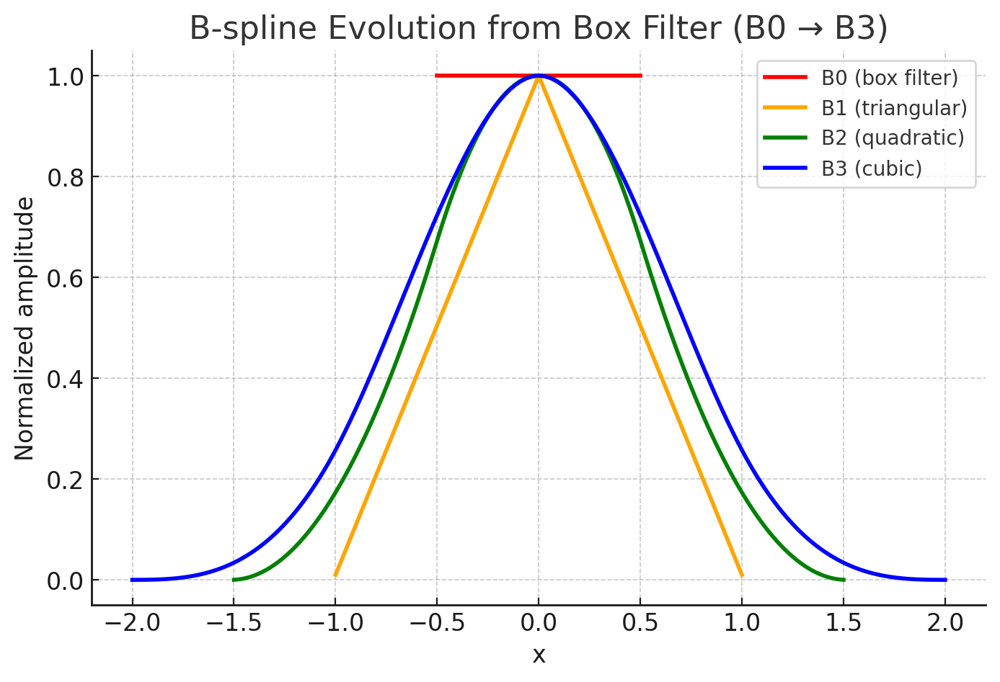

## 前言
在 Poisson Surface Reconstruction 表面重建文章中， 提到了使用自身 n 次卷积的 box filter 来作为平滑滤波器来说对指示函数进行平滑，生成梯度场。 那么 box filter 自身的 n 次卷积是什么呢？ 文章里面说用一个方差是采样分辨率的高斯函数是合适的，为什么可以用 box filter 自身 n 次卷积来代替高斯函数是合适的呢？ 下面就这个问题详细进行展开讨论。 因为采用的滤波器会直接影响到算法的数值离散化方式和效率。我们需要在理论和实践上都去理解它。

---

## 🧩 一、背景：Poisson 重建中的卷积思想

在 Poisson 重建中，我们要求解一个方程：

$$\Delta \chi = \nabla \cdot \mathbf{V}$$

其中

- $\chi$ 是隐式函数（其 0 等值面为重建表面）
- $\mathbf{V}$ 是由点云法向估计出来的“梯度场”近似。

离散时，我们通常在 **三维格点上** 近似求解这个方程。此时，$\chi$ 会用 **基函数展开**：

$$\chi(\mathbf{x}) = \sum_i c_i B(\mathbf{x} - \mathbf{x}_i)$$

这里的 $B(\cdot)$ 就是一个 **B-spline(Basis Spline) 核函数**。 实际上 box filter 自身 n 次卷积又称为**B-spline 核函数**,或者称为 B 样条函数。 没错，这个也就是计算机图形学里面那个 B 样条函数，关于B样条函数的术语，可以参考[附录B](#附录B)。

B-spline 特点：

- **局部支持（local support）**：矩阵稀疏；
- **平滑（smooth）**：适合解拉普拉斯方程；
- **可分离（separable）**：3D 计算可分为 1D 卷积。


---

## 🧱 二、B-spline 和 box filter 的关系

### ✅ 结论一句话：

> **B-spline 核函数是 box filter 的多次自卷积结果。**

具体地：

$$B_n(x) = \underbrace{(b * b * \cdots * b)}_{n+1 \text{ 次}}$$

其中 $b(x)$ 是 **box filter（单位宽度的矩形函数）**。

### 🧮 举例说明

1. **0 阶 B-spline**

   $$
   B_0(x) =
   \begin{cases}
   1 & |x| < \tfrac{1}{2}\\
   0 & \text{otherwise}
   \end{cases}
   $$

   这就是一个 **box filter**。

2. **1 阶 B-spline**

   $$B_1(x) = B_0 * B_0$$

   也就是两个 box filter 卷积后的结果，形成一个 **三角形核（tent function）**。

3. **2 阶 B-spline**

   $$B_2(x) = B_1 * B_0$$

   这会变成一个二次平滑的核（光滑的凸形），再往上阶就更平滑。

下图是通过Box filter卷积展示的B0-B3的 B-spline 核函数的形状，可以看到3阶 B-spline 的形状已经很像一个gaussian 核函数了。 



如果感兴趣box filter 卷积的形状推导和代码示例，可以参考 [附录 A，推导 B-spline 的分段表达式](#附录A)

---

## 🧠 三、为什么 Poisson 重建里用 B-spline


1. **紧支撑（compact support）**：  
   每个基函数只影响局部区域（通常一个格点的八邻域）。
2. **可用 box filter 实现快速卷积**：  
   因为 B-spline = 多次 box filter 卷积，所以在实现上可以利用**积分图（summed-area table）或 box filtering 技巧**来快速计算梯度、散度和能量项。
卷积的次数越多，函数越光滑：
3. **Poisson 重建里通常用 **三次 B-spline（cubic B-spline）**， 因为它在 $C^2$ 连续的情况下计算梯度和 Laplace 都很稳定**。  
实现上则用 box filter 的多次积分来高效模拟卷积。
- $B_0$：不连续（box）
- $B_1$：连续但不可导
- $B_2$：一次可导
- $B_3$：二次可导（通常使用）

---

## ⚙️ 四、数值计算上的意义

当你要计算：

$$\int B(\mathbf{x} - \mathbf{x}_i) B(\mathbf{x} - \mathbf{x}_j)\, d\mathbf{x}$$

这样的项时，  
用 box filter 实现比直接算 spline 快得多。  
所以在实现中，Poisson 重建经常会：

- 先通过 **box filter 累积法向场（V）**；
- 再通过 **多次 box filter 平滑** 得到对应的 B-spline 加权场；
- 最后解线性系统得到系数 $c_i$。

---

## 🔍 五、总结对比表

| 概念                | 数学定义        | 在 Poisson 重建中的作用      | 与 box filter 的关系      |
| ------------------- | --------------- | ---------------------------- | ------------------------- |
| Box filter          | 0 阶 B-spline   | 最基础的卷积单元             | 自身                      |
| B-spline (1 阶)     | 两次 box 卷积   | 平滑插值                     | box filter \* box filter  |
| B-spline (2 阶以上) | 多次 box 卷积   | 提供光滑的基                 | $B_n = b^{*(n+1)}$        |
| 应用                | 定义 χ 的基函数 | 将法向场光滑化、构造系数矩阵 | 可快速实现 via box filter |

---

## 📖 参考文献

- Kazhdan, M., Bolitho, M., & Hoppe, H. (2006).  
   _Poisson Surface Reconstruction_.  
- Kazhdan & Hoppe (2013).  
   _Screened Poisson Surface Reconstruction_.  
---


## 附录 A，推导 B-spline 的分段表达式 {#附录A}

### 一 1 阶 B-spline 是一个三角形核函数

下面给出证明，我们先证明 1 阶 B-spline 是一个三角形核函数。

证明：若

$$b(x)=\begin{cases}1,&|x|<\tfrac12,\\0,&\text{otherwise},\end{cases}$$

则一阶 B-spline （即 $B_1$）定义为 $B_1=b*b$，其解析表达为

$$
B_1(x)=\begin{cases}
1-|x|, & |x|<1,\\[4pt]
0, & |x|\ge1.
\end{cases}
$$

（注意这里 $b$ 的面积为 1，因而 $B_1$ 的峰值为 1，整体积分仍为 1。）

#### 1. 卷积定义

两个函数的卷积：

$$(B_1)(x)=(b*b)(x)=\int_{-\infty}^{\infty} b(t)\,b(x-t)\,dt.$$

由于 $b$ 是指示函数（indicator），可以写成

$$b(t)=\mathbf{1}_{[-\tfrac12,\tfrac12]}(t),\qquad b(x-t)=\mathbf{1}_{[-\tfrac12,\tfrac12]}(x-t).$$

于是被积函数为 1 当且仅当 $t\in[-\tfrac12,\tfrac12]$ 且 $x-t\in[-\tfrac12,\tfrac12]$。

第二个条件等价于 $t\in[x-\tfrac12,x+\tfrac12]$。

因此被积函数为 1 当且仅当

$$t\in I(x)\equiv [-\tfrac12,\tfrac12]\cap[x-\tfrac12,x+\tfrac12].$$

卷积值等于交集 $I(x)$ 的长度（Lebesgue measure）：

$$B_1(x)=\operatorname{length}(I(x)).$$

#### 2. 求交集长度（分段分析）

交集区间上下界是

$$
\text{下界}= \max\!\big(-\tfrac12,\; x-\tfrac12\big),\qquad
\text{上界}= \min\!\big(\tfrac12,\; x+\tfrac12\big).
$$

所以长度为

$$B_1(x)=\min\!\big(\tfrac12,\; x+\tfrac12\big)-\max\!\big(-\tfrac12,\; x-\tfrac12\big),$$

当上界 ≤ 下界 时长度为 0（表示无重叠）。

下面按 $x$ 的范围分情况计算。

##### 情况 A： $x\le -1$

此时区间 $[x-\tfrac12,x+\tfrac12]$ 在 $[-1.5,-0.5]$ 之类，完全落在 $[-∞,-\tfrac12]$ 左侧，与 $[-1/2,1/2]$ 无交集 → $B_1(x)=0$.

##### 情况 B： $-1 < x < 0$

- 上界：$\min(\tfrac12, x+\tfrac12)=x+\tfrac12$（因为 $x+\tfrac12<\tfrac12$）
- 下界：$\max(-\tfrac12, x-\tfrac12)=-\tfrac12$（因为 $x-\tfrac12<-\tfrac12$）

因此

$$B_1(x)=(x+\tfrac12)-(-\tfrac12)=x+1.$$

注意 $x+1=1-|x|$ 在此区间（因为 $|x|=-x$）。

##### 情况 C： $0 \le x < 1$

- 上界：$\min(\tfrac12,x+\tfrac12)=\tfrac12$（因为 $x+\tfrac12\ge\tfrac12$）
- 下界：$\max(-\tfrac12,x-\tfrac12)=x-\tfrac12$

因此

$$B_1(x)=\tfrac12-(x-\tfrac12)=1-x,$$

也就是 $1-|x|$ （在此区间 $|x|=x$）。

##### 情况 D： $x\ge 1$

无重叠，$B_1(x)=0$.

#### 3. 合并分段结果

把上面的各段合并：

$$
B_1(x)=\begin{cases}
0, & |x|\ge1,\\[4pt]
1-|x|, & |x|<1.
\end{cases}
$$

这就是著名的 **三角形核（tent function）**。

#### 4. 性质检验（可选）

1. 支持：$\mathrm{supp}(B_1)=[-1,1]$（宽度为 2）。
2. 最大值：$B_1(0)=1$。
3. 积分（面积）：

$$
\int_{-\infty}^{\infty} B_1(x)\,dx
= \int_{-1}^{1} (1-|x|)\,dx
= 2\int_{0}^{1} (1-x)\,dx
=2\left[x-\tfrac{x^2}{2}\right]_0^1=2\cdot\tfrac12=1,
$$

与单个 box 的面积一致（卷积保持总能量/面积）。

4. 导数（分段）：

$$
B_1'(x)=\begin{cases}
1, & -1<x<0,\\
-1, & 0<x<1,\\
0, & \text{elsewhere (in distribution sense at }\pm1,0\text{有不连续点)}.
\end{cases}
$$

说明 $B_1$ 连续但在 $x=0$ 可导性改变（一次可导不连续）。

#### 5. 直观解释（补充）

- 把宽为 1 的两个单位矩形沿 x 轴滑动相乘并积分；卷积在每个位置 $x$ 上的值就是两个矩形重叠长度。
- 当 $x=0$ 重叠最大（长度=1）；当 $x$ 逐渐移动到 ±1 时重叠线性变为 0，产生线性的上升/下降段 -> 三角形。

---

### 二 2 阶和 3 阶 B-spline 核函数的形状

### 1. 设定与回顾

定义 0 阶（box）函数

$$
b(x)=\mathbf{1}_{[-\tfrac12,\tfrac12]}(x)=
\begin{cases}1,&|x|<\tfrac12,\\0,&\text{otherwise.}\end{cases}
$$

已知

$$B_1(x)=(b*b)(x)=\begin{cases}1-|x|,&|x|<1,\\0,&|x|\ge1,\end{cases}$$

即“三角形核”。

接下来

$$
B_2(x)=B_1*b=(b*b)*b,
\qquad
B_3(x)=B_2*b.
$$

卷积定义（1D）：

$$(f*g)(x)=\int_{-\infty}^{\infty} f(t)\,g(x-t)\,dt.$$

---

### 2. 详细推导：二阶 $B_2(x)=B_1*b$

写成积分：

$$B_2(x)=\int_{-\infty}^\infty B_1(t)\, b(x-t)\,dt.$$

由于 $B_1(t)$ 在 $|t|<1$ 有值，$b(x-t)$ 在 $|x-t|<\tfrac12$ 有值，因此被积项非零当且仅当

$$t\in[-1,1]\cap[x-\tfrac12,\,x+\tfrac12].$$

所以积分的上下限是

$$
\text{下界}=L(x)=\max(-1,\,x-\tfrac12),\qquad
\text{上界}=U(x)=\min(1,\,x+\tfrac12),
$$

且在这些 $t$ 上被积函数为 $B_1(t)=1-|t|$.

因此

$$B_2(x)=\int_{L(x)}^{U(x)} (1-|t|)\,dt.$$

观察交集何时为空：当 $[x-\tfrac12,x+\tfrac12]$ 与 $[-1,1]$ 无交集时（即 $|x|\ge 1.5$），积分为 0。所以 $B_2$ 的支撑是 $[-3/2,\,3/2]$。

关键断点来自使上下界转变的点：$x=-\tfrac32,\; -\tfrac12,\; \tfrac12,\; \tfrac32$。因此分四段讨论（对称性可只做 $x\ge0$ 再镜像，但这里写出三段中心表达）：

#### 情形 A： $-\tfrac32 \le x < -\tfrac12$

在此区间，$x+\tfrac12<0$ 且 $x-\tfrac12<-1$，因此

$$L(x)=-1,\quad U(x)=x+\tfrac12,\quad\text{并且区间内 }t\le0,$$

所以 $|t|=-t$，被积项 $1-|t|=1+t$。

计算：

$$
B_2(x)=\int_{-1}^{\,x+\tfrac12}(1+t)\,dt
=\Big[t+\tfrac{t^2}{2}\Big]_{-1}^{x+\tfrac12}.
$$

令 $u=x+\tfrac12$，则

$$
B_2(x)=\Big(u+\tfrac{u^2}{2}\Big)-\Big(-1+\tfrac{1}{2}\Big)
= u+\tfrac{u^2}{2}+\tfrac12.
$$

化简（把 $u=x+\tfrac12$ 代回）：

$$
B_2(x)=\frac{(x+\tfrac32)^2}{2},
\qquad -\tfrac32\le x<-\tfrac12.
$$

#### 情形 B： $-\tfrac12 \le x \le \tfrac12$

此时交集为 $[x-\tfrac12,\,x+\tfrac12]$，并且区间跨过 $t=0$。于是分两段积分（从 $x-\tfrac12$ 到 0，再到 $x+\tfrac12$）：

$$B_2(x)=\int_{x-\tfrac12}^{0} (1+t)\,dt + \int_{0}^{x+\tfrac12} (1-t)\,dt.$$

计算：

$$\int_{x-\tfrac12}^{0}(1+t)\,dt = -\big(x-\tfrac12\big) - \tfrac{(x-\tfrac12)^2}{2},$$ $$\int_{0}^{x+\tfrac12}(1-t)\,dt = \big(x+\tfrac12\big) - \tfrac{(x+\tfrac12)^2}{2}.$$

相加并化简（省略代数中间行）结果为

$$B_2(x)=\tfrac34 - x^2,\qquad |x|\le \tfrac12.$$

（可以验算：在 $x=0$ 时 $B_2(0)=3/4$，在 $x=\pm 1/2$ 时为 $3/4 - 1/4 = 1/2$，与相邻段连续。）

#### 情形 C： $\tfrac12 < x \le \tfrac32$

对称于 A 段，可写出：

$$B_2(x)=\frac{(\tfrac32-x)^2}{2},\qquad \tfrac12<x\le\tfrac32.$$

#### 合并写成分段函数（即最终结果）

$$
\boxed{\,B_2(x)=\begin{cases}
\frac{(x+\tfrac32)^2}{2}, & -\tfrac32\le x< -\tfrac12,\\[6pt]
\tfrac34 - x^2, & |x|\le \tfrac12,\\[6pt]
\frac{(\tfrac32-x)^2}{2}, & \tfrac12< x\le \tfrac32,\\[4pt]
0,& |x|>\tfrac32.
\end{cases}\,}
$$

- 支撑：$[-3/2,\,3/2]$（宽度 3）。
- 在边界处各段值与导数可检查为连续（$C^1$ 连续，即一次连续导数），但二阶导在节点处有间断（这与次数 2 的光滑度一致）。
- 积分 $\int B_2(x)\,dx=1$。

### 3. 三阶 $B_3$（结果与说明）

三阶可以继续用卷积 $B_3 = B_2 * b$。它的支撑是 $[-2,2]$。分段点出现在 $|x|=0,1,2$。最终的、常见且标准化的闭式分段多项式为：

$$
\boxed{\,B_3(x)=\begin{cases}
\displaystyle\frac{1}{6}\,(2-|x|)^3, & 1<|x|<2,\\[8pt]
\displaystyle\frac{1}{6}\big(4-6x^2+3|x|^3\big), & |x|\le 1,\\[6pt]
0, & |x|\ge 2.
\end{cases}\,}
$$

（注意公式中出现 $|x|^3$ 保证了关于原点的偶对称性。）

这可以等价写成两段（利用偶性）：

- 当 $0\le |x|\le 1$：
  $$B_3(x)=\frac{4-6x^2+3|x|^3}{6}.$$
- 当 $1<|x|<2$：
  $$B_3(x)=\frac{(2-|x|)^3}{6}.$$

**性质检验 / 由卷积得到的理由（概述推导路线）：**

- $B_3(x)=\int_{L(x)}^{U(x)} B_2(t)\,dt$（其中 $L,U$ 与上面类似，分段点为 $-2,-1,0,1,2$）。
- 分段时要把积分区间按 $B_2$ 的三段形式拆开（每一段为二次多项式），对每一段做多项式原函数计算并合并，最后化简得到上面的三次多项式表达。
- 连续性：$B_3$ 在节点处连续且一阶、二阶导数也连续（即 $C^2$），这与 degree=3 的 B-spline 的光滑度相符。
- 面积：$\int_{-\infty}^{\infty} B_3(x)\,dx = 1$。

---

### 4. 小结（直观与对应表）

- $B_0$（box）：支撑 $[-1/2,1/2]$，不连续。
- $B_1$（三角）：支撑 $[-1,1]$，连续但一阶不可导（$C^0$）。
- $B_2$（二次）：支撑 $[-3/2,3/2]$，$C^1$（一次可导连续）。
- $B_3$（三次）：支撑 $[-2,2]$，$C^2$（二阶导连续），常用于图形/Poisson 重建中因为求二阶导（Laplace）数值稳定。

每升一阶，等价于对 box filter 做一次卷积——函数更宽、平滑度提高，且每段都是对应次数的多项式。

---

### 形状绘制
下面通过绘制代码来具体观察一下形状。 

```python
import numpy as np
import matplotlib.pyplot as plt
from scipy.signal import convolve

def box_filter_1d(resolution=0.01):
    x = np.arange(-0.5, 0.5 + resolution, resolution)
    y = np.ones_like(x)
    return x, y / np.sum(y)

def bspline_1d(order, resolution=0.01):
    x, b = box_filter_1d(resolution=resolution)
    y = b.copy()
    for _ in range(order):
        y = convolve(y, b, mode='full') * resolution
    x_full = np.linspace(-(order + 1) / 2, (order + 1) / 2, len(y))
    return x_full, y / np.max(y)

# 绘制从 box filter 到 cubic B-spline 的演化
plt.figure(figsize=(8, 5))
colors = ['red', 'orange', 'green', 'blue']
labels = ['B0 (box filter)', 'B1 (triangular)', 'B2 (quadratic)', 'B3 (cubic)']

for n, color, label in zip(range(4), colors, labels):
    x, y = bspline_1d(n)
    plt.plot(x, y, color=color, label=label, linewidth=2)

plt.title("B-spline Evolution from Box Filter (B0 → B3)")
plt.xlabel("x")
plt.ylabel("Normalized amplitude")
plt.legend()
plt.grid(True)
plt.show()

```


- `order=0` ：box filter（矩形函数）
- `order=1` ：三角形核
- `order=2` ：二次平滑核
- `order=3` ：三次 B-spline（通常用于 Poisson 重建）


| 阶数 | 形状           | 连续性  |
| ---- | -------------- | ------- |
| 0    | 方形           | 不连续  |
| 1    | 三角形         | C⁰ 连续 |
| 2    | 光滑凸曲线     | C¹ 连续 |
| 3    | 更平滑的凸曲线 | C² 连续 |


这张图展示了从 **box filter（B₀）** 到 **三次 B-spline（B₃）** 的平滑演化过程：

- 红色：B₀，方形脉冲（不连续）
- 橙色：B₁，三角形（一次连续）
- 绿色：B₂，二次平滑（一次可导）
- 蓝色：B₃，三次平滑（两次可导）

你可以看到——每卷积一次，曲线就更光滑、支撑范围更宽。  
这就是 B-spline 的核心思想：**通过 box filter 的多次卷积实现平滑基函数。**

---

## 📘 附录 B-spline 的中文术语常见翻译 {#附录B}

| 英文术语                     | 中文翻译          | 说明                  |
| ---------------------------- | ----------------- | --------------------- |
| B-spline                     | B 样条            | 最常见、标准译法      |
| Basis spline                 | 基样条            | 强调是“基函数”        |
| Cubic B-spline               | 三次 B 样条       | 在 Poisson 重建中常用 |
| Uniform B-spline             | 均匀 B 样条       | 节点均匀分布          |
| Non-uniform B-spline (NURBS) | 非均匀有理 B 样条 | 用于 CAD、曲面建模    |

---