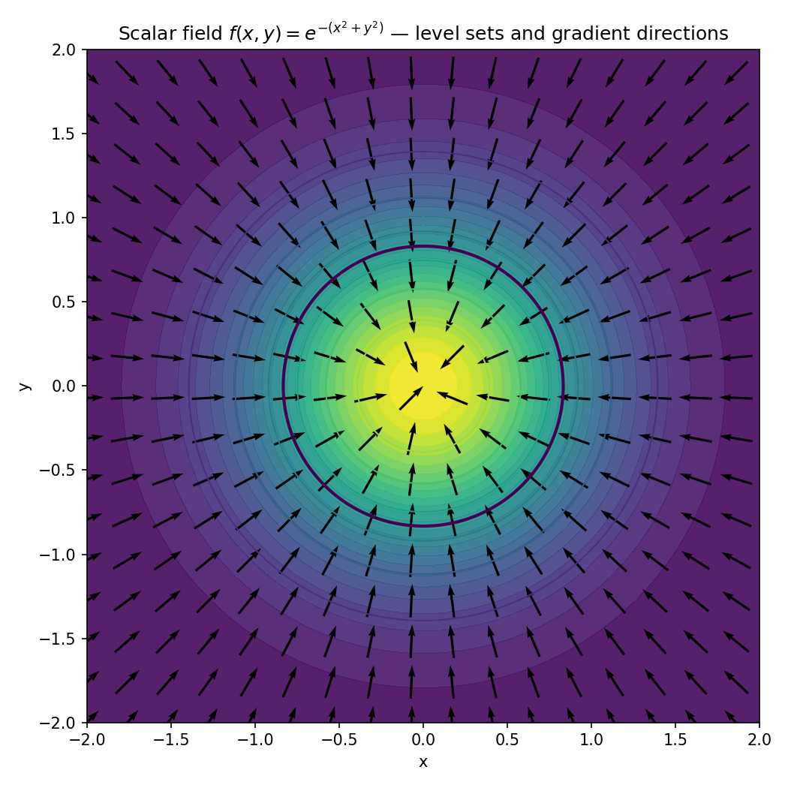

# 关于Poisson重建$\partial$符号的理解

初次看到Poisson重建这篇文章的时候，看到他用$\partial M$ 表示表面，当时很困惑，为什么偏导数表示表面？ 这里我觉得有一个概念理解错误的问题。 作者使用$\partial M$ 表示“集合 M 的边界”，而不是“偏导数”。 具体说来，  $\partial$其实是**数学记号上的“边界符号”**（boundary operator），不是偏导数。  


## 一、误解的来源

在 Poisson Surface Reconstruction 论文中（Kazhdan et al., 2006），确实有这样的记号：

$$\partial M \equiv \text{surface of the solid model } M$$

很多人第一次看会以为 “∂” 是偏导符号，但其实这里：

> $\partial M$ 表示的是**集合 M 的边界（boundary）**，而不是偏导（partial derivative）。

* * *

## 二、数学背景：拓扑学/几何分析中的边界算子

在**几何拓扑（geometric topology）**或**流形理论（manifold theory）**中，  
“∂” 是标准的边界算子（boundary operator），读作 “boundary of”。

例如：

* 对于二维区域 $M \subset \mathbb{R}^2$，  
    它的边界 $\partial M$ 是一条一维曲线；
    
* 对于三维体积 $M \subset \mathbb{R}^3$，  
    它的边界 $\partial M$ 是一个二维表面。
    

这种“降一维”的对应关系是拓扑学中非常核心的概念。

* * *

## 三、Poisson 重建中为什么要这样写

Poisson Surface Reconstruction 的核心思想是：

我们假设存在一个**隐式函数** $\chi(\mathbf{x})$，表示物体的**指示函数**：

$$\chi(\mathbf{x}) =  
\begin{cases}  
1, & \mathbf{x} \in M \\  
0, & \mathbf{x} \notin M  
\end{cases}$$

那么，**表面**就定义为这个体的**边界**：

$$\partial M = \{ \mathbf{x} \mid \chi(\mathbf{x}) = \text{const} \}$$

或者等价地说：

$$\partial M = \text{zero level set of } \chi$$

* * *

## 四、符号上的逻辑关系

| 符号 | 意义 | 维度变化 | 在 Poisson 重建中 |
| --- | --- | --- | --- |
| $M$ | 三维实体（体积域） | 3D | 我们想重建的物体体积 |
| $\partial M$ | $M$ 的边界 | 2D | 表面 mesh |
| $\chi(\mathbf{x})$ | 指示函数 | 标量场 | 用于定义 $M$ |
| $\nabla \chi$ | 梯度场 | 法向方向 | 从点云法向构造 |
| $\Delta \chi = \nabla \cdot \mathbf{V}$ | Poisson 方程 | PDE 形式 | 用于求解隐式表面 |

所以 “∂” 在这里不是“偏导”，而是“边界算子”，在几何上表示**取边界**这个操作。


## 五、总结一句话

> 在 Poisson 表面重建中，$\partial M$ 表示“体积 M 的边界表面”，  
> 这个符号来自**微分几何与拓扑中的边界算子**，  
> 不是偏导数符号，也不是梯度符号。


* * *


## 六、如何理解等值集levelset呢？

第三节我们说，$$\partial M = \text{zero level set of } \chi$$
这个公式如何理解呢？ levelset又是什么？

“等值集 (level set)” 是理解隐式表面、Poisson 重建、甚至很多偏微分方程（PDE）问题的**核心概念**。  
我们一步步把它讲清楚。

* * *

### 6.1 定义：什么是等值集（Level Set）

给一个**标量场**：

$$f: \mathbb{R}^n \to \mathbb{R}$$

它在空间中每个点都有一个实数值。

那么对某个常数 $c$，**等值集（level set）**定义为：

$$L_c = \{ \mathbf{x} \in \mathbb{R}^n \mid f(\mathbf{x}) = c \}$$

这就是——

> 所有使函数值等于同一个常数的点的集合。

* * *

### 6.2、低维直观例子

| 空间维度 | 函数例子 | 等值集几何形状 | 可视化 |
| --- | --- | --- | --- |
| 1D | $f(x) = x^2$ | 点 | $f(x)=1$ → 两个点 $\{-1, +1\}$ |
| 2D | $f(x, y) = x^2 + y^2$ | 曲线 | $f=1$ → 圆：$x^2 + y^2 = 1$ |
| 3D | $f(x, y, z) = x^2 + y^2 + z^2$ | 曲面 | $f=1$ → 球面 $x^2 + y^2 + z^2 = 1$ |

* * *

### 6.3、几何意义：隐式定义的曲面/曲线

你可能见过**显式定义的曲面**，比如：

$$z = g(x, y)$$

但等值集是一种**隐式定义（implicit form）**的方式：

$$f(x, y, z) = c$$

这两者的关键区别是：

* 显式形式：你把一个变量当作其他变量的函数；
    
* 隐式形式：你只说哪些点“满足某个条件”属于表面。
    

这种隐式表示能轻易描述复杂拓扑的表面（例如空洞、分叉），  
这就是为什么 Poisson 重建、SDF（有符号距离场）、Level Set 方法 都用隐式表示。

* * *

### 6.4、梯度与法向的关系

在等值集上：

$$f(\mathbf{x}) = c$$

对任意在表面上微小移动 $d\mathbf{x}$，我们有：

$$df = \nabla f \cdot d\mathbf{x} = 0$$

这表示沿着表面移动时，函数值不变，所以：

> 梯度 $\nabla f$ 总是垂直于等值面。

换句话说：

* 等值集定义了“面”；
    
* 梯度定义了“面法向方向”。
    

这正是 Poisson 重建的核心几何关系：

$$\mathbf{n}(\mathbf{x}) \propto \nabla \chi(\mathbf{x})$$

* * *

### 6.5、Poisson 重建中的等值集

在 Poisson Surface Reconstruction 中：

1. 我们定义一个**指示函数** $\chi(\mathbf{x})$，  
    它大致为：
    
    $$\chi(\mathbf{x}) =  
    \begin{cases}  
    1, & \text{inside the object}\\  
    0, & \text{outside}  
    \end{cases}$$
2. 表面定义为它的一个**等值集**：
    
    $$\partial M = \{ \mathbf{x} \mid \chi(\mathbf{x}) = c \}$$
    
    通常取 $c = 0.5$ 或某个平均值。
    
3. 梯度场 $\nabla \chi$ 与点云的法向方向一致，  
    Poisson 方程
    
    $$\Delta \chi = \nabla \cdot \mathbf{V}$$
    
    用来从散乱的法向场 $\mathbf{V}$ 恢复出隐式函数 $\chi$。
    

* * *

### 6.6、从几何角度再看一遍

| 概念 | 数学形式 | 直觉 |
| --- | --- | --- |
| 标量场 | $f(x, y, z)$ | 空间中每点的“高度”或“密度” |
| 等值面 | $f(x, y, z) = c$ | “所有同高度的点”的集合 |
| 梯度 | $\nabla f$ | 指向函数增长最快的方向（表面法向） |
| Poisson 表面 | $\chi(x) = c$ | 体的边界（∂M） |

* * *

### 6.7、图像化比喻

想象一座山：

* 山体的高度就是 $f(x, y)$；
    
* 每条等高线就是一个**level set**；
    
* 梯度方向（最陡上升）垂直于等高线；
    
* 三维时，同理——等高“线”变成等高“面”。
    

* * *

### 6.8、总结一句话

> **等值集（level set）**是标量场中函数值相等的点的集合，  
> 它是表面的一种隐式表示。  
> 在 Poisson 重建中，物体表面就是指示函数的等值集，  
> 梯度方向定义了表面的法向。

* * *

接下来我们画一张图，用 Python显示：

* 标量场 $f(x, y)$；
    
* 几条等值线；
    
* 梯度方向箭头？  
    这样我们可以一眼看出“level set”和“gradient”的几何关系。

* * *

```python
# Creating a visualization of a 2D scalar field, its level sets, and the gradient field (quiver).
# The resulting image will be saved to /mnt/data/levelset_plot.png and displayed inline.
import numpy as np
import matplotlib.pyplot as plt
from pathlib import Path

# Grid
nx, ny = 200, 200
x = np.linspace(-2.0, 2.0, nx)
y = np.linspace(-2.0, 2.0, ny)
X, Y = np.meshgrid(x, y)

# Scalar field: a smooth bump (radial)
F = np.exp(-(X**2 + Y**2))

# Compute gradients (partial derivatives)
dx = x[1] - x[0]
dy = y[1] - y[0]
Fy_x, Fy_y = np.gradient(F, dx, dy, edge_order=2)  # returns derivatives along axis 0 and 1
# Note: np.gradient returns (dF/dy, dF/dx) for a 2D array with axes (y, x).
dFdx = Fy_y
dFdy = Fy_x

# Prepare quiver sampling (sparser for clarity)
step = 12
Xq = X[::step, ::step]
Yq = Y[::step, ::step]
dFdx_q = dFdx[::step, ::step]
dFdy_q = dFdy[::step, ::step]

# Normalize gradient vectors for visualization (only direction matters)
mag = np.sqrt(dFdx_q**2 + dFdy_q**2)
nonzero = mag > 1e-12
dFdx_q[nonzero] /= mag[nonzero]
dFdy_q[nonzero] /= mag[nonzero]

# Plotting
fig, ax = plt.subplots(figsize=(7,7))
# Filled contour for scalar field
cf = ax.contourf(X, Y, F, levels=30, alpha=0.9)
# Contour lines (level sets)
cs = ax.contour(X, Y, F, levels=np.linspace(F.min(), F.max(), 8), linewidths=1)
# Highlight a specific level set, e.g., f = 0.5
lvl = 0.5
cs2 = ax.contour(X, Y, F, levels=[lvl], linewidths=2)
# Quiver for gradient (points outward for this radial bump)
q = ax.quiver(Xq, Yq, dFdx_q, dFdy_q, scale=20, pivot='mid')

ax.set_aspect('equal', 'box')
ax.set_title('Scalar field $f(x,y)=e^{-(x^2+y^2)}$ — level sets and gradient directions')
ax.set_xlabel('x')
ax.set_ylabel('y')

# Save figure
out_path = Path('./levelset_plot.jpg')
plt.tight_layout()
plt.savefig(out_path, dpi=150)
plt.show()


```
上面代码运行后，会生成下面的图片：


标量场 $f(x,y)=e^{-(x^2+y^2)}$ 的填色图、若干等值线（level sets），以及梯度方向（箭头，quiver）。图中粗线对应 $f=0.5$ 的等值集——这就是一个隐式定义的“曲线/表面”（在 3D 中同理是曲面）；箭头显示梯度方向（指向函数增大的方向），也就是等值集的法向方向。
