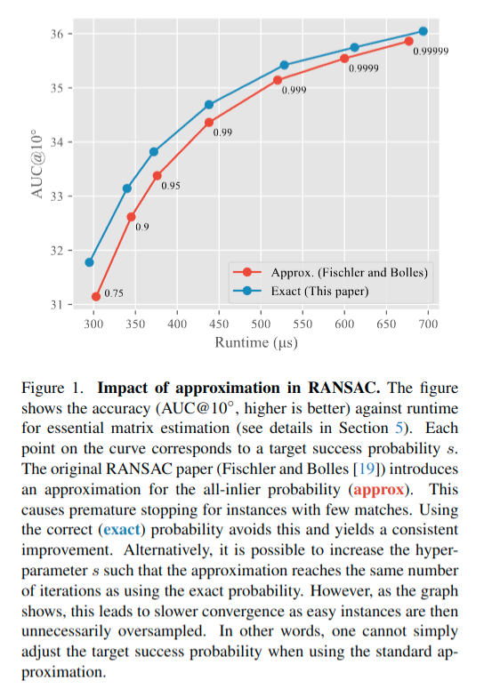
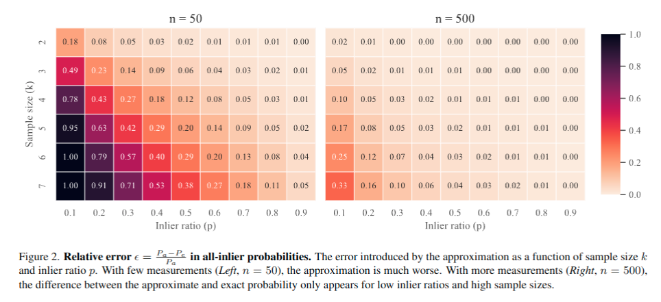
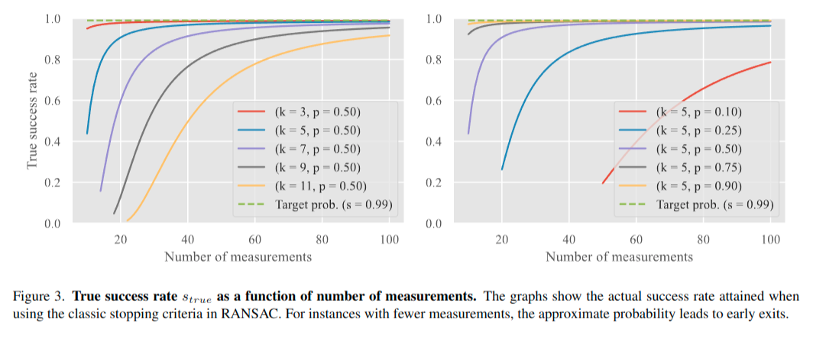
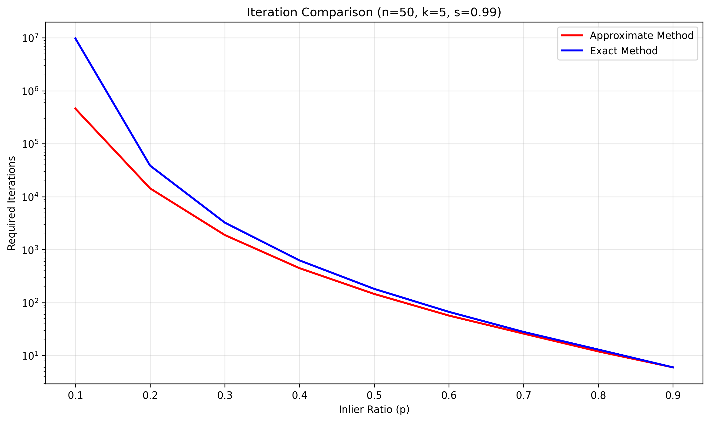

# RANSAC 停止准则的修正：从近似到精确

## 文章概述
几年以前在自己写RANSAC算法时候， 就发现利用Multi-View Geometry那本圣经中的停止准则来计算迭代次数，似乎不能得到最好的解。 后来面试过一些候选人，他们也发现了这个问题。 但是我从未怀疑过是理论出了问题，况且在读那本Multi-View Geometry一书的时候，我也确信自己是读懂了的。 今年发现这篇文章，真的是有那种感觉，就是发现有问题的地方，应该好好思考，敢于怀疑。好了，说了这么多其实这篇文章很短， 就是修正了RANSAC 算法停止准则中概率的近似计算问题。 文章地址： https://arxiv.org/abs/2503.07829


文章题目：Fixing the RANSAC Stopping Criterion， 由 Johannes Schönberger、Viktor Larsson 和 Marc Pollefeys 发表于今年-- 2025 年。 一作是Colmap的作者。 

## 正题
RANSAC（Random Sample Consensus）自 1981 年由 Fischler 和 Bolles 提出以来，一直是计算机视觉中最常用的鲁棒估计算法之一 。设 s 表示期望我们RANSAC算法的采样中至少能有一次采样点都是内点，也就是能够正确工作的期望概率， 例如0.99。设 P 表示一次采样全部都是内点的概率。我们尝试采样次数N应该满足： 
$$
\begin{equation}
 (1 − P )^N \leq 1 − s 
\end{equation}
$$

两边取对数，并且注意到(1 − P ) < 1 ，我们有

$$ 
\begin{equation}
    N \geq \dfrac{log(1 − s)}{log(1 − P )} 
\end{equation}
$$

原始的paper给定所有内点的概率的计算公式为：

$$
\begin{equation}
P_a = p^k
\end{equation}
$$

但是，这其实是一个近似解(Pa中的a表示是一个approximate）。 论文指出，正确的精确（exact）概率应该是：
$$
\begin{equation}
P_e =\frac{\binom{pn}{k}}{\binom{n}{k}}
\end{equation}
$$
其实可以等价表示为：
$$
\begin{equation}
P_e = \prod_{i=0}^{k-1} \frac{n_p - i}{n - i}
\end{equation}
$$
 n 为整体样本数量， pn 是内点数量。如果pn > k,那么P =  $P_e$ ,否则P = 0。

## 效果
作者实验了使用精确计算和近似计算的效果。 



并且分析了pa与pe之间的相对误差关系与内点率和sample 维度K之间的关系，见下图。 

<center>图像2：pa与pe之间的相对误差</center>

作者还分析了概率估计对真正的s（RANSAC正确工作的概率）的影响

其中
$$
\begin{equation}
s_{true} = 1 - {(1 - P_e)}^{\frac{log(1 - s)}{log(1−P_a)}} 
\end{equation}
$$


### 实际影响
最后总结起来，就是使用错误的概率计算方法，导致RANSAC算法在某些场景下表现不佳。 
- **欠采样**：RANSAC 在挑战性场景中过早停止
- **模型失败**：无法找到好的模型
- **性能下降**：在低内点比例场景中表现不佳
- **参数K数量**：K越大越容易出现错误

下图是我自己写的一个脚本来直观的看下近似估计和精确估计之间，对于迭代次数N的估计差异。 


### 精确停止准则的实现

实现精确概率计算非常简单：

```python
def exact_all_inlier_probability(n, p, k):
    """计算精确的全内点采样概率"""
    pn = int(p * n)  # 内点总数
    if pn < k:
        return 0.0

    probability = 1.0
    for i in range(k):
        probability *= (pn - i) / (n - i)
    return probability
```

### 停止准则计算

```python
def compute_iterations(s, P):
    """计算所需的迭代次数"""
    if P >= 1.0:
        return 1
    return math.ceil(math.log(1 - s) / math.log(1 - P))
```


### 开源项目影响

论文调查了多个流行的开源项目，发现几乎所有项目都使用了错误的近似方法，包括：

- OpenCV
- scikit-image
- scikit-learn
- COLMAP
- OpenMVG
- ORB-SLAM3


### 修复的简单性

修正这个问题通常只需要几行代码的改动，但能带来显著的性能提升。

## 结论与意义

### 主要贡献

1. **理论分析**：首次系统分析了 RANSAC 停止准则中的近似误差
2. **精确解决方案**：提出了简单有效的精确概率计算方法
3. **实验验证**：在多个计算机视觉问题上验证了改进效果

### 实际意义

- 在挑战性场景中显著提高模型估计成功率
- 减少灾难性估计失败
- 为计算机视觉社区提供重要的算法修正

### 局限性

- 精确方法会增加运行时间，特别是在困难场景中
- 未考虑测量噪声、最小求解器稳定性等其他因素
- 未在所有 RANSAC 变体上进行全面测试

## 未来展望

这项工作为 RANSAC 算法的进一步改进奠定了基础，未来可以：

1. 将精确停止准则集成到所有流行的 RANSAC 实现中
2. 研究其他影响成功概率的因素
3. 开发统一的框架来综合考虑各种影响因素

---

**参考文献**：Schönberger, J., Larsson, V., & Pollefeys, M. (2025). Fixing the RANSAC Stopping Criterion. arXiv preprint arXiv:2503.07829.
