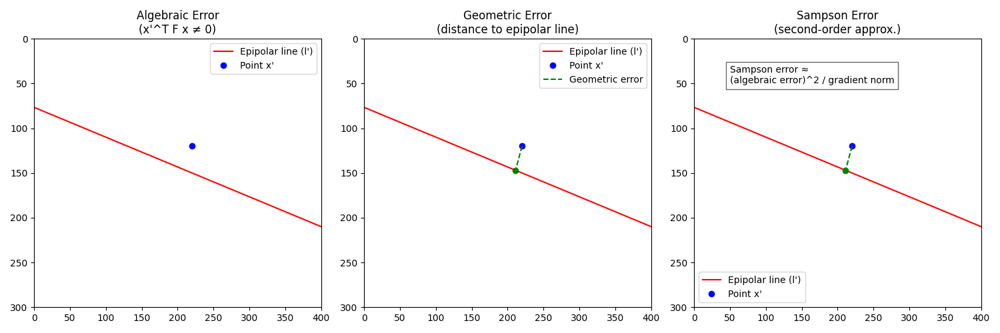

## Sampson 误差

在在两视图几何（epipolar geometry）里面,经常会提到**Sampson 误差**，那么什么是 sampson 误差呢？

### 1. 背景：两视图几何和对极约束

在两视图几何中，如果我们有两幅图像的匹配点 $\mathbf{x} = (u, v, 1)^T$ 和 $\mathbf{x}' = (u', v', 1)^T$，它们应满足 **对极约束 (epipolar constraint)**：

$$\mathbf{x}'^T F \mathbf{x} = 0$$

其中 $F$ 是 **基础矩阵 (fundamental matrix)**。

但在实际数据中，由于噪声，约束通常不严格成立：

$$\mathbf{x}'^T F \mathbf{x} \neq 0$$

于是需要一个 **误差度量** 来描述点与几何模型的偏差。

---

### 2. 几种常见的误差

- **代数误差 (algebraic error)**:
  $$E_{\text{alg}} = \mathbf{x}'^T F \mathbf{x}$$
  但它没有几何意义，且量纲随缩放改变。
- **几何重投影误差 (reprojection error)**:  
   真实几何意义的误差：点到其对应对极线的几何距离。但最小化它需要非线性优化，代价较高。
- **Sampson 误差**  
   是对重投影误差的二阶近似，可以在代数误差基础上，加上归一化因子来近似几何距离。

---

### 3. Sampson 误差公式

设：

$$e = \mathbf{x}'^T F \mathbf{x}$$

对极线方程：

$$
\mathbf{l} = F \mathbf{x} = (a, b, c)^T, \quad
\mathbf{l}' = F^T \mathbf{x}' = (a', b', c')^T
$$

那么 Sampson 误差定义为：

$$E_{\text{Sampson}}(\mathbf{x}, \mathbf{x}') = \frac{( \mathbf{x}'^T F \mathbf{x} )^2}{(a^2 + b^2) + (a'^2 + b'^2)}$$

其中：

- 分子：代数误差平方
- 分母：归一化因子（梯度平方和），保证误差有几何尺度意义

---

### 4. 直观解释

- Sampson 误差 ≈ 点到对极线的几何距离的平方
- 它比代数误差合理，但计算量比重投影误差小得多
- 在实际估计基础矩阵、单应矩阵时，常用作优化的目标函数（比如 RANSAC 内点判定、非线性 refinement）

---

### 5. 小结

- **代数误差**：快但无几何意义
- **几何重投影误差**：真实意义但优化困难
- **Sampson 误差**：折中 → 是几何误差的二阶近似，常用在两视图几何优化里

### 6. 图解sampson误差

这里展示了三种误差的直观区别：

1. **代数误差 (左图)**  
   只是代入公式 $\mathbf{x}'^T F \mathbf{x}$，值不为零说明点不在对应对极线上，但它没有几何意义。
2. **几何误差 (中图)**  
   用点到对极线的垂直距离表示，是真正的几何偏差。
3. **Sampson 误差 (右图)**  
   用代数误差平方除以梯度平方和来近似几何误差，是二阶近似，计算快，效果接近几何误差。

