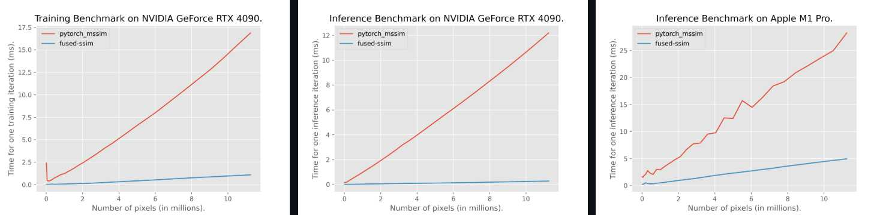

https://en.wikipedia.org/wiki/Structural_similarity_index_measure

# 介绍

结构 相似性 指数（SSIM）是一种用于预测数字电视和电影画面以及其他类型数字图像和视频的感知质量的方法。它也用于衡量两幅图像之间的相似度。SSIM 指数是一种完全参考度量；换句话说，图像质量的测量或预测是基于初始的未压缩或无失真图像作为参考的。

SSIM 是一种基于感知的模型，它将图像退化视为结构信息的感知变化，同时还纳入了重要的感知现象，包括亮度掩蔽和对比度掩蔽项。这与其他技术（例如均方误差(MSE) 或峰值信噪比(PSNR)）不同，后者估计的是绝对误差。结构信息是指像素之间存在很强的相互依赖性，尤其是在空间上接近时。这些依赖性包含有关视觉场景中物体结构的重要信息。亮度掩蔽是指图像失真（在此上下文中）在明亮区域往往不太明显，而对比度掩蔽是指图像中存在显著活动或“纹理”的区域失真不太明显。

---

# 算法

SSIM 的数学公式

给定两幅图像块 $x$ 和 $y$，SSIM 定义为：

$$
\text{SSIM}(x, y) =
\frac{(2\mu_x \mu_y + C_1)(2\sigma_{xy} + C_2)}
{(\mu_x^2 + \mu_y^2 + C_1)(\sigma_x^2 + \sigma_y^2 + C_2)}
$$

其中：

| 符号                                | 含义                                      |
| ----------------------------------- | ----------------------------------------- |
| $\mu_x, \mu_y$                      | 图像 $x, y$ 的平均亮度                    |
| $\sigma_x^2, \sigma_y^2$            | 图像 $x, y$ 的方差（反映对比度）          |
| $\sigma_{xy}$                       | 图像 $x, y$ 的协方差（反映结构相似度）    |
| $C_1, C_2$                          | 为防止分母为零的稳定常数，常设为：        |
| $C_1 = (K_1L)^2, \, C_2 = (K_2L)^2$ |
| $L$                                 | 像素取值范围（如 8-bit 图像中 $L = 255$） |
| $K_1, K_2$                          | 通常取 $K_1 = 0.01, K_2 = 0.03$           |


实际上，SSIM 由三个部分组成：

$$\text{SSIM}(x, y) = [l(x, y)]^\alpha \cdot [c(x, y)]^\beta \cdot [s(x, y)]^\gamma$$

其中：

- 亮度比较：
  $$l(x, y) = \frac{2\mu_x \mu_y + C_1}{\mu_x^2 + \mu_y^2 + C_1}$$
- 对比度比较：
  $$c(x, y) = \frac{2\sigma_x \sigma_y + C_2}{\sigma_x^2 + \sigma_y^2 + C_2}$$
- 结构比较：
  $$s(x, y) = \frac{\sigma_{xy} + C_3}{\sigma_x \sigma_y + C_3}$$
  其中 $C_3 = C_2 / 2$。

通常取 $\alpha = \beta = \gamma = 1$，于是化简后就得到常见的主公式。

---

# SSIM 的范围与意义

- 取值范围：
  $$-1 \leq \text{SSIM} \leq 1$$
- 实际中：
  - **1** 表示两图完全一致；
  - **0** 表示完全不相关；
  - **负值** 表示反相关（很少出现）。

---

# Python 示例

可以直接用 `scikit-image` 计算：

```python
from skimage.metrics import structural_similarity as ssim
import cv2

img1 = cv2.imread("image1.png", cv2.IMREAD_GRAYSCALE)
img2 = cv2.imread("image2.png", cv2.IMREAD_GRAYSCALE)

score, diff = ssim(img1, img2, full=True)
print("SSIM:", score)
```

---

# 应用场景

- 图像压缩质量评估（JPEG、WebP、AVIF）
- 图像去噪/超分辨率效果评价
- 深度学习图像重建/生成质量指标（GAN、NeRF、重建网络等）

# 深度学习中作为作为损失函数

当在做图像重建、生成、优化、或深度网络中作为损失函数，用 SSIM 评价两张图（预测 vs 真实）的时候，希望SSIM的计算是可微的，方便进行梯度下降，并且希望计算速度快。 可以使用https://github.com/rahul-goel/fused-ssim 提供的实现。 一方面可微，一方面速度快。 另外它支持多种硬件加速。 它比pytorch-msssim要快5到8倍。 





# 参考

[1] https://en.wikipedia.org/wiki/Structural_similarity_index_measure
[2] https://github.com/rahul-goel/fused-ssim
