# SuperPoint: 自监督兴趣点检测与描述

**Daniel DeTone**  
Magic Leap, Sunnyvale, CA  
ddetone@magicleap.com  

**Tomasz Malisiewicz**  
Magic Leap, Sunnyvale, CA  
tmalisiewicz@magicleap.com  

**Andrew Rabinovich**  
Magic Leap, Sunnyvale, CA  
arabinovich@magicleap.com  

---

## 摘要

本文提出了一种自监督框架，用于训练适用于计算机视觉中多视角几何问题的兴趣点检测器和描述符。与基于图像块的神经网络不同，我们的全卷积模型在全尺寸图像上运行，并在一次前向传播中联合计算像素级兴趣点位置及相关描述符。我们引入了**单应性适应**（Homographic Adaptation），一种多尺度、多单应性方法，用于提升兴趣点检测的可重复性并实现跨领域适应（例如，从合成到真实）。我们的模型在 MS-COCO 通用图像数据集上使用单应性适应进行训练后，能够比初始未适应的深度模型及任何其他传统角点检测器更丰富地重复检测兴趣点。最终系统在 HPatches 数据集上的单应性估计结果优于 LIFT、SIFT 和 ORB。

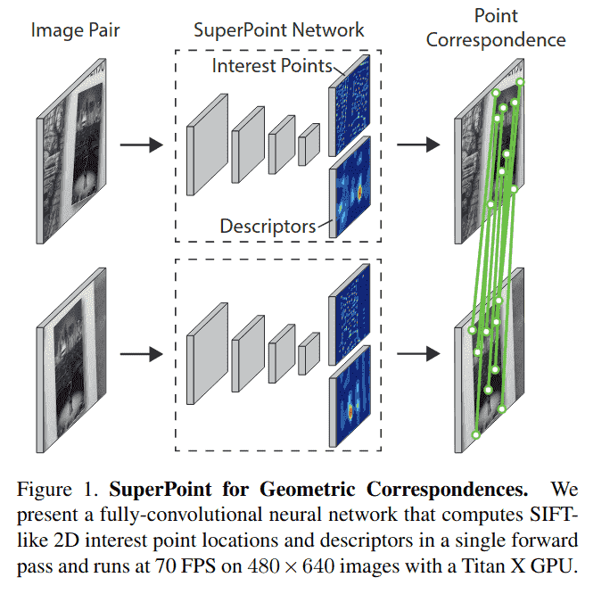

---

## 1. 引言

在同步定位与建图（SLAM）、运动恢复结构（SfM）、相机标定和图像匹配等几何计算机视觉任务中，第一步是从图像中提取兴趣点。兴趣点是图像中的 2D 位置，在不同光照条件和视角下具有稳定性和可重复性。多视图几何这一数学与计算机视觉子领域包含的定理和算法基于一个假设：兴趣点可以在图像间可靠地提取和匹配。然而，大多数现实世界计算机视觉系统的输入是原始图像，而非理想化的点位置。

卷积神经网络在几乎所有需要图像输入的任务中已被证明优于手工设计的表示。特别是，预测 2D“关键点”或“标志点”的全卷积神经网络已在人体姿态估计、目标检测和房间布局估计等多种任务中得到深入研究。这些技术的核心是由人工标注者标记的大量 2D 真实位置数据。

很自然地，可以将兴趣点检测类似地表述为大规模监督机器学习问题，并训练最新的卷积神经网络架构来检测它们。不幸的是，与语义任务（如人体关键点估计，其中网络被训练检测嘴角或左脚踝等身体部位）相比，兴趣点检测的概念在语义上是模糊的。因此，使用兴趣点的强监督训练卷积神经网络并非易事。

我们提出了一种使用自训练的自监督解决方案，而不是使用人工监督来定义真实图像中的兴趣点。在我们的方法中，我们创建了一个大规模的真实图像伪真实兴趣点位置数据集，由兴趣点检测器自身而非大规模人工标注工作进行监督。

为生成伪真实兴趣点，我们首先在一个包含数百万样本的合成数据集上训练一个全卷积神经网络，该数据集名为 Synthetic Shapes（见图 2a）。合成数据集由简单的几何形状组成，其兴趣点位置没有歧义。我们将训练得到的检测器称为 MagicPoint——它在合成数据集上显著优于传统兴趣点检测器（见第 4 节）。尽管存在领域适应困难，MagicPoint 在真实图像上表现惊人地好。然而，与在多样图像纹理和模式上的经典兴趣点检测器相比，MagicPoint 遗漏了许多潜在的兴趣点位置。为弥补在真实图像上的性能差距，我们开发了一种多尺度、多变换技术——单应性适应。

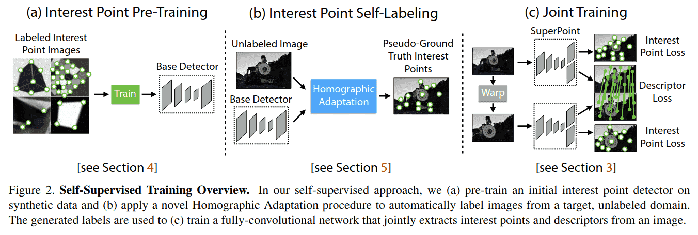

单应性适应旨在实现兴趣点检测器的自监督训练。它多次扭曲输入图像，帮助兴趣点检测器从多个不同视角和尺度观察场景（见第 5 节）。我们将单应性适应与 MagicPoint 检测器结合使用，以提升检测器性能并生成伪真实兴趣点（见图 2b）。得到的检测结果更具可重复性，并对更广泛的刺激产生响应；因此我们将得到的检测器命名为 SuperPoint。

检测到鲁棒且可重复的兴趣点后，最常见的步骤是为每个点附加一个固定维度的描述符向量，用于更高层次的语义任务，例如图像匹配。因此，我们最后将 SuperPoint 与一个描述符子网络结合（见图 2c）。由于 SuperPoint 架构由提取多尺度特征的深度卷积层堆叠而成，可以轻松地将兴趣点网络与计算兴趣点描述符的附加子网络结合（见第 3 节）。最终系统如图 1 所示。

---

## 2. 相关工作

传统兴趣点检测器已被全面评估。FAST 角点检测器是第一个将高速角点检测转化为机器学习问题的系统，而尺度不变特征变换（SIFT）可能仍是计算机视觉中最著名的传统局部特征描述符。

我们的 SuperPoint 架构受到深度学习在兴趣点检测和描述符学习方面最新进展的启发。在匹配图像子结构的能力上，我们与 UCN 相似，在较小程度上与 DeepDesc 相似；但两者都不执行兴趣点检测。另一方面，LIFT 是最近引入的 SIFT 卷积替代方案，它接近传统的基于图像块的“先检测后描述”流程。LIFT 流程包含兴趣点检测、方向估计和描述符计算，但还需要传统 SfM 系统的监督。这些差异总结在表 1 中。

**表 1. 与相关方法的定性比较**  
我们的 SuperPoint 方法是唯一在单个网络中实时计算兴趣点和描述符的方法。

| 方法             | 兴趣点? | 描述符? | 全图像输入? | 单网络? | 实时? |
|------------------|---------|---------|-------------|---------|-------|
| SuperPoint (ours)| √       | √       | √           | √       | √     |
| LIFT [32]        | √       | √       |             |         |       |
| UCN [3]          |         | √       | √           | √       |       |
| DeepDesc [6]     |         | √       |             |         |       |
| SIFT             | √       | √       |             |         |       |
| ORB              | √       | √       |             |         | √     |

在监督谱的另一端，Quad-Networks 从无监督方法处理兴趣点检测问题；然而，他们的系统是基于图像块的（输入是小图像块）且是相对较浅的 2 层网络。TILDE 兴趣点检测系统使用了与单应性适应类似的原理；但他们的方法未能受益于大型全卷积神经网络的能力。

我们的方法也可与其他自监督方法、合成到真实领域适应方法进行比较。与单应性适应类似的方法是 Honari 等人提出的“等变标志点变换”。此外，几何匹配网络和深度图像单应性估计使用类似的自监督策略创建用于估计全局变换的训练数据。然而，这些方法缺乏兴趣点和点对应关系，而这通常是执行 SLAM 和 SfM 等高级计算机视觉任务所必需的。联合姿态和深度估计模型也存在，但不使用兴趣点。

---

## 3. SuperPoint 架构

我们设计了一个名为 SuperPoint 的全卷积神经网络架构，该架构在全尺寸图像上运行，并在单次前向传播中产生兴趣点检测结果及固定长度描述符（见图 3）。该模型具有一个共享编码器来处理和降低输入图像维度。编码器之后，架构分成两个解码器“头”，分别学习任务特定的权重——一个用于兴趣点检测，另一个用于兴趣点描述。网络的大部分参数在两个任务之间共享，这与传统系统不同，传统系统先检测兴趣点再计算描述符，缺乏跨任务共享计算和表示的能力。

### 3.1. 共享编码器

我们的 SuperPoint 架构使用 VGG 风格的编码器来降低图像维度。编码器由卷积层、通过池化进行的空间下采样以及非线性激活函数组成。我们的编码器使用三个最大池化层，使得对于大小为 H×W 的图像，我们可以定义 Hc = H/8 和 Wc = W/8。我们将低维输出中的像素称为“单元”，其中编码器中的三个 2×2 非重叠最大池化操作导致 8x8 像素的单元。编码器将输入图像 I ∈ R^(H×W) 映射到中间张量 B ∈ R^(Hc×Wc×F)，该张量具有更小的空间维度和更大的通道深度（即 Hc < H, Wc < W 且 F > 1）。

### 3.2. 兴趣点解码器

对于兴趣点检测，输出的每个像素对应于输入中该像素的“点性”概率。密集预测的标准网络设计涉及编码器-解码器对，其中空间分辨率通过池化或步进卷积降低，然后通过上卷积操作（如 SegNet 中所做）上采样回全分辨率。不幸的是，上采样层往往会增加大量计算并可能引入不需要的棋盘伪影，因此我们设计了一个带有显式解码器的兴趣点检测头，以减少模型的计算量。

兴趣点检测器头计算 X ∈ R^(Hc×Wc×65) 并输出大小为 R^(H×W) 的张量。65 个通道对应于局部、非重叠的 8×8 像素网格区域加上一个额外的“无兴趣点”垃圾箱。在通道方向 softmax 之后，移除垃圾箱维度，并执行 R^(Hc×Wc×64) ⇒ R^(H×W) 的重塑。

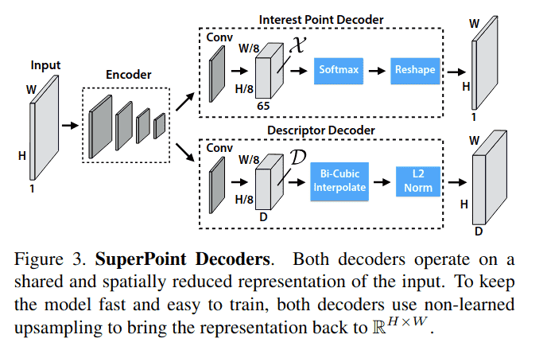

### 3.3. 描述符解码器

描述符头计算 D ∈ R^(Hc×Wc×D) 并输出大小为 R^(H×W×D) 的张量。为了输出 L2 归一化固定长度描述符的密集映射，我们使用类似于 UCN 的模型，首先输出半密集的描述符网格（例如，每 8 个像素一个）。半密集而非密集地学习描述符减少了训练内存并保持运行时可控。然后解码器对描述符执行双三次插值，然后对激活进行 L2 归一化使其成为单位长度。这个固定的、非学习的描述符解码器如图 3 所示。

### 3.4. 损失函数

最终损失是两个中间损失的总和：一个用于兴趣点检测器 Lp，一个用于描述符 Ld。我们使用合成扭曲的图像对，这些图像既有 (a) 伪真实兴趣点位置，也有 (b) 来自随机生成的联系两幅图像的单应性 H 的真实对应关系。这使我们能够同时优化两个损失，给定一对图像，如图 2c 所示。我们使用 λ 来平衡最终损失：

\[ \mathcal{L}(\mathcal{X},\mathcal{X}^{\prime},\mathcal{D},\mathcal{D}^{\prime};Y,Y^{\prime},S) = \mathcal{L}_{p}(\mathcal{X},Y) + \mathcal{L}_{p}(\mathcal{X}^{\prime},Y^{\prime}) + \lambda\mathcal{L}_{d}(\mathcal{D},\mathcal{D}^{\prime},S) \quad (1) \]

兴趣点检测器损失函数 Lp 是单元 x_hw ∈ X 上的全卷积交叉熵损失。我们将相应的真实兴趣点标签集称为 Y，单个条目为 y_hw。损失为：

\[ \mathcal{L}_{p}(\mathcal{X},Y) = \frac{1}{H_{c}W_{c}} \sum_{h=1}^{H_{c}} \sum_{w=1}^{W_{c}} l_{p}(x_{hw}; y_{hw}) \quad (2) \]

其中

\[ l_{p}(x_{hw}; y) = -\log \left( \frac{\exp(x_{hwy})}{\sum_{k=1}^{65} \exp(x_{hwk})} \right) \quad (3) \]

描述符损失应用于所有描述符单元对，d_hw ∈ D 来自第一幅图像，d'_{h'w'} ∈ D' 来自第二幅图像。由单应性引起的 (h, w) 单元与 (h', w') 单元之间的对应关系可以写成：

\[ s_{hwh'w'} = \begin{cases} 1, & \text{if } \|\widehat{\mathcal{H} p_{hw}} - p_{h'w'}\| \leq 8 \\ 0, & \text{otherwise} \end{cases} \quad (4) \]

其中 p_hw 表示 (h, w) 单元中心像素的位置，\widehat{\mathcal{H} p_{hw}} 表示将单元位置 p_hw 乘以单应性 H 并除以最后一个坐标，正如在欧几里得坐标和齐次坐标之间转换时通常所做的那样。我们用 S 表示一对图像的整个对应关系集。

我们还添加了一个加权项 λ_d 来帮助平衡正对应关系少于负对应关系的事实。我们使用具有正边界 m_p 和负边界 m_n 的合页损失。描述符损失定义为：

\[ \mathcal{L}_{d}(\mathcal{D},\mathcal{D}^{\prime},S) = \frac{1}{(H_{c}W_{c})^{2}} \sum_{h=1}^{H_{c}} \sum_{w=1}^{W_{c}} \sum_{h'=1}^{H_{c}} \sum_{w'=1}^{W_{c}} l_{d}(d_{hw}, d_{h'w'}^{\prime}; s_{hwh'w'}) \quad (5) \]

其中

\[ l_{d}(d, d'; s) = \lambda_{d} \cdot s \cdot \max(0, m_{p} - d^{T}d') + (1-s) \cdot \max(0, d^{T}d' - m_{n}) \quad (6) \]

---

## 4. 合成预训练

在本节中，我们描述了训练基础检测器（称为 MagicPoint，如图 2a 所示）的方法，该检测器与单应性适应结合使用，以自监督方式为未标注图像生成伪真实兴趣点标签。

### 4.1. 合成形状

目前不存在大规模的兴趣点标注图像数据库。因此，为了引导我们的深度兴趣点检测器，我们首先创建了一个名为 Synthetic Shapes 的大规模合成数据集，该数据集通过合成数据渲染四边形、三角形、直线和椭圆来简化 2D 几何。这些形状的示例如图 4 所示。在该数据集中，我们能够通过简单的 Y 型连接点、L 型连接点、T 型连接点以及微小椭圆的中心和线段的端点来模拟兴趣点，从而消除标签歧义。

合成图像渲染后，我们对每个图像应用单应性扭曲以增加训练样本数量。数据是动态生成的，网络不会两次看到同一个样本。虽然 Synthetic Shapes 中表示的兴趣点类型仅代表现实世界中所有潜在兴趣点的一个子集，但我们发现它在实践中用于训练兴趣点检测器效果相当好。

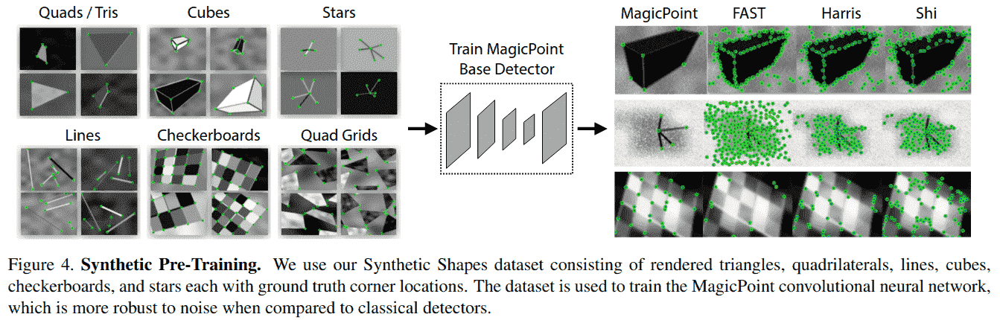

### 4.2. MagicPoint

我们使用 SuperPoint 架构的检测器路径（忽略描述符头）并在 Synthetic Shapes 上对其进行训练。我们将得到的模型称为 MagicPoint。

有趣的是，当我们在 Synthetic Shapes 数据集上评估 MagicPoint 与其他传统角点检测方法（如 FAST、Harris 角点和 Shi-Tomasi 的“良好特征跟踪”）时，我们发现我们的性能优势巨大。我们在 Synthetic Shapes 数据集的 1000 张保留图像上测量平均精度（mAP），并在表 2 中报告结果。经典检测器在存在成像噪声时表现挣扎——图 4 显示了这方面的定性示例。更详细的实验可在附录 B 中找到。

**表 2. Synthetic Shapes 检测器性能**  
MagicPoint 模型在检测简单几何形状的角点方面优于经典检测器，并且对添加的噪声具有鲁棒性。

|              | MagicPoint | FAST  | Harris | Shi   |
|--------------|------------|-------|--------|-------|
| mAP 无噪声   | 0.979      | 0.405 | 0.678  | 0.686 |
| mAP 有噪声   | 0.971      | 0.061 | 0.213  | 0.157 |

MagicPoint 检测器在 Synthetic Shapes 上表现非常好，但它能推广到真实图像吗？总结我们在第 7.2 节稍后呈现的结果，答案是肯定的，但没有我们希望的那么好。我们惊讶地发现 MagicPoint 在现实世界图像上表现相当好，特别是在具有强角点状结构的场景上，如桌子、椅子和窗户。不幸的是，在所有自然图像的空间中，与视角变化下的可重复性相比，它的表现不如相同的经典检测器。这促使我们提出了用于在真实世界图像上训练的自监督方法，我们称之为单应性适应。

---

## 5. 单应性适应

我们的系统从基础兴趣点检测器和来自目标领域（例如 MS-COCO）的大量未标注图像集自举。在自监督范式（也称为自训练）下操作，我们首先生成目标领域中每个图像的伪真实兴趣点位置集，然后使用传统的监督学习机制。我们方法的核心是一个过程，该过程将随机单应性应用于输入图像的扭曲副本并组合结果——这个过程我们称之为单应性适应（见图 5）。

### 5.1. 公式化

单应性对于仅围绕相机中心旋转、场景中物体距离较远以及平面场景的相机运动，给出了精确或几乎精确的图像到图像变换。此外，由于世界大部分是合理平面的，单应性是描述从不同视角观察同一 3D 点时发生情况的良好模型。因为单应性不需要 3D 信息，它们可以被随机采样并轻松应用于任何 2D 图像——仅涉及双线性插值。由于这些原因，单应性是我们自监督方法的核心。

令 f_θ(·) 表示我们希望适应的初始兴趣点函数，I 是输入图像，x 是得到的兴趣点，H 是随机单应性，使得：

\[ x = f_{\theta}(I) \quad (7) \]

理想的兴趣点算子应该关于单应性具有协变性。函数 f_θ(·) 关于 H 是协变的，如果输出随输入变换。换句话说，协变检测器将满足，对于所有 H：

\[ \mathcal{H}x = f_{\theta}(\mathcal{H}(I)) \quad (8) \]

将单应性相关项移到右边，我们得到：

\[ x = \mathcal{H}^{-1} f_{\theta}(\mathcal{H}(I)) \quad (9) \]

在实践中，检测器不会完全协变——公式 9 中不同的单应性将导致不同的兴趣点 x。单应性适应背后的基本思想是对足够大的随机 H 样本进行经验求和（见图 5）。因此，对样本的聚合产生了一个新的改进的超级点检测器 F̂(·)：

\[ \hat{F}(I; f_{\theta}) = \frac{1}{N_{h}} \sum_{i=1}^{N_{h}} \mathcal{H}_{i}^{-1} f_{\theta}(\mathcal{H}_{i}(I)) \quad (10) \]

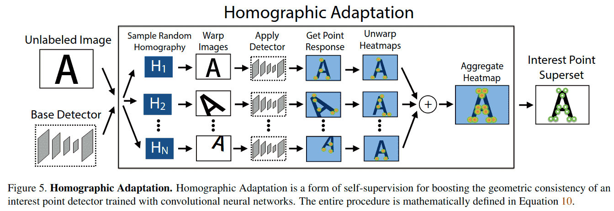

### 5.2. 选择单应性

并非所有 3x3 矩阵都是单应性适应的良好选择。为了采样能代表合理相机变换的良好单应性，我们将潜在的单应性分解为更简单、表达能力较低的变换类。我们使用截断正态分布在预定范围内采样平移、尺度、平面内旋转和对称透视畸变。这些变换与初始的根部中心裁剪组合在一起，以帮助避免边界伪影。此过程如图 6 所示。

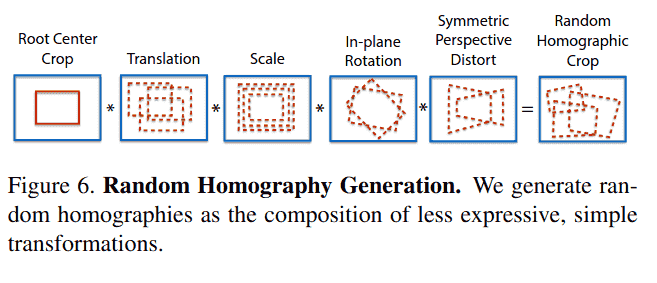

当对图像应用单应性适应时，我们使用输入图像的大量单应性扭曲的平均响应。单应性扭曲的数量 N_h 是我们方法的一个超参数。我们通常强制第一个单应性等于恒等变换，因此在我们实验中 N_h = 1 对应于不进行适应。我们进行了一个实验来确定 N_h 的最佳值，将 N_h 的范围从小 N_h=10，到中 N_h=100，再到大 N_h=1000 进行变化。我们的实验表明，执行超过 100 次单应性变换的回报是递减的。在 MS-COCO 的保留图像集上，我们在不进行任何单应性适应时获得可重复性得分 0.67，执行 N_h=100 次变换时可重复性提升 21%，当 N_h=1000 时可重复性提升 22%，因此使用超过 100 次单应性的附加益处很小。关于此实验的更详细分析和讨论见附录 C。

### 5.3. 迭代单应性适应

我们在训练时应用单应性适应技术，以提高基础 MagicPoint 架构在真实图像上的泛化能力。该过程可以迭代重复，以持续自监督和改进兴趣点检测器。在我们所有的实验中，我们将应用单应性适应后得到的模型称为 SuperPoint，并在图 7 中展示了在 HPatches 图像上的定性进展。

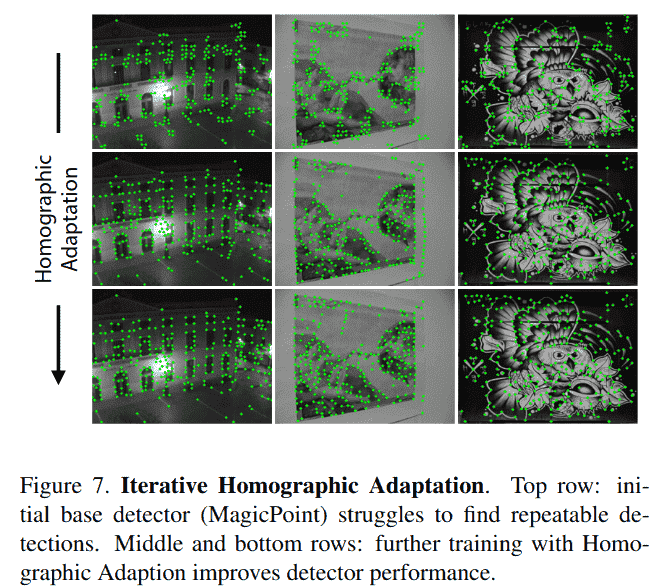

---

## 6. 实验细节

在本节中，我们提供训练 MagicPoint 和 SuperPoint 模型的一些实现细节。该编码器具有类似 VGG 的架构，具有八个 3x3 卷积层，大小为 64-64-64-64-128-128-128-128。每两层有一个 2x2 最大池化层。每个解码器头有一个 256 单元的 3x3 卷积层，后跟一个 1x1 卷积层，分别具有 65 个单元（兴趣点检测器）和 256 个单元（描述符）。网络中的所有卷积层后都跟随 ReLU 非线性激活和 BatchNorm 归一化。

为了训练全卷积 SuperPoint 模型，我们从一个在 Synthetic Shapes 上训练的基础 MagicPoint 模型开始。MagicPoint 架构是 SuperPoint 架构减去描述符头。MagicPoint 模型在合成数据上训练了 200,000 次迭代。由于合成数据简单且渲染快速，数据是动态渲染的，因此网络不会两次看到同一个样本。

我们使用 MS-COCO 2014 训练数据集分割（包含 80,000 张图像）和 MagicPoint 基础检测器生成伪真实标签。图像大小调整为 240x320 分辨率并转换为灰度。标签使用 N_h=100 的单应性适应生成，这由我们在第 5.2 节的结果所推动。我们重复第二次单应性适应，使用第一次单应性适应训练得到的模型。

SuperPoint 的联合训练也在 240x320 灰度 COCO 图像上进行。对于每个训练样本，随机采样一个单应性。它从比单应性适应期间更受限的单应性集合中采样，以更好地模拟成对匹配的目标应用（例如，我们避免采样极端的平面内旋转，因为它们在 HPatches 中很少见）。图像和相应的伪真实通过单应性变换以创建所需的输入和标签。所有实验中使用的描述符大小为 D=256。我们使用加权项 λ_d=250 来保持描述符学习的平衡。描述符合页损失使用正边界 m_p=1 和负边界 m_n=0.2。我们使用因子 λ=0.0001 来平衡两个损失。

所有训练均使用 PyTorch 完成，小批量大小为 32，使用 ADAM 求解器，默认参数为 lr=0.001 和 β=(0.9,0.999)。我们还使用标准数据增强技术，如随机高斯噪声、运动模糊、亮度水平变化，以提高网络对光照和视角变化的鲁棒性。

---

## 7. 实验

在本节中，我们展示了论文中提出的方法的定量结果。兴趣点和描述符的评估是一个经过充分研究的主题，因此我们遵循 Mikolajczyk 等人的评估协议。关于我们评估指标的更多细节，见附录 A。

### 7.1. 系统运行时

我们使用 Titan X GPU 和 Caffe 深度学习库附带的计时工具测量 SuperPoint 架构的运行时间。模型的一次前向传播在 480x640 的输入上大约需要 11.15 毫秒，这会产生点检测位置和半密集描述符映射。为了从半密集描述符中采样更高 480x640 分辨率的描述符，不需要创建整个密集描述符映射——我们可以仅从 1000 个检测到的位置采样，这在双三次插值和 L2 归一化的 CPU 实现上大约需要 1.5 毫秒。因此，我们估计系统在 GPU 上的总运行时间约为 13 毫秒或 70 FPS。

### 7.2. HPatches 可重复性

在我们的实验中，我们在 MS-COCO 图像上训练 SuperPoint，并使用 HPatches 数据集进行评估。HPatches 包含 116 个场景，有 696 个独特图像。前 57 个场景表现出大的光照变化，其他 59 个场景有大的视角变化。

为了评估 SuperPoint 模型的兴趣点检测能力，我们测量了 HPatches 数据集上的可重复性。我们将其与 MagicPoint 模型（单应性适应之前）以及使用 OpenCV 实现的 FAST、Harris 和 Shi 进行比较。可重复性在 240x320 分辨率下计算，每张图像检测 300 个点。我们还改变了应用于检测的非极大值抑制（NMS）。我们使用正确距离 ε=3像素。应用更大程度的 NMS 有助于确保点在图像中均匀分布，这对于某些应用（如 ORB-SLAM）很有用，其中在粗网格的每个单元中强制检测最少数量的 FAST 角点。

**表 3. HPatches 检测器可重复性**
SuperPoint 在光照变化下具有最高的可重复性，在视角变化下具有竞争力，并且在所有场景中都优于 MagicPoint。

| 方法        | 57个光照场景 (NMS=4) | 57个光照场景 (NMS=8) | 59个视角场景 (NMS=4) | 59个视角场景 (NMS=8) |
|-------------|----------------------|----------------------|----------------------|----------------------|
| SuperPoint  | .652                 | .631                 | .503                 | .484                 |
| MagicPoint  | .575                 | .507                 | .322                 | .260                 |
| FAST        | .575                 | .472                 | .503                 | .404                 |
| Harris      | .620                 | .533                 | .556                 | .461                 |
| Shi         | .606                 | .511                 | .552                 | .453                 |
| Random      | .101                 | .103                 | .100                 | .104                 |

总之，用于将 MagicPoint 转换为 SuperPoint 的单应性适应技术显著提高了可重复性，特别是在大的视角变化下。结果如表 3 所示。SuperPoint 模型在光照变化下优于经典检测器，在视角变化下与经典检测器表现相当。

### 7.3. HPatches 单应性估计

为了评估 SuperPoint 兴趣点检测器和描述符网络的性能，我们比较了在 HPatches 数据集上的匹配能力。我们将 SuperPoint 与三个著名的检测器和描述符系统进行比较：LIFT、SIFT 和 ORB。对于 LIFT，我们使用作者提供的预训练模型（Picadilly）。对于 SIFT 和 ORB，我们使用默认的 OpenCV 实现。我们使用正确距离 ε=3 像素来计算 Rep、MLE、NN mAP 和 MScore。我们在 480x640 分辨率下为所有系统计算最多 1000 个点，并为每个图像对计算多个指标。为了估计单应性，我们执行从第一幅图像中检测到的所有兴趣点+描述符到第二幅图像中所有兴趣点+描述符的最近邻匹配。我们使用 OpenCV 实现（带 RANSAC 的 findHomography()）和所有匹配来计算最终的单应性估计。

单应性估计结果如表 4 所示。在 HPatches 上使用各种 ε 正确性阈值进行单应性估计时，SuperPoint 优于 LIFT 和 ORB，并与 SIFT 表现相当。SuperPoint 与 LIFT、SIFT 和 ORB 的定性示例如图 8 所示。请参阅附录 D 以获取更多单应性估计示例对。SuperPoint 倾向于产生更多正确的匹配，这些匹配密集地覆盖图像，并且在应对光照变化时特别有效。

**表 4. HPatches 单应性估计**
SuperPoint 在使用各种 ε 正确性阈值进行单应性估计时优于 LIFT 和 ORB，并与 SIFT 表现相当。我们还报告了分别测量检测器和描述符性能的相关指标。

| 方法        | ε=1  | ε=3  | ε=5  | Rep. | MLE  | NN mAP | M. Score |
|-------------|------|------|------|------|------|--------|----------|
| SuperPoint  | .310 | .684 | .829 | .581 | 1.158 | .821   | .470     |
| LIFT        | .284 | .598 | .717 | .449 | 1.102 | .664   | .315     |
| SIFT        | .424 | .676 | .759 | .495 | 0.833 | .694   | .313     |
| ORB         | .150 | .395 | .538 | .641 | 1.157 | .735   | .266     |

在定量上，我们在几乎所有指标上都优于 LIFT。LIFT 在大多数指标上也逊于 SIFT。这可能是因为 HPatches 包含室内序列，而 LIFT 仅在单个室外序列上训练。我们的方法在数十万个扭曲的 MS-COCO 图像上训练，这些图像表现出更大的多样性，并且更接近 HPatches 中的多样性。

SIFT 在亚像素精度单应性（ε=1）方面表现良好，并且具有最低的平均定位误差（MLE）。这很可能是因为 SIFT 执行额外的亚像素定位，而其他方法不执行此步骤。

ORB 实现了最高的可重复性（Rep.）；然而，其检测点倾向于在整个图像中形成稀疏的簇，如图 8 所示，因此在最终的单应性估计任务上得分较差。这表明仅优化可重复性并不会在流程的更上游导致更好的匹配或估计。

SuperPoint 在描述符聚焦的指标上得分很高，例如最近邻 mAP（NN mAP）和匹配分数（M. Score），这证实了 Choy 等人和 Yi 等人的发现，即用于描述符匹配的学习表示优于手工调整的表示。

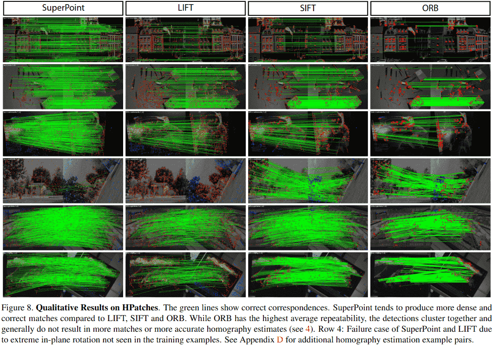

## 8. 结论

我们提出了一种全卷积神经网络架构，用于兴趣点检测和描述，该架构使用称为单应性适应的自监督领域适应框架进行训练。我们的实验证明：(1) 可以将知识从合成数据集迁移到真实世界图像上，(2) 稀疏兴趣点检测和描述可以转化为单一、高效的卷积神经网络，以及 (3) 所得系统在几何计算机视觉匹配任务（如单应性估计）中表现良好。

未来的工作将研究单应性适应是否可以提高语义分割（例如 SegNet）和目标检测（例如 SSD）等模型的性能。它还将仔细研究兴趣点检测和描述（以及可能其他任务）相互受益的方式。

最后，我们相信我们的 SuperPoint 网络可用于解决 3D 计算机视觉问题（如 SLAM 和 SfM）中的所有视觉数据关联问题，并且基于学习的视觉 SLAM 前端将为机器人和增强现实带来更鲁棒的应用。

<!-- ---

## 参考文献

[1] V. Badrinarayanan, A. Kendall, and R. Cipolla. SegNet: A deep convolutional encoder-decoder architecture for image segmentation. PAMI, 2017.
[2] V. Balntas, K. Lenc, A. Vedaldi, and K. Mikolajczyk. HPatches: A benchmark and evaluation of handcrafted and learned local descriptors. In CVPR, 2017.
[3] C.B. Choy, J. Gwak, S. Savarese, and M. Chandraker. Universal Correspondence Network. In NIPS. 2016.
... (参考文献列表继续，此处省略部分条目以节省空间)

--- -->

## 附录

### A. 评估指标

在本节中，我们提供评估所用指标的更多细节。在我们的实验中，我们遵循 [16] 的协议，但有一个例外。由于我们的全卷积模型不使用局部图像块，我们改为通过测量 2D 检测中心之间的距离来比较检测距离，而不是测量图像块重叠。对于 SIFT 和 ORB 等多尺度方法，我们在最高分辨率尺度上比较距离。

**角点检测平均精度**：我们计算精确率-召回率曲线及相应的曲线下面积（也称为平均精度），正确检测的像素定位误差，以及可重复率。对于角点检测，我们使用阈值 ε 来确定返回的点位置 x 相对于一组 K 个真实角点 {x̂₁, ..., x̂_K} 是否正确。我们定义正确性如下：

\[ \operatorname{Corr}(x) = \left( \min_{j} \| x - \hat{x}_{j} \| \right) \leq \varepsilon \]

通过改变检测置信度来创建精确率-召回率曲线，并用单个数字（即平均精度，范围从 0 到 1）进行总结，AP 越大越好。

**定位误差**：为了补充 AP 分析，我们计算角点定位误差，但仅针对正确检测。我们将定位误差定义如下：

\[ LE = \frac{1}{N} \sum_{i: \operatorname{Corr}(x_i)} \min_{j \in \{1, \ldots, K\}} \left\| x_i - \hat{x}_{j} \right\| \quad (12) \]

定位误差介于 0 和 ε 之间，LE 越低越好。

**可重复性**：我们计算一对图像上兴趣点检测器的可重复率。由于 SuperPoint 架构是全卷积的，不依赖于图像块提取，我们无法计算图像块重叠，而是通过测量提取的 2D 点中心之间的距离来计算可重复性。我们使用 ε 表示两个点之间的正确距离阈值。更具体地说，假设第一幅图像中有 N₁ 个点，第二幅图像中有 N₂ 个点。我们为可重复性实验定义正确性如下：

\[ \operatorname{Corr}(x_i) = \left( \min_{j \in \{1, \ldots, N_2\}} \left\| x_i - \hat{x}_{j} \right\| \right) \leq \varepsilon \quad (13) \]

可重复性简单地衡量一个点在第二幅图像中被检测到的概率。

\[ \operatorname{Rep} = \frac{1}{N_1 + N_2} \left( \sum_{i} \operatorname{Corr}(x_i) + \sum_{j} \operatorname{Corr}(x_j) \right) \quad (14) \]

**最近邻平均精度**：该指标通过在多描述符距离阈值下评估来描述描述符的区分能力。它通过使用最近邻匹配策略测量精确率-召回率曲线的曲线下面积（AUC）来计算。该指标在图像对之间对称计算并取平均值。

**匹配分数**：该指标衡量兴趣点检测器和描述符组合的整体性能。它衡量整个流程在共享视点区域内可以恢复的真实对应关系数量与流程提出的特征数量之比。该指标在区域内对称计算。该指标在图像对之间对称计算并取平均值。

**单应性估计**：我们通过比较估计的单应性 Ĥ 与真实单应性 H 来衡量算法估计关联图像对的单应性的能力。直接比较 3×3 的 H 矩阵并不简单，因为矩阵中的不同条目具有不同的尺度。相反，我们比较单应性将一幅图像的四个角点变换到另一幅图像上的效果如何。我们将第一幅图像的四个角点定义为 c₁, c₂, c₃, c₄。然后我们应用真实 H 得到第二幅图像中的真实角点 c'₁, c'₂, c'₃, c'₄，并应用估计的单应性 Ĥ 得到 ĉ'₁, ĉ'₂, ĉ'₃, ĉ'₄。我们使用阈值 ε 表示正确的单应性。

\[ \operatorname{CorrH} = \frac{1}{N} \sum_{i=1}^{N} \left( \left( \frac{1}{4} \sum_{j=1}^{4} \left\| c'_{ij} - \hat{c}_{ij}' \right\| \right) \leq \varepsilon \right) \quad (15) \]

分数在 0 到 1 之间，越高越好。

### B. 额外的合成形状实验

我们展示了 SuperPoint 兴趣点检测器（忽略描述符头）在 Synthetic Shapes 数据集上训练和评估的完整结果。我们将此检测器称为 MagicPoint。数据包含简单的合成几何形状，人类可以轻松标记其真实角点位置。我们期望一个好的点检测器能够轻松检测这些场景中的正确角点。事实上，我们惊讶地发现，对于 FAST、Harris 和 Shi-Tomasi "Good Features to Track" 等经典点检测器来说，简单的几何形状竟然如此困难。

我们评估了两个模型：MagicPointL 和 MagicPointS。两个模型共享相同的编码器架构，但每层的神经元数量不同。MagicPointL 和 MagicPointS 分别有 64-64-64-64-128-128-128-128-128 和 9-9-16-16-32-32-32-32-32。

我们使用 Synthetic Shapes 生成器创建了一个评估数据集，以确定我们的检测器能够定位简单角点的能力。有 10 类图像，如图 9 所示。

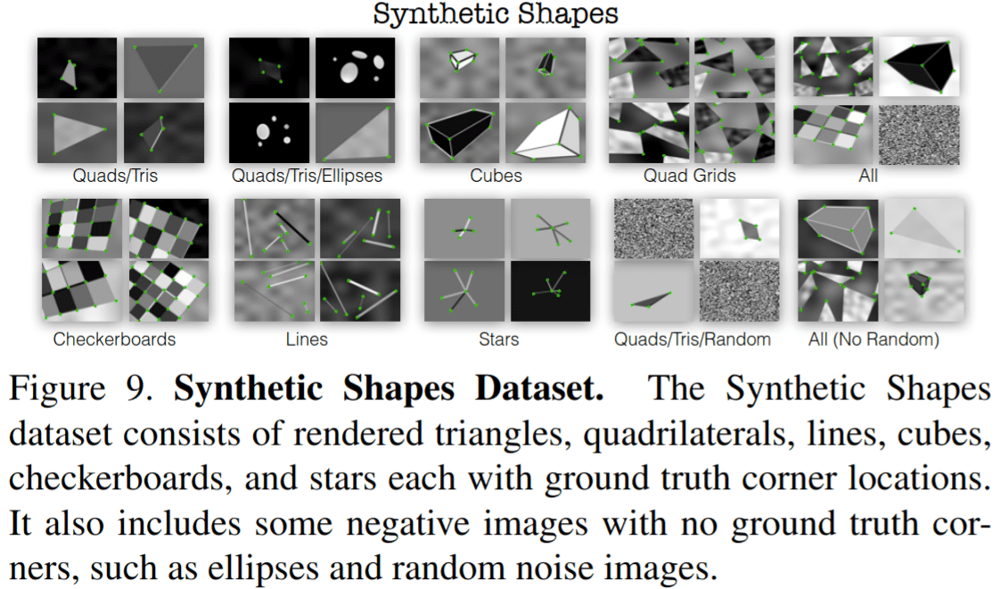

**平均精度和平均定位误差**：对于每个类别，从 Synthetic Shapes 生成器中采样 1000 张图像。我们计算有和无添加图像噪声时的平均精度和定位误差。每个类别的结果摘要如图 10 所示，平均结果如表 5 所示。MagicPoint 检测器在所有类别中都优于经典检测器。在存在噪声的情况下，所有类别的 mAP 都存在显著的性能差距。

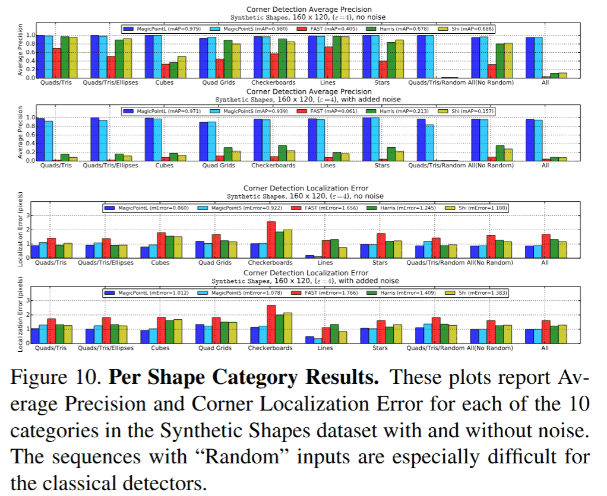

**表 5. Synthetic Shapes 结果表**
报告了 Synthetic Shapes 数据集上 10 类图像的平均精度（mAP，越高越好）和平均定位误差（MLE，越低越好）。注意 MagicPointL 和 MagicPointS 相对不受成像噪声影响。

| 指标   | 噪声  | MagicPointL | MagicPointS | FAST  | Harris | Shi   |
|--------|-------|-------------|-------------|-------|--------|-------|
| mAP    | 无噪声 | 0.979       | 0.980       | 0.405 | 0.678  | 0.686 |
| mAP    | 有噪声 | 0.971       | 0.939       | 0.061 | 0.213  | 0.157 |
| MLE    | 无噪声 | 0.860       | 0.922       | 1.656 | 1.245  | 1.188 |
| MLE    | 有噪声 | 1.012       | 1.078       | 1.766 | 1.409  | 1.383 |

**噪声强度的影响**：接下来我们通过改变噪声强度来更仔细地研究噪声的影响。我们想知道添加到图像中的噪声是否过于极端且对点检测器不合理。为了验证这个假设，我们在干净图像（s=0）和噪声图像（s=1）之间进行线性插值。为了将检测器推向极限，我们还在噪声图像和随机噪声（s=2）之间进行插值。随机噪声图像不包含几何形状，因此所有检测器的 mAP 得分均为 0.0。不同噪声程度的示例和绘图如图 11 所示。

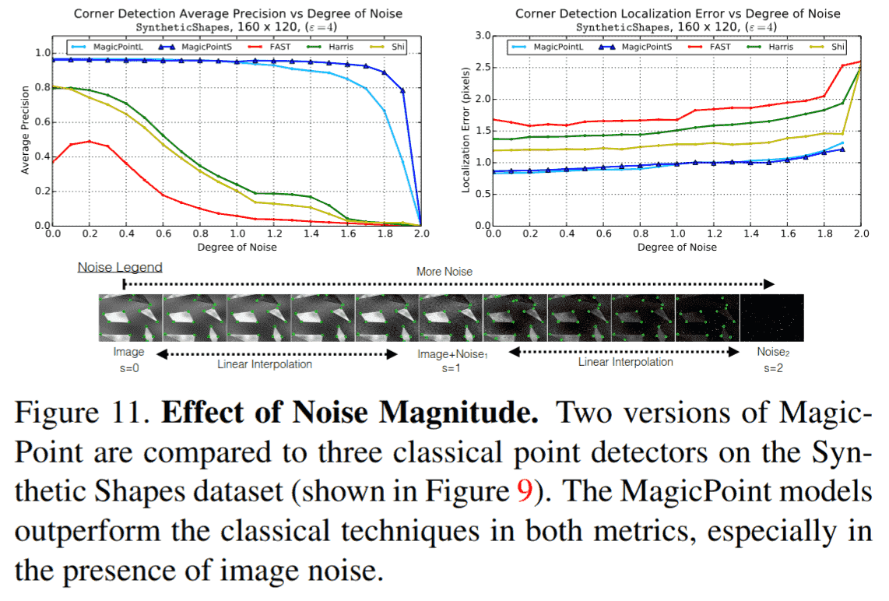

**噪声类型的影响**：我们将噪声分为八类。我们单独研究这些噪声类型的影响，以更好地了解哪种噪声对点检测器的影响最大。散斑噪声对传统检测器尤其困难。结果总结在图 12 中。

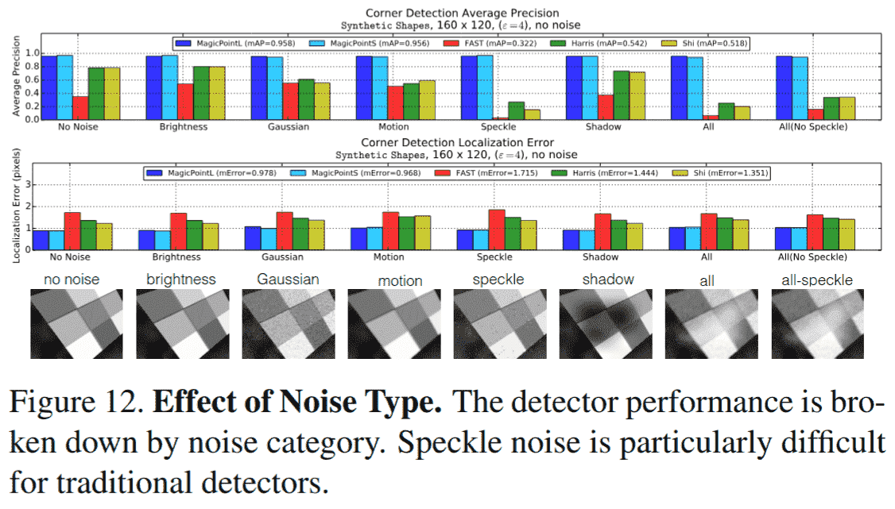

**斑点检测**：我们实验了我们的模型检测斑点和椭圆中心的能力。我们使用 MagicPointL 架构（如上所述）并扩充了 Synthetic Shapes 训练集，除了角点外还包括斑点中心。我们观察到，只要整个形状不是太大，我们的模型就能够检测到此类斑点。然而，为此类"斑点检测"产生的置信度通常低于角点的置信度，这使得将两种检测集成到单个系统中有些麻烦。在论文的主要实验中，我们省略了使用斑点进行训练，除了以下实验。

我们创建了一个 96×96 的黑色正方形在白色背景上的图像序列。我们将正方形的宽度从 3 变化到 91 像素，并报告 MagicPoint 在输出热图中两个特殊像素的置信度：中心像素（斑点位置）和正方形的左上角像素（一个容易检测的角点）。该实验的 MagicPoint 斑点+角点置信度图可以在图 13 中看到。我们观察到，当正方形宽度在 11 到 43 像素之间时（图 13 中的红色区域），我们可以自信地检测斑点的中心，当正方形宽度在 43 到 71 像素之间时（黄色区域）以较低置信度检测，当正方形大于 71 像素时（蓝色区域）无法检测中心斑点。

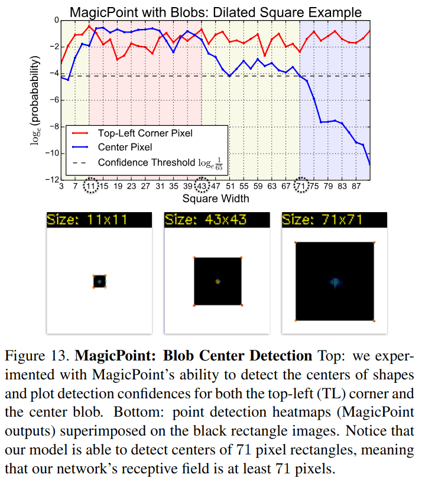

### C. 单应性适应实验

当合并兴趣点响应图时，区分尺度内聚合和跨尺度聚合很重要。真实世界图像通常包含不同尺度的特征，因为在高分辨率图像中被认为有趣的一些点，在更粗糙的低分辨率图像中通常甚至不可见。然而，在单个尺度内，图像的变换（如旋转和平移）不应使兴趣点出现/消失。图像的这种底层多尺度性质对尺度内和跨尺度聚合策略有不同的影响。尺度内聚合应类似于计算集合的交集，而跨尺度聚合应类似于集合的并集。换句话说，我们真正想要的是尺度内的平均响应，而跨尺度的是最大响应。我们还可以使用跨尺度的平均响应作为兴趣点置信度的多尺度度量。跨尺度的平均响应当兴趣点在所有尺度上都可见时最大，这些点很可能是跟踪应用中最鲁棒的兴趣点。

**尺度内聚合**：我们使用输入图像的大量单应性扭曲的平均响应。应谨慎选择随机单应性，因为并非所有单应性都是真实的图像变换。单应性扭曲的数量 N_h 是我们方法的一个超参数。我们通常强制第一个单应性等于恒等变换，因此在我们实验中 N_h=1 对应于不进行单应性变换（或等效地，应用恒等单应性）。我们的实验范围从"小" N_h=10，到"中" N_h=100，和"大" N_h=1000。

**跨尺度聚合**：当跨尺度聚合时，考虑的尺度数量 N_s 是我们方法的一个超参数。设置 N_s=1 对应于无多尺度聚合（或仅聚合最大可能图像尺寸）。对于 N_s>1，我们将被处理的图像的多尺度集合称为"多尺度图像金字塔"。我们考虑对金字塔的不同层级进行加权，给更高分辨率的图像更大的权重。这很重要，因为在较低分辨率下检测到的兴趣点定位能力较差，我们希望最终聚合的点尽可能定位准确。

我们在 MS-COCO 图像的保留测试集上实验了尺度内和跨尺度聚合。结果总结在图 14 中。我们发现尺度内聚合对可重复性的影响最大。

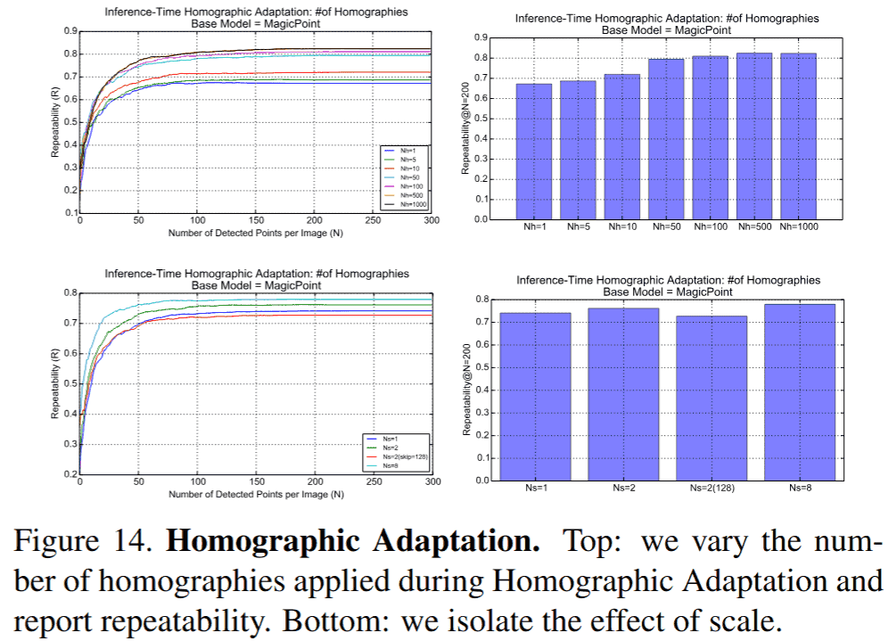

### D. 额外的定性示例

我们在图 15 中展示了 SuperPoint、LIFT、SIFT 和 ORB 在 HPatches 匹配上的额外定性示例。

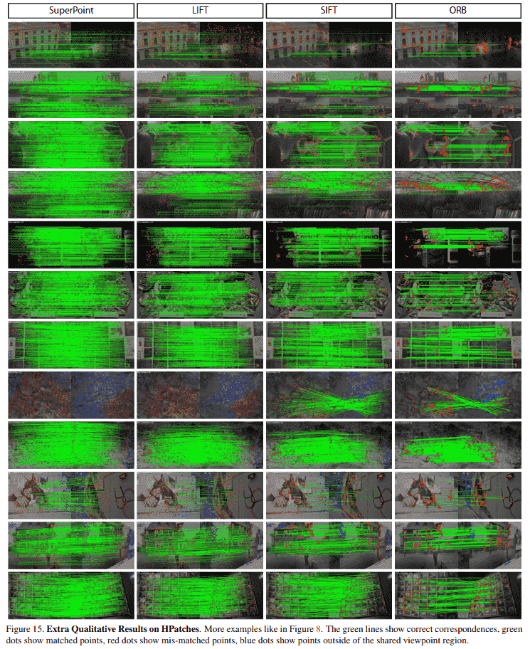