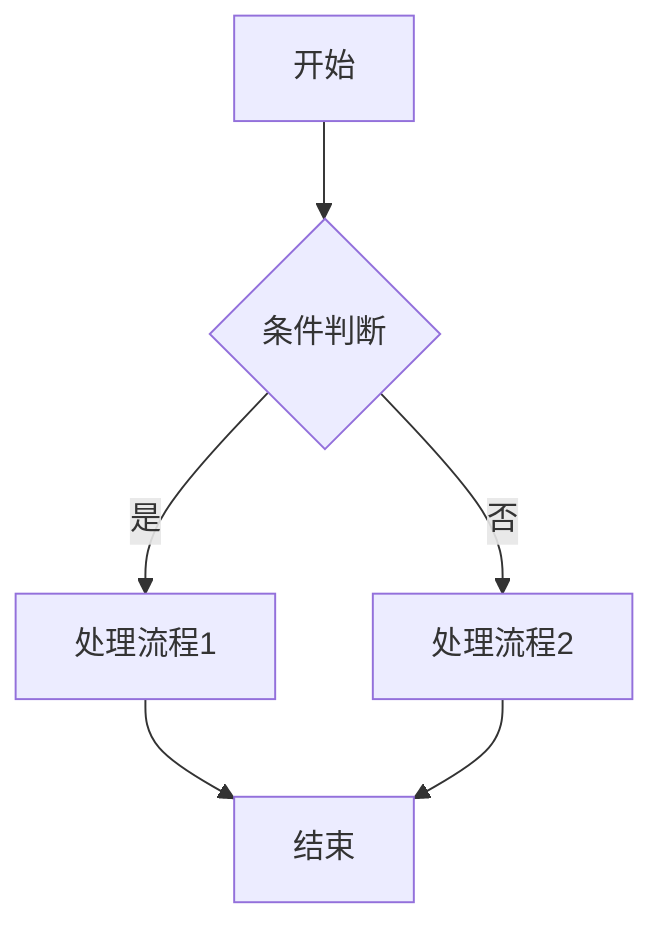
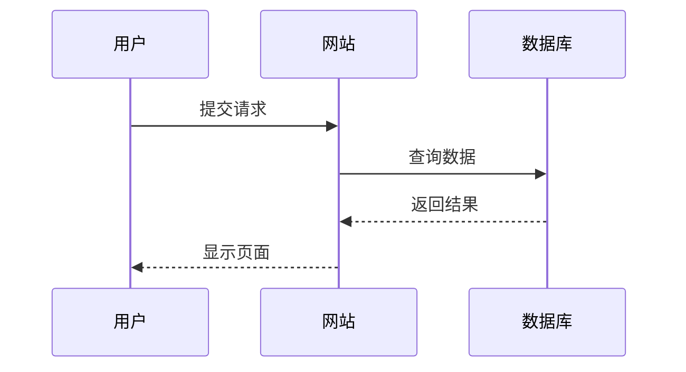
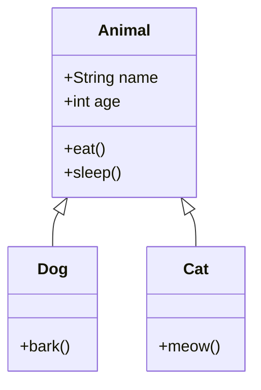
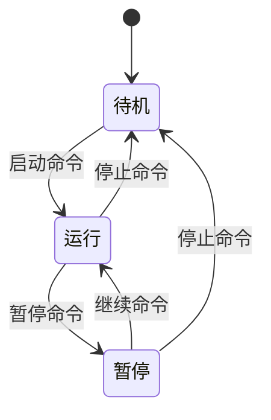
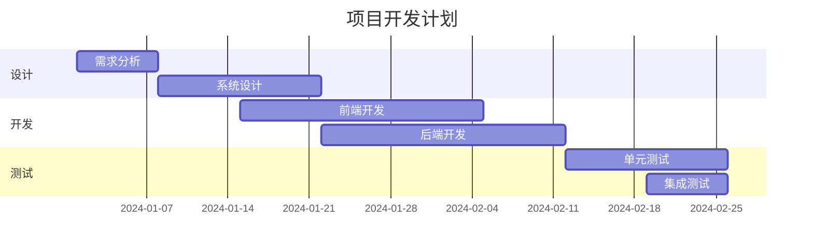
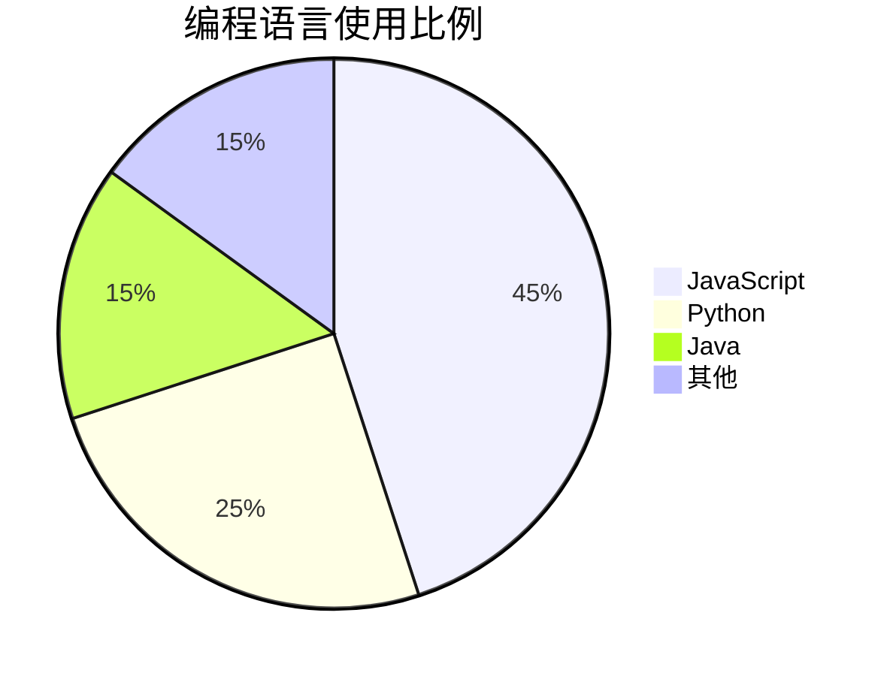

[toc]

# Markdown 渲染测试

测试本博客的Markdown渲染效果。

---

## 1. 标题

# 一级标题
## 二级标题
### 三级标题
#### 四级标题
##### 五级标题
###### 六级标题

---

## 2. 段落与换行

这是第一段。

这是第二段。  
这一行和上一行之间有一个 **硬换行**（在行尾加两个空格）。

---

## 3. 强调

*斜体*  
_斜体（另一种写法）_  
**粗体**  
__粗体（另一种写法）__  
***粗斜体***  
~~删除线~~

---

## 4. 列表

- 无序列表项 A
- 无序列表项 B
  - 嵌套项 1
  - 嵌套项 2

1. 有序列表项 1
2. 有序列表项 2
   1. 子项 2.1
   2. 子项 2.2

- [x] 已完成任务
- [ ] 未完成任务

---

## 5. 引用

> 这是一级引用
>> 这是二级引用
>>> 这是三级引用

---

## 6. 链接与图片

这是一个 [普通链接](https://www.example.com "普通链接") [^1]。

这是一个带标题的链接 [Example](https://www.example.com "示例网站")[^2]。

行内图片示例[^3]：  
 

内部链接示例：  
[跳转到参考文献](#参考文献)

---

## 7.代码测试

### JavaScript代码
```javascript
function hello() {
  console.log("Hello World");
  return true;
}
```

### Python代码
```python
def hello():
    print("Hello World")
    return True
```

### 简单代码

这是一个简单的代码块
没有指定语言

```
ls -a
```


## 8LaTeX公式测试

### 行内公式

**测试代码**： 

```LaTeX
行内公式使用单个美元符号包裹，例如：$E = mc^2$ 是爱因斯坦的质能方程。

另一个例子是二次方程的求根公式：$x = \frac{-b \pm \sqrt{b^2 - 4ac}}{2a}$
```
**渲染效果**： 

行内公式使用单个美元符号包裹，例如：$E = mc^2$ 是爱因斯坦的质能方程。

另一个例子是二次方程的求根公式：$x = \frac{-b \pm \sqrt{b^2 - 4ac}}{2a}$

### 块级公式

块级公式使用两个美元符号包裹，会单独成行并居中显示：

**测试代码**
```LaTeX
$$
\int_{-\infty}^{\infty} e^{-x^2} dx = \sqrt{\pi}
$$
```

**渲染效果**
$$
\int_{-\infty}^{\infty} e^{-x^2} dx = \sqrt{\pi}
$$

这是高斯积分公式。

### 矩阵表示

**测试代码**
```
$$
A =
\begin{bmatrix}
a_{11} & a_{12} & \dots & a_{1n} \\
a_{21} & a_{22} & \dots & a_{2n} \\
\vdots & \vdots & \ddots & \vdots \\
a_{m1} & a_{m2} & \dots & a_{mn}
\end{bmatrix}, \quad
B =
\begin{bmatrix}
b_{11} & b_{12} & \dots & b_{1p} \\
b_{21} & b_{22} & \dots & b_{2p} \\
\vdots & \vdots & \ddots & \vdots \\
b_{n1} & b_{n2} & \dots & b_{np}
\end{bmatrix}
$$

矩阵乘积 \(C = A B\) 为：

$$
C =
\begin{bmatrix}
\sum_{k=1}^{n} a_{1k} b_{k1} & \sum_{k=1}^{n} a_{1k} b_{k2} & \dots & \sum_{k=1}^{n} a_{1k} b_{kp} \\
\sum_{k=1}^{n} a_{2k} b_{k1} & \sum_{k=1}^{n} a_{2k} b_{k2} & \dots & \sum_{k=1}^{n} a_{2k} b_{kp} \\
\vdots & \vdots & \ddots & \vdots \\
\sum_{k=1}^{n} a_{mk} b_{k1} & \sum_{k=1}^{n} a_{mk} b_{k2} & \dots & \sum_{k=1}^{n} a_{mk} b_{kp}
\end{bmatrix}
$$

矩阵相乘：
$$
\begin{bmatrix}
1 & 2 \\
3 & 4
\end{bmatrix}
\times
\begin{bmatrix}
5 & 6 \\
7 & 8
\end{bmatrix}
\;=\;
\begin{bmatrix}
? & ? \\
? & ?
\end{bmatrix}
$$
```

**渲染效果**
$$
A =
\begin{bmatrix}
a_{11} & a_{12} & \dots & a_{1n} \\
a_{21} & a_{22} & \dots & a_{2n} \\
\vdots & \vdots & \ddots & \vdots \\
a_{m1} & a_{m2} & \dots & a_{mn}
\end{bmatrix}, \quad
B =
\begin{bmatrix}
b_{11} & b_{12} & \dots & b_{1p} \\
b_{21} & b_{22} & \dots & b_{2p} \\
\vdots & \vdots & \ddots & \vdots \\
b_{n1} & b_{n2} & \dots & b_{np}
\end{bmatrix}
$$

矩阵乘积 \(C = A B\) 为：

$$
C =
\begin{bmatrix}
\sum_{k=1}^{n} a_{1k} b_{k1} & \sum_{k=1}^{n} a_{1k} b_{k2} & \dots & \sum_{k=1}^{n} a_{1k} b_{kp} \\
\sum_{k=1}^{n} a_{2k} b_{k1} & \sum_{k=1}^{n} a_{2k} b_{k2} & \dots & \sum_{k=1}^{n} a_{2k} b_{kp} \\
\vdots & \vdots & \ddots & \vdots \\
\sum_{k=1}^{n} a_{mk} b_{k1} & \sum_{k=1}^{n} a_{mk} b_{k2} & \dots & \sum_{k=1}^{n} a_{mk} b_{kp}
\end{bmatrix}
$$

矩阵相乘：
$$
\begin{bmatrix}
1 & 2 \\
3 & 4
\end{bmatrix}
\times
\begin{bmatrix}
5 & 6 \\
7 & 8
\end{bmatrix}
\;=\;
\begin{bmatrix}
? & ? \\
? & ?
\end{bmatrix}
$$

### 常用数学符号

**测试代码**
```
- 求和：$\sum_{i=1}^{n} i = \frac{n(n+1)}{2}$
- 积分：$\int_{a}^{b} f(x) dx$
- 极限：$\lim_{x \to 0} \frac{\sin x}{x} = 1$
- 偏导数：$\frac{\partial f}{\partial x}$
```

**渲染效果**
- 求和：$\sum_{i=1}^{n} i = \frac{n(n+1)}{2}$
- 积分：$\int_{a}^{b} f(x) dx$
- 极限：$\lim_{x \to 0} \frac{\sin x}{x} = 1$
- 偏导数：$\frac{\partial f}{\partial x}$

### 复杂公式示例

麦克斯韦方程组中的第一个方程：
**测试代码**
```
$$
\nabla \cdot \mathbf{E} = \frac{\rho}{\varepsilon_0}
$$
```

**渲染效果**
$$
\nabla \cdot \mathbf{E} = \frac{\rho}{\varepsilon_0}
$$


**测试代码**

标量场论的拉格朗日量：
```LaTeX
$$
\mathcal{L} = \frac{1}{2} (\partial_\mu \phi)^2 - \frac{1}{2} m^2 \phi^2 - \frac{\lambda}{4!} \phi^4
$$
```

**渲染效果**
$$
\mathcal{L} = \frac{1}{2} (\partial_\mu \phi)^2 - \frac{1}{2} m^2 \phi^2 - \frac{\lambda}{4!} \phi^4
$$


## Mermaid流程图测试

Mermaid是一个基于JavaScript的图表绘制工具，它允许你在Markdown中使用简单的文本语法来创建各种图表。本文将介绍Mermaid的基本用法。

### 流程图

流程图是最常用的图表类型之一：



### 序列图

序列图用于展示对象之间的交互顺序：



### 类图

类图用于展示面向对象设计中的类关系：



### 状态图

状态图用于展示对象的状态转换：



### 甘特图

甘特图用于项目进度管理：



### 饼图

饼图用于展示数据比例：



### 使用技巧

1. **语法简洁**：Mermaid使用简单的文本语法，易于学习和使用
2. **实时预览**：支持实时渲染，修改后立即看到效果
3. **多种图表**：支持流程图、序列图、类图、状态图、甘特图、饼图等
4. **主题定制**：可以通过CSS自定义图表样式

Mermaid是一个非常强大的工具，特别适合在技术文档中使用。通过简单的文本描述，就能生成专业的图表。


## 参考文献

[^1]: Berners-Lee, T. (1989). *Information Management: A Proposal*. CERN.  
[^2]: Gruber, J. (2004). *Markdown Syntax Documentation*. Daring Fireball.  
[^3]: W3C. (2010). *Web Content Accessibility Guidelines (WCAG) 2.0*. W3C Recommendation.

