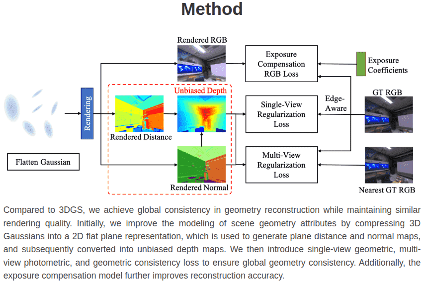

# 可微高斯渲染器

https://github.com/graphdeco-inria/diff-gaussian-rasterization

# 3D 高斯点染简介

https://huggingface.co/blog/zh/gaussian-splatting

# Meshing

## SuGaR

SuGaR: Surface‑Aligned Gaussian Splatting for Efficient 3D Mesh Reconstruction and High‑Quality Mesh Rendering (Guédon & Lepetit, 2024)

**Project**：[SuGaR](https://imagine.enpc.fr/~guedona/sugar/)

**摘要**

我们提出了一种方法，可以从三维高斯点云（3D Gaussian Splatting, SIGGRAPH 2023）中实现精确且极快的网格提取。高斯点云最近变得非常流行，因为它在生成逼真渲染效果的同时，训练速度明显比 NeRFs 快。然而，从数百万个微小的三维高斯点中提取网格仍然具有挑战性，因为这些高斯点在优化后往往无序，而目前还没有提出有效的方法。

- 我们的第一个关键贡献是引入一个正则化项，它鼓励三维高斯点更好地与场景表面对齐。
- 接着，我们提出了一种利用这种对齐的方法，在场景的真实表面上采样点，并使用泊松重建（Poisson reconstruction）从高斯点提取网格。这种方法速度快、可扩展，同时保留细节，与通常用于从神经 SDF 提取网格的行进立方体算法（Marching Cubes）不同。
- 最后，我们引入了一种可选的优化策略，将高斯函数绑定到网格表面，并通过高斯撒点渲染对这些高斯函数和网格进行联合优化。这使得通过操作网格而非高斯本身，使用传统软件（Blender、Unity、Unreal Engine 等）轻松编辑、雕刻、绑定、动画或重新光照成为可能。使用我们的方法获取这样一个可编辑的用于真实渲染的网格只需几分钟，而使用基于神经 SDF 的最先进方法则需要数小时，同时在 PSNR、SSIM 和 LPIPS 上提供更好的渲染质量。

> @article{guedon2023sugar,
        title={SuGaR: Surface-Aligned Gaussian Splatting for Efficient 3D Mesh Reconstruction and High-Quality Mesh Rendering},
        author={Gu{\'e}don, Antoine and Lepetit, Vincent},
        journal={CVPR},
        year={2024}
      }

## 2DGS: 2D Gaussian Splatting for Geometrically Accurate Radiance Fields

**Code** [Github](https://surfsplatting.github.io/)

**摘要**

三维高斯溅射 (3DGS) 近期彻底改变了辐射场重建，实现了高质量的新视图合成和快速的渲染速度，且无需烘焙。然而，由于三维高斯函数的多视图不一致性，3DGS 无法准确地表示表面。我们提出了二维高斯溅射 (2DGS)，这是一种从多视图图像中建模和重建几何精确辐射场的新方法。我们的核心思想是将三维体积折叠成一组二维定向平面高斯盘。与三维高斯函数不同，二维高斯函数在本质上建模表面的同时，还能提供视图一致的几何形状。为了准确地恢复薄表面并实现稳定的优化，我们引入了一种利用光线溅射相交和光栅化的透视精确二维溅射过程。此外，我们还结合了深度失真和法线一致性项，以进一步提高重建质量。我们证明，我们的可区分渲染器可以实现无噪声和详细的几何重建，同时保持具有竞争力的外观质量、快速的训练速度和实时渲染。

>@inproceedings{Huang2DGS2024,
    title={2D Gaussian Splatting for Geometrically Accurate Radiance Fields},
    author={Huang, Binbin and Yu, Zehao and Chen, Anpei and Geiger, Andreas and Gao, Shenghua},
    publisher = {Association for Computing Machinery},
    booktitle = {SIGGRAPH 2024 Conference Papers},
    year = {2024},
    doi = {10.1145/3641519.3657428}
    }

## PGSR: Planar-based Gaussian Splatting for Efficient and High-Fidelity Surface Reconstruction

**Project**：[PGSR](https://zju3dv.github.io/pgsr/)
**Code** [Github](https://github.com/zju3dv/pgsr)

**Abstract**

最近，由于其高质量的渲染以及超快的训练和渲染速度，3D 高斯撒点（3DGS）受到了广泛关注。然而，由于高斯点云的不规则和非结构化特性，仅依靠图像重建损失难以保证几何重建的精度和多视图一致性。尽管最近基于 3DGS 的表面重建研究层出不穷，但它们的网格质量总体上仍不尽如人意。为了解决这个问题，我们提出了一种基于平面的快速高斯散点重建表示（PGSR），以在保证高质量渲染的同时实现高保真表面重建。具体来说，我们首先引入了一种无偏深度渲染方法，该方法基于点云的高斯分布，直接渲染相机原点到高斯平面的距离及对应的法线图，并通过两者相除得到无偏深度。随后，我们引入了单视角几何、多视角光度和几何正则化以保持全局几何精度。同时，我们还提出了一种相机曝光补偿模型，以应对光照变化大的场景。在室内和室外场景的实验表明，我们的方法在保持高保真渲染和几何重建的同时，实现了快速训练和渲染，优于基于 3DGS 和基于 NeRF 的方法。

> @article{chen2024pgsr,
        title={PGSR: Planar-based Gaussian Splatting for Efficient and High-Fidelity Surface Reconstruction},
        author={Danpeng Chen and Hai Li and Weicai Ye and Yifan Wang and Weijian Xie and Shangjin Zhai and Nan Wang and Haomin Liu and Hujun Bao and Guofeng Zhang},
          booktitle={arxiv preprint arxiv:2406.06521},
          year={2024}
      }

## Quadratic Gaussian Splatting:High Quality Surface Reconstruction with Second-order Geometric Primitives

**Project**：[Quadratic Gaussian Splatting](https://alvin528.github.io/QuadraticGS/)
**Code** [Github](https://github.com/zju3dv/PGSR)

**Abstract**
最近，由于其高质量的渲染以及超快的训练和渲染速度，3D 高斯点溅射（3DGS）受到了广泛关注。然而，由于高斯点云的非结构化和不规则性，仅依靠图像重建损失很难保证几何重建的精度和多视图一致性。尽管最近出现了许多基于 3DGS 的表面重建研究，但其网格的质量总体上并不令人满意。为了解决这一问题，我们提出了一种基于快速平面高斯点溅射重建表示（PGSR），以在确保高质量渲染的同时实现高保真的表面重建。具体来说，我们首先介绍了一种无偏深度渲染方法，该方法直接根据点云的高斯分布渲染从相机原点到高斯平面的距离及对应的法线图，并通过两者的除法来获得无偏深度。然后，我们引入单视图几何、多视图光度学以及几何正则化，以保持全局几何精度。我们还提出了一种相机曝光补偿模型，以应对光照变化较大的场景。在室内和室外场景上的实验表明，我们的方法在保持高保真渲染和几何重建的同时，实现了快速训练和渲染，性能优于基于 3DGS 和基于 NeRF 的方法。

**Abstract**

我们提出了二次高斯绘制（Quadratic Gaussian Splatting, QGS），这是一种新型表示方法，它用可变形的二次曲面（例如椭圆、抛物面）取代静态基元，以捕捉复杂的几何结构。与以往依赖欧氏距离进行基元密度建模的方法不同——这种度量在变形情况下与表面几何不一致——QGS 引入了基于测地线距离的密度分布。这一创新确保密度权重能够自然地适应基元曲率，在形状变化过程中保持一致性（例如从平面盘到曲面抛物面）。通过在二次曲面上以闭式方式求解测地线距离，QGS 实现了面向表面的绘制，其中单个基元即可表示以前需要数十个平面表面元素才能表达的复杂曲率，从而有可能在保持高效渲染（通过快速射线-二次曲面交点计算）的同时减少内存使用。在 DTU、Tanks and Temples 和 MipNeRF360 数据集上的实验表明，表面重建达到了最先进的水平，其中 QGS 在 DTU 数据集上将几何误差（Chamfer 距离）比 2DGS 减少了 33%，比 GOF 减少了 27%。关键是，QGS 保持了具有竞争力的外观质量，为机器人和沉浸式现实等应用在几何精度与视觉逼真度之间架起了桥梁。

>@inproceedings{zhang2025quadraticgaussiansplattinghigh,
    author    = {Ziyu Zhang and Binbin Huang and Hanqing Jiang and Liyang Zhou and Xiaojun Xiang and Shunhan Shen},
    title     = {{Quadratic Gaussian Splatting: High Quality Surface Reconstruction with Second-order Geometric Primitives}},
    booktitle = {IEEE International Conference on Computer Vision (ICCV)},
    year      = {2025},
}

## 3D Gaussian Splatting with Normal Information for Mesh Extraction and Improved Rendering (Krishnan et al., 2025)

这篇工作进一步推进了 Mesh 优化方向：

引入法线监督（从 SDF/高斯估计的法线梯度）来改善几何重建质量，特别是在高曲率或细节丰富区域。

虽然直接不是“从高斯优化网格”的完全方案，但在从高斯 →Mesh 的路径上提供了很有价值的正则项／损失函数思路。

## GausSurf: Geometry-Guided 3D Gaussian Splatting for Surface Reconstruction

https://jiepengwang.github.io/GausSurf/

3D 高斯散射技术在具有实时渲染能力的新型视图合成方面取得了令人瞩目的性能。然而，利用 3D 高斯函数重建具有精细细节的高质量表面仍然是一项具有挑战性的任务。本文提出了一种名为 GausSurf 的新型高质量表面重建方法。该方法利用场景中纹理丰富区域的多视图一致性几何指导和纹理稀疏区域的法线先验信息。我们观察到，场景可以主要分为两个区域：1）纹理丰富区域和 2）纹理稀疏区域。为了在纹理丰富区域实现多视图一致性，我们通过引入传统的基于块匹配的多视图立体（MVS）方法来指导几何优化，从而提高重建质量。该方法实现了高斯函数优化和块匹配细化之间的相互促进，显著提升了重建结果并加速了训练过程。同时，对于纹理稀疏区域，我们利用预训练的法线估计模型提供的法线先验信息来指导优化。在 DTU 和 Tanks and Temples 数据集上进行的大量实验表明，我们的方法在重建质量和计算时间方面都优于最先进的方法。

## HDGS: Textured 2D Gaussian Splatting for Enhanced Scene Rendering

## FatesGS: Fast and Accurate Sparse-View Surface Reconstruction Using Gaussian Splatting with Depth-Feature Consistency

>@inproceedings{huang2025fatesgs,
title={FatesGS: Fast and Accurate Sparse-View Surface Reconstruction Using Gaussian Splatting with Depth-Feature Consistency},
author={Han Huang and Yulun Wu and Chao Deng and Ge Gao and Ming Gu and Yu-Shen Liu},
booktitle={Proceedings of the AAAI Conference on Artificial Intelligence},
year={2025}
}

**Project**：[FatesGS](https://alvin528.github.io/FatesGS/)

**摘要**
近年来，高斯溅射（Gaussian Splatting）在计算机视觉领域掀起了一股新潮流。除了新视图合成之外，它还被扩展到了多视图重建领域。最新的方法能够在保证快速训练速度的同时，实现完整、精细的表面重建。然而，这些方法仍然需要密集的输入视图，并且在稀疏视图的情况下，其输出质量会显著下降。我们观察到，高斯基元容易过拟合少数训练视图，导致出现噪声浮点和不完整的重建表面。本文提出了一种创新的稀疏视图重建框架，该框架利用视图内深度和多视图特征的一致性，实现了极其精确的表面重建。具体而言，我们利用单目深度排序信息来监督图像块内深度分布的一致性，并采用平滑度损失来增强分布的连续性。为了实现更精细的表面重建，我们通过多视图投影特征优化了深度的绝对位置。在 DTU 和 BlendedMVS 上进行的大量实验表明，我们的方法比最先进的方法快 60 倍到 200 倍，无需昂贵的预训练即可实现快速和细粒度的网格重建。

**方法**

首先，我们使用一组稀疏的输入视图，通过 COLMAP 初始化二维高斯分布，并利用 splatting 技术渲染 RGB 图像和深度图。为了增强几何学习过程，我们整合了单目深度估计的排序信息，并应用深度平滑以确保视图内深度的一致性。为了进一步优化几何形状，我们将估计的表面点投影到源图像上，从而对齐提取的多视图特征。

# PlanarGS: High-Fidelity Indoor 3D Gaussian Splatting Guided by Vision-Language Planar Priors

**Project**：[PlanarGS](https://planargs.github.io/)
**Code** [Github](https://github.com/SJTU-ViSYS-team/PlanarGS)

**Abstract**
三维高斯喷溅（3DGS）近年来作为一种高效的新视角合成表示方法出现，并实现了令人印象深刻的视觉效果。然而，在大型且低纹理区域主导的场景中（这种场景在室内环境中很常见），用于优化 3DGS 的光度损失会产生模糊的几何结构，并且无法恢复高保真的三维表面。为克服这一限制，我们提出了 PlanarGS，一个基于 3DGS 并针对室内场景重建的框架。具体而言，我们设计了一个语言提示平面先验（LP3）流程，它采用预训练的视觉-语言分割模型，并通过跨视图融合以及几何先验检查来优化其区域提议。我们框架中的三维高斯采用两个附加项进行优化：一个平面先验监督项，用于强制平面一致性；另一个几何先验监督项，引导高斯向深度和法线线索靠拢。我们在标准室内基准上进行了广泛的实验。结果表明，PlanarGS 能够重建准确且细致的三维表面，并且始终以较大幅度优于最先进的方法。

# PG-SAG: Parallel Gaussian Splatting for Fine-Grained Large-Scale Urban Buildings Reconstruction via Semantic-Aware Grouping (2025)

**Project**：[PG-SAG](https://github.com/TFwang-9527/PG-SAG/tree/main)

**Abstract**
抽象三维高斯点溅射（3DGS）已经成为实时新颖合成领域的一种变革性方法。基于3DGS，近期的进展通过基于空间的分区策略应对大规模场景，从而减少视频内存和优化时间成本。在本工作中，我们提出了一种并行高斯点溅射方法，称为PG-SAG，该方法充分利用语义线索用于分区和高斯核优化，从而实现大规模城市区域的精细建筑表面重建，而无需降低原始图像分辨率。首先，利用跨模态模型——Language Segment Anything对建筑物进行掩膜分割。然后，根据在注册图像中的可见性检查，将分割出的建筑区域分组为子区域。这些子区域的高斯核在带掩膜像素的情况下并行优化。此外，对于掩膜检测出的边缘，法线损失被重新构建，以减轻边缘法向量的不确定性。最后，为了改善三维高斯的优化，我们引入了一种梯度约束负载平衡损失，该损失考虑了对应场景的复杂性，有效地最小化像素并行渲染阶段的线程等待时间以及重建损失。在各种城市数据集上进行了大量实验，结果表明，与几种最先进的基于3DGS的方法相比，我们的PG-SAG在建筑表面重建方面表现出优越的性能。项目网页：https://github.com/TFWang-9527/PG-SAG。

# 工程／优化方向

DashGaussian: Optimizing 3D Gaussian Splatting in 200 Seconds（Chen et al., 2025）聚焦于加速 3DGS 优化，但其方法同样可为 Mesh 优化场景提供更快收敛的基础。
CVF 开放获取

还有 3DGS‑LM: Faster Gaussian‑Splatting Optimization with Levenberg‑Marquardt（Höllein et al., 2025），提供更高效的优化器替代思路。
