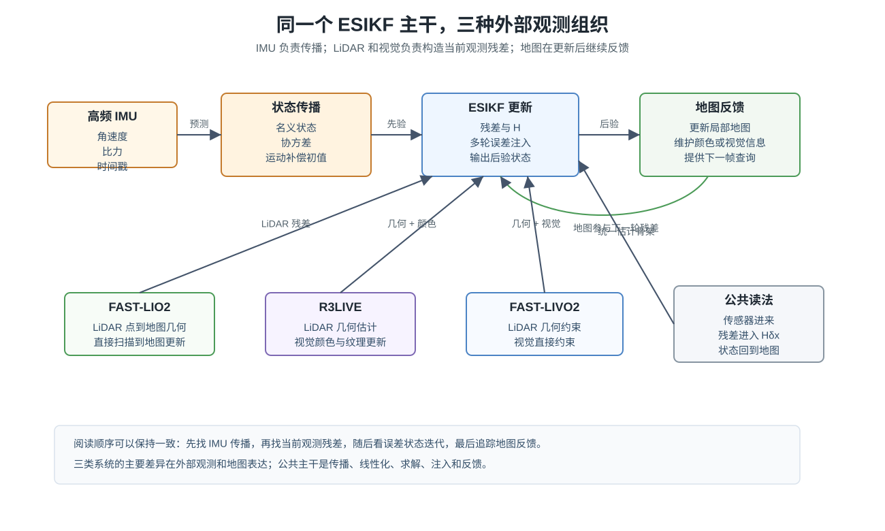

# 三篇代表性工作中的 ESIKF：FAST-LIO2、R3LIVE 与 FAST-LIVO2

> 上一篇从公式层面说明了 ESIKF：预测状态给出先验，当前观测给出非线性残差，误差状态在一次观测内部迭代求解。本文换一个角度，沿着 FAST-LIO2、R3LIVE 和 FAST-LIVO2 三篇代表性工作，看看论文里具体怎样使用这套结构。

**阅读路线：** [ESIKF：误差状态上的迭代卡尔曼更新](../esikf-iterated-error-state/index.html) → 本文。若想对照关键帧因子图路线，可阅读 [从 IMU 预积分到 VINS、LIO-SAM 与 LVI-SAM](../vins-lio-sam-preintegration/index.html)。

## 摘要：三篇文章共同回答的一个问题

LiDAR、相机和 IMU 的组合系统经常面对同一个问题：IMU 可以高频传播状态，但会随时间漂移；LiDAR 和相机可以约束环境几何或图像外观，但它们的观测模型高度非线性。当前帧到来时，系统需要在很短时间内把这些观测转化为状态修正，并把修正后的状态反馈给地图和下一帧。

ESIKF 在这类系统中扮演的角色很具体。它把历史信息压缩为当前预测状态和协方差，把当前帧的 LiDAR 或视觉观测写成残差，再在误差状态上进行若干轮迭代。每一轮都围绕当前名义状态重新计算残差和 Jacobian，求得局部增量后注入状态。

FAST-LIO2、R3LIVE 和 FAST-LIVO2 的差异，主要体现在“当前观测”这一项。FAST-LIO2 使用 LiDAR 点到地图的几何残差；R3LIVE 在 LiDAR-Inertial 主干上叠加视觉颜色和纹理地图；FAST-LIVO2 把 LiDAR 几何和视觉直接约束放进更紧的 LiDAR-Inertial-Visual 估计流程。三篇文章都可以用同一条线阅读：状态怎样传播，观测怎样变成残差，迭代发生在哪里，地图怎样反馈。

**关键词：** ESIKF；FAST-LIO2；R3LIVE；FAST-LIVO2；LiDAR-Inertial；LiDAR-Visual-Inertial；迭代观测更新

上图只保留公共骨架。橙色部分是 IMU 传播，蓝色部分是 ESIKF 迭代更新，绿色部分是地图反馈。阅读三篇文章时，重点放在每篇文章把哪一种观测残差送进这个骨架。

## 1. 三篇文章的公共 ESIKF 骨架

先把三篇文章共有的部分抽出来。每个时刻的估计都可以分成五个动作。

第一，IMU 传播。系统从上一时刻后验状态出发，用陀螺仪和加速度计传播姿态、速度、位置和零偏，同时传播协方差。传播结果记为 $\hat{\mathcal X}^{-}$ 和 $P^{-}$。它是当前观测更新的先验。

第二，当前帧预处理。LiDAR 扫描需要运动补偿和坐标变换，图像需要时间同步、特征跟踪或直接法采样。预处理的目标，是让当前观测可以在预测状态附近同地图建立关系。

第三，构造观测残差。LiDAR 点和地图局部平面形成几何残差，视觉观测和投影像素形成重投影或光度残差。这些残差都可以写成

$$
r=z-h(\mathcal X).
$$

第四，迭代误差状态更新。第 $l$ 轮在当前名义状态 $\hat{\mathcal X}^{(l)}$ 附近线性化：

$$
r^{(l)}\approx H^{(l)}\eta+n.
$$

系统求得局部增量 $\eta$，再通过 $\boxplus$ 注入名义状态。注入后的状态成为下一轮线性化点。

第五，地图反馈。收敛后的状态用于更新点云地图、颜色地图、视觉地图或局部查询结构。下一帧到来时，IMU 传播又从这个状态继续出发。

这五个动作构成本文的阅读框架。下面三节进入三篇文章内部，分别看它们如何实现“观测残差”和“迭代更新”。

## 2. FAST-LIO2：把扫描到地图配准写成 ESIKF 更新

FAST-LIO2 是理解 ESIKF 在 LIO 中落地的直接例子。它的目标是让当前 LiDAR 扫描直接同增量地图配准，同时利用 IMU 传播保持高频状态连续。相比依赖边缘、平面等人工特征的系统，FAST-LIO2 更强调原始点对地图的直接配准和高效地图查询。

### 2.1 状态传播：当前扫描有一个惯性先验

扫描到来之前，IMU 已经把状态传播到扫描时间附近。这个传播不只给出一个位姿初值，还给出协方差。协方差说明每个状态方向的可信程度，后续 LiDAR 几何残差会在这个先验上修正状态。

LiDAR 扫描本身覆盖一个时间段。扫描内不同点的采样时刻不同，运动会造成点云畸变。IMU 传播得到的连续运动信息会用于点云去畸变，使当前扫描中的点尽量对应到同一个状态时刻。这样，后面的点到地图残差才有明确的几何意义。

### 2.2 观测构造：原始点到局部地图

FAST-LIO2 的观测可以从一个点看起。当前扫描中的点 $p_i$ 经由当前状态变换到地图坐标系。系统在局部地图中寻找该点附近的邻域，并用邻域估计局部平面。若平面法向为 $n_i$，平面上一点为 $q_i$，则点到平面的残差可以抽象为

$$
e_i=n_i^{\top}\left(Rp_i+t-q_i\right).
$$

一批点的残差堆叠起来，就形成当前扫描对状态的观测。状态一变，点在地图中的位置会变；点的位置一变，局部邻域和平面也可能变化。因此，这个观测模型带有明显的非线性。

### 2.3 迭代更新：配准问题落到误差状态上

在第 $l$ 轮迭代中，FAST-LIO2 使用当前状态计算每个有效点的残差，并对误差状态求 Jacobian。点到平面残差主要直接约束姿态和位置；速度和零偏通过 IMU 传播、协方差相关性和后续时间传播继续影响估计。

线性化后，一批 LiDAR 残差形成

$$
r_{\mathrm{lidar}}^{(l)}
\approx
H_{\mathrm{lidar}}^{(l)}\eta+n.
$$

ESIKF 根据预测协方差和 LiDAR 残差权重求解误差增量。增量注入状态后，当前扫描会在新的位姿下重新同地图比较。多轮迭代逐步把当前扫描推向与局部地图更一致的位置。

### 2.4 地图反馈：后验状态继续服务下一帧

迭代完成后，当前扫描根据后验状态插入地图。地图查询结构随之更新，下一帧 LiDAR 到来时会使用新的局部地图。后验状态也成为下一段 IMU 传播的起点。

因此，FAST-LIO2 里的 ESIKF 可以理解为扫描到地图配准的求解器，同时也是 IMU 传播、LiDAR 几何和增量地图之间的连接方式。

可以把 FAST-LIO2 的核心读法压缩为：

$$
\text{IMU 传播}
\rightarrow
\text{当前扫描去畸变}
\rightarrow
\text{点到地图残差}
\rightarrow
\text{ESIKF 迭代}
\rightarrow
\text{地图增量更新}.
$$

## 3. R3LIVE：在 LiDAR-Inertial 主干上接入视觉颜色

R3LIVE 进一步把视觉接入 LiDAR-Inertial 系统。理解它时，可以先保留 FAST-LIO2 的主干：IMU 传播状态，LiDAR 扫描通过地图几何更新状态。然后再看视觉信息怎样围绕同一状态和同一地图发挥作用。

### 3.1 LiDAR-Inertial 子系统提供几何状态

R3LIVE 的 LiDAR-Inertial 部分仍然承担几何估计主线。IMU 传播得到状态先验，LiDAR 扫描同地图建立几何残差，迭代更新后得到当前位姿。这个位姿决定当前扫描如何进入地图，也决定相机观测如何投影到地图点上。

这一层可以看作 R3LIVE 的几何骨架。没有稳定的几何状态，视觉颜色和纹理信息就缺少可靠的三维承载位置。LiDAR-Inertial 更新先把当前状态放到地图坐标中，再让视觉信息参与地图外观表达。

### 3.2 视觉信息的入口：从图像到彩色地图

R3LIVE 的视觉部分关注图像与三维地图之间的联系。地图点有了三维位置后，可以通过当前相机位姿投影到图像中。图像中的颜色、纹理和像素一致性，可以为地图点提供 RGB 信息，也可以帮助维护视觉层面的约束。

从 ESIKF 角度看，视觉入口仍然遵循同一形式。给定状态，系统预测地图点应该投影到哪里，随后比较预测图像信息和实际图像信息。残差依赖相机位姿、外参、地图点位置和图像内容。状态被更新后，投影关系和可见性关系也会更新。

### 3.3 论文里的结构感：两个子系统共享状态和地图

R3LIVE 可以理解为两个相互连接的子系统。

第一层是 LiDAR-Inertial 估计。它利用 IMU 和 LiDAR 几何估计当前运动状态，并维护三维几何地图。

第二层是视觉惯性和彩色建图。它使用相机观测和当前状态，把图像信息关联到三维地图上，并让地图获得颜色和纹理表达。

这两个子系统共享状态、时间同步关系、外参和地图。LiDAR 给视觉提供几何支撑，视觉让地图拥有更丰富的外观信息。ESIKF 的意义在这里变成一种组织原则：所有观测最终都围绕同一个运动状态和局部误差来解释。

### 3.4 R3LIVE 对理解 ESIKF 的价值

FAST-LIO2 主要展示了 LiDAR 几何怎样进入 ESIKF。R3LIVE 展示了另一个层次：当系统加入视觉后，ESIKF 仍然可以作为状态估计的主干，视觉信息通过投影和地图关联接入闭环。

读 R3LIVE 时，不宜只问视觉是否直接改变某一轮滤波更新。更稳定的读法是追踪视觉信息如何使用当前状态、如何投影到地图、如何更新颜色地图，以及这些结果如何在后续帧中继续影响数据关联和地图一致性。

## 4. FAST-LIVO2：LiDAR 与视觉直接约束进入同一估计流程

FAST-LIVO2 继续推进 LiDAR-Inertial-Visual 的紧耦合估计。它的重点在于把 LiDAR 几何和视觉直接约束更紧地组织到当前状态估计中。读这篇文章时，可以把它看作从 FAST-LIO2 的 LiDAR 几何更新，走向 LiDAR 与视觉共同约束当前状态。

### 4.1 状态传播仍然从 IMU 开始

当前帧到来之前，IMU 传播给出预测状态和协方差。这个预测同时服务于 LiDAR 和视觉。对 LiDAR，它提供扫描去畸变和点云配准初值；对视觉，它提供图像投影、特征或直接法跟踪的运动初值。

因此，FAST-LIVO2 中的 IMU 传播是多类观测共享的时间主线。LiDAR 和视觉都围绕同一组状态工作。

### 4.2 LiDAR 残差：三维几何约束

LiDAR 观测仍然可以写成点云到地图的几何残差。当前点经过状态变换后，与地图中的局部结构比较。残差主要约束姿态和位置，并通过协方差相关性影响完整误差状态。

这一部分与 FAST-LIO2 的读法相近。区别在于 FAST-LIVO2 还会继续接入视觉约束，LiDAR 更新提供的状态和地图会成为视觉更新的重要基础。

### 4.3 视觉残差：图像域的直接约束

视觉约束把三维地图和图像联系起来。给定当前状态，地图点或局部结构可以投影到图像中，形成像素位置、图像块或光度一致性残差。直接视觉残差通常依赖图像梯度、可见性和局部纹理，非线性比简单位置观测更强。

这类残差也可以写成

$$
r_{\mathrm{visual}}
\approx
H_{\mathrm{visual}}\delta x+n.
$$

其中 $H_{\mathrm{visual}}$ 通过相机投影模型、外参和当前状态对误差状态求导。状态注入后，投影位置和图像采样位置会发生变化，因此视觉残差同样适合迭代求解。

### 4.4 顺序更新：多类观测的工程组织

FAST-LIVO2 中一个值得注意的点，是 LiDAR 和视觉观测可以按顺序进入状态更新。概念上，两类残差可以堆叠成一个整体问题：

$$
\begin{bmatrix}
r_{\mathrm{lidar}}\\
r_{\mathrm{visual}}
\end{bmatrix}
\approx
\begin{bmatrix}
H_{\mathrm{lidar}}\\
H_{\mathrm{visual}}
\end{bmatrix}
\delta x+n.
$$

工程上，LiDAR 残差和视觉残差的维度、频率、数据关联和计算代价不同。顺序更新让系统先吸收一类观测，再在更新后的状态上吸收另一类观测。这样既保留了统一状态，又能根据传感器特性组织计算。

从 ESIKF 角度看，顺序更新并不改变核心动作。每次进入更新的观测都会形成残差、Jacobian 和局部误差增量；状态被注入后，下一类观测在新的状态附近继续工作。

### 4.5 FAST-LIVO2 对理解 ESIKF 的价值

FAST-LIVO2 展示了 ESIKF 面对多类非线性观测时的组织方式。LiDAR 给出三维几何，视觉给出图像域约束，IMU 提供连续时间传播。三者通过同一个误差状态连接。

读这篇文章时，可以重点看三处：LiDAR 残差怎样更新状态，视觉残差怎样接入同一状态，顺序更新怎样避免把所有观测粗暴堆成一个庞大线性系统。这样，ESIKF 会从一个滤波公式变成多传感器前端和地图之间的估计接口。

## 5. 三篇文章的横向比较

下面把三篇文章放在同一张表中。表里的重点放在 ESIKF 在每篇文章中的具体作用。

| 项目 | FAST-LIO2 | R3LIVE | FAST-LIVO2 |
|---|---|---|---|
| 代表问题 | 当前 LiDAR 扫描如何直接对齐增量地图 | LiDAR-Inertial 几何状态如何承载视觉颜色地图 | LiDAR 几何和视觉直接约束如何共同更新当前状态 |
| 先验来源 | IMU 传播状态和协方差 | IMU 传播支撑 LiDAR-Inertial 主干 | IMU 传播同时服务 LiDAR 与视觉 |
| 主要残差 | 点到局部地图平面的几何残差 | LiDAR 几何残差加视觉投影和颜色关联 | LiDAR 几何残差与视觉直接残差 |
| 迭代位置 | 当前扫描到地图配准内部 | LiDAR-Inertial 更新和视觉地图关联围绕当前状态展开 | LiDAR 与视觉观测通过紧耦合或顺序更新进入 ESIKF |
| 地图反馈 | 更新点云地图和查询结构 | 更新几何地图及 RGB 外观信息 | 更新同时服务几何和视觉的地图表达 |
| 对 ESIKF 的启发 | ESIKF 可以承担实时 scan-to-map 配准 | ESIKF 主干可以承载外观地图扩展 | ESIKF 可以组织多类非线性观测 |

三篇文章形成一条很自然的理解路径。FAST-LIO2 先把 LiDAR 几何和 ESIKF 的关系讲清楚。R3LIVE 在这条几何主线上接入视觉外观信息。FAST-LIVO2 进一步把 LiDAR 和视觉约束放进更统一的当前状态估计流程。

## 6. 与 VINS、LIO-SAM、LVI-SAM 的对照

VINS、LIO-SAM 和 LVI-SAM 那条线适合从关键帧因子图看。IMU 样本被压缩成关键帧之间的预积分因子，再和视觉、LiDAR、回环或 GPS 因子一起进入窗口优化或平滑估计。

FAST-LIO2、R3LIVE 和 FAST-LIVO2 这条线适合从当前帧递推看。IMU 传播直接给当前状态先验，当前 LiDAR 或视觉观测围绕这个状态做 ESIKF 更新。历史信息主要体现在当前均值和协方差中。

两条线都在求解加权残差。因子图更强调多个关键帧之间的联合优化，ESIKF 更强调当前观测到来时的递推吸收。把这两条线并排看，预积分文章回答“高频 IMU 怎样变成关键帧因子”，本文回答“三篇代表性 LIO/LIVO 工作怎样把当前观测变成迭代误差状态更新”。

## 7. 小结

这篇文章的重点是三篇代表性工作中的 ESIKF 做法。

FAST-LIO2 把当前 LiDAR 扫描到地图的直接配准写成迭代误差状态更新。IMU 传播给出先验，点到局部地图的几何残差给出观测，迭代更新后的状态回到地图。

R3LIVE 在 LiDAR-Inertial 几何主干上加入视觉颜色和纹理信息。它帮助我们看到，视觉进入系统后，状态、投影、地图点和外观信息仍然可以围绕同一套误差状态估计闭环组织。

FAST-LIVO2 把 LiDAR 几何和视觉直接约束更紧地放进当前状态估计中。顺序更新和多类残差组织说明，ESIKF 可以作为多传感器非线性观测的统一接口。

顺着这三篇读下去，ESIKF 会从“Kalman filter 迭代几次”的公式印象，变成一种实时 SLAM 系统的组织方式：IMU 管连续时间，地图管空间结构，LiDAR 和视觉管当前观测，误差状态迭代把它们接到同一个状态上。

## 参考文献

1. Wei Xu, Yixi Cai, Dongjiao He, Jiarong Lin, and Fu Zhang, *FAST-LIO2: Fast Direct LiDAR-inertial Odometry*, IEEE Transactions on Robotics, 2022. <https://arxiv.org/abs/2107.06829>
2. Jiarong Lin and Fu Zhang, *R3LIVE: A Robust, Real-time, RGB-colored, LiDAR-Inertial-Visual tightly-coupled state Estimation and mapping package*, ICRA, 2022. <https://arxiv.org/abs/2109.07982>
3. Chongjian Yuan, Jiarong Lin, Zuhao Zou, Xiaoping Hong, and Fu Zhang, *FAST-LIVO2: Fast, Direct LiDAR-Inertial-Visual Odometry*, arXiv:2408.14035, 2024. <https://arxiv.org/abs/2408.14035>
4. Wei Xu and Fu Zhang, *FAST-LIO: A Fast, Robust LiDAR-Inertial Odometry Package by Tightly-Coupled Iterated Kalman Filter*, IEEE Robotics and Automation Letters, 2021. <https://arxiv.org/abs/2010.08196>
5. [ESIKF：误差状态上的迭代卡尔曼更新](../esikf-iterated-error-state/index.html)
6. [从 IMU 预积分到 VINS、LIO-SAM 与 LVI-SAM](../vins-lio-sam-preintegration/index.html)
