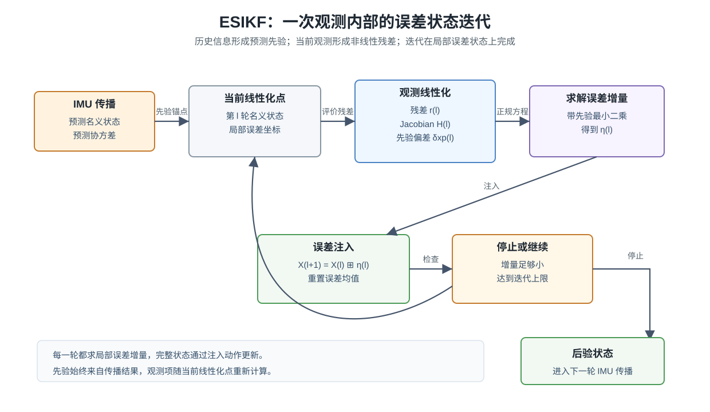

# ESIKF：误差状态上的迭代卡尔曼更新

> 这是 ESKF 系列的第四篇。前三篇已经建立了名义状态、误差状态、IMU 传播和观测 Jacobian。本文只处理一个核心问题：ESKF 的一次观测更新怎样扩展成 ESIKF 的迭代更新。

**阅读路线：** [ESKF 入门：从状态预测到误差注入](../ekf-again/index.html) → [ESKF 误差动力学：从 IMU 模型推导 $F$ 和 $G$](../eskf-error-dynamics/index.html) → [ESKF 观测更新：从观测模型推导 $H$ 矩阵](../eskf-observation-h/index.html) → 本文。系统案例可以继续阅读 [三篇代表性工作中的 ESIKF：FAST-LIO2、R3LIVE 与 FAST-LIVO2](../esikf-fast-lio2-r3live-fast-livo2/index.html)。

## 摘要

ESKF 的观测更新表面上是 Kalman gain 乘以残差。换一个角度看，它是在预测状态附近求解一个带高斯先验的局部最小二乘问题。预测均值和协方差构成先验，传感器观测构成残差，观测 Jacobian 把非线性模型在当前名义状态附近展开。

ESIKF 把这一步放进一个小循环。当前观测到来后，系统先用预测状态作为初始线性化点；随后反复计算残差、构造 Jacobian、求解误差增量、注入名义状态，并在新的名义状态附近重新线性化。每一轮仍然求局部误差状态，完整状态仍然通过流形上的注入动作更新。

这篇文章的主线是：先把 ESKF 更新写成最小二乘，再把非线性观测放进去，最后说明迭代中的先验、残差、Jacobian、误差注入和协方差各自处在什么位置。理解这条线后，LiDAR 点到地图、视觉重投影、光度残差等观测都可以接入同一套误差状态语言。

**关键词：** ESIKF；IESKF；误差状态；迭代更新；非线性最小二乘；Kalman 滤波

上图表达本文的核心结构。IMU 传播给出预测先验；当前观测给出非线性残差；ESIKF 在一次观测内部多次更新线性化点。每次求解得到的都是局部误差增量，状态更新通过注入完成。

## 1. 从宏观上看 ESIKF

ESKF 已经把状态估计拆成两层。名义状态保存完整的姿态、位置、速度和零偏；误差状态保存名义状态附近的小修正。滤波器用误差状态完成线性估计，再把估计出的误差注入名义状态。

ESIKF 沿用这套两层结构。它改变的是观测更新的组织方式。普通 ESKF 在预测名义状态附近线性化一次观测模型，然后完成一次误差注入。ESIKF 在当前观测内部重复这一动作。第 $l$ 轮有一个当前名义状态 $\hat{\mathcal X}^{(l)}$，系统围绕它计算残差和 Jacobian，求得局部增量 $\eta^{(l)}$，再更新为

$$
\hat{\mathcal X}^{(l+1)}=
\hat{\mathcal X}^{(l)}\boxplus\eta^{(l)}.
$$

新的状态成为下一轮线性化点。残差、Jacobian、数据关联或局部地图几何都可以在下一轮重新计算。这样，一次观测更新内部就具有了 Gauss-Newton 式迭代的形态。

ESIKF 可以概括为：

> **在误差状态滤波框架中，用若干轮局部线性化求解当前观测对应的非线性最小二乘问题。**

这句话包含三层含义。第一，历史信息仍由预测均值和协方差表达。第二，求解变量仍是当前名义状态附近的小误差。第三，观测模型可以在状态被修正后重新线性化。

## 2. ESKF 更新的最小二乘视角

传播完成后，滤波器得到预测名义状态 $\hat{\mathcal X}^{-}$ 和预测协方差 $P^{-}$。真实状态写成

$$
\mathcal X=\hat{\mathcal X}^{-}\boxplus\delta x.
$$

观测模型为

$$
z=h(\mathcal X)+n,
\qquad
n\sim\mathcal N(0,R).
$$

在预测状态附近，预测观测为 $h(\hat{\mathcal X}^{-})$，残差为

$$
r=z-h(\hat{\mathcal X}^{-}).
$$

把真实状态写成预测状态加误差，并对误差做一阶展开：

$$
h(\hat{\mathcal X}^{-}\boxplus\delta x)
\approx
h(\hat{\mathcal X}^{-})+H\delta x.
$$

于是观测残差满足

$$
r\approx H\delta x+n.
$$

预测状态本身也带有不确定性。若把预测误差看作先验约束，当前更新可以写成

$$
\min_{\delta x}
\left\|\delta x\right\|^2_{P^{-}}
+
\left\|r-H\delta x\right\|^2_R.
$$

第一项惩罚状态增量偏离传播结果，第二项惩罚修正后的状态无法解释观测。这个目标是二次型，正规方程为

$$
\left((P^{-})^{-1}+H^{\top}R^{-1}H\right)\delta x
=H^{\top}R^{-1}r.
$$

Kalman gain 给出的误差修正，与这个二次问题的解等价。对线性观测，求解一次即可得到后验均值。对非线性观测，这个二次问题只描述当前线性化点附近的局部形状。

## 3. 非线性观测中的目标函数

许多机器人观测都带有明显非线性。LiDAR 点需要先用当前姿态和位置投到地图中，再与局部平面或局部结构比较；视觉特征需要经过三维变换和透视投影；直接法视觉还会把图像灰度、颜色和可见性放入残差。

这类观测更自然地写成完整状态上的目标函数：

$$
\min_{\mathcal X}
\left\|\mathcal X\boxminus\hat{\mathcal X}^{-}\right\|^2_{P^{-}}
+
\left\|z-h(\mathcal X)\right\|^2_R.
$$

第一项把当前估计约束在传播结果附近。第二项要求状态解释当前观测。由于 $h(\mathcal X)$ 是非线性的，求解通常需要选择线性化点，再在该点附近求一个局部增量。

ESIKF 的迭代正是围绕这个目标展开。它并没有把完整状态当作普通向量直接相加。每一轮仍然选择局部误差 $\eta$ 作为增量，并用 $\boxplus$ 把它施加到当前名义状态上。

## 4. 一轮 ESIKF 迭代

设第 $l$ 轮的当前名义状态为 $\hat{\mathcal X}^{(l)}$。预测先验仍然是传播阶段给出的 $\hat{\mathcal X}^{-}$ 和 $P^{-}$。

当前状态相对预测状态的先验偏差为

$$
\delta x_p^{(l)}=
\hat{\mathcal X}^{(l)}\boxminus\hat{\mathcal X}^{-}.
$$

当前观测残差为

$$
r^{(l)}=z-h(\hat{\mathcal X}^{(l)}).
$$

在 $\hat{\mathcal X}^{(l)}$ 附近施加新的局部增量 $\eta$：

$$
\mathcal X \approx \hat{\mathcal X}^{(l)}\boxplus\eta.
$$

观测项一阶展开为

$$
z-h(\hat{\mathcal X}^{(l)}\boxplus\eta)
\approx
r^{(l)}-H^{(l)}\eta.
$$

先验项也需要表达在当前切空间中：

$$
(\hat{\mathcal X}^{(l)}\boxplus\eta)\boxminus\hat{\mathcal X}^{-}
\approx
\delta x_p^{(l)}+J_p^{(l)}\eta.
$$

于是第 $l$ 轮要解的局部二次问题为

$$
\min_{\eta}
\left\|\delta x_p^{(l)}+J_p^{(l)}\eta\right\|^2_{P^{-}}
+
\left\|r^{(l)}-H^{(l)}\eta\right\|^2_R.
$$

对应正规方程可以写成

$$
\left(
J_p^{\top}(P^{-})^{-1}J_p
+
H^{\top}R^{-1}H
\right)\eta
=
H^{\top}R^{-1}r
-
J_p^{\top}(P^{-})^{-1}\delta x_p.
$$

为保持符号简洁，上式省略了迭代上标。它显示了两个力的来源：观测残差希望拉动状态解释测量，先验项希望状态保持在传播结果的可信范围内。协方差决定两者的相对权重。

求得 $\eta^{(l)}$ 后，执行注入：

$$
\hat{\mathcal X}^{(l+1)}=
\hat{\mathcal X}^{(l)}\boxplus\eta^{(l)}.
$$

接着进入下一轮，或者在满足停止条件后输出后验状态。

## 5. 先验项在迭代中的作用

ESIKF 的每一轮都围绕当前状态线性化观测，但先验来自同一个传播结果。第 $0$ 轮通常有

$$
\hat{\mathcal X}^{(0)}=\hat{\mathcal X}^{-},
\qquad
\delta x_p^{(0)}=0.
$$

第一轮以后，当前名义状态已经被观测拉动，$\delta x_p^{(l)}$ 一般不再为零。后续迭代继续受到 $P^{-}$ 约束。协方差较小的方向，先验约束更强；协方差较大的方向，观测残差可以给出更大的修正。

这也是 ESIKF 与单纯反复做几何配准的区别所在。几何配准只关心当前观测与地图的一致性；ESIKF 同时维护传播先验、状态协方差、观测噪声和误差注入。它的每一轮更新都带着滤波器的概率权重。

## 6. 姿态误差与注入

误差状态的迭代必须尊重姿态所在的流形。以右侧扰动为例，姿态满足

$$
R_{WB}=\hat R_{WB}\operatorname{Exp}([\delta\theta]_\times).
$$

若第 $l$ 轮求得姿态增量 $\eta_\theta^{(l)}$，注入写成

$$
\hat R_{WB}^{(l+1)}
=
\hat R_{WB}^{(l)}
\operatorname{Exp}([\eta_\theta^{(l)}]_\times).
$$

位置、速度和 bias 通常采用加性注入：

$$
\hat p^{(l+1)}=\hat p^{(l)}+\eta_p^{(l)},
\quad
\hat v^{(l+1)}=\hat v^{(l)}+\eta_v^{(l)}.
$$

注入之后，误差均值重新定义在新的名义状态附近。下一轮的 $H^{(l+1)}$ 要在新的姿态、位置和局部坐标中计算。若忽略这一步，Jacobian、残差和协方差可能描述不同的局部坐标。

## 7. 一个 LiDAR 点到平面的微观例子

设当前 LiDAR 点在机体系中为 $p_B$。当前状态给出姿态 $R_{WB}$ 和位置 $p_W$，点投到世界系为

$$
p_W^{\mathrm{scan}}=R_{WB}p_B+p_W.
$$

局部地图给出平面法向 $n_W$ 和平面上一点 $q_W$。点到平面的残差写成

$$
e=n_W^{\top}\left(R_{WB}p_B+p_W-q_W\right).
$$

在右侧姿态扰动下，

$$
R_{WB}=\hat R_{WB}\operatorname{Exp}([\delta\theta]_\times).
$$

利用一阶近似，扫描点的变化为

$$
\delta p_W^{\mathrm{scan}}
\approx
-\hat R_{WB}[p_B]_\times\delta\theta+
\delta p.
$$

残差的一阶变化为

$$
\delta e
\approx
n_W^{\top}
\left(-\hat R_{WB}[p_B]_\times\delta\theta+
\delta p\right).
$$

因此观测 Jacobian 中的姿态和位置块为

$$
H_\theta=-n_W^{\top}\hat R_{WB}[p_B]_\times,
\qquad
H_p=n_W^{\top}.
$$

这个例子展示了微观推导的路径。先写残差，再把误差扰动代入状态，随后保留一阶项。迭代更新时，第 $l$ 轮使用当前 $\hat R_{WB}^{(l)}$、$\hat p_W^{(l)}$、当前地图对应关系和当前平面参数。注入后，这些量可以在下一轮重新评价。

## 8. 一个视觉重投影的微观例子

设空间点为 $P_W$，相机观测像素为 $u$。给定当前相机位姿，预测像素可以写成

$$
\hat u=\pi\left(R_{CW}(P_W-p_W)\right).
$$

重投影残差为

$$
r_u=u-\hat u.
$$

这个残差同时受到姿态、位置、外参、地图点和相机内参影响。投影函数 $\pi(\cdot)$ 包含除深度操作，空间点靠近相机、视角变化较大或初值偏差较大时，单次线性化给出的近似会变粗。

ESIKF 的处理方式保持一致。第 $l$ 轮用当前状态预测像素，计算残差和投影 Jacobian，求得误差增量后注入状态。下一轮在新的位姿附近重新投影。若系统还使用光度残差，图像梯度和颜色误差会进入 $h(\mathcal X)$，但求解变量仍可保持为误差状态。

## 9. 协方差与停止条件

迭代更新最终要输出后验状态和后验协方差。工程上常见做法是在最后一次线性化点处构造后验信息矩阵，或使用与 Kalman 更新等价的协方差更新形式。关键要求是：输出协方差应与最终名义状态和最终误差坐标一致。

停止条件通常来自四类信息：

1. 局部增量 $\eta$ 的范数已经足够小；
2. 加权残差下降幅度已经很小；
3. 迭代次数达到上限；
4. 实时系统留给当前观测的计算时间已经用完。

这些条件服务于同一件事：在计算成本和非线性拟合之间取得平衡。迭代次数过少时，强非线性观测可能仍停留在较粗的线性化近似；迭代次数过多时，实时系统会把时间消耗在当前观测上，影响后续数据处理。

## 10. 与因子图和预积分的关系

ESIKF 和因子图都在求解加权残差。因子图通常保留一个窗口或一批关键帧，把 IMU 预积分、视觉、LiDAR、回环等约束一起优化。ESIKF 更强调递推，历史信息通过当前状态和协方差进入下一次更新。

两条路线共享许多底层公式。IMU 动力学给出传播，误差状态定义给出局部坐标，观测模型给出 Jacobian，协方差给出权重。差异主要体现在历史状态的保留方式和求解问题的规模。因子图在窗口内联合调整多个状态；ESIKF 围绕当前状态吸收当前观测。

预积分可以看作因子图路线中处理高频 IMU 的方式。ESIKF 则直接用 IMU 连续传播当前状态和协方差。理解这一区别后，再看 VINS、LIO-SAM、LVI-SAM、FAST-LIO2、R3LIVE 和 FAST-LIVO2，就能把系统差异放到估计架构中，而无需把所有矩阵混在一起比较。

## 11. 本文得到的结果与适用边界

本文把 ESIKF 放回 ESKF 的观测更新中理解，得到以下结论：

1. ESKF 的单次观测更新等价于一个带预测先验的局部二次最小二乘；
2. ESIKF 在同一观测时刻内多次构造这个局部二次问题；
3. 每轮增量都定义在当前名义状态的局部误差空间中；
4. 预测先验在所有迭代中持续约束状态，权重由 $P^{-}$ 决定；
5. LiDAR、视觉和光度观测都可以通过 $r\approx H\delta x+n$ 接入；
6. 注入和 reset 保证下一轮线性化点、误差坐标和协方差保持一致。

这套说明默认观测噪声可用高斯协方差近似，线性化点已经处在可收敛的局部范围内，数据关联或地图查询在迭代中可被合理维护。若初值偏差很大、环境几何退化、观测外点很多，或者噪声模型明显偏离高斯假设，ESIKF 仍需要鲁棒核、外点剔除、退化检测、运动补偿和良好的初始化共同配合。

## 12. 小结

ESIKF 的核心并不复杂。它把 ESKF 的观测更新放进迭代结构中：当前状态计算残差，残差对误差状态线性化，求出局部增量，增量注入名义状态，然后在新的状态附近继续计算。

这个过程把滤波器和非线性最小二乘连接起来。滤波器提供预测先验和协方差，最小二乘提供观测残差的迭代求解，误差状态提供适合姿态和其他状态的局部坐标。掌握这一层后，再读 LiDAR-Inertial 和 LiDAR-Visual-Inertial 系统，重点就可以放在观测如何构造、地图如何查询、Jacobian 如何对应误差状态，以及更新结果如何反馈到下一帧。

## 参考文献

1. Joan Solà, *Quaternion kinematics for the error-state Kalman filter*, arXiv:1711.02508, 2017. <https://arxiv.org/abs/1711.02508>
2. Joan Solà, Jérémie Deray, and Dinesh Atchuthan, *A micro Lie theory for state estimation in robotics*, arXiv:1812.01537, 2018. <https://arxiv.org/abs/1812.01537>
3. Wei Xu, Yixi Cai, Dongjiao He, Jiarong Lin, and Fu Zhang, *FAST-LIO2: Fast Direct LiDAR-inertial Odometry*, IEEE Transactions on Robotics, 2022. <https://arxiv.org/abs/2107.06829>
4. Christian Forster, Luca Carlone, Frank Dellaert, and Davide Scaramuzza, *On-Manifold Preintegration for Real-Time Visual-Inertial Odometry*, IEEE Transactions on Robotics, 2017. <https://arxiv.org/abs/1512.02363>
5. [ESKF 观测更新：从观测模型推导 $H$ 矩阵](../eskf-observation-h/index.html)
6. [从 IMU 预积分到 VINS、LIO-SAM 与 LVI-SAM](../vins-lio-sam-preintegration/index.html)
7. [三篇代表性工作中的 ESIKF：FAST-LIO2、R3LIVE 与 FAST-LIVO2](../esikf-fast-lio2-r3live-fast-livo2/index.html)
