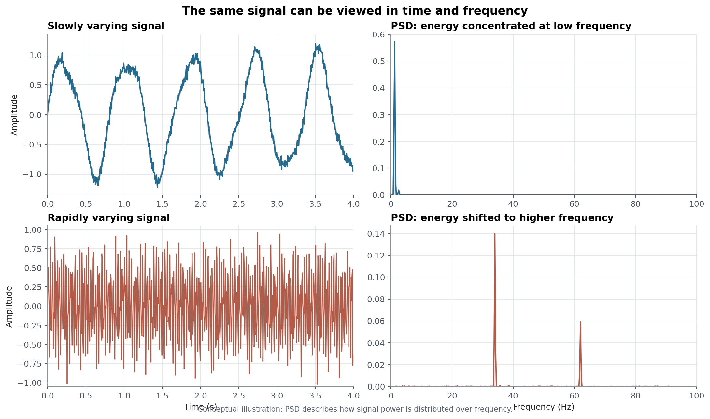

# IMU 噪声参数：噪声密度、角度随机游走、速度随机游走与零偏不稳定性

> 本文围绕 IMU 噪声分析中的几类核心参数展开：噪声密度、陀螺仪的角度随机游走、加速度计的速度随机游走，以及零偏不稳定性。它们对应不同的传感器和时间尺度，不能用同一个标准差混为一谈。

IMU 输出由真实运动、快速测量噪声和缓慢变化的零偏共同组成。噪声密度描述测量白噪声的强度；角度随机游走描述陀螺仪白噪声积分后的角度误差增长；速度随机游走描述加速度计白噪声积分后的速度误差增长；零偏不稳定性则需要分别描述陀螺仪和加速度计在更长时间尺度上的稳定程度。Allan 方差提供了一种按时间尺度区分这些成分的方法，文章最后再把识别出的参数接回 ESKF/预积分中的过程噪声协方差 $Q$。

这里先区分几组容易混淆的概念：噪声密度是测量端的白噪声参数；陀螺仪白噪声积分后表现为角度随机游走，加速度计白噪声积分后表现为速度随机游走；零偏随机游走是两个 bias 状态各自的过程模型；零偏不稳定性也要分别读取陀螺仪的 $B_g$ 和加速度计的 $B_a$。它们的作用对象和单位都不同。

**阅读路线：** 先定义 IMU 测量中的噪声和零偏，再说明 PSD、噪声密度与采样频率之间的关系；接着分别推导陀螺仪的角度随机游走和加速度计的速度随机游走，解释零偏随机游走与零偏不稳定性；最后介绍 Allan 方差如何从双对数图的斜率和谷底识别这些参数，并说明它们如何进入状态估计。如果还不熟悉 ESKF 的状态和协方差传播，可以先看 [ESKF（误差状态卡尔曼滤波）入门：从状态预测到误差注入](../ekf-again/index.html)；如果想了解噪声参数如何进入关键帧约束，可以继续看 [IMU 预积分详解：原理、推导与 C++/Eigen 实现](../imu-preintegration/index.html)。

一份 IMU 数据手册可能会给出如下参数：

- 陀螺仪噪声密度（Noise Density）：$0.005\ \mathrm{rad/s/\sqrt{Hz}}$
- 角度随机游走（Angle Random Walk，陀螺仪）：$0.2\ ^\circ/\sqrt{h}$
- 速度随机游走（Velocity Random Walk，加速度计）：$0.02\ \mathrm{m/s/\sqrt{h}}$
- 陀螺仪零偏不稳定性（Gyroscope Bias Instability）：$8\ ^\circ/h$
- 加速度计零偏不稳定性（Accelerometer Bias Instability）：$0.8\ \mathrm{mg}\approx0.0078\ \mathrm{m/s^2}$

这些参数分别描述测量白噪声、陀螺仪积分后的角度误差、加速度计积分后的速度误差，以及陀螺仪和加速度计各自的长期零偏稳定程度。它们的单位、读取方式和在滤波器中的作用并不相同。Allan 方差通过改变统计窗口的长度，把这些时间尺度不同的成分区分出来。

后文从测量模型和随机过程开始，逐步建立单位、积分增长率和 Allan 图斜率之间的对应关系。

---

## 1. IMU 测量中的噪声与零偏

一个 IMU（惯性测量单元）里有两个核心传感器：

- **陀螺仪**：测角速度 $\omega$，单位 $\mathrm{rad/s}$
- **加速度计**：测比力 $a$，单位 $\mathrm{m/s^2}$

实际传感器存在测量噪声和零偏，因此输出可以写成：

$$
\omega_m = \omega + b_g + n_g
$$

> **测量值 = 真值 + 零偏（bias）+ 噪声（noise）**

- $b_g$：**零偏**。一个缓慢变化的偏差，比如开机时陀螺明明没转，但输出 $0.01\ \mathrm{rad/s}$，而且这个值会慢慢漂。
- $n_g$：**噪声**。快速随机抖动，每个时刻都不一样。

加速度计同理：

$$
a_m = a + b_a + n_a
$$

本文后面会把这两个量拆成几类工程参数来描述：测量白噪声对应噪声密度，陀螺仪白噪声积分后的角度误差对应角度随机游走，加速度计白噪声积分后的速度误差对应速度随机游走，零偏的慢变化则通过随机游走和零偏不稳定性描述。

---

## 2. 噪声的随机过程表示

IMU 噪声不是一个固定的随机数，而是随时间产生的一串随机样本：

$$
n_1,\ n_2,\ n_3,\ n_4,\ \ldots
$$

每一个都是随机的，而且**随时间不断产生**。这种东西叫**随机过程**，写作 $n(t)$。

```
时间:   t1     t2     t3     t4     t5
        │      │      │      │      │
噪声:  0.2   -0.5    0.1    1.2   -0.3
```

把这种随时间变化的随机量写成 $n(t)$，就是随机过程的表示。

---

## 3. 白噪声模型

IMU 噪声最简单的模型是**白噪声**（White Noise）。它满足两条：

1. 每个时刻的噪声都服从 $N(0, \sigma^2)$
2. **不同时刻的噪声互不相关**：$E[n_i n_j] = 0, \quad i \neq j$

不相关条件的含义是：

> 这一毫秒的噪声，和下一毫秒的噪声，没有任何关系。你无法从现在的噪声预测未来的噪声。

“白”描述的是它在频率上的均匀性。在理想模型中，白噪声的功率谱密度在频率上保持平坦。

这种对频率分布的描述，就是下一节的功率谱密度（PSD）。

---

## 4. 功率谱密度与噪声频率分布

**功率谱密度（Power Spectral Density，PSD）**描述信号功率如何分布在不同频率上。

同一个信号可以从两个角度观察：时域中的波形，以及频域中的功率分布。下面的示意图用一组缓慢变化和一组快速变化的有限长度信号说明这种对应关系：



<em>这是概念性示意图，不是 IMU 实测数据。左列显示时域信号，右列显示对应的功率谱密度：慢变化信号的能量主要集中在低频，快速变化信号的能量向更高频移动。</em>

如果信号变化缓慢，它的主要能量会集中在低频；如果信号快速抖动，能量会分布到更高的频率范围。PSD 正是用来描述这种频率分布的量。

PSD 画出来就是一条曲线，横轴是频率，纵轴是该频率上"每 1 Hz 带宽里有多少功率"：

$$
S(f) \quad [\text{单位: 信号单位}^2 / \mathrm{Hz}]
$$

白噪声的特殊之处在于，它的 PSD 是**常数**：

$$
S(f) = S = \text{常数}
$$

因此，白噪声的功率谱密度可以近似看作常数。

> **PSD 高表示对应频率上的噪声更强；白噪声的 PSD 为常数，表示各频率上的功率密度相同。**

---

## 5. 噪声密度与测量标准差

先看陀螺仪的噪声密度。它是角速度噪声 PSD 的平方根：

陀螺仪噪声 $n_g$ 的 PSD 记为 $S_g$，单位是：

$$
(\mathrm{rad/s})^2 / \mathrm{Hz}
$$

（信号是角速度，单位 $\mathrm{rad/s}$；PSD 是"每 Hz 的功率"，功率是信号的平方，所以是 $(\mathrm{rad/s})^2/\mathrm{Hz}$。）

现在定义 **噪声密度（Noise Density）** 为 PSD 的平方根：

$$
N_g = \sqrt{S_g}
$$

单位自然就是：

$$
\sqrt{(\mathrm{rad/s})^2/\mathrm{Hz}} = \mathrm{rad/s/\sqrt{Hz}}
$$

**所以 $N_g$ 就是"陀螺仪白噪声的 PSD 开根号"，单位里的 $\sqrt{\mathrm{Hz}}$ 是从 PSD 的除法里开方开出来的。** 单位就是这么来的。

在带宽为 $B$ 的观测中，噪声密度与测量标准差的关系为：

假设我们观测的频率范围是带宽 $B$（单位 Hz），那么这 $B$ Hz 里总的噪声功率就是：

$$
\sigma^2 = S_g \cdot B
$$

（PSD 是"每 Hz 的功率"，乘以带宽 $B$ Hz 就是总功率。）

代入 $S_g = N_g^2$，开根号得到标准差：

$$
\boxed{\sigma = N_g \sqrt{B}}
$$

这就是噪声密度最重要的意义：

> **噪声密度 $N_g$ 告诉你在 1 Hz 带宽里噪声有多大；实际带宽 $B$ 里的标准差，是 $N_g\sqrt{B}$。**

### 一个数值例子

假设数据手册说陀螺仪噪声密度 $N_g = 0.01\ \mathrm{rad/s/\sqrt{Hz}}$，有效带宽 $B = 100\ \mathrm{Hz}$，那么：

$$
\sigma = 0.01 \times \sqrt{100} = 0.1\ \mathrm{rad/s}
$$

**注意：单次测量的标准差是 0.1，不是 0.01！** 0.01 是"每 1 Hz 带宽"的噪声，不是"每次测量"的噪声。这里最容易搞混。

---

## 6. 噪声密度到离散测量噪声

IMU 给你的是离散采样，不是连续信号。假设采样率 $f_s = 100\ \mathrm{Hz}$，那么采样间隔：

$$
\Delta t = \frac{1}{f_s} = 0.01\ \mathrm{s}
$$

离散采样时，**单个样本的标准差**由下式给出（推导：采样相当于用带宽 $\sim 1/\Delta t$ 观察信号，套用上一节的 $\sigma = N\sqrt{B}$）：

$$
\boxed{\sigma_{\text{sample}} = \frac{N}{\sqrt{\Delta t}}}
$$

用上面的数字：

$$
\sigma_{\text{sample}} = \frac{0.01}{\sqrt{0.01}} = 0.1\ \mathrm{rad/s}
$$

和上一节用带宽算出的 0.1 一致。两条路径得到同一结果：

```
噪声密度 N (rad/s/√Hz)
   │ 平方
   ▼
PSD S = N²
   │ 乘带宽（或除 Δt）
   ▼
方差 σ²
   │ 开根号
   ▼
测量标准差 σ
```

> **噪声密度 ≠ 单次测量的标准差。噪声密度 → PSD → 实际带宽/采样下的标准差。** 

另外注意一个反直觉的结论：**采样率越高（$\Delta t$ 越小），单样本噪声越大**（$\sigma_{\text{sample}} = N/\sqrt{\Delta t}$ 越大）。不过没关系：样本多了，平均后噪声反而变小。这正是 Allan 方差利用的性质。

---

## 7. 白噪声积分与角度随机游走

陀螺仪测的是角速度，而我们想要的是姿态角。角度 = 角速度的积分：

$$
\theta(t) = \int_0^t \omega(\tau)\,d\tau
$$

如果 $\omega$ 里有 PSD 为 $N^2$ 的白噪声 $n(\tau)$，积分后的角度误差方差为：

$$
\mathrm{Var}\big(\theta(T)\big) = N^2 \cdot T
$$

$$
\boxed{\sigma_\theta(T) = N\sqrt{T}}
$$

**关键结论：白噪声积分后，角度的不确定度随时间 $\sqrt{T}$ 增长。**

用刚才的例子，$N = 0.01\ \mathrm{rad/s/\sqrt{Hz}}$：

| 积分时长 $T$ | 角度噪声 $\sigma_\theta = N\sqrt{T}$ |
|---|---|
| 1 s | 0.01 rad ≈ 0.57° |
| 100 s | 0.1 rad ≈ 5.7° |
| 10000 s | 1 rad ≈ 57° |

这里的 $N$ 也可以用角度随机游走（Angle Random Walk，ARW）来表达。它描述陀螺仪角速度白噪声经过积分后，角度误差标准差随 $\sqrt{T}$ 增长的强度。若 $N$ 的单位是 $\mathrm{rad/s/\sqrt{Hz}}$，换成常见的 $\mathrm{deg/\sqrt{h}}$ 时，需要同时进行弧度到角度、秒到小时的单位换算。

### 7.1 加速度计白噪声与速度随机游走

加速度计测量的是比力，积分一次后得到速度。因此，加速度计白噪声对应的积分误差不是角度，而是速度。设加速度计白噪声的噪声密度为 $N_a$，则

$$
\mathrm{Var}\big(\delta v(T)\big)=N_a^2T,
$$

$$
\boxed{\sigma_v(T)=N_a\sqrt{T}}.
$$

这个量称为速度随机游走（Velocity Random Walk，VRW）。它与上一节的角度随机游走完全对称：陀螺仪的角速度白噪声积分成角度误差，加速度计的加速度白噪声积分成速度误差。两者的区别只在于传感器输出和积分结果不同：

| 传感器 | 白噪声输入 | 积分后的误差 | 常见随机游走参数 |
|---|---|---|---|
| 陀螺仪 | 角速度 | 角度 | ARW，常见单位 $\mathrm{deg/\sqrt{h}}$ |
| 加速度计 | 加速度/比力 | 速度 | VRW，常见单位 $\mathrm{m/s/\sqrt{h}}$ |

因此，给定加速度计噪声密度 $N_a$ 后，可以用同样的时间单位换算得到 VRW。这里的 VRW 不是 bias 的随机游走；它描述的是测量白噪声对速度积分的影响。

---

## 8. 两类零偏的随机游走与不稳定性

测量白噪声之外，陀螺仪零偏 $b_g$ 和加速度计零偏 $b_a$ 都会随时间缓慢变化。对任意一种传感器 bias，常用的随机游走模型都可以写成：

$$
\mathbf b_s=\begin{cases}
\mathbf b_g,&s=g\\
\mathbf b_a,&s=a
\end{cases},
\qquad
\dot{\mathbf b}_s=\mathbf w_s .
$$

$$
\mathbf b_s(t)=\mathbf b_s(0)+\int_0^t\mathbf w_s(\tau)\,d\tau
$$

其中 $\mathbf w_s$ 是对应传感器的 bias 随机游走白噪声。也就是说，两个零偏都可以有自己的随机游走系数：$K_g$ 描述陀螺仪 bias 的变化，$K_a$ 描述加速度计 bias 的变化。

白噪声积分出来的东西，就是**随机游走（Random Walk）**：它描述 bias 状态如何随时间变化，而不是描述测量白噪声积分后的 ARW 或 VRW。

对任意一个传感器分量，离散模型为

$$
b_{s,k+1}=b_{s,k}+w_{s,k}.
$$

如果各步独立，方差直接相加：

$$
\mathrm{Var}(b_{s,N}) = N\sigma_{w_s}^2
$$

$$
\sigma_{b_s} = \sqrt{N}\,\sigma_{w_s}
$$

而 $N \propto t$（时间越长样本越多），所以：

$$
\boxed{\sigma_b \propto \sqrt{t}}
$$

这里的随机游走描述零偏状态本身如何变化；第 7 节的 ARW/VRW 描述测量白噪声积分后的姿态/速度误差增长。它们都出现 $\sqrt{t}$，但作用对象和单位不同，不能混为同一个参数。

现在对比一下两种噪声：

| | 白噪声（测量噪声） | 随机游走（零偏漂移） |
|---|---|---|
| 作用位置 | 直接加在测量值上 | 加在 bias 上，bias 再影响测量 |
| 时间表现 | 快速抖动 | 缓慢漂移 |
| 累积效果 | 积分后 $\propto \sqrt{t}$ | 本身就是 $\propto \sqrt{t}$ |
| 在状态估计里 | 观测噪声 | **通常作为 bias 状态及其过程噪声建模** |

因此 VIO/ESKF 的状态中通常包含 $b_g,b_a$，并分别用 $K_g,K_a$ 描述它们的随机游走。零偏不稳定性也要分别从两条 Allan 曲线的谷底读取：$B_g$ 的单位是角速度，$B_a$ 的单位是加速度；二者都不是与随机游走系数完全相同的过程参数。

---

## 9. 从静止数据识别噪声参数

现在你手里有一段静止的 IMU 数据（陀螺仪放在桌上不动）：

$$
\omega_1, \omega_2, \ldots, \omega_{100000}
$$

目标是从这段数据中识别噪声密度，并将陀螺仪和加速度计的白噪声分别换算成 ARW 和 VRW，同时估计零偏不稳定性和零偏随机游走。

直接计算整体标准差并不能完成这个任务：

- **短时间尺度**主要由白噪声决定；
- **长时间尺度**会受到零偏漂移影响。

因此，整体标准差既不能直接代表噪声密度，也不能直接代表零偏不稳定性。需要使用随窗口长度变化的统计量，把不同时间尺度分开。

Allan 方差正是为这种时间尺度分析设计的。

---

## 10. Allan 方差的定义

Allan 方差通过不同窗口长度 $\tau$ 计算相邻簇均值的差异：

### 10.1 按窗口长度计算簇均值

把 $N$ 个样本按时间窗口 $\tau$ 分组。假设 $\tau$ 包含 $m$ 个样本，每个簇的平均值为：

$$
\bar{y}_k = \frac{1}{m}\sum_{i=1}^{m} y_{k m + i}
$$

```
簇1: [y1 y2 ... ym]   → 平均值 ȳ1
簇2: [ym+1 ... y2m]   → 平均值 ȳ2
簇3: [y2m+1 ... y3m]  → 平均值 ȳ3
...
```

### 10.2 计算相邻簇均值差

$$
\Delta_k = \bar{y}_{k+1} - \bar{y}_k
$$

### 10.3 形成 Allan 方差

$$
\boxed{\sigma^2(\tau) = \frac{1}{2} \left\langle (\bar{y}_{k+1} - \bar{y}_k)^2 \right\rangle}
$$

其中 $\langle \cdot \rangle$ 表示对所有 $k$ 取平均。**这就是 Allan 方差的定义。**

除以 $1/2$ 是 Allan 方差的归一化定义，用来表示相邻簇均值差异的单簇尺度。

 **Allan 标准差（Allan Deviation）** 就是它的平方根 $\sigma(\tau)$。

现在关键来了：**把窗口 $\tau$ 从很小变到很大，会怎样？**

- **$\tau$ 很小**（比如 0.01 s）：簇内只有几个样本，平均几乎消不掉噪声 → $\bar{y}_k$ 里白噪声占主导 → $\sigma(\tau)$ 反映**白噪声**
- **$\tau$ 很大**（比如 100 s）：簇内成百上千个样本，白噪声被平均得差不多了，但 bias 漂移在长窗口里累积明显 → $\sigma(\tau)$ 反映**随机游走/零偏漂移**

所以：

> **Allan 方差把窗口长度 $\tau$ 作为时间尺度，在不同 $\tau$ 上观察噪声成分的变化。**

---

## 11. 从 Allan 图读取噪声参数

把不同 $\tau$ 算出来的 $\sigma(\tau)$ 画在双对数坐标上（横轴 $\tau$，纵轴 $\sigma(\tau)$），得到 Allan deviation 曲线。下面给出一组有限长度静止 IMU 仿真数据的示例：


<em>这是由有限长度静止 IMU 仿真数据计算得到的示意图，不是某一款真实传感器的实测结果。曲线包含白噪声、缓慢变化的零偏、零偏随机游走和有限样本统计起伏；蓝色与红色虚线分别标出 $-1/2$ 和 $+1/2$ 的局部参考斜率。实际陀螺仪和加速度计应分别使用各自的静止数据计算 Allan deviation，左侧 $-1/2$ 段分别换算为 ARW 和 VRW。</em>

对陀螺仪和加速度计分别计算 Allan deviation。在各自的双对数图上，斜率和谷底对应不同的时间尺度。白噪声段都具有 $-1/2$ 斜率，但陀螺仪的读数换算为 ARW，加速度计的读数换算为 VRW。

| 斜率 | 噪声类型 | 读出的参数 |
|---|---|---|
| $-1$ | 量化噪声 | 量化系数 $Q$ |
| $-1/2$ | 角速度白噪声 | 陀螺仪噪声密度 $N_g$，换写为 ARW |
| $-1/2$ | 加速度白噪声 | 加速度计噪声密度 $N_a$，换写为 VRW |
| $0$（谷底） | 零偏不稳定性 | 陀螺仪 $B_g$；加速度计 $B_a$ |
| $+1/2$ | 零偏随机游走 | 系数 $K$ |
| $+1$ | 速率斜坡 | $R$ |

量化噪声和速率斜坡是 Allan 分析中可能出现的其他成分，本文不展开。需要注意，ARW 和 VRW 都来自各自传感器白噪声段的 $-1/2$ 斜率，它们不是两条新的斜率。下面分别说明这些参数的读取方式。

### 11.1 噪声密度与角度随机游走

白噪声的 Allan 方差可以严格推出：

$$
\sigma^2(\tau) = \frac{N^2}{\tau}
$$

$$
\sigma(\tau) = \frac{N}{\sqrt{\tau}}
$$

取对数：$\log\sigma = \log N - \frac{1}{2}\log\tau$，所以斜率是 $-1/2$。

当 $\tau = 1\ \mathrm{s}$ 时，$\sigma(1) = N$。也就是说：

> **在 Allan 图上，斜率为 $-1/2$ 的白噪声段延伸到 $\tau = 1\,\mathrm{s}$ 处的读数，对应角速度噪声密度 $N$。**

这个 $N$ 也可以用角度随机游走（Angle Random Walk，ARW）表示。二者描述的是同一类陀螺仪白噪声，只是单位和使用场景不同：$N$ 常写成 $\mathrm{rad/s/\sqrt{Hz}}$，ARW 常写成 $\mathrm{deg/\sqrt{h}}$。从 $N$ 到 ARW 需要同时进行弧度到角度、秒到小时的单位换算。

直觉也说得通：$\tau$ 越大，簇内平均的样本越多，白噪声被平均掉得越多，所以 $\sigma(\tau)$ 随 $\tau$ 增大而减小。

### 11.2 加速度计噪声密度与速度随机游走

对加速度计使用同样的 Allan 分析。若加速度计白噪声密度为 $N_a$，其 Allan deviation 的白噪声段仍满足

$$
\sigma_a(\tau)=\frac{N_a}{\sqrt{\tau}}.
$$

因此，在 $\tau=1\,\mathrm{s}$ 处读取该段的值，可以得到加速度计噪声密度 $N_a$；再将单位从 $\mathrm{m/s^2/\sqrt{Hz}}$ 换成 $\mathrm{m/s/\sqrt{h}}$，就是常见的速度随机游走 VRW。它表示加速度白噪声经过一次积分后，速度误差按

$$
\sigma_v(T)=N_a\sqrt{T}
$$

增长的强度。

### 11.3 零偏随机游走

零偏随机游走（$b_g$ 的漂移）的 Allan 方差为：

$$
\sigma^2(\tau) = \frac{K^2 \tau}{3}
$$

$$
\sigma(\tau) = K\sqrt{\frac{\tau}{3}}
$$

取对数斜率是 $+1/2$。直觉：$\tau$ 越大，bias 漂移累积得越久，$\sigma(\tau)$ 越大。

> **斜率为 $+1/2$ 的段，读出 $K = \sigma(\tau)\sqrt{3/\tau}$，就是随机游走系数。**

### 11.4 陀螺仪与加速度计的零偏不稳定性

两条 Allan 曲线各自的最低点（斜率转 0 的地方）对应各自的**零偏不稳定性**：陀螺仪谷底给出 $B_g$，加速度计谷底给出 $B_a$。它们的估计形式分别为

$$
B_g \approx \frac{\sigma_{g,\min}}{0.664},
\qquad
B_a \approx \frac{\sigma_{a,\min}}{0.664}.
$$

$B_g$ 的单位是角速度，例如 $\mathrm{deg/h}$；$B_a$ 的单位是加速度，例如 $\mathrm{m/s^2}$ 或 $\mathrm{mg}$。它们分别描述陀螺仪和加速度计在对应时间尺度上的零偏稳定程度，不能把陀螺仪的 $B_g$ 直接用于加速度计。

---

## 12. 噪声参数如何进入状态估计

对静止数据进行 Allan 分析后，陀螺仪和加速度计分别可以得到各自的测量噪声密度、零偏随机游走系数和零偏不稳定性 $B_g/B_a$。陀螺仪噪声密度可换算成角度随机游走 ARW，加速度计噪声密度可换算成速度随机游走 VRW。

$$
N_g,\ N_a \quad (\text{测量噪声密度}), \qquad K_g,\ K_a \quad (\text{零偏随机游走})
$$

在基本 ESKF/预积分模型中，真正进入连续时间过程噪声协方差的是测量噪声密度和零偏随机游走系数：

$$
Q_c = \begin{bmatrix}
N_g^2 I & & & \\
& N_a^2 I & & \\
& & K_g^2 I & \\
& & & K_a^2 I
\end{bmatrix}
$$

然后经过离散化，变成滤波器/优化器里实际用的 $Q$，进入协方差传播：

$$
P_{k+1} = F P_k F^T + G Q G^T
$$

离散化后，它们形成滤波器或优化器中的过程噪声协方差。角度随机游走和速度随机游走提供白噪声积分后的姿态、速度误差尺度；$B_g$ 和 $B_a$ 则分别检查陀螺仪、加速度计在更长时间尺度上的 bias 稳定程度。

于是：

> **$Q$ 不是凭空指定的矩阵，而是这一小段时间里 IMU 噪声给状态增加的不确定性。** 其中陀螺仪和加速度计噪声密度决定噪声如何进入姿态和速度，$K_g/K_a$ 决定两个 bias 状态如何变化；ARW、VRW 和 $B_g/B_a$ 帮助检查这些参数在不同时间尺度上的物理含义和数量级。

一句话总结整条链路：

```
静止 IMU 数据
   ↓ 按不同窗口 τ 分组、相邻簇求差、取方差
Allan 方差 σ²(τ)
   ↓ 在 log-log 图上按斜率分段
噪声密度 N、ARW/VRW、零偏随机游走 K、零偏不稳定性 B_g/B_a
   ↓ 拼成对角阵
连续噪声协方差 Qc
   ↓ 离散化
离散噪声协方差 Q
   ↓ 代入
P = FPFᵀ + GQGᵀ   （ESKF / 预积分 / 因子图）
```

---

## 13. 附：用 Python 计算 Allan 方差

最后附一段最小实现：

```python
import numpy as np

def allan_variance(data, fs, taus):
    """
    data: 静止 IMU 数据（一维，如某轴陀螺仪）
    fs  : 采样率 (Hz)
    taus: 要计算的窗口时长列表 (s)
    返回: (taus, allan_deviation)
    """
    data = np.asarray(data, dtype=float)
    n = len(data)
    adevs = []
    for tau in taus:
        m = int(round(tau * fs))          # 每个簇的样本数
        if m < 1 or m > n // 2:
            continue
        n_clusters = n // m               # 簇的数量
        clusters = data[:n_clusters * m].reshape(n_clusters, m)
        means = clusters.mean(axis=1)     # 每个簇的平均值 ȳ_k
        diffs = np.diff(means)            # 相邻簇之差 ȳ_{k+1} - ȳ_k
        avar = 0.5 * np.mean(diffs ** 2)  # Allan 方差定义
        adevs.append(np.sqrt(avar))
    return taus[:len(adevs)], np.array(adevs)

# 用法示例：仿真一段含白噪声+随机游走的数据
fs = 200.0
t = np.arange(0, 2000, 1 / fs)
N = 0.005          # 噪声密度 rad/s/√Hz
K = 0.0001         # 随机游走系数
data = np.random.randn(len(t)) * N / np.sqrt(1 / fs)   # 白噪声
data += np.cumsum(np.random.randn(len(t))) * K * np.sqrt(1 / fs)  # 随机游走

taus = np.logspace(-1.5, 2.5, 40)         # τ 从 0.03s 到 300s
taus, adev = allan_variance(data, fs, taus)

# 双对数作图
import matplotlib.pyplot as plt
plt.loglog(taus, adev, 'o-')
plt.xlabel(r'$\tau$ (s)'); plt.ylabel(r'$\sigma(\tau)$')
plt.grid(True, which='both', ls='--', alpha=0.5)
plt.show()
```

这段代码计算 Allan deviation。对陀螺仪或加速度计数据，左侧 $-1/2$ 斜率都对应各自的测量白噪声：陀螺仪由此换算 ARW，加速度计由此换算 VRW；中间谷底分别给出 $B_g$ 和 $B_a$，右侧 $+1/2$ 斜率分别给出 $K_g$ 和 $K_a$ 的估计。

---

## 总结：噪声参数的对应关系

```
噪声类型          时间表现         Allan 图斜率     读出的参数
─────────────────────────────────────────────────────────────
陀螺仪白噪声      快速角速度抖动   -1/2            $N_g$ → ARW
加速度计白噪声    快速加速度抖动   -1/2            $N_a$ → VRW
陀螺仪零偏不稳定性  长期角速度漂移   0 (谷底)         B_g
加速度计零偏不稳定性 长期加速度漂移  0 (谷底)         B_a
零偏随机游走        累积漂移         +1/2            K_g/K_a
量化噪声          阶梯状           -1              Q
```

需要记住的核心结论：

1. **噪声密度 $N$ 是 PSD 的平方根**，单位 $\mathrm{rad/s/\sqrt{Hz}}$ 来自"每 Hz 带宽的噪声"，**不等于**单次测量标准差；实际标准差是 $N\sqrt{B}$ 或 $N/\sqrt{\Delta t}$。
2. **陀螺仪白噪声积分后形成角度随机游走 ARW，加速度计白噪声积分后形成速度随机游走 VRW。** 二者都来自各自白噪声段的 $-1/2$ 斜率，但积分结果和单位不同。
3. **零偏随机游走是两个 bias 状态各自的过程模型，零偏不稳定性则分别由两条 Allan 曲线的谷底给出 $B_g$ 和 $B_a$。** 二者相关但不等价。
4. **Allan 方差用不同窗口 $\tau$ 分离时间尺度：$-1/2$ 段识别噪声密度并换算 ARW/VRW，两个谷底分别估计 $B_g/B_a$，$+1/2$ 段分别识别 $K_g/K_a$。**
