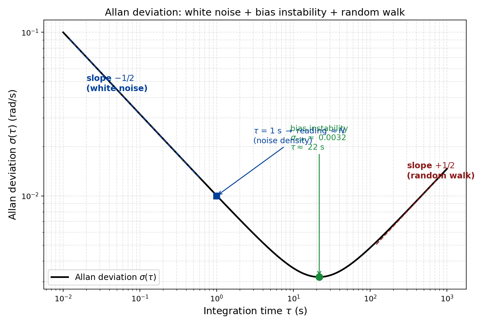

# 从 IMU 噪声到 Allan 方差：一步步讲给零基础

拿到一个 IMU，你打开数据手册，会看到这样的参数：

- 陀螺仪噪声密度（Noise Density）：$0.005\ \mathrm{rad/s/\sqrt{Hz}}$
- 角度随机游走（Angle Random Walk）：$0.2\ ^\circ/\sqrt{h}$
- 零偏不稳定性（Bias Instability）：$8\ ^\circ/h$

这些数字是什么意思？为什么单位这么奇怪？它们是怎么测出来的？为什么搞 SLAM 的人一谈到 IMU 就绕不开 **Allan 方差**？

这篇文章的目标就是回答这些问题。全程只需要：小学的加法、一点点概率直觉、和"积分就是累加"这一个概念。

---

## 1. IMU 在测什么

一个 IMU（惯性测量单元）里有两个核心传感器：

- **陀螺仪**：测角速度 $\omega$，单位 $\mathrm{rad/s}$
- **加速度计**：测比力 $a$，单位 $\mathrm{m/s^2}$

问题是，传感器不完美。它的输出不是真值，而是：

$$
\omega_m = \omega + b_g + n_g
$$

翻译成人话：

> **测量值 = 真值 + 零偏（bias）+ 噪声（noise）**

- $b_g$：**零偏**。一个缓慢变化的偏差，比如开机时陀螺明明没转，但输出 $0.01\ \mathrm{rad/s}$，而且这个值会慢慢漂。
- $n_g$：**噪声**。快速随机抖动，每个时刻都不一样。

加速度计同理：

$$
a_m = a + b_a + n_a
$$

这篇文章我们只关心一件事：**$n_g$ 和 $b_g$ 到底是什么样的随机过程，怎么用数字描述它们，怎么从实测数据里把它们估计出来。** 最后你会发现，这条路走到底，就是 Allan 方差。

---

## 2. 从随机变量到随机过程

你学过概率，知道随机变量 $X \sim N(0, \sigma^2)$ 是什么：一个数，随机取值，服从高斯分布。

但 IMU 的噪声不是"一个数"，它是**每秒给你几千个数的连续序列**：

$$
n_1,\ n_2,\ n_3,\ n_4,\ \ldots
$$

每一个都是随机的，而且**随时间不断产生**。这种东西叫**随机过程**，写作 $n(t)$。

```
时间:   t1     t2     t3     t4     t5
        │      │      │      │      │
噪声:  0.2   -0.5    0.1    1.2   -0.3
```

随机过程听起来吓人，但它只是"随时间变化的随机变量序列"，仅此而已。

---

## 3. 白噪声：最基础的噪声模型

IMU 噪声最简单的模型是**白噪声**（White Noise）。它满足两条：

1. 每个时刻的噪声都服从 $N(0, \sigma^2)$
2. **不同时刻的噪声互不相关**：$E[n_i n_j] = 0, \quad i \neq j$

第二条是关键。它说的是：

> 这一毫秒的噪声，和下一毫秒的噪声，没有任何关系。你无法从现在的噪声预测未来的噪声。

为什么叫"白"？因为白光包含所有频率的光。类比过来：

> 白噪声在所有频率上都有**一样多的能量**。

这个"能量在频率上怎么分布"的描述，就是下一节的 PSD。

---

## 4. PSD：噪声能量在频率上的分布

**功率谱密度（Power Spectral Density，PSD）** 是信号处理里最唬人的词之一，但它的直觉非常简单：

> PSD 回答一个问题：这个信号的能量，主要分布在哪些频率上？

想象一个信号：

```
低频（慢慢漂移）         高频（快速抖动）
←─────────────────────────────────────→
```

- 如果信号主要是缓慢漂移，能量集中在**低频**
- 如果信号是快速抖动，能量集中在**高频**

PSD 画出来就是一条曲线，横轴是频率，纵轴是该频率上"每 1 Hz 带宽里有多少功率"：

$$
S(f) \quad [\text{单位: 信号单位}^2 / \mathrm{Hz}]
$$

白噪声的特殊之处在于，它的 PSD 是**常数**：

$$
S(f) = S = \text{常数}
$$

所有频率一样多，所以叫"白"。这就是"白噪声"这个名字的全部来历。

> **重要直觉：PSD 高 → 那个频率上的噪声强。PSD 是常数 → 所有频率一样强。**

---

## 5. 噪声密度：rad/s/√Hz 到底怎么来的

现在到了你最大的困惑：**为什么陀螺仪噪声密度的单位是 $\mathrm{rad/s/\sqrt{Hz}}$？**

一步步来。

陀螺仪噪声 $n_g$ 的 PSD 记为 $S_g$，单位是：

$$
(\mathrm{rad/s})^2 / \mathrm{Hz}
$$

（信号是角速度，单位 $\mathrm{rad/s}$；PSD 是"每 Hz 的功率"，功率是信号的平方，所以是 $(\mathrm{rad/s})^2/\mathrm{Hz}$。）

现在定义 **噪声密度（Noise Density）** 为 PSD 的平方根：

$$
N_g = \sqrt{S_g}
$$

单位自然就是：

$$
\sqrt{(\mathrm{rad/s})^2/\mathrm{Hz}} = \mathrm{rad/s/\sqrt{Hz}}
$$

**所以 $N_g$ 就是"陀螺仪白噪声的 PSD 开根号"，单位里的 $\sqrt{\mathrm{Hz}}$ 是从 PSD 的除法里开方开出来的。** 它不是凭空出现的，也不是某个魔法常数。

现在回答最关键的问题：**噪声密度和标准差是什么关系？**

假设我们观测的频率范围是带宽 $B$（单位 Hz），那么这 $B$ Hz 里总的噪声功率就是：

$$
\sigma^2 = S_g \cdot B
$$

（PSD 是"每 Hz 的功率"，乘以带宽 $B$ Hz 就是总功率。）

代入 $S_g = N_g^2$，开根号得到标准差：

$$
\boxed{\sigma = N_g \sqrt{B}}
$$

这就是噪声密度最重要的意义：

> **噪声密度 $N_g$ 告诉你在 1 Hz 带宽里噪声有多大；实际带宽 $B$ 里的标准差，是 $N_g\sqrt{B}$。**

### 举个具体例子

假设数据手册说陀螺仪噪声密度 $N_g = 0.01\ \mathrm{rad/s/\sqrt{Hz}}$，有效带宽 $B = 100\ \mathrm{Hz}$，那么：

$$
\sigma = 0.01 \times \sqrt{100} = 0.1\ \mathrm{rad/s}
$$

**注意：单次测量的标准差是 0.1，不是 0.01！** 0.01 是"每 1 Hz 带宽"的噪声，不是"每次测量"的噪声。这是最容易搞混的地方。

---

## 6. 采样频率如何介入：σ_sample = N / √Δt

IMU 给你的是离散采样，不是连续信号。假设采样率 $f_s = 100\ \mathrm{Hz}$，那么采样间隔：

$$
\Delta t = \frac{1}{f_s} = 0.01\ \mathrm{s}
$$

离散采样时，**单个样本的标准差**由下式给出（推导：采样相当于用带宽 $\sim 1/\Delta t$ 观察信号，套用上一节的 $\sigma = N\sqrt{B}$）：

$$
\boxed{\sigma_{\text{sample}} = \frac{N}{\sqrt{\Delta t}}}
$$

用上面的数字：

$$
\sigma_{\text{sample}} = \frac{0.01}{\sqrt{0.01}} = 0.1\ \mathrm{rad/s}
$$

和上一节用带宽算出来的 0.1 完全吻合。这两条路殊途同归：

```
噪声密度 N (rad/s/√Hz)
   │ 平方
   ▼
PSD S = N²
   │ 乘带宽（或除 Δt）
   ▼
方差 σ²
   │ 开根号
   ▼
测量标准差 σ
```

> **噪声密度 ≠ 单次测量的标准差。噪声密度 → PSD → 实际带宽/采样下的标准差。** 这一条值得反复念三遍。

另外注意一个反直觉的结论：**采样率越高（$\Delta t$ 越小），单样本噪声越大**（$\sigma_{\text{sample}} = N/\sqrt{\Delta t}$ 越大）。但别担心——样本多了，平均之后噪声反而变小。这正是 Allan 方差利用的性质。

---

## 7. 白噪声积分：误差随 √t 增长

陀螺仪测的是角速度，而我们想要的是姿态角。角度 = 角速度的积分：

$$
\theta(t) = \int_0^t \omega(\tau)\,d\tau
$$

如果 $\omega$ 里有白噪声 $n(\tau)$（PSD 为 $N^2$），积分后角度里的噪声是多少？

直觉想一下：白噪声每时每刻都在随机扰动，积分就是不断累加这些扰动。累加的结果不会抵消（因为是随机游走式的累积），而是：

$$
\mathrm{Var}\big(\theta(T)\big) = N^2 \cdot T
$$

$$
\boxed{\sigma_\theta(T) = N\sqrt{T}}
$$

**关键结论：白噪声积分后，角度的不确定度随时间 $\sqrt{T}$ 增长。**

用刚才的例子，$N = 0.01\ \mathrm{rad/s/\sqrt{Hz}}$：

| 积分时长 $T$ | 角度噪声 $\sigma_\theta = N\sqrt{T}$ |
|---|---|
| 1 s | 0.01 rad ≈ 0.57° |
| 100 s | 0.1 rad ≈ 5.7° |
| 10000 s | 1 rad ≈ 57° |

看到没有：**即使纯白噪声，纯积分也会越漂越远**，而且漂移速度是 $\sqrt{T}$。这就是为什么 IMU 不能单独用——几秒内还行，几分钟就废了。

---

## 8. 随机游走：另一种"噪声"

白噪声是直接加在测量上的。但零偏 $b_g$ 是另一种东西：它本身在缓慢地随机变化。

建模为：

$$
\dot{b}_g = w(t)
$$

其中 $w(t)$ 是白噪声。也就是说，**零偏的"变化率"是白噪声**。积分一下：

$$
b_g(t) = b_g(0) + \int_0^t w(\tau)\,d\tau
$$

白噪声积分出来的东西，就是**随机游走（Random Walk）**——一个不断累积、越走越远的随机过程。

离散版本更直观。设 $b_{k+1} = b_k + w_k$，$w_k \sim N(0, \sigma_w^2)$，那么：

$$
b_N = b_0 + w_1 + w_2 + \cdots + w_N
$$

因为各 $w_k$ 独立，方差直接相加：

$$
\mathrm{Var}(b_N) = N\sigma_w^2
$$

$$
\sigma_b = \sqrt{N}\,\sigma_w
$$

而 $N \propto t$（时间越长样本越多），所以：

$$
\boxed{\sigma_b \propto \sqrt{t}}
$$

**又是 $\sqrt{t}$！** 白噪声积分是 $\sqrt{t}$，随机游走也是 $\sqrt{t}$——它们本质上是同一件事：白噪声经过一次积分。

现在对比一下两种噪声：

| | 白噪声（测量噪声） | 随机游走（零偏漂移） |
|---|---|---|
| 作用位置 | 直接加在测量值上 | 加在 bias 上，bias 再影响测量 |
| 时间表现 | 快速抖动 | 缓慢漂移 |
| 累积效果 | 积分后 $\propto \sqrt{t}$ | 本身就是 $\propto \sqrt{t}$ |
| 在状态估计里 | 观测噪声 | **必须当成状态量估计** |

所以 VIO 的状态向量里必然有 $b_g, b_a$，不是数学家强迫症，而是**零偏真的是个会漂的随机量，不估计它，误差就会按 $\sqrt{t}$ 累积**。

---

## 9. 核心问题：一段静止数据，噪声参数怎么定？

现在你手里有一段静止的 IMU 数据（陀螺仪放在桌上不动）：

$$
\omega_1, \omega_2, \ldots, \omega_{100000}
$$

你想知道：**这里面的噪声参数（白噪声强度、随机游走强度）是多少？**

最自然的想法是算标准差 $\mathrm{std}(\omega)$。但问题来了：

- **短时间尺度**看：主要是白噪声在跳
- **长时间尺度**看：bias 在慢慢漂，把标准差拉大

这两种噪声混在一起，一个简单的 $\mathrm{std}(\omega)$ 根本分不开。你算出来的数，既不是白噪声强度，也不是随机游走强度，而是个大杂烩。

> **不同时间尺度，要用不同的"放大镜"去看。这就是 Allan 方差的全部动机。**

---

## 10. Allan 方差：一步步推导

Allan 方差（Allan Variance）的思想简单到令人发指，就三步：

### 第 1 步：把数据切成"簇"

把 $N$ 个样本按时间窗口 $\tau$ 分组。假设 $\tau$ 包含 $m$ 个样本，每个簇的平均值为：

$$
\bar{y}_k = \frac{1}{m}\sum_{i=1}^{m} y_{k m + i}
$$

```
簇1: [y1 y2 ... ym]   → 平均值 ȳ1
簇2: [ym+1 ... y2m]   → 平均值 ȳ2
簇3: [y2m+1 ... y3m]  → 平均值 ȳ3
...
```

### 第 2 步：相邻簇均值做差

$$
\Delta_k = \bar{y}_{k+1} - \bar{y}_k
$$

### 第 3 步：差的方差，除以 2

$$
\boxed{\sigma^2(\tau) = \frac{1}{2} \left\langle (\bar{y}_{k+1} - \bar{y}_k)^2 \right\rangle}
$$

其中 $\langle \cdot \rangle$ 表示对所有 $k$ 取平均。**这就是 Allan 方差的定义。**

为什么要 $\frac{1}{2}$？因为相邻两个簇的均值都含噪声，差的方差是单个簇的两倍，除以 2 就还原成"单个簇均值的方差"。这是归一化，不用纠结。

 **Allan 标准差（Allan Deviation）** 就是它的平方根 $\sigma(\tau)$。

现在关键来了：**把窗口 $\tau$ 从很小变到很大，会怎样？**

- **$\tau$ 很小**（比如 0.01 s）：簇内只有几个样本，平均几乎消不掉噪声 → $\bar{y}_k$ 里白噪声占主导 → $\sigma(\tau)$ 反映**白噪声**
- **$\tau$ 很大**（比如 100 s）：簇内成百上千个样本，白噪声被平均得差不多了，但 bias 漂移在长窗口里累积明显 → $\sigma(\tau)$ 反映**随机游走/零偏漂移**

所以：

> **Allan 方差 = 用不同大小的"时间放大镜"，把混在一起的噪声按时间尺度分开。**

这就是它的全部秘密。它不是一个数学炫技，而是一个**显微镜**。

---

## 11. Allan 图怎么读：斜率就是噪声的指纹

把不同 $\tau$ 算出来的 $\sigma(\tau)$ 画在双对数坐标上（横轴 $\tau$，纵轴 $\sigma(\tau)$），得到经典的 Allan 曲线：

实际曲线大致长这样：



<em>黑色实线为按白噪声 $\sigma(\tau)=N/\sqrt{\tau}$、零偏不稳定性（常数项）与随机游走 $\sigma(\tau)=K\sqrt{\tau/3}$ 三个模型叠加合成的 Allan 曲线（$N=0.01$，$B=0.0015$，$K=0.0008$）。蓝色虚线为 $-1/2$ 斜率参考（白噪声段），红色虚线为 $+1/2$ 斜率参考（随机游走段），绿点为谷底（零偏不稳定性），蓝色方块为 $\tau=1$ s 处读数</em>

```
log σ(τ)
 │\
 │ \      ← 斜率 -1/2：白噪声（角度随机游走）
 │  \
 │   \____
 │        \   ← 谷底：零偏不稳定性
 │         \
 │          \   ← 斜率 +1/2：零偏随机游走
 │           \
 └──────────────────→ log τ
```

**不同直线段的斜率，对应不同的噪声类型**，这就是 Allan 方差最强大的地方：

| 斜率 | 噪声类型 | 读出的参数 |
|---|---|---|
| $-1$ | 量化噪声 | 量化系数 $Q$ |
| $-1/2$ | 白噪声 | 噪声密度 $N$ |
| $0$（谷底） | 零偏不稳定性 | $B$ |
| $+1/2$ | 随机游走 | 随机游走系数 $K$ |
| $+1$ | 速率斜坡 | $R$ |

为什么斜率是这样？我们只推两个最重要的。

### 白噪声段（斜率 $-1/2$）

白噪声的 Allan 方差可以严格推出：

$$
\sigma^2(\tau) = \frac{N^2}{\tau}
$$

$$
\sigma(\tau) = \frac{N}{\sqrt{\tau}}
$$

取对数：$\log\sigma = \log N - \frac{1}{2}\log\tau$，所以斜率是 $-1/2$。

**并且**：当 $\tau = 1\ \mathrm{s}$ 时，$\sigma(1) = N$。也就是说——

> **在 Allan 图上，斜率为 $-1/2$ 的直线段延伸到 $\tau = 1$ 处的读数，就是噪声密度 $N$！**

这也解释了为什么噪声密度单位是 $\mathrm{rad/s/\sqrt{Hz}}$：$\sigma(1s)$ 的单位是 $\mathrm{rad/s}$，除以 $\sqrt{1\ \mathrm{Hz}}$ 的根号因子后就是 $\mathrm{rad/s/\sqrt{Hz}}$。**Allan 方差和 PSD 在这里完美对上。**

直觉也说得通：$\tau$ 越大，簇内平均的样本越多，白噪声被平均掉得越多，所以 $\sigma(\tau)$ 随 $\tau$ 增大而减小。

### 随机游走段（斜率 $+1/2$）

零偏随机游走（$b_g$ 的漂移）的 Allan 方差为：

$$
\sigma^2(\tau) = \frac{K^2 \tau}{3}
$$

$$
\sigma(\tau) = K\sqrt{\frac{\tau}{3}}
$$

取对数斜率是 $+1/2$。直觉：$\tau$ 越大，bias 漂移累积得越久，$\sigma(\tau)$ 越大。

> **斜率为 $+1/2$ 的段，读出 $K = \sigma(\tau)\sqrt{3/\tau}$，就是随机游走系数。**

### 谷底：零偏不稳定性

曲线最低点（斜率转 0 的地方）对应**零偏不稳定性**——bias 的极限稳定程度。这个谷底的值就是：

$$
B \approx \frac{\sigma_{\min}}{0.664}
$$

它告诉你：这个 IMU 的零偏再好也就稳定在这个水平，再长的积分也改善不了。

---

## 12. 从 Allan 方差到 SLAM

现在把整个链路串起来。你对着静止数据做 Allan 方差分析，得到四个参数：

$$
N_g,\ N_a \quad (\text{噪声密度}), \qquad K_g,\ K_a \quad (\text{随机游走})
$$

它们组成连续时间噪声协方差矩阵（假设各轴独立、陀螺加速度计独立）：

$$
Q_c = \begin{bmatrix}
N_g^2 I & & & \\
& N_a^2 I & & \\
& & K_g^2 I & \\
& & & K_a^2 I
\end{bmatrix}
$$

然后经过离散化，变成滤波器/优化器里实际用的 $Q$，进入协方差传播：

$$
P_{k+1} = F P_k F^T + G Q G^T
$$

看到这里你应该恍然大悟：

> **$Q$ 根本不是凭空拍脑袋的矩阵，它就是"这一小段时间里，IMU 的噪声给状态增加了多少不确定性"。** 而它的每一个数，最终都来自那段静止数据 + Allan 方差分析。

一句话总结整条链路：

```
静止 IMU 数据
   ↓ 按不同窗口 τ 分组、相邻簇求差、取方差
Allan 方差 σ²(τ)
   ↓ 在 log-log 图上按斜率分段
噪声密度 N、随机游走 K、零偏不稳定性 B
   ↓ 拼成对角阵
连续噪声协方差 Qc
   ↓ 离散化
离散噪声协方差 Q
   ↓ 代入
P = FPFᵀ + GQGᵀ   （ESKF / 预积分 / 因子图）
```

---

## 13. 附：30 行 Python 算 Allan 方差

最后给一个最小实现，感受一下它有多简单：

```python
import numpy as np

def allan_variance(data, fs, taus):
    """
    data: 静止 IMU 数据（一维，如某轴陀螺仪）
    fs  : 采样率 (Hz)
    taus: 要计算的窗口时长列表 (s)
    返回: (taus, allan_deviation)
    """
    data = np.asarray(data, dtype=float)
    n = len(data)
    adevs = []
    for tau in taus:
        m = int(round(tau * fs))          # 每个簇的样本数
        if m < 1 or m > n // 2:
            continue
        n_clusters = n // m               # 簇的数量
        clusters = data[:n_clusters * m].reshape(n_clusters, m)
        means = clusters.mean(axis=1)     # 每个簇的平均值 ȳ_k
        diffs = np.diff(means)            # 相邻簇之差 ȳ_{k+1} - ȳ_k
        avar = 0.5 * np.mean(diffs ** 2)  # Allan 方差定义
        adevs.append(np.sqrt(avar))
    return taus[:len(adevs)], np.array(adevs)

# 用法示例：仿真一段含白噪声+随机游走的数据
fs = 200.0
t = np.arange(0, 2000, 1 / fs)
N = 0.005          # 噪声密度 rad/s/√Hz
K = 0.0001         # 随机游走系数
data = np.random.randn(len(t)) * N / np.sqrt(1 / fs)   # 白噪声
data += np.cumsum(np.random.randn(len(t))) * K * np.sqrt(1 / fs)  # 随机游走

taus = np.logspace(-1.5, 2.5, 40)         # τ 从 0.03s 到 300s
taus, adev = allan_variance(data, fs, taus)

# 双对数作图
import matplotlib.pyplot as plt
plt.loglog(taus, adev, 'o-')
plt.xlabel(r'$\tau$ (s)'); plt.ylabel(r'$\sigma(\tau)$')
plt.grid(True, which='both', ls='--', alpha=0.5)
plt.show()
```

跑一下，你会亲眼看到那条曲线：左边以 $-1/2$ 斜率下降（白噪声），右边以 $+1/2$ 斜率上升（随机游走），中间一个谷底。**在 $\tau = 1$ 处读 $\sigma$，就是 $N$——数据仿真用的 0.005，能读回来。**

---

## 总结：一张图记住全部

```
噪声类型          时间表现         Allan 图斜率     读出的参数
─────────────────────────────────────────────────────────────
白噪声            快速抖动         -1/2            N (噪声密度)
零偏不稳定性      缓慢漂移         0 (谷底)         B
随机游走          累积漂移         +1/2            K
量化噪声          阶梯状           -1              Q
```

三个必须记住的核心结论：

1. **噪声密度 $N$ 是 PSD 的平方根**，单位 $\mathrm{rad/s/\sqrt{Hz}}$ 来自"每 Hz 带宽的噪声"，**不等于**单次测量标准差；实际标准差是 $N\sqrt{B}$ 或 $N/\sqrt{\Delta t}$。
2. **白噪声积分和随机游走都按 $\sqrt{t}$ 增长**，这是 IMU 单独撑不了几分钟的根本原因，也是 bias 必须进状态向量的原因。
3. **Allan 方差就是用不同大小的窗口 $\tau$ 做"簇平均"，把不同时间尺度的噪声分离开**；log-log 图上的斜率就是噪声类型的指纹，$\tau=1$ 处的读数就是噪声密度。
