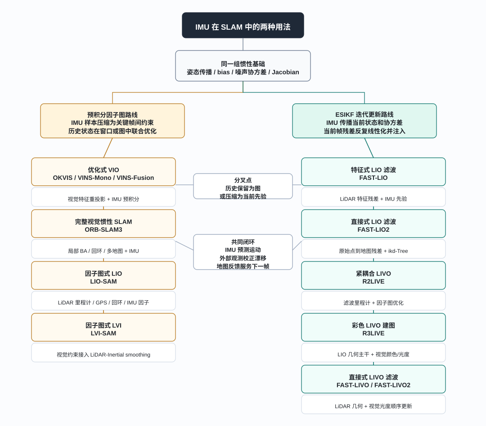
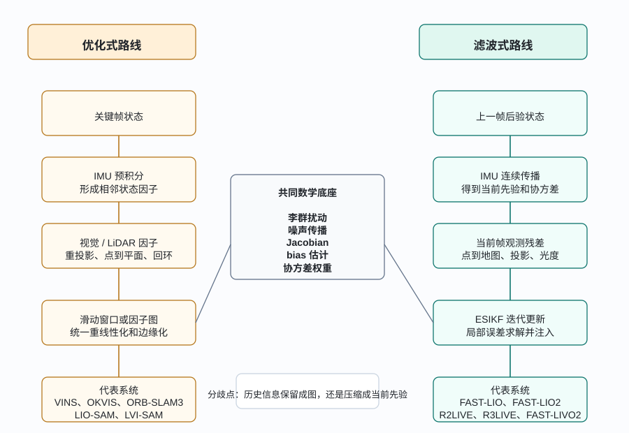

# 带 IMU 的视觉、LiDAR 与视觉激光 SLAM 框架演化

> 前面的 IMU 系列和 ESKF 系列，分别回答了两个基础问题：IMU 测量怎样传播状态、误差和协方差；误差状态怎样通过观测残差完成更新。本文站在更高一层，把这些基础放回真实 SLAM 系统中，梳理带 IMU 的 VIO、LIO 和 LIVO/LVI 框架怎样演化。

**系列位置：** 本文承接 [ESKF（误差状态卡尔曼滤波）入门](../ekf-again/index.html)、[ESKF 误差动力学](../eskf-error-dynamics/index.html)、[ESKF 观测更新](../eskf-observation-h/index.html)、[IMU 预积分详解](../imu-preintegration/index.html)、[从 IMU 预积分到 VINS、LIO-SAM 与 LVI-SAM](../vins-lio-sam-preintegration/index.html) 和 [三篇代表性工作中的 ESIKF](../esikf-fast-lio2-r3live-fast-livo2/index.html)。前序文章解释 IMU、预积分和误差状态的局部机制，本文把这些机制放回 VIO、LIO 与 LIVO/LVI 的系统谱系中。

## 摘要：系统谱系与估计主线

带 IMU 的视觉、LiDAR 和视觉激光 SLAM 包含很多代表系统：VINS-Mono、OKVIS、ORB-SLAM3、LIO-SAM、LVI-SAM、FAST-LIO、FAST-LIO2、R2LIVE、R3LIVE、FAST-LIVO、FAST-LIVO2。它们的传感器组合、前端残差和地图表示不同，但状态估计主线具有共同结构。

IMU 提供的是**时间上的连续运动约束**。相机和 LiDAR 提供的是**外部世界对当前状态的几何或外观约束**。系统设计的核心问题，是怎样把高频、会漂移的惯性信息，同低频、非线性但能约束漂移的外部观测组织在一起。

主流系统逐渐形成两类估计架构。

第一类是**优化式后端**。它保留若干时刻的状态，把 IMU 预积分、视觉重投影、LiDAR 匹配、回环、GPS 等写成因子，在滑动窗口或因子图中统一优化。VINS、OKVIS、ORB-SLAM3、LIO-SAM 和 LVI-SAM 都位于这条谱系中。

第二类是**滤波式迭代更新后端**。它用 IMU 从上一时刻后验状态传播到当前时刻，得到先验状态和协方差；当前 LiDAR 或视觉观测被写成残差，在误差状态上反复线性化、求解和注入。FAST-LIO、FAST-LIO2、R2LIVE、R3LIVE、FAST-LIVO 和 FAST-LIVO2 都属于这条谱系。

两类架构共享同一套底层数学：李群上的状态扰动、IMU 噪声传播、bias 估计、Jacobian、协方差权重和非线性残差。二者的分野来自历史信息的组织方式：优化式系统将一段历史保留成图；滤波式系统将历史压缩成当前先验和协方差。

**关键词：** IMU；视觉惯性；激光惯性；视觉激光惯性；预积分；因子图；ESIKF；滑动窗口

上图给出本文的知识树。它不以传感器组合为主轴，而以 IMU 在后端中的使用方式为主轴：一支把 IMU 样本预积分成关键帧间因子，进入滑动窗口或因子图；另一支把 IMU 测量用于当前状态传播，再由 ESIKF 接收 LiDAR 或视觉残差完成迭代更新。各个系统的前后关系也沿着这两条主干展开。

## 1. IMU 的时间骨架作用

视觉 SLAM 和 LiDAR SLAM 都依赖外部环境。视觉依赖纹理、角点、边缘或光度一致性；LiDAR 依赖几何结构、局部平面、边缘或点到地图关系。它们都有一个共同特点：当前帧必须和过去某种地图、关键帧或局部结构建立对应，才能约束位姿。

IMU 的角色来自时间连续性。它不依赖外部环境观测，在相邻时刻之间连续传播姿态、速度和位置。短时间内，这种传播给相机和 LiDAR 提供运动先验；长时间看，噪声和零偏会逐渐积累成漂移。因此，IMU 同时带来短时稳定性和长期校正需求。

$$
\text{IMU 负责沿时间传播状态，视觉和 LiDAR 负责把状态拉回外部世界。}
$$

不同系统之间的差异，主要体现在几个层面：

- IMU 进入系统的方式：预积分成关键帧因子，或递推当前滤波先验；
- 视觉观测的形式：特征重投影、直接光度误差，或辅助回环和建图；
- LiDAR 观测的形式：边缘和平面特征，或原始点到地图的几何残差；
- 后端组织方式：保留一段历史反复优化，或围绕当前状态做迭代更新；
- 地图表达方式：稀疏视觉地图、局部点云地图、体素地图、彩色点云地图，或多地图 Atlas。

这些层面共同构成带 IMU 的视觉、LiDAR 与视觉激光 SLAM 的系统分类坐标：传感器组合决定观测来源，前端决定残差形式，IMU 决定时间传播方式，后端决定历史信息的组织方式，地图反馈决定估计结果怎样进入后续数据关联。

## 2. 知识树：IMU 使用方式决定主干

带 IMU 的 SLAM 表面上可以按传感器组合分为 VIO、LIO 和 LIVO/LVI。这个分类说明外部观测来自相机、LiDAR，还是二者共同参与；但它还没有触及框架演化的核心。真正把这些系统分开的，是 IMU 进入后端估计器的方式。

VIO 使用相机和 IMU。相机提供图像几何约束，IMU 提供尺度、重力方向和短时运动先验。单目视觉本身缺少绝对尺度，IMU 的加速度与重力信息使尺度和 roll/pitch 可被约束，但这依赖足够的运动激励和合理的零偏建模。

LIO 使用 LiDAR 和 IMU。LiDAR 点云直接提供三维几何，IMU 主要用于扫描去畸变、短时位姿预测、退化场景下的运动约束和状态连续性。相比 VIO，LIO 对光照不敏感，同时受到几何退化、扫描模式、运动畸变和地图查询效率影响。

LIVO 或 LVI 同时使用 LiDAR、Camera 和 IMU。LiDAR 给出稳定三维几何，相机给出纹理、颜色、细节或额外的图像域约束，IMU 负责时间传播。这类系统的难点在于时间同步、外参、残差尺度、观测顺序、地图表达和实时计算。

预积分因子图路线中，IMU 的高频样本先被压缩为关键帧之间的相对运动约束，随后与视觉重投影、LiDAR 匹配、GPS 和回环一起进入非线性优化。VIO 中的 OKVIS、VINS-Mono 和 ORB-SLAM3，LIO/LVI 中的 LIO-SAM 和 LVI-SAM，都属于这条主干。

迭代更新路线中，IMU 首先承担当前状态传播，得到预测状态和协方差。当前帧 LiDAR 或视觉观测再被写成残差，在误差状态上反复线性化、求解和注入。FAST-LIO、FAST-LIO2、R2LIVE、R3LIVE、FAST-LIVO 和 FAST-LIVO2 构成这条主干的主要演化链；其中 R2LIVE 还保留因子图优化层，用于补充滤波里程计的历史约束。

传感器分类回答观测来源，IMU 使用方式和后端估计形式回答系统结构。后者决定一项工作在框架谱系中的位置。

| 层级 | 主要问题 | 典型选择 |
|---|---|---|
| 传感器 | 状态从哪些观测获得约束 | Camera + IMU、LiDAR + IMU、LiDAR + Camera + IMU |
| 前端 | 当前帧怎样变成残差 | 特征重投影、光度误差、点到平面、点到地图、回环匹配 |
| IMU 处理 | 高频惯性怎样进入估计器 | 预积分因子、连续传播、bias Jacobian、协方差传播 |
| 后端 | 多个约束怎样改变状态 | 滑动窗口优化、因子图、MAP、ESKF、ESIKF |
| 地图 | 更新结果怎样被未来复用 | 视觉路标、关键帧、局部子图、增量点云地图、体素地图、彩色地图 |

这张表里，IMU 处理处在中间位置。它连接前端观测和后端估计：状态随时间延续，协方差随传播演化，视觉和 LiDAR 观测在惯性先验附近进入非线性估计。

## 3. 代表性系统的整体定位

常见工作构成如下系统谱系。表中“系统位置”概括每项工作的结构特征，不展开实验结论。

| 系统 | 传感器 | 后端范式 | IMU 入口 | 系统位置 |
|---|---|---|---|---|
| VINS-Mono | 单目相机 + IMU | 滑动窗口优化 | 预积分因子 | 特征重投影和 IMU 预积分共同估计位姿、速度、零偏和尺度 |
| VINS-Fusion | 相机 + IMU，可扩展多传感器 | 滑动窗口优化 | 预积分因子 | VINS-Mono 视觉惯性框架向多传感器配置扩展 |
| OKVIS | 双目相机 + IMU | 关键帧非线性优化 | 惯性误差项 | 关键帧 VIO 中视觉重投影和惯性项联合优化的早期代表 |
| ORB-SLAM3 | 单目、双目、RGB-D，可带 IMU | MAP / 非线性优化 | 预积分与惯性初始化 | 视觉、视觉惯性和多地图管理统一到完整 SLAM 系统中 |
| LIO-SAM | LiDAR + IMU，可接 GPS/回环 | 因子图平滑 | 预积分因子 | IMU、LiDAR 里程计、GPS 和回环通过因子图统一组织 |
| LVI-SAM | LiDAR + Camera + IMU | 因子图 / 平滑 | 预积分因子 | LIO-SAM 主线中加入视觉约束，形成因子图式 LVI |
| FAST-LIO | LiDAR + IMU | 迭代误差状态滤波 | IMU 传播 | LiDAR 特征残差进入紧耦合 IEKF/ESIKF 当前状态更新 |
| FAST-LIO2 | LiDAR + IMU | ESIKF | IMU 传播 | 原始点到地图残差与增量地图结构支撑直接 LIO |
| R2LIVE | LiDAR + Camera + IMU | 滤波里程计 + 因子图优化 | IMU 传播 | LiDAR-Inertial-Visual 紧耦合估计，连接 FAST-LIO 式滤波和视觉约束 |
| R3LIVE | LiDAR + Camera + IMU | ESIKF 主干 | IMU 传播 | LiDAR-Inertial 几何主干接入视觉直接法和彩色地图 |
| FAST-LIVO | LiDAR + Camera + IMU | ESIKF / 顺序融合 | IMU 传播 | LIO 与 VIO 两个直接子系统紧耦合到快速状态估计中 |
| FAST-LIVO2 | LiDAR + Camera + IMU | ESIKF / 顺序更新 | IMU 传播 | LiDAR 原始点配准和视觉光度约束进入统一直接 LIVO 框架 |

这张表里最关键的分界线，是“预积分因子”和“IMU 传播”。

预积分通常服务于优化式系统。它把关键帧之间的高频 IMU 样本压缩成相邻状态之间的一条约束。优化器改变端点状态时，预积分测量可以通过 bias Jacobian 做局部修正，避免每一轮都重新遍历所有 IMU 样本。

IMU 传播通常服务于滤波式系统。系统从上一帧后验状态开始，沿 IMU 测量传播到当前帧，得到先验状态和协方差。当前 LiDAR 或视觉观测只围绕当前状态做更新，历史信息主要体现在先验和协方差中。

## 4. 系统演化中的主干节点

这些工作可以压缩成几个主干节点。它们分别占据视觉惯性、因子图式 LIO、直接 ESIKF LIO、紧耦合 LIVO 过渡和直接 ESIKF LIVO 几个关键位置：

$$
\text{ORB-SLAM3}
\rightarrow
\text{LIO-SAM}
\rightarrow
\text{FAST-LIO2}
\rightarrow
\text{R2LIVE / R3LIVE}
\rightarrow
\text{FAST-LIVO2}.
$$

ORB-SLAM3 代表完整视觉和视觉惯性 SLAM 系统。视觉前端、局部地图、关键帧、回环、多地图管理和 IMU 初始化在同一系统中协同工作。视觉因子和惯性约束共同进入 MAP 估计，长期数据关联补充了短窗口跟踪难以独立维持的全局一致性。

LIO-SAM 的系统重心转向 LiDAR。它体现了“IMU 预积分 + 因子图”的工程组织方式：IMU 预积分连接相邻关键帧，LiDAR 里程计提供几何约束，GPS 和回环作为额外因子加入图中。因子图在这里承担异步、多来源约束的统一容器。

FAST-LIO2 代表滤波式直接 LIO。系统围绕当前扫描做高效的迭代误差状态更新。IMU 传播给当前扫描提供先验和去畸变信息，LiDAR 原始点直接与局部地图建立残差，ESIKF 在当前状态附近反复线性化并注入误差状态。

R2LIVE 和 R3LIVE 位于 LiDAR-Inertial 到 LiDAR-Inertial-Visual 的过渡位置。R2LIVE 将 LiDAR、IMU 和视觉放入紧耦合估计框架，并保留 filter-based odometry 与 factor graph optimization 的双层结构；R3LIVE 进一步强调几何状态和彩色地图之间的联系。

FAST-LIVO2 在 FAST-LIO2 的直接 LiDAR-Inertial 主干上重新接入相机。LiDAR 几何残差和视觉光度残差围绕同一个运动状态顺序组织、更新和反馈，系统由直接 LIO 推进到直接 LIVO。

围绕这些主干节点，其余工作形成旁支关系：VINS-Mono 和 OKVIS 构成优化式 VIO 的基础；VINS-Fusion 展示多传感器扩展；LVI-SAM 展示因子图式 LIVO/LVI；FAST-LIO 展示 FAST 系列的早期特征残差版本；FAST-LIVO 展示从双子系统融合走向更统一直接 LIVO 的过渡。

## 5. 优化式后端中的历史状态与因子

优化式后端保留一批状态节点，并把观测写成这些节点之间的约束。给定一组状态

$$
\mathcal X = \{x_0,x_1,\cdots,x_N\},
$$

以及来自视觉、LiDAR、IMU、回环或 GPS 的观测，后端求解一个加权非线性最小二乘问题：

$$
\min_{\mathcal X}\sum_k \|r_k(\mathcal X)\|^2_{\Sigma_k^{-1}}.
$$

这里每个残差 $r_k$ 都有自己的物理含义。视觉重投影残差比较地图点投影位置和图像观测位置；LiDAR 残差比较当前点和地图局部几何；IMU 预积分残差比较端点状态预测出的相对运动和预积分测量；回环残差比较两个非相邻关键帧之间的相对位姿。

### 5.1 视觉惯性的关键帧窗口

OKVIS、VINS-Mono 和 ORB-SLAM3 构成优化式 VIO 的一条清晰脉络。它们都围绕关键帧状态组织视觉和惯性约束，但系统目标逐渐从局部里程计扩展到完整 SLAM。

OKVIS 较早清晰展示了关键帧式视觉惯性非线性优化。系统把视觉重投影误差和惯性误差项放到同一个有限窗口中，通过边缘化限制计算规模。VIO 在这里表现为同一概率目标中的相机-IMU 状态联合估计。

VINS-Mono 围绕单目相机和低成本 IMU，形成了初始化、特征跟踪、滑动窗口优化、重定位和回环等完整流程。单目尺度、重力方向、速度和零偏这些问题，在视觉惯性初始化和滑动窗口估计中被统一处理。

ORB-SLAM3 进一步把 VIO 放回完整 SLAM 系统里。它同时关注地图复用、多地图管理、回环和长期数据关联。ORB 特征和局部 BA 保留视觉 SLAM 的传统主干，IMU 约束补充尺度、重力和短时运动稳定性，Atlas 多地图机制服务于长时间运行和重定位。

### 5.2 关键帧之间的惯性约束

优化式 VIO/LIO/LVI 里的 IMU 通常不逐样本进入后端图。IMU 频率高，相邻关键帧之间可能有大量样本。每一次优化迭代重新积分会带来重复计算；每个 IMU 时刻都建成状态节点又会导致图规模膨胀。

预积分解决的正是这个问题。它在固定的起点局部坐标系中，提前把一段 IMU 样本压缩成

$$
\Delta R_{ij},\quad \Delta v_{ij},\quad \Delta p_{ij},
$$

同时保存对 gyro bias 和 accelerometer bias 的 Jacobian 以及协方差。进入优化时，IMU 因子比较两端状态推出的相对运动与这组三个预积分量。bias 的小变化由 Jacobian 做一阶修正；偏离线性化点较远时再重新预积分。

因此，预积分属于高频 IMU 测量到低频关键帧约束之间的建模环节。因子图、滑动窗口和 MAP 优化负责在后端组织这些约束。

### 5.3 LIO-SAM 中的多源因子

LIO-SAM 是优化式 LIO 的代表系统。IMU 预积分、LiDAR 里程计、GPS 和回环都以因子形式进入同一张图，系统由局部 scan-to-map 里程计扩展为 smoothing and mapping 框架。

在每个关键帧之间，IMU 预积分提供相邻状态约束。LiDAR 前端通过局部 scan-to-map 匹配形成当前关键帧的几何位姿约束。GPS 若可用，可以提供绝对位置约束；回环检测成功后，可以提供非相邻关键帧之间的相对位姿约束。这些约束的共同形式都是“因子”，只是残差来源不同。

LIO-SAM 的意义在于把 LIO 从纯局部里程计扩展到更完整的 smoothing and mapping 框架。回环、GPS、多源约束和长期一致性需求，使因子图成为清晰的系统组织方式。

### 5.4 LVI-SAM 中的视觉与激光互补

LVI-SAM 延续 LIO-SAM 的 smoothing 框架，同时吸收视觉惯性系统中的图像约束。LiDAR 提供三维几何结构，视觉提供图像域的跟踪和约束，IMU 继续提供时间传播和关键帧之间的惯性联系。

LVI-SAM 的结构重点在于视觉和 LiDAR 的相互支持。LiDAR 缓解视觉在弱纹理、光照变化或尺度方面的困难；视觉在几何退化或远距离结构不足时提供额外信息。因子图允许这些约束以相对统一的形式进入后端。

优化式框架发展到 LVI-SAM 后形成了较完整的多源因子图形态：传感器越多，因子种类越多；系统越长时间运行，回环和全局约束越重要；为了保持实时性，需要滑动窗口、边缘化、关键帧选择和局部地图管理。

## 6. 滤波式后端中的当前状态更新

滤波式后端更接近在线估计。系统显式维护当前名义状态和误差协方差：

$$
\hat x_k^{-},\quad P_k^{-}.
$$

IMU 先把上一时刻后验状态传播到当前时刻，得到先验。当前 LiDAR 或视觉观测到来后，系统构造非线性残差

$$
r = z - h(x),
$$

并在当前名义状态附近线性化：

$$
r \approx H\delta x + n.
$$

ESIKF 的“iterated”体现在观测更新内部。每一轮求出误差状态增量，将其注入名义状态，再围绕新的名义状态重新计算残差和 Jacobian。这个过程让滤波更新可以处理更强的非线性观测，例如点到地图配准和视觉光度误差。

### 6.1 FAST-LIO 的特征残差

FAST-LIO 是 FAST 系列的起点。它把 LiDAR 特征点和 IMU 数据放入紧耦合迭代卡尔曼滤波框架中。IMU 传播提供先验和协方差，LiDAR 特征残差在当前扫描到来时修正状态。

这里的关键转变，是 scan matching 问题进入滤波观测更新。历史约束不再以关键帧节点和因子的形式显式存在，而是通过当前状态、协方差和地图表达影响下一次更新。

### 6.2 FAST-LIO2 的原始点直接配准

FAST-LIO2 的重要推进，是直接使用原始 LiDAR 点到地图的残差，减少对人工特征提取的依赖。当前扫描经过 IMU 辅助去畸变后，点被变换到地图坐标系，在局部地图中寻找邻域并估计局部几何。一个常见抽象是点到平面残差：

$$
e_i = n_i^\top(Rp_i+t-q_i).
$$

这里 $p_i$ 是当前扫描点，$n_i$ 和 $q_i$ 来自地图局部平面。状态变化会改变点在地图中的位置，也可能改变邻域和平面估计，因此需要迭代线性化。ESIKF 在这种场景下很自然：用 IMU 给初值和不确定性，用 LiDAR 残差反复拉回几何地图。

FAST-LIO2 还强调增量地图结构。直接点到地图残差需要高效查询、插入、删除和下采样，否则实时性会被地图维护拖住。于是，地图不再只是后端优化的结果，也成为当前滤波更新能够实时运行的关键数据结构。

### 6.3 R2LIVE 的紧耦合 LIVO 过渡

R2LIVE 位于 FAST-LIO 系列和 R3LIVE 之间。它已经进入 LiDAR-Inertial-Visual 紧耦合框架，但系统组织还保留两层结构：一层是面向实时性的 filter-based odometry，另一层是用于进一步约束轨迹和地图一致性的 factor graph optimization。

从演化关系看，R2LIVE 的意义在于把视觉从辅助表达推向状态估计链路。LiDAR 和 IMU 提供几何状态主干，视觉观测围绕相机投影、图像特征和地图关联参与估计。它不像纯 LIO 那样只依赖点云几何，也还没有完全走到 FAST-LIVO2 那种更统一的直接残差组织方式。

### 6.4 R3LIVE 的几何主干与彩色地图

R3LIVE 把相机接入 FAST-LIO 风格的 LiDAR-Inertial 主干。系统包含两个互相连接的层次：LIO 子系统负责几何状态和三维地图，视觉子系统利用图像信息为地图提供颜色和纹理，并通过图像到地图关系参与状态和地图一致性。

R3LIVE 的结构重点，是共享状态和地图对 LiDAR 与视觉两类信息的连接。LiDAR 建立几何骨架，相机把图像域信息投到三维地图上；状态更新改变投影关系，地图反馈又影响后续数据关联。

R3LIVE 的价值在于把 LIO 从几何里程计推进到 RGB-colored mapping。它说明视觉加入后，系统目标不一定只是轨迹更准，也可能是让地图拥有更丰富的外观表达。

### 6.5 FAST-LIVO 系列的直接多模态融合

FAST-LIVO 延续 FAST 系列的快速迭代估计思想，把 LiDAR-Inertial 和 Visual-Inertial 两个直接子系统紧耦合起来。它将 LiDAR 几何和视觉信息都接入快速状态估计，视觉信息由后处理着色走向状态估计闭环。

FAST-LIVO2 进一步把这个方向推向更统一的直接 LIVO。LiDAR 模块直接注册原始点，视觉模块直接最小化光度误差，二者围绕同一个状态和地图表达进行顺序更新。由于 LiDAR 几何残差和视觉图像残差的维度、噪声尺度和线性化行为不同，顺序更新是一种工程上清晰的组织方式：先让一类观测更新状态和地图，再让另一类观测在更新后的状态附近继续约束。

FAST-LIVO2 代表的趋势，是在保证实时性的前提下，将 LiDAR 的三维几何、相机的图像外观和 IMU 的连续传播组织进同一个直接、紧耦合、迭代更新框架中。

## 7. 历史信息的两种组织方式

优化式后端和滤波式后端都在解非线性状态估计问题。二者的差异集中在五个方面。

| 维度 | 优化式 / 因子图 | 滤波式 / ESIKF |
|---|---|---|
| 历史信息 | 保留一段状态和观测因子 | 压缩为当前先验和协方差 |
| IMU 入口 | 关键帧之间的预积分因子 | 连续传播当前名义状态和协方差 |
| 观测更新 | 多因子统一重线性化 | 当前帧残差迭代线性化 |
| 长期一致性 | 天然适合回环、GPS、全局图 | 需要额外模块维护全局一致性 |
| 实时性压力 | 图规模、边缘化和重线性化 | 当前帧残差数量、地图查询和迭代次数 |

优化式系统的优势，是在一个窗口或图中同时考虑多时刻、多来源约束，并允许过去状态被重新线性化。回环、重定位、全局一致性和复杂多源约束都能自然进入这类后端。代价是图规模控制、边缘化一致性和计算资源管理。

滤波式系统的优势，是线性化和数据流组织更轻。系统围绕当前帧工作，历史信息被压缩进协方差，高频实时 LiDAR-Inertial 和 LiDAR-Visual-Inertial 场景常采用这种组织方式。代价是长期一致性需要额外模块维护，过去被压缩的信息通常不能像图优化那样被完整重线性化。

因此，两类后端对应不同计算预算、不同传感器前端和不同地图目标下的组织方式。实际系统也可能混合使用：前端用滤波快速输出里程计，后端用位姿图或全局优化维护长期一致性。

## 8. 每篇工作的简要介绍

这一节把前面的系统再压缩一次，形成工作谱系索引。

**OKVIS。** 关键帧式视觉惯性优化的早期代表。它把双目视觉重投影误差和 IMU 误差项放入有限窗口中，通过非线性优化估计关键帧状态，确立了视觉与惯性在同一目标函数中联合估计的基本形态。

**VINS-Mono。** 单目视觉惯性系统的经典工程形态。它强调鲁棒初始化、滑动窗口优化、重定位和回环，把单目尺度、重力、速度和零偏放入实际 VIO 系统的初始化与持续估计流程。

**VINS-Fusion。** VINS-Mono 思路的多传感器扩展。它保留优化式视觉惯性主干，同时支持更灵活的相机配置和外部信息，体现 VIO 框架从单一配置走向工程化传感器组合的扩展方式。

**ORB-SLAM3。** 完整视觉/视觉惯性 SLAM 系统代表。ORB 特征、局部地图、回环、多地图管理和 IMU 约束在统一系统中协同工作，展示长期视觉 SLAM 结构吸收惯性约束后的完整形态。

**LIO-SAM。** 因子图式 LiDAR-Inertial 的代表。它用 IMU 预积分连接相邻状态，用 LiDAR 里程计形成几何约束，并可以自然加入 GPS 和回环，体现 factor graph 对多源约束的统一组织能力。

**LVI-SAM。** 因子图式 LiDAR-Visual-Inertial 代表。它在 LiDAR-Inertial 主线中接入视觉信息，使视觉、LiDAR 和 IMU 围绕同一 smoothing 框架工作，形成优化式 LVI 的系统组织样例。

**FAST-LIO。** FAST 系列的滤波式起点。它用紧耦合迭代卡尔曼滤波融合 LiDAR 特征和 IMU 测量，将 scan matching 转化为当前帧滤波更新。

**FAST-LIO2。** 直接 LiDAR-Inertial 的关键代表。它减少对传统特征提取的依赖，用原始点直接同地图建立残差，并通过增量地图结构支撑实时更新，形成 ESIKF 与直接点到地图配准结合的典型框架。

**R2LIVE。** LiDAR-Inertial-Visual 紧耦合系统。它由 filter-based odometry 和 factor graph optimization 共同组织，位于 FAST-LIO 式快速滤波和后续 RGB-colored mapping / 直接 LIVO 之间。

**R3LIVE。** LiDAR-Inertial-Visual 彩色建图系统。它在 LIO 几何主干上接入视觉信息，使三维地图获得颜色和纹理表达，突出视觉围绕已有几何地图和状态估计参与建图的作用。

**FAST-LIVO。** 直接 LiDAR-Inertial-Visual 的过渡系统。它把 LIO 和 VIO 两个直接子系统紧耦合起来，展示了 FAST 系列从 LIO 走向 LIVO 的路径。

**FAST-LIVO2。** 更统一的快速直接 LIVO 框架。LiDAR 原始点配准和视觉光度误差进入同一个 ESIKF 估计流程，顺序更新处理不同观测的规模和性质，代表 FAST 系列多模态紧耦合的完整形态。

## 9. 从前序文章接到本文

前面的 IMU 和 ESKF 系列主要是在“局部机制”层面展开。

IMU 噪声文章回答了噪声密度、随机游走、零偏不稳定性和 Allan 方差怎样进入过程噪声。零偏可观性文章回答了为什么陀螺仪和加速度计 bias 不能只靠优化器硬估，必须依赖静止段、外部相对姿态、姿态激励和重力结构。预积分文章回答了如何把高频 IMU 样本压缩成关键帧约束。ESKF 系列回答了误差状态怎样传播、观测 Jacobian 怎样作用、迭代更新怎样在名义状态附近进行。

本文把这些局部机制接回系统层：

- 在 VINS、OKVIS、ORB-SLAM3、LIO-SAM 和 LVI-SAM 中，IMU 预积分进入优化式后端，成为相邻状态之间的惯性因子；
- 在 FAST-LIO、FAST-LIO2、R2LIVE、R3LIVE、FAST-LIVO 和 FAST-LIVO2 中，IMU 传播进入快速里程计前端，成为当前帧迭代更新的先验；R2LIVE 额外保留因子图优化层；
- 视觉和 LiDAR 在不同时间尺度上校正 IMU 漂移；
- bias、噪声、协方差和 Jacobian 是连接底层数学和系统设计的共同语言；
- 地图反馈决定估计结果怎样影响下一帧，这一点和残差本身同样重要。

因此，具体系统可以用同一组结构维度比较：状态定义、IMU 传播或预积分、观测残差、Jacobian 对象、更新位置、地图反馈和长期一致性机制。

## 10. 小结

带 IMU 的视觉、LiDAR 和视觉激光 SLAM，可以按传感器分成 VIO、LIO 和 LIVO/LVI；更深层的谱系则由状态估计架构决定。

优化式路线将 IMU 预积分、视觉重投影、LiDAR 匹配、回环和外部绝对观测写成因子，在滑动窗口或因子图中统一优化。VINS、OKVIS、ORB-SLAM3、LIO-SAM 和 LVI-SAM 都位于这条谱系中。

滤波式迭代更新路线用 IMU 传播当前状态和协方差，再把当前 LiDAR 或视觉观测写成误差状态残差，通过多轮线性化完成状态注入。FAST-LIO、FAST-LIO2、R2LIVE、R3LIVE、FAST-LIVO 和 FAST-LIVO2 都位于这条谱系中；R2LIVE 同时体现了滤波里程计与因子图优化的混合组织。

两条路线的共同底座，是同一套惯性测量模型、李群扰动、噪声传播、bias 估计、Jacobian 和协方差加权。区别在于历史信息怎样保存，当前观测怎样被组织，以及地图反馈怎样支撑下一次估计。

ORB-SLAM3、LIO-SAM、FAST-LIO2、R2LIVE/R3LIVE 和 FAST-LIVO2 构成本文的主干节点。它们分别对应完整视觉惯性 SLAM、因子图式 LIO、直接 ESIKF LIO、紧耦合 LIVO 过渡和彩色/直接 LIVO 演化。围绕这些节点组织其他系统，论文列表会形成一棵有主干、有分支、有演化方向的知识树。

## 参考文献

1. Stefan Leutenegger, Simon Lynen, Michael Bosse, Roland Siegwart, Paul Furgale. **Keyframe-based visual-inertial odometry using nonlinear optimization**. The International Journal of Robotics Research, 2015.
2. Tong Qin, Peiliang Li, Shaojie Shen. **VINS-Mono: A Robust and Versatile Monocular Visual-Inertial State Estimator**. IEEE Transactions on Robotics, 2018.
3. Christian Forster, Luca Carlone, Frank Dellaert, Davide Scaramuzza. **On-Manifold Preintegration for Real-Time Visual-Inertial Odometry**. IEEE Transactions on Robotics, 2017.
4. Carlos Campos, Richard Elvira, Juan J. Gómez Rodríguez, José M. M. Montiel, Juan D. Tardós. **ORB-SLAM3: An Accurate Open-Source Library for Visual, Visual-Inertial, and Multimap SLAM**. IEEE Transactions on Robotics, 2021.
5. Tixiao Shan, Brendan Englot, Drew Meyers, Wei Wang, Carlo Ratti, Daniela Rus. **LIO-SAM: Tightly-coupled Lidar Inertial Odometry via Smoothing and Mapping**. IEEE/RSJ International Conference on Intelligent Robots and Systems, 2020.
6. Tixiao Shan, Brendan Englot, Carlo Ratti, Daniela Rus. **LVI-SAM: Tightly-coupled Lidar-Visual-Inertial Odometry via Smoothing and Mapping**. IEEE International Conference on Robotics and Automation, 2021.
7. Wei Xu, Fu Zhang. **FAST-LIO: A Fast, Robust LiDAR-inertial Odometry Package by Tightly-Coupled Iterated Kalman Filter**. IEEE Robotics and Automation Letters, 2021.
8. Wei Xu, Yixi Cai, Dongjiao He, Jiarong Lin, Fu Zhang. **FAST-LIO2: Fast Direct LiDAR-Inertial Odometry**. IEEE Transactions on Robotics, 2022.
9. Jiarong Lin, Chunran Zheng, Wei Xu, Fu Zhang. **R2LIVE: A Robust, Real-time, LiDAR-Inertial-Visual tightly-coupled state Estimator and mapping**. IEEE Robotics and Automation Letters, 2021.
10. Jiarong Lin, Fu Zhang. **R3LIVE: A Robust, Real-time, RGB-colored, LiDAR-Inertial-Visual tightly-coupled state Estimation and mapping package**. IEEE International Conference on Robotics and Automation, 2022.
11. Chunge Bai, Tao Xiao, Yajie Chen, Haoqian Wang, Fang Zhang, Xiang Gao. **FAST-LIVO: Fast and Tightly-coupled Sparse-Direct LiDAR-Inertial-Visual Odometry**. IEEE/RSJ International Conference on Intelligent Robots and Systems, 2022.
12. Chunge Bai, Tao Xiao, Yajie Chen, Haoqian Wang, Fu Zhang, Xiang Gao. **FAST-LIVO2: Fast, Direct LiDAR-Inertial-Visual Odometry**. IEEE Transactions on Robotics, 2025.
