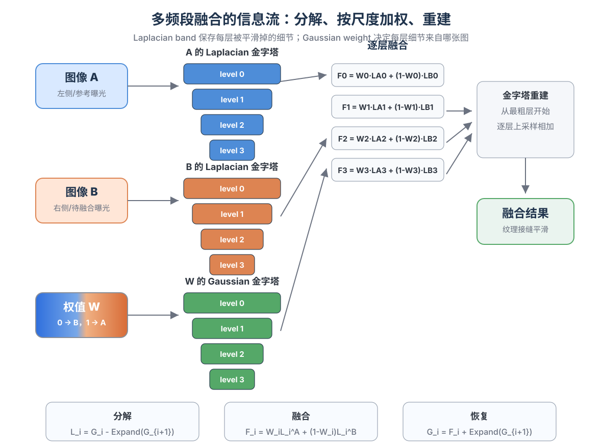

# 图像金字塔多波段融合：原理、权值与 OpenCV 实践

图像拼接里常见的接缝问题可以分成两层：一层是纹理、边缘、梯度在接缝处突然断掉；另一层是两张图的曝光、白平衡或响应曲线不同，导致同一块区域的颜色慢慢漂移。多波段融合处理的是第一层问题。它把图像拆成若干尺度的细节，再用同样拆成若干尺度的权值去融合这些细节。重建时，各层细节重新相加，接缝被分散到不同尺度上，视觉上就不再是一条硬边。

这里的 “Laplacian” 容易让人联想到 Poisson 融合或 PDE 里的拉普拉斯算子。多波段融合里的 Laplacian Pyramid 更接近一种多尺度差分表示。它保存的是相邻两个高斯尺度之间被平滑掉的残差，残差里主要是边缘、纹理和局部亮度变化。可以把它理解成在不同频段上处理“梯度类细节”；而大面积、缓慢变化的颜色差异仍然留在低频里，通常还需要单独的匀色或增益补偿。



---

## 1. 先看图像金字塔：尺度就是频率

高斯金字塔从原图开始，反复做低通滤波和下采样：

$$
G_0 = I,
$$

$$
G_{i+1} = \operatorname{Down}(\operatorname{Blur}(G_i)).
$$

$G_0$ 保留完整分辨率；$G_1$ 只保留更粗的结构；层数越高，图像越小，细节越少。这个过程把图像从“像素空间”组织成“尺度空间”。高频纹理主要在低层，低频光照和颜色主要在高层。

拉普拉斯金字塔在高斯金字塔之上定义。第 $i$ 层不是直接保存模糊图，而是保存当前层和下一层上采样回来之后的差：

$$
L_i = G_i - \operatorname{Expand}(G_{i+1}).
$$

最后一层通常直接保存最粗的高斯图：

$$
L_N = G_N.
$$

这个差分有很清楚的工程含义：$G_{i+1}$ 上采样回来只能解释 $G_i$ 里的粗结构，解释不了的那部分就是该尺度的细节残差。边缘、纹理、小范围亮度变化会进入较细的 Laplacian 层，大范围色调和曝光差会更多进入粗层。

拉普拉斯金字塔能无损重建原图，重建过程从最粗层开始：

$$
\hat G_i = L_i + \operatorname{Expand}(\hat G_{i+1}).
$$

这个式子是理解多波段融合的关键。融合并不是在原图上一次性平均，而是在每个 $L_i$ 上分别选择信息来源，最后再通过重建公式恢复成完整图像。

---

## 2. 多波段融合：每个尺度用自己的权值

假设有两张已经配准好的图像 $A$ 和 $B$，以及一张权值图 $W$。$W=1$ 表示该位置更相信 $A$，$W=0$ 表示更相信 $B$。最直接的 alpha blending 是：

$$
F = W A + (1-W)B.
$$

这种做法在权值过渡足够宽时可以抹掉硬边，但也容易把边缘和纹理揉糊。原因是所有频率都使用同一张原始权值图。高频细节需要较窄的过渡，低频颜色需要较宽的过渡；一张权值图很难同时满足这两个要求。

多波段融合把三样东西都做成金字塔：

- 对图像 $A$ 构建 Laplacian 金字塔 $L_i^A$；
- 对图像 $B$ 构建 Laplacian 金字塔 $L_i^B$；
- 对权值 $W$ 构建 Gaussian 金字塔 $W_i$。

然后逐层融合：

$$
F_i = W_i L_i^A + (1-W_i)L_i^B.
$$

最后对 $F_i$ 做拉普拉斯重建，得到输出图像。这个过程看起来只是把 alpha blending 放进了金字塔，但效果差异来自权值的尺度变化。细层的 $W_i$ 接近原始 mask，边缘和纹理不会被过度拉宽；粗层的 $W_i$ 已经被多次模糊和下采样，低频亮度会在更大范围内平滑过渡。

如果有多张图，公式可以写成归一化加权：

$$
F_i = \frac{\sum_k W_i^k L_i^k}{\sum_k W_i^k + \epsilon}.
$$

这里 $\epsilon$ 只是避免所有权值同时为零。实际系统会尽量保证每个像素至少有一张图的权值有效。

---

## 3. 权值怎么来：先决定信任区域，再做尺度化

多波段融合的效果很大程度取决于权值。权值不是为了“好看”随便画一张透明度图，它表达的是每个像素应该相信哪张输入图。

常见权值构造可以按三步理解。

第一步是生成有效区域。拼接场景里，每张图经过投影变换后会落在画布上的一块区域，有像素的地方记为 1，没有像素的地方记为 0。

第二步是确定接缝或主导区域。简单情形可以用二值 mask：左边用图像 $A$，右边用图像 $B$。更实际的做法会根据距离边界的远近、视角夹角、清晰度、曝光差或动态物体风险来决定每张图的可信度。距离变换是一种常用基础权值：离图像边界越远，权值越高；靠近边缘的投影误差和缺失风险更大，权值自然降低。

第三步是归一化并构建权值金字塔。两图融合时可以直接使用 $W$ 和 $1-W$；多图融合时要保证同一像素上的权值和接近 1：

$$
\tilde W^k = \frac{W^k}{\sum_j W^j + \epsilon}.
$$

随后对 $\tilde W^k$ 构建 Gaussian 金字塔。注意这里用的是 Gaussian Pyramid，而不是 Laplacian Pyramid。权值表示“混合比例”，它应该在尺度上逐渐变平滑，而不是保存差分残差。

工程上可以用几条简单规则检查权值：

- 权值必须非负，多图权值最好归一化；
- 接缝不要穿过明显运动物体、人脸、文字和强边缘；
- 原始 mask 的过渡带不必很宽，金字塔会在粗层自然扩大过渡；
- 金字塔层数越多，最低频融合范围越大，颜色过渡越柔，但过多层数会让大范围色差被扩散；
- 对齐误差较大时，不能指望融合完全补救，应该先改配准或接缝位置。

---

## 4. “Laplacian 解决梯度，颜色再匀色”的准确理解

这句话在工程直觉上很有用。Laplacian band 保存的是局部变化量。图像中的边缘可以看成强梯度，纹理可以看成局部高频变化。多波段融合在每个 band 上做加权，相当于让这些局部变化在接缝附近逐尺度过渡。重建时，细节残差重新叠回去，结构接缝就被缓和了。

但它没有真正求解一个全局梯度场，也不会自动让两张图的颜色统计一致。若 $A$ 偏冷、$B$ 偏暖，或者两张图的曝光差形成大面积低频偏移，多波段融合只能让过渡变柔，不能保证整张图颜色一致。接缝不明显了，区域色块仍然可能一眼看出。

所以完整拼接流程通常会把问题拆开：

1. 先做几何配准，让同一物体落到相同位置；
2. 再做曝光补偿或颜色匀色，降低低频亮度和色彩差；
3. 然后选择接缝或权值，避开难融合区域；
4. 最后用多波段融合处理跨尺度的结构过渡。

颜色匀色可以很简单，也可以很复杂。简单版本是在重叠区域估计每张图的通道增益或均值方差，使它们的颜色统计接近。更系统的版本会在图像图上求全局 gain compensation，使所有相邻图像的重叠区域同时一致。多波段融合位于这个流程的最后一段，它负责把已经比较接近的图像融合得自然。

---

## 5. 选择金字塔层数

层数可以从接缝过渡尺度来估计。每下采样一层，像素尺度大约扩大 2 倍。若希望最低频在几十到几百像素范围内平滑过渡，6 层左右通常是一个合理起点。

一个直观判断是：

$$
2^N \approx \text{希望低频平滑覆盖的像素宽度}.
$$

例如希望低频过渡覆盖约 64 像素，可以从 $N=6$ 附近开始试。这里的 $N$ 不是严格公式，因为滤波核、图像尺寸、mask 形状和重建实现都会影响实际范围。它只是一个工程尺度估计。

几条经验比较稳定：

- 小图或局部贴图使用较少层数，避免粗层太小；
- 全景拼接、纹理拼接可以用 5 到 8 层作为初值；
- 对齐误差明显时，增加层数会让 ghosting 更柔，但不会消除重影；
- 曝光差明显时，先做匀色，再调整层数。

---

## 6. OpenCV C++ demo

下面的 demo 接收两张已经对齐、尺寸相同或接近的图像，以及一张 mask。mask 中 255 表示使用左图，0 表示使用右图，中间灰度表示软权值。程序会构建两张图的 Laplacian 金字塔、mask 的 Gaussian 金字塔，逐层融合后重建输出。

编译方式示例：

```bash
g++ -std=c++17 multiband_blending_demo.cpp -o multiband_blending_demo `pkg-config --cflags --libs opencv4`
```

运行方式示例：

```bash
./multiband_blending_demo left.png right.png mask.png blended.png 6 1
```

最后一个参数为 1 时，会启用一个很轻量的均值方差颜色匹配。真实项目里建议把这一步替换成基于重叠区域的曝光补偿或全局 gain compensation。

```cpp
#include <opencv2/opencv.hpp>

#include <algorithm>
#include <iostream>
#include <stdexcept>
#include <string>
#include <vector>

namespace {

cv::Mat ReadColor32F(const std::string& path) {
  cv::Mat image_u8 = cv::imread(path, cv::IMREAD_COLOR);
  if (image_u8.empty()) {
    throw std::runtime_error("failed to read image: " + path);
  }
  cv::Mat image_f;
  image_u8.convertTo(image_f, CV_32FC3, 1.0 / 255.0);
  return image_f;
}

cv::Mat ReadWeight32F(const std::string& path, const cv::Size& size) {
  cv::Mat mask_u8 = cv::imread(path, cv::IMREAD_GRAYSCALE);
  if (mask_u8.empty()) {
    throw std::runtime_error("failed to read mask: " + path);
  }
  if (mask_u8.size() != size) {
    cv::resize(mask_u8, mask_u8, size, 0.0, 0.0, cv::INTER_LINEAR);
  }
  cv::Mat mask_f;
  mask_u8.convertTo(mask_f, CV_32FC1, 1.0 / 255.0);
  cv::max(mask_f, 0.0, mask_f);
  cv::min(mask_f, 1.0, mask_f);
  return mask_f;
}

cv::Mat To3Channels(const cv::Mat& gray) {
  std::vector<cv::Mat> channels(3, gray);
  cv::Mat color;
  cv::merge(channels, color);
  return color;
}

int MaxPyramidLevels(cv::Size size) {
  int levels = 1;
  while (size.width > 1 && size.height > 1) {
    size.width = (size.width + 1) / 2;
    size.height = (size.height + 1) / 2;
    ++levels;
  }
  return levels;
}

std::vector<cv::Mat> BuildGaussianPyramid(const cv::Mat& image, int levels) {
  std::vector<cv::Mat> pyramid;
  pyramid.reserve(levels);
  pyramid.push_back(image.clone());
  for (int i = 1; i < levels; ++i) {
    cv::Mat down;
    cv::pyrDown(pyramid.back(), down);
    pyramid.push_back(down);
  }
  return pyramid;
}

std::vector<cv::Mat> BuildLaplacianPyramid(const cv::Mat& image, int levels) {
  std::vector<cv::Mat> gaussian = BuildGaussianPyramid(image, levels);
  std::vector<cv::Mat> laplacian(levels);

  for (int i = 0; i + 1 < levels; ++i) {
    cv::Mat up;
    cv::pyrUp(gaussian[i + 1], up, gaussian[i].size());
    laplacian[i] = gaussian[i] - up;
  }
  laplacian.back() = gaussian.back();
  return laplacian;
}

cv::Mat ReconstructFromLaplacianPyramid(const std::vector<cv::Mat>& pyramid) {
  cv::Mat current = pyramid.back().clone();
  for (int i = static_cast<int>(pyramid.size()) - 2; i >= 0; --i) {
    cv::Mat up;
    cv::pyrUp(current, up, pyramid[i].size());
    current = up + pyramid[i];
  }
  return current;
}

cv::Mat MatchMeanStdNearSeam(const cv::Mat& source,
                             const cv::Mat& reference,
                             const cv::Mat& soft_mask) {
  // Optional low-frequency harmonization. The best mask is the real overlap or
  // seam transition band. If the input mask is binary and no transition exists,
  // the demo falls back to global mean/std matching.
  cv::Mat seam_mask;
  cv::inRange(soft_mask, cv::Scalar(0.05), cv::Scalar(0.95), seam_mask);
  const bool has_enough_seam_pixels = cv::countNonZero(seam_mask) > 100;

  cv::Scalar src_mean, src_std, ref_mean, ref_std;
  if (has_enough_seam_pixels) {
    cv::meanStdDev(source, src_mean, src_std, seam_mask);
    cv::meanStdDev(reference, ref_mean, ref_std, seam_mask);
  } else {
    cv::meanStdDev(source, src_mean, src_std);
    cv::meanStdDev(reference, ref_mean, ref_std);
  }

  std::vector<cv::Mat> channels;
  cv::split(source, channels);
  for (int c = 0; c < 3; ++c) {
    const double scale = (src_std[c] > 1e-6) ? ref_std[c] / src_std[c] : 1.0;
    channels[c] = (channels[c] - src_mean[c]) * scale + ref_mean[c];
  }

  cv::Mat matched;
  cv::merge(channels, matched);
  cv::max(matched, 0.0, matched);
  cv::min(matched, 1.0, matched);
  return matched;
}

cv::Mat MultiBandBlend(const cv::Mat& image_a,
                       const cv::Mat& image_b,
                       const cv::Mat& weight_a,
                       int levels) {
  if (image_a.size() != image_b.size() || image_a.size() != weight_a.size()) {
    throw std::runtime_error("image and mask sizes must match");
  }
  if (image_a.type() != CV_32FC3 || image_b.type() != CV_32FC3 ||
      weight_a.type() != CV_32FC1) {
    throw std::runtime_error("expected CV_32FC3 images and CV_32FC1 mask");
  }

  levels = std::clamp(levels, 2, MaxPyramidLevels(image_a.size()));

  std::vector<cv::Mat> lap_a = BuildLaplacianPyramid(image_a, levels);
  std::vector<cv::Mat> lap_b = BuildLaplacianPyramid(image_b, levels);
  std::vector<cv::Mat> weight_pyr = BuildGaussianPyramid(weight_a, levels);

  std::vector<cv::Mat> blended_pyr(levels);
  for (int i = 0; i < levels; ++i) {
    cv::Mat w3 = To3Channels(weight_pyr[i]);
    cv::Mat one = cv::Mat::ones(w3.size(), w3.type());
    blended_pyr[i] = lap_a[i].mul(w3) + lap_b[i].mul(one - w3);
  }

  return ReconstructFromLaplacianPyramid(blended_pyr);
}

}  // namespace

int main(int argc, char** argv) {
  if (argc < 5) {
    std::cerr << "usage: " << argv[0]
              << " left.png right.png mask.png output.png [levels=6] [match_color=0]\n"
              << "mask uses 255 for the left image and 0 for the right image.\n";
    return 1;
  }

  try {
    const std::string left_path = argv[1];
    const std::string right_path = argv[2];
    const std::string mask_path = argv[3];
    const std::string output_path = argv[4];
    const int requested_levels = argc > 5 ? std::max(2, std::stoi(argv[5])) : 6;
    const bool match_color = argc > 6 ? std::stoi(argv[6]) != 0 : false;

    cv::Mat left = ReadColor32F(left_path);
    cv::Mat right = ReadColor32F(right_path);
    if (left.size() != right.size()) {
      cv::resize(right, right, left.size(), 0.0, 0.0, cv::INTER_LINEAR);
    }
    cv::Mat weight_left = ReadWeight32F(mask_path, left.size());

    if (match_color) {
      right = MatchMeanStdNearSeam(right, left, weight_left);
    }

    cv::Mat blended = MultiBandBlend(left, right, weight_left, requested_levels);
    cv::max(blended, 0.0, blended);
    cv::min(blended, 1.0, blended);

    cv::Mat blended_u8;
    blended.convertTo(blended_u8, CV_8UC3, 255.0);
    if (!cv::imwrite(output_path, blended_u8)) {
      throw std::runtime_error("failed to write output: " + output_path);
    }
    std::cout << "wrote " << output_path << "\n";
  } catch (const std::exception& e) {
    std::cerr << "error: " << e.what() << "\n";
    return 2;
  }
  return 0;
}

```

---

## 7. 小结

多波段融合的核心并不复杂：先把图像拆成不同尺度的细节，再让每个尺度按自己的权值融合，最后用拉普拉斯金字塔重建回原图。它之所以经典，是因为它把“接缝”从一个像素级决策变成了一个多尺度决策。细节层保住边缘和纹理，粗层负责低频过渡。

它的边界也同样清楚。多波段融合擅长处理结构接缝，不负责从根上解决配准误差和全局颜色不一致。一个稳定的实践流程应当先配准、再匀色、再设计权值，最后做多波段融合。这样理解以后，Laplacian Pyramid 就不再只是一个公式技巧，而是图像拼接系统里“多尺度残差恢复”的核心部件。

## 参考

- Peter J. Burt and Edward H. Adelson, “A Multiresolution Spline with Application to Image Mosaics”, ACM Transactions on Graphics, 1983.
- Peter J. Burt and Edward H. Adelson, “The Laplacian Pyramid as a Compact Image Code”, IEEE Transactions on Communications, 1983.
- Richard Szeliski, “Computer Vision: Algorithms and Applications”, 2nd edition, 2022.
