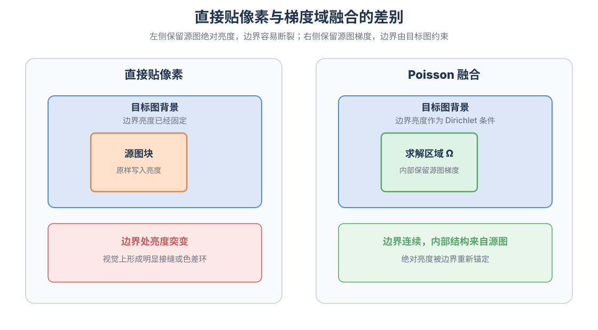
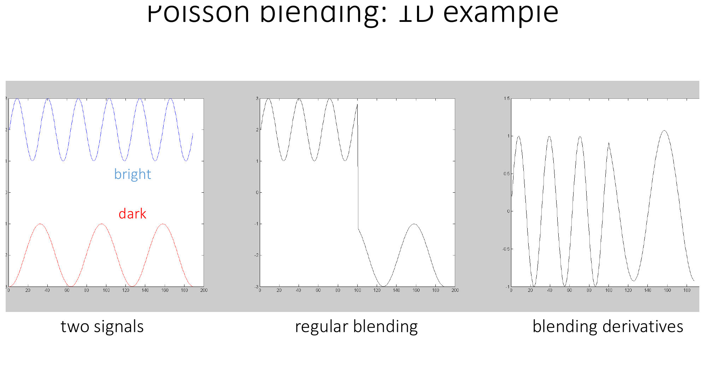
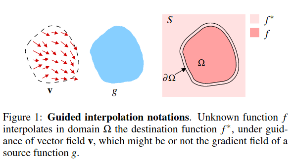
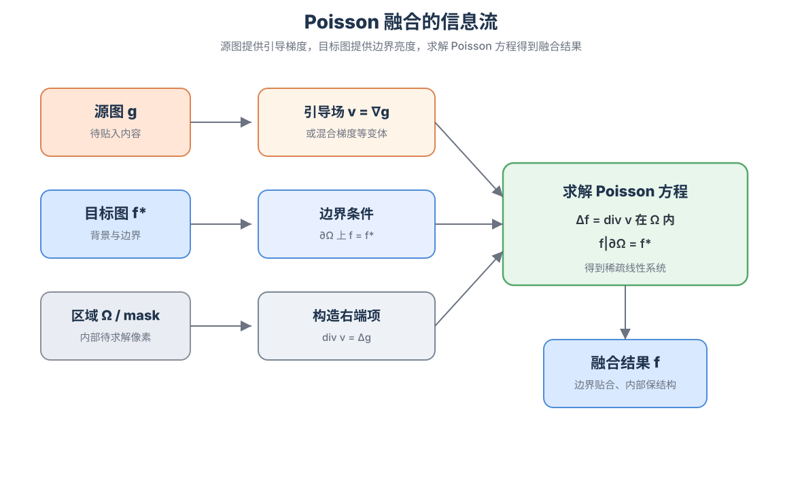
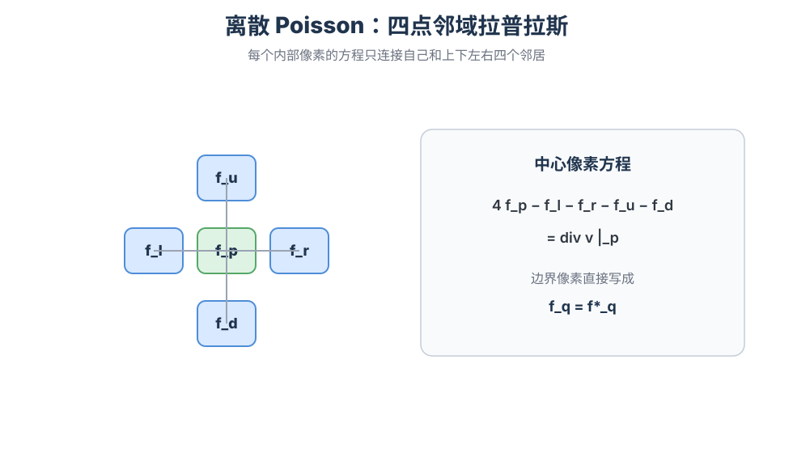
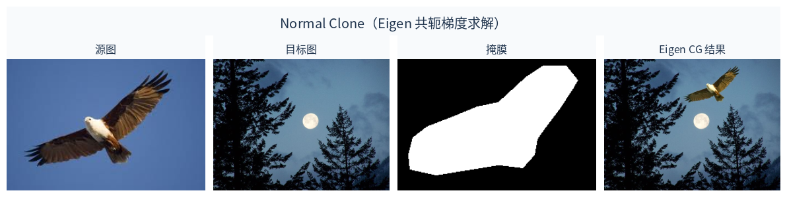
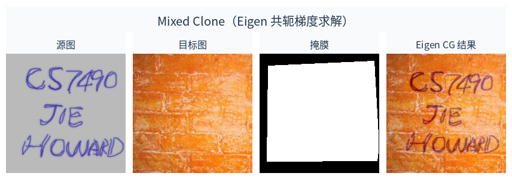

# 图像融合经典算法——Poisson 融合

> Poisson 融合在贴入区域内部让结果图的局部变化尽量跟随源图，在区域边界上让亮度贴住目标图。绝对亮度由边界重新锚定，边缘和纹理通过匹配梯度保留下来。把这个目标写成方程，得到带 Dirichlet 边界条件的 Poisson 问题；落到像素上，得到可用共轭梯度求解的稀疏线性系统。

上一篇 [多频段融合](../multiband-blending/) 按尺度分解图像，再按尺度混合。本篇改在梯度域里做局部融合，更适合把一块内容无缝贴进另一张图。

站内 [Poisson 表面重建](../poisson_understand_2/) 使用同一类数学骨架。两边都是由一个向量场恢复与它最相容的标量场。图像融合里，标量场是亮度，向量场是引导梯度；表面重建里，标量场是隐式函数，向量场是法向场。差别主要在定义域、边界条件和离散方式，方程形态保持一致。

下文按问题、连续模型、离散方程、求解与实现的顺序展开，并与表面重建文章互相参照。

---

## 1. 问题设定

给定目标图 $f^*$、源图 $g$，以及目标图上的一块区域 $\Omega$。任务是把 $g$ 中对应内容放进 $\Omega$，使结果在边界附近看起来连续，同时尽量保留源图内部的边缘和纹理。

这类任务接近局部粘贴。$\Omega$ 外保持 $f^*$ 不变，真正需要重建的是 $\Omega$ 内的亮度。

直接把源图像素写入 $\Omega$，会保留源图的绝对亮度，也把源图与目标图在边界上的亮度差原样留下。两边曝光或色温不一致时，边界会出现色差环。



---

## 2. 一维直觉

先看一个一维例子，会更容易进入二维图像的讨论。

设想两条一维信号，左边偏亮，右边偏暗，中间需要接起来。若直接对数值做加权平均，接缝附近会出现一段两侧都不像的过渡，两边的局部起伏也被抹平。若在接缝左侧保留左信号的差分，在右侧保留右信号的差分，再重新积分出一条曲线，局部起伏仍可留下，整体高度则由端点决定。

Gkioulekas 梯度域讲义里的一维示意把这件事画得很清楚。左侧是两条高低不同、局部起伏类似的信号；中间是直接拼接数值，接缝处出现跳变；右侧改为拼接导数后再积分，局部起伏保留下来，接缝处连续。



图像融合里的 Poisson 思路，是后一种做法在二维上的推广。需要保留的是变化，也就是梯度、差分、边缘与纹理；可以放开的是整体偏移，也就是由边界重新决定的绝对亮度。

Pérez 等人的论文把二维设定画成下面的记号图。未知函数 $f$ 定义在区域 $\Omega$ 内，边界 $\partial\Omega$ 上取目标图 $f^*$，区域内由引导场 $\mathbf{v}$ 约束；$g$ 是源图，常取 $\mathbf{v}=\nabla g$。



因此，贴入一块内容时可以写成两个约束。在 $\Omega$ 内部，结果图 $f$ 的梯度尽量接近引导场 $\mathbf{v}$，通常取 $\nabla g$。在边界 $\partial\Omega$ 上，$f=f^*$，保证外侧背景连续接入。

一句话概括，就是保留局部结构，放开全局偏移。

普通 alpha 混合仍在像素值空间工作，

$$
f = W g + (1-W) f^*.
$$

同一张权值 $W$ 同时作用在所有尺度上。过渡带窄，亮度差会挤在边界；过渡带宽，边缘也会被一起平均。Poisson 融合把内部结构约束和边界亮度约束分开处理。

---

## 3. 从梯度约束到 Poisson 方程

### 3.1 可积的梯度场

若存在某个标量场 $f$ 精确满足 $\nabla f=\mathbf{v}$，就称向量场 $\mathbf{v}$ 可积。对光滑函数，可积性对应混合偏导相等，也就是 $\mathbf{v}$ 的旋度为零，

$$
\nabla\times\mathbf{v}=0.
$$

图像梯度 $\nabla g$ 来自真实图像，因此可积。融合过程中常常会改动梯度，例如在不同区域拼接两张图的梯度、取两边梯度中较大者，或去掉部分纹理。改完之后的 $\mathbf{v}$，一般不再是任何图像的精确梯度。

此时需要在无法精确积分的条件下，寻找一幅与引导场最接近的图像。

### 3.2 最小二乘目标

一个自然的目标是在 $\Omega$ 内最小化梯度误差，同时钉住边界，

$$
\min_f
\iint_{\Omega}\lvert\nabla f-\mathbf{v}\rvert^2\,dx\,dy,
\qquad
f\big|_{\partial\Omega}=f^*\big|_{\partial\Omega}.
$$

这是一个变分问题，未知量是整块区域上的函数 $f$。对它求极值，Euler–Lagrange 方程给出

$$
\Delta f=\operatorname{div}\mathbf{v}
\quad\text{在 }\Omega\text{ 内},
\qquad
f=f^*
\quad\text{在 }\partial\Omega\text{ 上}.
$$

这就是带 Dirichlet 边界条件的 Poisson 方程。

当 $\mathbf{v}=\nabla g$ 时，$\operatorname{div}\mathbf{v}=\Delta g$，于是

$$
\Delta f=\Delta g
\quad\text{在 }\Omega\text{ 内}.
$$

此时 $f$ 与 $g$ 在区域内具有相近的二阶变化结构，差别主要由边界上的绝对亮度吸收。



建模上，目标是让梯度接近 $\mathbf{v}$、边界等于 $f^*$。计算上，这个目标等价于解一个 Poisson 方程，因此可以直接使用稀疏线性代数工具。

Gkioulekas 的梯度域讲义把同类流程写成估计梯度、编辑梯度、得到通常不可积的向量场，再从梯度重建图像。Poisson 融合是这条流程中的经典例子。

---

## 4. 离散像素方程

连续方程还不能直接交给计算机。图像是网格，需要把 $\Delta f=\operatorname{div}\mathbf{v}$ 写成每个内部像素的代数方程。

### 4.1 四点邻域拉普拉斯

对内部像素 $p$，记四邻域为 $N_p$。离散拉普拉斯常用

$$
\Delta f(p)
\approx
\sum_{q\in N_p}\bigl(f_q-f_p\bigr)
=
\Bigl(\sum_{q\in N_p}f_q\Bigr)-\lvert N_p\rvert f_p.
$$

把它移项，并与引导场的离散散度对应起来，Pérez 等人给出的像素方程为

$$
\lvert N_p\rvert\,f_p-\sum_{q\in N_p\cap\Omega}f_q
=
\sum_{q\in N_p}v_{pq}
+
\sum_{q\in N_p\cap\partial\Omega}f^*_q.
$$

其中 $v_{pq}$ 是边上的引导差分。源图梯度模式下，

$$
v_{pq}=g_p-g_q.
$$

### 4.2 方程两端的含义

方程左边只含未知量，包括中心像素 $f_p$，以及仍在 $\Omega$ 内的邻居 $f_q$。  
方程右边是已知量，包括引导场贡献，以及落在边界上的目标图像素 $f^*_q$。

若某个邻居在 $\Omega$ 外，它不进入未知向量，亮度用 $f^*$ 固定并移到右端。这就是 Dirichlet 边界条件在像素上的具体形式。



### 4.3 单个像素的展开

设 $p$ 的四个邻居都在图像内，且全部属于 $\Omega$，引导场取源图梯度，则

$$
4f_p-f_r-f_l-f_u-f_d
=
(g_p-g_r)+(g_p-g_l)+(g_p-g_u)+(g_p-g_d).
$$

右端等于 $4g_p-(g_r+g_l+g_u+g_d)$，也就是源图在 $p$ 处的离散拉普拉斯。  
若右邻落在边界上，未知量里去掉 $f_r$，右端增加 $f^*_r$，同时仍保留引导差分 $g_p-g_r$。

每个内部像素贡献这样一行方程。$\Omega$ 内有 $N$ 个像素，就得到 $N$ 个未知数和 $N$ 行方程。

---

## 5. 组装稀疏系统

把所有内部像素排成未知向量 $\mathbf{f}=(f_{p_1},\ldots,f_{p_N})^{\mathsf T}$。第 $i$ 个像素对应第 $i$ 行。对角元取 $A_{ii}=\lvert N_{p_i}\rvert$；若邻居 $p_j$ 仍在 $\Omega$ 内，则写 $A_{ij}=-1$；右端 $b_i$ 按上一节累加引导差分与边界贡献。于是

$$
A\mathbf{f}=\mathbf{b}.
$$

矩阵 $A$ 稀疏，每行通常只有五个非零项。邻居关系对称，所以 $A$ 对称。在连通区域与 Dirichlet 边界下，$A$ 通常正定，常数漂移被边界钉住，系统可以唯一求解。

彩色图像时，一般对 R、G、B 三个通道分别组装并求解同一结构的系统。

从梯度最小二乘角度看，若把所有邻接边上的差分算子堆成矩阵 $G$，引导差分堆成向量 $\mathbf{v}$，目标可写成

$$
\min_{\mathbf{f}}
\lVert G\mathbf{f}-\mathbf{v}\rVert^2.
$$

对应的法方程为

$$
G^{\mathsf T}G\,\mathbf{f}=G^{\mathsf T}\mathbf{v}.
$$

这里的 $G^{\mathsf T}G$ 正是上面的拉普拉斯型矩阵 $A$，$G^{\mathsf T}\mathbf{v}$ 正是右端 $\mathbf{b}$。先离散 Poisson 方程，或先离散梯度误差再做法方程，得到的是同一类稀疏系统。

---

## 6. 共轭梯度求解

$N$ 可以到数万甚至更大，显式求逆既不现实也无必要。共轭梯度适合这种对称正定稀疏系统，因为它只反复计算矩阵向量积 $A\mathbf{x}$，不需要形成 $A^{-1}$。

CG 实际上在最小化

$$
E(\mathbf{f})=\tfrac12\mathbf{f}^{\mathsf T}A\mathbf{f}-\mathbf{b}^{\mathsf T}\mathbf{f},
$$

其残差为 $\mathbf{r}=A\mathbf{f}-\mathbf{b}$。普通梯度下降沿着 $-\mathbf{r}$ 更新；共轭梯度会构造一组彼此共轭的搜索方向，通常收敛更快。

对本问题，$A$ 来自局部邻域，因此 $A\mathbf{x}$ 本质上是在未知像素上做一次离散拉普拉斯。实现时既可以真正组装稀疏矩阵，也可以在掩膜约束下用卷积完成矩阵向量积。下文的 Eigen 示例采用显式组装。

初始化会影响收敛速度，不改变凸问题的最终解。工程上常用源图嵌入结果，或由粗到细的多层结果作为初值；原理型 demo 使用求解器默认初值即可。

---

## 7. 引导场选择

引导场 $\mathbf{v}$ 决定 $\Omega$ 内部更听从谁的局部变化。

### 7.1 源图梯度

$$
\mathbf{v}=\nabla g,\qquad v_{pq}=g_p-g_q.
$$

这种模式通常称为 Normal Clone。源图结构被尽量完整地带入目标区域，适合更换背景并保留前景外观。

### 7.2 混合梯度

逐边比较源图与目标图的差分幅值，取较大者，

$$
v_{pq}=
\begin{cases}
g_p-g_q,&\lvert g_p-g_q\rvert\ge\lvert f^*_p-f^*_q\rvert,\\
f^*_p-f^*_q,&\text{otherwise}.
\end{cases}
$$

这种模式通常称为 Mixed Clone。源图细节与目标图原有纹理可以共存。把字贴到砖墙上时，笔画来自源图，砖缝仍来自目标图。

两种模式都不改求解器，只改右端 $\mathbf{b}$ 的构造方式。

---

## 8. 与 Poisson 表面重建的联系

站内 [Poisson 表面重建：从法向场到有限元离散](../poisson_understand_2/) 的核心方程是

$$
\Delta\chi=\nabla\cdot\mathbf{V},
$$

其中 $\mathbf{V}$ 由点云法向构造，$\chi$ 是隐式标量场。本篇的图像融合方程是

$$
\Delta f=\nabla\cdot\mathbf{v}.
$$

| 对象 | Poisson 图像融合 | Poisson 表面重建 |
| --- | --- | --- |
| 标量场 | 图像亮度 $f$ | 隐式函数 $\chi$ |
| 引导向量场 | 图像梯度或编辑后的梯度 | 由法向构造的向量场 |
| 定义域 | 图像平面上的区域 $\Omega$ | 三维空间中的自适应网格 |
| 边界条件 | 边界像素取目标图 $f^*$ | 由计算域设置消除常数不确定性 |
| 离散方式 | 像素四点差分，组装 $A\mathbf{f}=\mathbf{b}$ | 局部基函数与有限元弱形式 |
| 输出 | 融合后的图像 | 等值面网格 |

[关于 $\partial$ 符号的说明](../poisson_understand_1/) 也适用于这里。$\partial\Omega$ 表示区域边界，是集合意义下的边界算子。若需要从论文原文对照三维重建一侧的完整推导，可参考 [Poisson 表面重建译文](../poisson_recon/)。

两边都可以沿着“梯度约束、取散度、Poisson 方程、稀疏系统”这条链阅读，不必把公式背成两套。

---

## 9. Eigen 共轭梯度结果

下面两组结果用本文的 Eigen 实现求解。OpenCV 只负责读图写图，线性系统由 `Eigen::ConjugateGradient` 完成。输入图像来自 OpenCV 官方测试数据 [`opencv_extra/testdata/cv/cloning`](https://github.com/opencv/opencv_extra/tree/master/testdata/cv/cloning)。

### 9.1 Normal Clone



飞鸟的羽翼纹理跟随源图梯度进入夜景，整体色调被边界上的夜空亮度重新锚定，掩膜边缘不再留下白天天空的色差环。

### 9.2 Mixed Clone



手写笔画来自源图，砖墙纹理来自目标图。混合梯度让两边的强结构同时留下。

---

## 10. Eigen 共轭梯度实现

实现与上文步骤一致。先根据 mask 与粘贴位置得到目标图上的 $\Omega$，再收集内部像素并建立像素到未知量下标的映射，然后按四点邻域组装稀疏矩阵 $A$ 与右端 $\mathbf{b}$，对每个颜色通道调用共轭梯度求解，最后把解写回 $\Omega$，其余位置保持目标图。

编译需要 Eigen 与 OpenCV，后者仅用于图像读写。

```bash
g++ -std=c++17 poisson_blending_eigen_demo.cpp -o poisson_blending_eigen_demo \
  `pkg-config --cflags --libs opencv4` -I/usr/include/eigen3
```

```bash
./poisson_blending_eigen_demo demo all
./poisson_blending_eigen_demo demo normal
./poisson_blending_eigen_demo demo mixed
```

完整代码与数据见 [`poisson_blending_eigen_demo.cpp`](poisson_blending_eigen_demo.cpp)，也可 [下载 ZIP](./poisson_blending_demo.zip)。

核心组装与求解如下。

```cpp
// 对每个内部像素 p 组装一行：
//   |N_p| f_p - sum_{q in Omega} f_q
//     = sum_q v_pq + sum_{q on boundary} f*_q
void AssembleSystem(const cv::Mat& guidance_f32,
                    const cv::Mat& destination_f32,
                    const cv::Mat& omega,
                    const std::vector<Pixel>& interior,
                    bool mixed_gradients,
                    Eigen::SparseMatrix<double>* A,
                    Eigen::VectorXd* b) {
  const int n = static_cast<int>(interior.size());
  cv::Mat index_map(omega.size(), CV_32SC1, cv::Scalar(-1));
  for (int i = 0; i < n; ++i) {
    index_map.at<int>(interior[i].y, interior[i].x) = i;
  }

  std::vector<Eigen::Triplet<double>> triplets;
  b->resize(n);
  b->setZero();

  const int dx[4] = {1, -1, 0, 0};
  const int dy[4] = {0, 0, 1, -1};

  for (int i = 0; i < n; ++i) {
    const int px = interior[i].x;
    const int py = interior[i].y;
    const float gp = guidance_f32.at<float>(py, px);
    const float fp = destination_f32.at<float>(py, px);

    int degree = 0;
    double rhs = 0.0;

    for (int k = 0; k < 4; ++k) {
      const int qx = px + dx[k];
      const int qy = py + dy[k];
      if (!Inside(qx, qy, omega.cols, omega.rows)) {
        continue;
      }
      ++degree;

      const float gq = guidance_f32.at<float>(qy, qx);
      const float fq = destination_f32.at<float>(qy, qx);
      const float vg = gp - gq;
      const float vf = fp - fq;
      const float vpq =
          (!mixed_gradients || std::fabs(vg) >= std::fabs(vf)) ? vg : vf;
      rhs += static_cast<double>(vpq);

      if (IsInterior(omega, qx, qy)) {
        const int j = index_map.at<int>(qy, qx);
        triplets.emplace_back(i, j, -1.0);
      } else {
        rhs += static_cast<double>(fq);  // 边界邻居用 f* 固定
      }
    }

    triplets.emplace_back(i, i, static_cast<double>(degree));
    (*b)(i) = rhs;
  }

  A->resize(n, n);
  A->setFromTriplets(triplets.begin(), triplets.end());
  A->makeCompressed();
}

Eigen::ConjugateGradient<Eigen::SparseMatrix<double>,
                         Eigen::Lower | Eigen::Upper> cg;
cg.setTolerance(1e-10);
cg.compute(A);
Eigen::VectorXd x = cg.solve(b);
```

这段实现里，未知量只包含 `omega` 内的像素；矩阵一行的对角元是邻居个数，与内部邻居的连接写成 $-1$；右端由引导差分 $v_{pq}$ 与边界邻居的 $f^*$ 累加得到。

---

## 11. 与多频段融合的关系

| 方面 | 多频段融合 | Poisson 融合 |
| --- | --- | --- |
| 主要对象 | 两张图按尺度混合 | 一块区域内重建亮度 |
| 核心表示 | 拉普拉斯 / 高斯金字塔 | 梯度场与边界条件 |
| 过渡方式 | 细层窄切换，粗层宽过渡 | 边界钉住，内部匹配梯度 |
| 典型场景 | 全景拼接、大范围重叠融合 | 局部克隆、局部替换 |
| 对曝光差 | 粗层平滑过渡，常需另做匀色 | 边界重新锚定局部亮度 |
| 对未对齐 | 重影变柔，几何误差仍在 | 同样不能纠正几何误差 |

大范围重叠区可用多频段融合，局部贴图可用 Poisson 融合。两者都无法替代几何配准。

---

## 12. 作用与边界

Poisson 融合擅长处理局部区域的亮度不连续。源图结构清晰、目标图边界稳定时，求解结果常能把源图内容托到目标图的光照条件下。

掩膜穿过人脸或细长结构、两图未对齐、光照方向明显冲突，以及不准确的 $\Omega$，都需要单独处理。方程只能在给定约束下求最优，不能自动给出正确的接缝或位移。

---

## 13. 小结

Poisson 融合在区域 $\Omega$ 内约束结果图的梯度接近引导场，在边界 $\partial\Omega$ 上取目标图像素作为 Dirichlet 条件。引导场经过编辑后通常不可积，对应的最小二乘问题等价于 Poisson 方程 $\Delta f=\operatorname{div}\mathbf{v}$。离散后，每个内部像素对应四点邻域的一行方程，整体形成稀疏系统 $A\mathbf{f}=\mathbf{b}$，可用共轭梯度求解。不同克隆模式对应不同的引导场，差别写在右端 $\mathbf{b}$ 里。

该方法与 [Poisson 表面重建](../poisson_understand_2/) 使用同一类由向量场恢复标量场的方程。与 [多频段融合](../multiband-blending/) 相比，前者在局部区域按梯度重建亮度，后者在多个尺度上按拉普拉斯金字塔混合图像。

## 参考

- Patrick Pérez, Michel Gangnet, and Andrew Blake, “Poisson Image Editing”, ACM Transactions on Graphics (SIGGRAPH), 2003.
- Ioannis Gkioulekas, “Gradient-domain image processing”, CMU 15-463/663/862 Computational Photography, Lecture 9, 2019.
- Peter J. Burt and Edward H. Adelson, “A Multiresolution Spline with Application to Image Mosaics”, ACM Transactions on Graphics, 1983.
- Kazhdan, M., Bolitho, M., & Hoppe, H., “Poisson Surface Reconstruction”, 2006.
- Eigen, `ConjugateGradient` sparse solver documentation.
- OpenCV cloning sample images in `opencv_extra/testdata/cv/cloning`.
