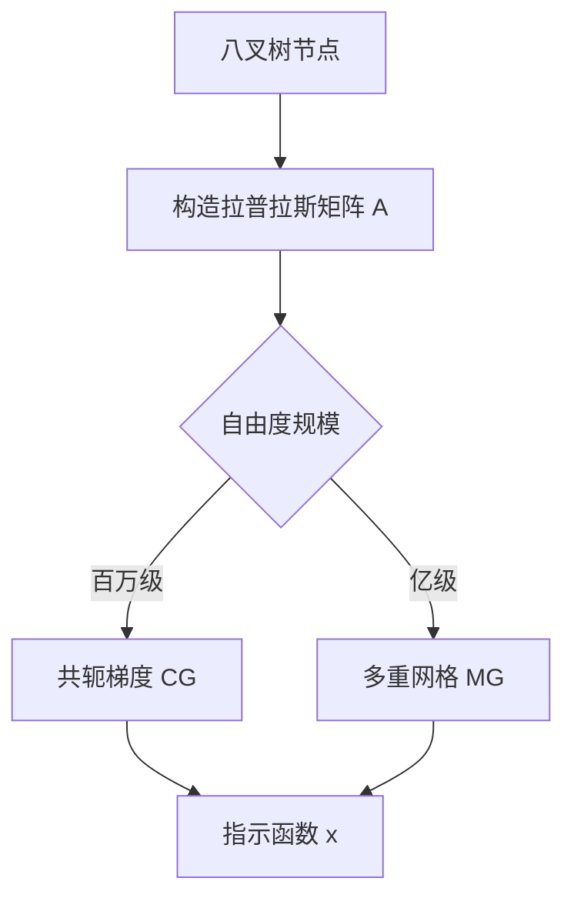

# 泊松重建中的稀疏线性系统求解

泊松重建（Poisson Surface Reconstruction）把"由带法向的点云重建曲面"转化为一个全局的隐式函数拟合问题。核心思想：**指示函数的梯度应当逼近点云法向场**。

## 问题建模

设点云法向场为 $\vec{V}$，指示函数为 $\chi$，我们希望：

$$
\nabla \chi = \vec{V}
$$

两边取散度得到泊松方程：

$$
\Delta \chi = \nabla \cdot \vec{V}
$$

$$\begin{equation}
\int_{\Omega} \nabla \chi \cdot \nabla \psi \, d\Omega = \int_{\Omega} \vec{V} \cdot \nabla \psi \, d\Omega
\end{equation}$$

其中 $\psi$ 为测试函数。离散化后得到稀疏线性系统：

$$
A \mathbf{x} = \mathbf{b}
$$

矩阵 $A$ 的稀疏结构如下（mermaid 示意图）：



## 离散化细节

在八叉树的每个节点上，基函数为：

$$
F_o(q) = \tilde{F}\left(\frac{q - c_o}{w_o}\right) \cdot \frac{1}{w_o^3}
$$

其中 $c_o$ 是节点中心，$w_o$ 是节点宽度。矩阵元素：

$$
A_{o,o'} = \left\langle \nabla F_o, \nabla F_{o'} \right\rangle
= \int \nabla \tilde{F}_p(q_0) \cdot \nabla \tilde{F}_{p'}(q_0) \, dp
$$

## 共轭梯度实现要点

```cpp
// 稀疏矩阵-向量乘：A 是八叉树分层的块结构
void matVec(const SparseMatrix& A, const VectorXf& x, VectorXf& y) {
  y.setZero();
  // 遍历非零块（同一父节点内的相互作用）
  for (const auto& block : A.blocks) {
    y.segment(block.row0, block.size) +=
        block.mat * x.segment(block.col0, block.size);
  }
}
```

收敛判据用相对残差：

$$
\frac{\|\mathbf{r}_k\|_2}{\|\mathbf{b}\|_2} < 10^{-4}
$$

## 特殊公式形式

多行对齐：

$$\begin{align}
\chi(q) &= \sum_{o \in \mathcal{O}} x_o F_o(q) \\
\nabla \chi(q) &= \sum_{o \in \mathcal{O}} x_o \nabla F_o(q)
\end{align}$$

分段函数：

$$
f(x) =
\begin{cases}
1, & x > \epsilon \\
0, & |x| \le \epsilon \\
-1, & x < -\epsilon
\end{cases}
$$

组合数（重建度量的权重）：

$$
\binom{n}{k} = \frac{n!}{k!(n-k)!}
$$

带编号与自定义标签：

$$
\max_{\mathbf{x}} \; \mathbf{c}^{\mathsf{T}} \mathbf{x}
\quad \text{s.t.} \quad A\mathbf{x} \le \mathbf{b}
\tag{LP}
$$

## 小结

- 泊松重建的精度瓶颈往往在**法向估计**而非线性求解器
- 百万自由度以下 CG 足够，更大规模需要多重网格预条件
- 矩阵构造遵循"父节点块稀疏"结构，缓存友好

下一篇计划写各向异性八叉树的实现细节。
