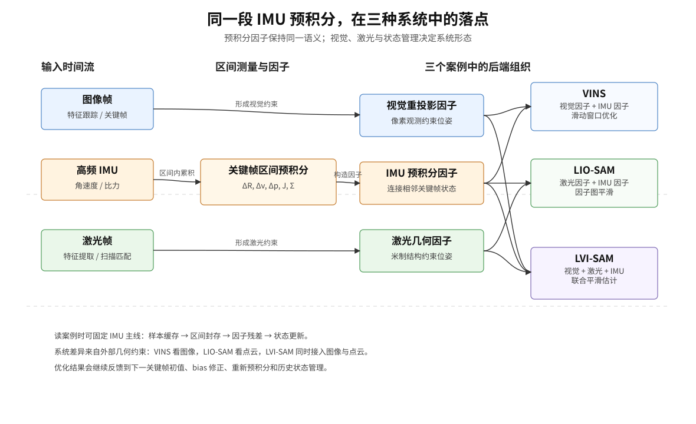

# 使用IMU预积分的三篇文章：VINS、LIO-SAM 与 LVI-SAM

> 上一篇从运动模型出发，推导了相对旋转、速度、位置增量，说明 bias Jacobian 和协方差的递推过程，并把它们写成 IMU 因子残差。本文沿着一段关键帧之间的 IMU 数据继续往下走，说明这些量进入 VINS、LIO-SAM 和 LVI-SAM 后怎样参与轨迹估计。

**阅读路线：** [IMU 预积分详解：原理、推导与 C++/Eigen 实现](../imu-preintegration/index.html) → 本文。误差状态与噪声约定可参考 [ESKF 系列](../ekf-again/index.html)、[IMU 噪声参数](../imu-noise-allan-variance/index.html) 和 [IMU 零偏可观性](../imu-bias-estimation/index.html)。

## 从一段 IMU 数据开始

系统处理完关键帧 $i$ 后，继续接收 IMU 测量。等到相机或激光产生关键帧 $j$，这段时间内的 IMU 样本就有了明确的起点和终点。几十到几百个高频样本，沿着下面的链路汇聚成一条连接两个关键帧的约束：

$$
\text{IMU 样本}_{i\rightarrow j}
\xrightarrow{\text{在线递推}}
\text{预积分测量}
\xrightarrow{\text{构造}}
\text{IMU 因子}
\xrightarrow{\text{和外部因子一起优化}}
\text{新的关键帧状态}.
$$

预积分保存的是两个端点之间的**相对运动信息**。端点状态、重力、bias 和协方差随后会进入残差计算，使这段相对运动成为一条带有不确定性的优化约束。

VINS、LIO-SAM 和 LVI-SAM 可以共享 IMU 因子的基本结构。VINS 以视觉重投影约束关键帧，LIO-SAM 以激光匹配约束关键帧，LVI-SAM 则把视觉和激光的几何约束放进同一套紧耦合估计流程。预积分负责把高频惯性信息接到状态图上，外部传感器负责补充纯惯性信息无法长期提供的几何约束。

**关键词：** IMU 预积分；VINS；LIO-SAM；LVI-SAM；滑动窗口；因子图；视觉惯性；激光惯性



上图把三种系统放在同一张信息流里。橙色部分是 IMU 预积分，它始终沿着“样本缓存、区间封存、因子残差、状态更新”这条主线前进；蓝色部分是视觉约束，绿色部分是激光约束。后面的三个案例都沿着这张图展开：从关键帧区间的确定讲起，再把外部观测和 IMU 因子怎样一起改变状态说清楚。

## 1. 关键帧之间的 IMU 数据

从关键帧 $i$ 开始，系统进入下一个关键帧之前的时间区间。IMU 仍以自己的频率不断输出测量，视觉或激光前端则继续判断下一帧是否应当成为关键帧。

### 1.1 预积分对象的创建与累积

关键帧 $i$ 处理完成后，系统会创建一个新的预积分对象，并记录：

- 起点时间 $t_i$；
- 用于积分的参考 gyro bias 和 accelerometer bias；
- 初始增量 $\Delta\mathbf R=\mathbf I$、$\Delta\mathbf v=\mathbf0$、$\Delta\mathbf p=\mathbf0$；
- 对 bias 的 Jacobian；
- 预积分量的协方差。

之后每来一个 IMU 样本，就按照时间顺序加入这个对象。它递推的是关键帧 $i$ 局部坐标系里的相对运动：

$$
\left(\Delta\mathbf R_{i k},\Delta\mathbf v_{i k},\Delta\mathbf p_{i k}\right)
\longrightarrow
\left(\Delta\mathbf R_{i,k+1},\Delta\mathbf v_{i,k+1},\Delta\mathbf p_{i,k+1}\right).
$$

在这个阶段，终点状态还没有加入当前的优化问题。IMU 测量先被保存在区间摘要中，视觉或激光前端确定关键帧边界后，这段摘要才会与新的状态节点连接起来。

### 1.2 关键帧边界与区间测量

当相机或激光前端产生关键帧 $j$ 时，区间 $[t_i,t_j]$ 也随之确定。系统完成当前区间的封存，并开始下一段预积分：

1. 取出 $t_i$ 到 $t_j$ 之间的 IMU 样本，并处理首尾时间戳；
2. 把当前预积分结果封存为 $i\rightarrow j$ 的 IMU 测量；
3. 创建新的预积分对象，从 $j$ 开始接收后续 IMU。

封存的对象包含一组带不确定性的相对测量：

$$
\mathcal{P}_{ij}=
\left(
\Delta\mathbf R_{ij},
\Delta\mathbf v_{ij},
\Delta\mathbf p_{ij},
\mathbf J_{ij},
\mathbf\Sigma_{ij},
\Delta t_{ij}
\right).
$$

其中 $\mathbf J_{ij}$ 代表对 bias 的敏感性，$\mathbf\Sigma_{ij}$ 代表积分噪声和传播误差的不确定性。它们让这段数据可以在后续多次优化中重复使用。

### 1.3 相对测量与端点状态

此时系统有两个状态节点：

$$
\mathbf x_i=(\mathbf R_i,\mathbf p_i,\mathbf v_i,\mathbf b_{g_i},\mathbf b_{a_i}),
$$

$$
\mathbf x_j=(\mathbf R_j,\mathbf p_j,\mathbf v_j,\mathbf b_{g_j},\mathbf b_{a_j}).
$$

预积分结果连接这两个节点，形成 IMU 因子：

$$
\mathbf x_i
\xleftrightarrow[\text{IMU 因子}]{t_i\rightarrow t_j}
\mathbf x_j.
$$

相机图像或激光点云也会生成各自的因子。后端把这些约束放入同一个最小二乘问题，在协方差决定的权重下共同估计端点状态。

### 1.4 优化迭代中的预积分测量

一次优化会改变 $\mathbf R_i,\mathbf p_i,\mathbf v_i$ 以及 bias 的估计，但已经保存的原始预积分测量不会凭空改变。改变的是：

- 残差计算时使用的端点状态改变了；
- 当前 bias 与预积分参考 bias 的差值改变了；
- 必要时用 bias Jacobian 修正预积分测量；
- 若 bias 偏离参考点太远，则重新遍历原始 IMU 样本进行预积分。

因此，预积分测量可以在局部线性化范围内重复使用。优化迭代主要改变残差评价，无需每次都重新访问全部高频样本。

## 2. 预积分与优化变量

### 2.1 直接积分可以得到运动，但不适合反复优化

给定初始状态和 IMU 测量，可以按照惯性导航方程传播：

$$
\mathbf R_{k+1}=\mathbf R_k\operatorname{Exp}
\left((\tilde{\boldsymbol\omega}_k-\mathbf b_{g,k})\Delta t_k\right),
$$

$$
\mathbf v_{k+1}=\mathbf v_k+
\left(\mathbf g+\mathbf R_k(\tilde{\mathbf a}_k-\mathbf b_{a,k})\right)\Delta t_k,
$$

$$
\mathbf p_{k+1}=\mathbf p_k+\mathbf v_k\Delta t_k+
\frac12\mathbf R_k(\tilde{\mathbf a}_k-\mathbf b_{a,k})\Delta t_k^2.
$$

这在状态传播中完全合理。但在滑动窗口或因子图中，优化器会反复改变起点姿态、速度、位置和 bias。如果每次迭代都从 $i$ 的新状态出发，逐样本积分到 $j$，同一批 IMU 数据会被重复访问很多次。

优化器通常只保留关键帧状态作为主要节点。预积分把中间的高频过程压缩成端点之间的一条测量，图的节点数量也因此主要由关键帧决定。

### 2.2 预积分结果与状态变量

下面的表列出了预积分结果与完整状态之间的关系：

| 内容 | 是否由预积分直接保存 | 说明 |
|---|---:|---|
| $\Delta\mathbf R_{ij}$ | 是 | 起点局部坐标系中的相对旋转 |
| $\Delta\mathbf v_{ij}$ | 是 | 起点局部坐标系中的速度增量 |
| $\Delta\mathbf p_{ij}$ | 是 | 起点局部坐标系中的位移增量 |
| bias Jacobian | 是 | 说明测量对参考 bias 的局部敏感性 |
| 协方差 | 是 | 决定这条约束在优化中的可信程度 |
| 世界系位置 $\mathbf p_j$ | 否 | 由端点状态和其他因子共同估计 |
| 世界系姿态 $\mathbf R_j$ | 否 | 由端点状态和其他因子共同估计 |
| 最终轨迹 | 否 | 需要全部因子和优化过程 |

因此，预积分结果应理解为关键帧之间的相对运动测量。它进入系统后，构成连接两个状态的 IMU 因子。

## 3. IMU 因子的形成

### 3.1 端点状态给出一份相对运动

固定世界坐标系 $W$ 和 IMU 坐标系 $B$，令 $\mathbf R_i$ 表示从 $B_i$ 到 $W$ 的旋转。由当前待优化的端点状态，可以计算从 $i$ 到 $j$ 的相对运动：

$$
\Delta\mathbf R_{ij}^{\mathrm{state}}
=\mathbf R_i^\top\mathbf R_j,
$$

$$
\Delta\mathbf v_{ij}^{\mathrm{state}}
=\mathbf R_i^\top
\left(\mathbf v_j-\mathbf v_i-\mathbf g\Delta t_{ij}\right),
$$

$$
\Delta\mathbf p_{ij}^{\mathrm{state}}
=\mathbf R_i^\top
\left(\mathbf p_j-\mathbf p_i-\mathbf v_i\Delta t_{ij}
-\frac12\mathbf g\Delta t_{ij}^2\right).
$$

它们表示当前两个状态所对应的相对运动。

### 3.2 IMU 预积分给出另一份相对运动

原始 IMU 样本通过递推得到

$$
\Delta\mathbf R_{ij}^{\mathrm{imu}},\qquad
\Delta\mathbf v_{ij}^{\mathrm{imu}},\qquad
\Delta\mathbf p_{ij}^{\mathrm{imu}}.
$$

这些量在起点局部坐标系中表达，因此不依赖优化过程中不断变化的世界系起点位姿。若当前 bias 与预积分时采用的参考 bias 不同，就利用 Jacobian 做局部修正。例如，速度和位置可抽象写为

$$
\widehat{\Delta\mathbf v}_{ij}
\approx\Delta\mathbf v_{ij}^{\mathrm{imu}}
+\mathbf J_{v b_g}\delta\mathbf b_g
+\mathbf J_{v b_a}\delta\mathbf b_a,
$$

$$
\widehat{\Delta\mathbf p}_{ij}
\approx\Delta\mathbf p_{ij}^{\mathrm{imu}}
+\mathbf J_{p b_g}\delta\mathbf b_g
+\mathbf J_{p b_a}\delta\mathbf b_a.
$$

旋转的 bias 修正要通过旋转群上的扰动表达，具体符号取决于左扰动、右扰动和旋转方向约定。预积分使用参考 bias，优化状态使用当前 bias，Jacobian 则把二者的小差异传递到相对测量。

### 3.3 两份相对运动形成残差

IMU 因子的旋转残差可以写成

$$
\mathbf r_{R,ij}
=\operatorname{Log}\left(
\widehat{\Delta\mathbf R}_{ij}^{\top}
\mathbf R_i^\top\mathbf R_j
\right),
$$

速度和位置残差写成

$$
\mathbf r_{v,ij}
=\mathbf R_i^\top
\left(\mathbf v_j-\mathbf v_i-\mathbf g\Delta t_{ij}\right)
-\widehat{\Delta\mathbf v}_{ij},
$$

$$
\mathbf r_{p,ij}
=\mathbf R_i^\top
\left(\mathbf p_j-\mathbf p_i-\mathbf v_i\Delta t_{ij}
-\frac12\mathbf g\Delta t_{ij}^2\right)
-\widehat{\Delta\mathbf p}_{ij}.
$$

合并后得到 IMU 因子残差：

$$
\mathbf r_{ij}^{\mathrm{imu}}
=
\begin{bmatrix}
\mathbf r_{R,ij}\\
\mathbf r_{v,ij}\\
\mathbf r_{p,ij}\\
\mathbf r_{b_g,ij}\\
\mathbf r_{b_a,ij}
\end{bmatrix}.
$$

最后两项通常约束相邻关键帧的 bias 演化，例如随机游走模型下的 bias 差。具体是否把 bias 项放进同一个因子，以及残差排列顺序，取决于实现；共同语义是不变的。

端点状态给出一份相对运动，IMU 样本给出另一份相对运动。两者的差异形成残差，优化器据此调整端点状态。

### 3.4 协方差决定“相信这条约束多少”

预积分不只是三个增量。IMU 噪声会随积分传播，因此因子还需要协方差 $\mathbf\Sigma_{ij}$。对应的加权代价为

$$
E_{ij}^{\mathrm{imu}}
=
\left\|\mathbf r_{ij}^{\mathrm{imu}}\right\|^2_{\mathbf\Sigma_{ij}}
=
\mathbf r_{ij}^{\mathrm{imu}\top}
\mathbf\Sigma_{ij}^{-1}
\mathbf r_{ij}^{\mathrm{imu}}.
$$

协方差较小时，这段 IMU 约束相对可靠，残差会受到更强惩罚；协方差较大时，优化器允许它与视觉或激光约束存在更明显的不一致。约束权重由噪声模型、积分时长和线性化传播共同决定。

## 4. 从数据流看预积分对象的生命周期

把前面的内容整理成一次可以在系统中追踪的生命周期：

| 阶段 | 输入 | 预积分对象的状态 | 输出或影响 |
|---|---|---|---|
| 创建 | 起点关键帧、参考 bias | 增量为单位值，协方差初始化 | 开始接收区间内 IMU |
| 累积 | 连续 IMU 测量与时间间隔 | 递推 $\Delta R,\Delta v,\Delta p,J,\Sigma$ | 暂时只是未封存的区间摘要 |
| 结束 | 终点关键帧时间戳 | 对应 $i\rightarrow j$ 的固定测量 | 形成 IMU 因子 |
| 评价 | 当前端点状态、当前 bias、重力 | 必要时做局部 bias 修正 | 计算残差和 Jacobian |
| 优化 | IMU 因子与外部因子 | 预积分测量通常保持不变 | 更新姿态、位置、速度和 bias |
| 检查 | 新旧 bias 的差异 | 偏离过大时重新积分 | 产生新的参考测量 |
| 状态管理 | 窗口或图的生命周期 | 因子继续保留或被压缩 | 保持实时性或全局一致性 |

这张表也给出了阅读实现时的一条索引。沿着预积分对象的生命周期，可以依次确认参考 bias 的记录时刻、样本的加入位置、区间的结束时间、协方差进入因子的时机，以及 bias 变化后的修正或重积分策略。

## 5. 一次优化迭代里，预积分具体做了什么

设后端已经有当前状态估计。一次非线性最小二乘迭代通常可以按下面的顺序理解：

1. 读取节点 $i$ 和 $j$ 的当前姿态、位置、速度和 bias；
2. 根据当前 bias 与预积分参考 bias 的差值，修正 $\Delta R,\Delta v,\Delta p$；
3. 用当前端点状态、重力和修正后的预积分量计算 IMU 残差；
4. 根据残差对端点状态求局部 Jacobian；
5. 用预积分协方差对白化后的残差和 Jacobian 加权；
6. 将 IMU 因子与视觉、激光、回环、GNSS 或先验因子一起交给非线性求解器；
7. 求解状态增量并更新关键帧状态；
8. 重新评价残差，直到满足当前迭代的停止条件。

预积分在系统中有两个相互衔接的阶段：

- **关键帧之间在线累积**：把高频样本压缩成可复用的区间测量；
- **后端优化中反复评价**：用端点状态和 bias 修正这条测量，生成当前残差。

### 5.1 bias 变化与重新预积分

预积分时采用参考 bias $\mathbf b^{\mathrm{ref}}$，而优化中的 bias 可能是 $\mathbf b$。令

$$
\delta\mathbf b=\mathbf b-\mathbf b^{\mathrm{ref}}.
$$

在局部范围内，可以利用一阶近似：

$$
\widehat{\Delta\mathbf z}
\approx
\Delta\mathbf z(\mathbf b^{\mathrm{ref}})
+\mathbf J_{\mathbf z b}\delta\mathbf b,
$$

其中 $\mathbf z$ 可以代表旋转、速度或位置增量。这样就不必因为每一个小的 bias 更新都重积分。

这是一阶线性化关系。当 $\delta\mathbf b$ 变大时，修正误差也会增大。工程上常见的处理策略是：

1. 小范围 bias 更新：使用已保存的 Jacobian 做修正；
2. bias 偏离参考值超过阈值：用当前 bias 重新遍历原始区间 IMU；
3. 把新的 bias 作为参考点，重新初始化 Jacobian 和协方差传播。

重新预积分的作用，是把线性化中心移到更接近当前 bias 的位置。

### 5.2 时间戳边界与区间对齐

关键帧时刻通常不一定正好落在某一个 IMU 样本上。区间首尾可能需要使用前后两个样本插值，或按实现约定分配时间间隔。如果把属于下一个区间的样本提前加入，或者一个样本同时加入两个区间，得到的 $\Delta t$、协方差和端点对齐都会改变。

这类问题常表现为：公式看起来正确，但旋转残差持续偏大、速度残差呈系统性偏差，或者轨迹在关键帧边界处出现跳变。阅读系统时，除了看积分公式，还要确认 IMU 缓冲、时间排序、边界插值和传感器时间偏移的处理。

## 6. VINS：视觉因子接到惯性区间上

下面以 VINS-Mono 为代表，沿着预积分进入系统的数据流说明视觉前端、IMU 因子和滑动窗口之间的关系。

### 6.1 相机关键帧确定预积分区间

VINS 以相机关键帧作为主要状态节点。系统处理完图像关键帧 $i$ 后，后端保存该帧的位姿、速度和 bias，新的预积分对象也从这个时刻开始接收 IMU。接下来相机可能还会产生普通图像帧，视觉前端继续跟踪特征；IMU 则以更高频率不断到来，被顺序加入当前区间。

当图像帧 $j$ 被选为新的关键帧时，区间 $i\rightarrow j$ 被封住。这个动作很关键：此前分散到来的 IMU 样本，此时有了明确的两个端点，于是被整理成一条连接 $\mathbf x_i$ 和 $\mathbf x_j$ 的 IMU 因子。

对每一对相邻节点，后端至少会看到两类信息：

$$
\mathbf x_i
\xleftrightarrow{\text{IMU 因子}}
\mathbf x_j,
$$

$$
\text{路标点}
\xrightarrow{\text{多帧观测}}
\text{视觉重投影因子}.
$$

IMU 因子提供短时间内的姿态、速度和位置连续性；视觉因子通过同一个三维点在不同相机姿态下的像素投影，维持环境几何的一致性。

### 6.2 同一个特征点把多个关键帧串起来

图像帧 $i$ 到 $j$ 之间，视觉前端一直在跟踪角点或其他图像特征。某个特征点如果在多帧中被观测到，后端就可以把它表示成路标点或逆深度变量，并检查这个点投影回每一帧图像时是否落在观测像素附近。这个差值就是重投影残差。

这样，VINS 的一小段窗口里会同时出现两种约束。IMU 因子说，从 $i$ 到 $j$ 的姿态、速度和位置变化应当符合这段惯性测量；视觉因子说，同一批环境点在这些相机位姿下应当投影到正确的像素位置。前者更像连续运动约束，后者更像环境几何约束。优化器改变关键帧位姿、速度、bias 和路标点深度时，两类残差会一起变化。

单目 VINS 还需要特别处理尺度。只看图像几何，整条轨迹可以等比例放大或缩小；IMU 提供了重力方向、时间尺度、速度变化和加速度信息，使系统能够在初始化阶段把视觉结构、尺度、速度和 bias 对齐。完成初始化后，预积分因子继续在每个相邻关键帧区间里维持短时运动连续性。

### 6.3 滑动窗口中的因子管理

如果所有历史关键帧、路标点和因子都永久留在优化中，计算规模会不断增长。VINS 通常使用固定长度的滑动窗口：

1. 新关键帧进入窗口；
2. 新的 IMU 因子和视觉重投影因子加入；
3. 在当前窗口内进行非线性优化；
4. 窗口超过长度后，选择旧状态移出；
5. 用边缘化把被移除变量的信息压缩为对剩余变量的先验。

预积分压缩关键帧之间的高频 IMU 样本，边缘化则压缩旧状态及其已有因子对当前窗口的影响。预积分生成局部运动测量，边缘化管理优化问题的规模。

这里可以把一个关键帧的生命周期连起来看：图像 $j$ 进入窗口后，它带来了新的视觉观测，也封住了上一段 IMU 预积分；优化更新之后，$j$ 的状态又成为下一段预积分的起点。若优化后 bias 与预积分参考 bias 只有小幅差异，残差计算用 Jacobian 修正即可；若差异变大，系统会重新遍历保存的 IMU 样本，把这段区间重新积分到新的 bias 参考点附近。

### 6.4 VINS 中的 IMU 数据流

阅读 VINS 的 IMU 部分时，可以沿着关键帧创建、区间起止时间、IMU 样本缓存、预积分对象、因子残差和视觉重投影的顺序追踪。随后再观察 bias 更新、重新预积分和边缘化先验之间的衔接。这样看下来，视觉前端、IMU 因子和滑动窗口会呈现为一条连续链路：图像决定节点，IMU 连接相邻节点，视觉特征把多个节点拉到同一份环境几何上。

## 7. LIO-SAM：激光几何接到惯性区间上

LIO-SAM 是另一种典型的组织方式。它以激光关键帧为图中的主要节点，将激光里程计因子、IMU 预积分因子，以及可用的 GPS 和回环因子放进平滑与建图框架。

### 7.1 激光关键帧封住 IMU 区间

在 LIO-SAM 中，关键帧边界通常由激光里程计和建图过程决定。系统处理完激光关键帧 $i$ 后，IMU 样本继续进入缓存和预积分对象；新的点云帧到来时，前端会利用点云特征、局部地图和运动初值估计当前扫描相对于地图的位姿。IMU 在这里既提供高频运动连续性，也常用于给点云处理提供短时运动参考。

当当前点云被接受为关键帧 $j$，上一段 IMU 区间也随之封存。于是相邻激光关键帧之间，会形成一条 IMU 预积分因子：

$$
\mathbf x_i
\xleftrightarrow{\text{IMU 预积分因子}}
\mathbf x_j.
$$

与此同时，激光前端会根据点云几何生成位姿约束。它可能来自相邻关键帧之间的匹配，也可能来自当前扫描到局部地图的匹配；落到后端时，本质上都是在告诉优化器：关键帧 $j$ 的位姿应当与周围点云结构保持一致。

$$
\mathbf x_i
\xleftrightarrow{\text{激光相对位姿因子}}
\mathbf x_j.
$$

### 7.2 同一段运动被惯性和点云共同描述

这两条因子描述的是同一段运动，但关注点不同：

| 因子 | 主要比较对象 | 典型优势 | 主要限制 |
|---|---|---|---|
| IMU 因子 | 动力学模型与惯性测量是否一致 | 高频、短时连续、对快速姿态变化敏感 | bias 导致长期漂移，噪声会累积 |
| 激光因子 | 点云几何配准是否一致 | 提供米制平移和环境结构约束 | 空旷、重复或退化几何中约束变弱 |

如果 IMU 积分预测的位姿和点云匹配得到的位姿略有差异，后端不会只相信其中一个。IMU 因子的协方差表达这段惯性积分的可信度，激光因子的噪声模型表达点云匹配的可信度；优化器根据这些权重更新关键帧位姿、速度和 bias。更新后的位姿又会回到前端，成为后续点云匹配、局部地图维护和下一段 IMU 传播的初值。

### 7.3 激光测量中的尺度

点云配准通常直接在米制空间中比较几何位置，因此激光关键帧之间的相对平移带有尺度。LIO-SAM 一般不需要像单目视觉那样，从无尺度图像运动中单独恢复整体尺度。

激光系统仍然需要 IMU。快速转动时，点云在一个扫描周期内覆盖了连续运动过程；环境空旷、重复或局部几何退化时，点云配准的某些方向也可能变弱。IMU 预积分提供高频姿态、速度和短时运动先验，激光几何约束则把纯惯性积分容易漂移的平移和姿态拉回环境结构中。两类约束各自有短板，组合起来更适合实时建图。

### 7.4 GPS 和回环位于更长时间尺度

LIO-SAM 中的 GPS 因子可以对关键帧位置施加绝对约束，回环因子可以把当前关键帧与历史关键帧重新连接。它们改变的是轨迹的长时间尺度一致性，并不改变一段局部 IMU 预积分量的定义。

因此可以把 LIO-SAM 的信息流写成：

```text
高频 IMU ──► 关键帧区间预积分 ──► IMU 因子 ───────┐
                                                   │
点云 ──────► 特征与扫描匹配 ────► 激光因子 ────────┤
                                                   ▼
GPS / 回环 ─────────────────────► 全局因子 ──► 因子图平滑
                                                   │
                                                   ▼
                                               轨迹与地图
```

读 LIO-SAM 时，可以从激光关键帧 $j$ 出发往回看：点云给出当前帧和地图之间的几何残差，IMU 给出 $i\rightarrow j$ 的连续运动残差，GPS 或回环在更稀疏的时间尺度上补充全局一致性。预积分处在局部运动链路上，保证相邻关键帧之间的高频惯性信息没有在降采样和建图过程中丢掉。

## 8. LVI-SAM：视觉与激光共同约束惯性状态

LVI-SAM 将视觉惯性和激光惯性放进同一个系统中。它保留了 VINS 中的视觉特征约束，也保留了 LIO-SAM 中的激光几何约束；IMU 预积分则继续连接相邻关键帧，为两类外部观测提供共同的运动状态。

### 8.1 三条时间流在关键帧处汇合

可以把 LVI-SAM 想成三条时间流并行前进。相机提供图像帧，视觉前端跟踪特征；激光提供点云帧，激光前端提取几何并维护地图；IMU 以最高频率提供角速度和比力，被持续预积分。平时三条流各自按时间戳进入系统，到了关键帧附近，它们会围绕同一组位姿、速度和 bias 发生联系。

当激光关键帧 $j$ 进入后端时，它通常已经带着一份点云匹配结果；与它时间相邻或经过同步关联的图像观测，也可以提供视觉重投影约束；从上一个关键帧 $i$ 到 $j$ 的 IMU 样本则形成预积分因子。于是同一个状态节点会同时接收三类信息：

$$
\text{视觉观测}
\rightarrow
\text{视觉重投影因子},
\qquad
\text{激光观测}
\rightarrow
\text{激光几何因子},
$$

$$
\text{IMU 样本}
\rightarrow
\text{预积分}
\rightarrow
\text{IMU 因子}.
$$

视觉提供图像中的多帧几何关系，激光提供米制空间中的结构约束，IMU 提供高频运动连续性。它们的观测空间不同，却通过关键帧状态、外参和时间对齐关系被放到同一个估计过程中。

### 8.2 视觉惯性和激光惯性的互相反馈

从工程组织上看，LVI-SAM 可以分成两个相互配合的部分。视觉惯性部分负责特征跟踪、视觉约束和必要的初始化；激光惯性部分负责点云特征、扫描匹配、IMU 因子以及地图相关的平滑估计。它的核心在于让视觉和激光围绕同一组惯性状态更新，并把一侧得到的运动估计反馈给另一侧。

这层反馈可以具体理解为几件事。视觉前端在近距离纹理丰富的场景中，能提供连续的短时运动线索；激光前端在尺度和三维结构上更直接，能把轨迹稳定在米制地图中；IMU 则把两者之间的时间缝隙填上，尤其是在快速运动和帧率不一致时维持状态连续。视觉较弱时，激光几何继续约束位姿；点云几何退化时，视觉和 IMU 仍能提供短时运动参考。后端会根据各类因子的残差和协方差联合更新状态，不需要先各自生成完整轨迹再做简单平均。

### 8.3 LVI-SAM 中的预积分位置

对一对相邻关键帧 $i$ 和 $j$，IMU 预积分仍然形成同一类端点约束：

$$
\mathbf x_i
\xleftrightarrow{\text{IMU 预积分因子}}
\mathbf x_j.
$$

这两个端点同时接收视觉和激光信息：

```text
图像 ──────► 特征跟踪 ──────► 视觉因子 ───────┐
                                               │
高频 IMU ──► 关键帧区间预积分 ─► IMU 因子 ──────┼─► 联合平滑估计
                                               │
点云 ──────► 特征与扫描匹配 ──► 激光因子 ──────┘
                                                        │
                                                        ▼
                                                    轨迹与地图
```

LVI-SAM 的预积分部分保留了 $\Delta\mathbf R$、$\Delta\mathbf v$、$\Delta\mathbf p$ 的基本语义。变化发生在因子图的周围：同一组惯性状态同时受到视觉几何和激光几何的约束，系统也需要协调视觉初始化、激光匹配、关键帧生成和地图更新的时间关系。读到这里时，可以把 LVI-SAM 看作前两个案例的叠加与协同：VINS 的视觉重投影链路还在，LIO-SAM 的点云建图链路也在，IMU 预积分则像中间的时间脊柱，把不同频率的观测接到连续运动上。

## 9. VINS、LIO-SAM 与 LVI-SAM：公共块和差异

### 9.1 可以固定不变的公共块

把系统名称暂时拿掉，三者都包含下面的公共处理：

$$
\text{高频 IMU}
\rightarrow
\left(\Delta R,\Delta v,\Delta p,J,\Sigma\right)
\rightarrow
\text{IMU 因子}
\rightarrow
\text{关键帧状态优化}.
$$

读到“两个关键帧之间的 IMU 约束”时，可以先把它翻译成：

1. 区间内样本已经被压缩为局部相对测量；
2. 测量带有 bias 敏感性和协方差；
3. 它连接两个端点状态；
4. 残差比较端点状态暗示的运动与预积分运动；
5. 这条约束还要和其他传感器因子共同优化。

### 9.2 外部因子与状态管理

| 项目 | VINS | LIO-SAM | LVI-SAM |
|---|---|---|---|
| 主要关键帧 | 相机关键帧决定窗口节点 | 激光关键帧决定建图节点 | 激光关键帧及关联视觉信息共同描述节点 |
| 一段 IMU 的端点 | 相邻相机关键帧 | 相邻激光关键帧 | 联合状态中的相邻关键帧 |
| 外部主因子 | 视觉特征重投影 | 激光特征或扫描匹配约束 | 视觉重投影与激光几何约束 |
| 外部观测进入位置 | 特征轨迹连接多个相机姿态和路标点 | 点云匹配约束当前关键帧与局部地图 | 图像和点云围绕同一组惯性状态更新 |
| 尺度 | 单目场景需要初始化恢复 | 点云匹配通常提供米制尺度 | 激光提供米制结构，视觉辅助短时运动与初始化 |
| 优化组织 | 固定滑动窗口与边缘化 | 增量平滑、因子图与建图 | 视觉惯性与激光惯性协同的平滑估计 |
| 优化反馈 | 更新窗口状态、bias、路标点和边缘化先验 | 更新轨迹、地图、bias 和下一帧匹配初值 | 在视觉惯性与激光惯性之间传递初值和状态修正 |
| 额外全局约束 | 回环、重定位等 | GPS、回环等 | 回环、地图和其他全局约束，随实现而定 |
| 预积分的基本含义 | 端点间动力学约束 | 端点间动力学约束 | 端点间动力学约束 |

三种系统共享同一类 IMU 因子结构，差异主要来自外部观测和状态管理框架。LVI-SAM 的特点，是把视觉和激光两种外部几何约束同时接到惯性状态上。

## 10. 几个需要保持清楚的关系

### 10.1 预积分测量和优化后的位姿

预积分量是在局部坐标系中表达的相对测量；优化后的位姿是在系统世界系中表达的状态。前者是因子输入，后者是优化变量。看到一个相对旋转或相对平移时，先确认它属于哪一类。

### 10.2 前端位姿和后端状态

视觉跟踪或激光匹配可以给出实时初值，这个初值可以用于创建关键帧或初始化优化。后端优化后的状态则是多类因子共同作用的结果。两者在数值上可能接近，但角色不同。

### 10.3 IMU 因子与 IMU 传播

ESKF 的 IMU 传播从当前状态向未来状态推进，预积分因子则把两个关键帧之间的原始样本压缩成约束。两者可以共享运动模型和误差传播推导，信息流和估计框架仍然不同。预积分服务于关键帧优化，ESKF 服务于递推式状态估计。

### 10.4 bias 修正和 bias 估计

预积分的 bias Jacobian 只能把当前 bias 与参考 bias 的局部差异传给测量。它本身不会独立“测出” bias。bias 是否能被估计，取决于视觉、激光、重力、运动激励和其他约束是否提供了足够信息。

### 10.5 预积分区间长度的取舍

区间变长后，一条因子包含更多 IMU 样本，同时噪声传播和 bias 线性化误差也会增加。关键帧策略需要在计算量、观测质量、线性化误差和实时性之间取得平衡。

### 10.6 协方差的作用

只使用 $\Delta R,\Delta v,\Delta p$ 而忽略协方差，相当于没有正确表达不同区间和不同残差的可信度。一个积分时间更长、噪声更大的区间，不应自动拥有和短区间相同的约束权重。

## 11. 从实现中还原数据流

阅读具体的 VIO、LIO 或 LVI 实现时，可以沿着一段预积分因子反向追踪。先确定两个端点由什么类型的关键帧构成，以及哪个时间戳事件结束区间。随后检查 IMU 缓冲的排序、首尾样本的插值和时间偏移处理，确认 $t_i$ 到 $t_j$ 之间的测量完整地进入了预积分。

接下来查看预积分对象保存的增量、参考 bias、bias Jacobian、协方差和积分时间。因子评价时，端点状态提供一份相对运动，当前 bias 修正后的预积分量提供另一份相对运动，二者形成残差。视觉重投影、激光几何、GNSS 或回环因子再从各自的观测空间约束同一组状态；在 LVI-SAM 中，视觉和激光因子会同时出现在这条约束链上。

最后沿着优化结果继续追踪：更新后的状态会成为下一关键帧的初值，bias 偏离参考值后会触发修正或重新预积分，旧状态及其因子则通过滑动窗口边缘化或因子图平滑得到管理。旋转方向、重力符号、加速度计比力定义、时间单位和协方差单位贯穿这些环节，任何一处约定不一致，都会在残差或轨迹中留下痕迹。

## 12. 小结

预积分在完整系统里的作用，可以沿着一条闭环来理解：

1. 关键帧之间，IMU 样本被在线累积为局部相对运动、bias Jacobian 和协方差；
2. 新关键帧到来时，这段测量被封存，并连接两个关键帧状态形成 IMU 因子；
3. 优化时，端点状态给出一份相对运动，bias 修正后的预积分给出另一份相对运动，二者之差构成残差；
4. 视觉或激光因子提供环境几何约束，帮助系统抑制惯性漂移并恢复或维持必要的尺度与结构信息；
5. 优化更新 bias 后，小变化通过 Jacobian 修正，大变化则通过重新预积分把线性化中心移近当前状态；
6. 滑动窗口或因子图负责管理状态和历史信息，它们决定预积分因子以什么形式长期参与估计。

VINS、LIO-SAM 与 LVI-SAM 都把高频 IMU 变成连接关键帧的动力学因子。文中的信息流图把这条公共主线和三类外部约束放在一起，便于对照阅读。VINS 以视觉重投影为主要外部约束，LIO-SAM 以激光几何为主要外部约束，LVI-SAM 则把两类几何信息共同接入惯性状态。三者的差异还体现在关键帧的定义方式，以及旧状态在实时优化中的管理方式。

沿着这条数据流再回到上一篇的中值积分、bias Jacobian、协方差传播和残差 Jacobian，每个公式都能对应到一个具体的系统动作。若继续对照递推式估计路线，可以阅读 [三篇代表性工作中的 ESIKF：FAST-LIO2、R3LIVE 与 FAST-LIVO2](../esikf-fast-lio2-r3live-fast-livo2/index.html)。

## 参考文献

1. Tong Qin, Peiliang Li, and Shaojie Shen, *VINS-Mono: A Robust and Versatile Monocular Visual-Inertial State Estimator*, IEEE Transactions on Robotics, 2018. <https://arxiv.org/abs/1708.03852>
2. Tixiao Shan, Brendan Englot, Drew Meyers, Wei Wang, Carlo Ratti, and Daniela Rus, *LIO-SAM: Tightly-coupled Lidar Inertial Odometry via Smoothing and Mapping*, IROS, 2020. <https://arxiv.org/abs/2007.00258>
3. Christian Forster, Luca Carlone, Frank Dellaert, and Davide Scaramuzza, *On-Manifold Preintegration for Real-Time Visual-Inertial Odometry*, IEEE Transactions on Robotics, 2017. <https://arxiv.org/abs/1512.02363>
4. Tixiao Shan et al., *LVI-SAM: Tightly-coupled Lidar-Visual-Inertial Odometry via Smoothing and Mapping*, IEEE Robotics and Automation Letters, 2021. <https://arxiv.org/abs/2104.10831>
5. [IMU 预积分详解：原理、推导与 C++/Eigen 实现](../imu-preintegration/index.html)
6. [ESKF 误差动力学：从 IMU 模型推导 $F$ 和 $G$](../eskf-error-dynamics/index.html)
7. [IMU 零偏可观性：静止、运动与姿态激励](../imu-bias-estimation/index.html)
8. [三篇代表性工作中的 ESIKF：FAST-LIO2、R3LIVE 与 FAST-LIVO2](../esikf-fast-lio2-r3live-fast-livo2/index.html)
9. HKUST Aerial Robotics Group, *VINS-Mono*, <https://github.com/HKUST-Aerial-Robotics/VINS-Mono>
10. Tixiao Shan et al., *LIO-SAM*, <https://github.com/TixiaoShan/LIO-SAM>
11. Tixiao Shan et al., *LVI-SAM*, <https://github.com/TixiaoShan/LVI-SAM>
