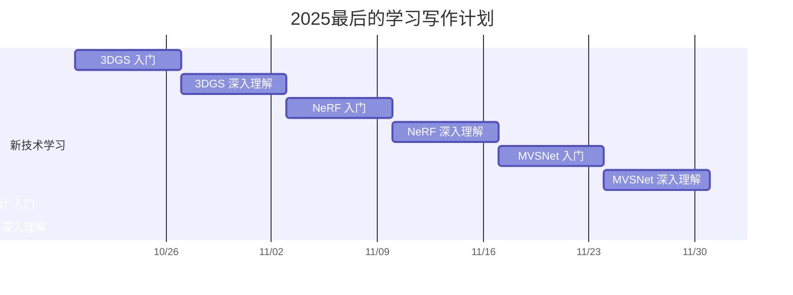

[toc]
# 图像三维重建学习与写作计划

> 个人学习与写作计划，覆盖从经典 SfM 到现代深度方法的完整体系。

---

## 计划概览

本计划分为两条线：

1. **工作中经典内容复盘**：已经熟悉的 SfM、MVS、Poisson 重建等。
2. **新技术深度学习**：想深入理解的 NeRF、3DGS、MVSNet、深度估计等。

写作策略：

- **螺旋式写作**：先每个主题写一篇概览文章，再逐步增加细节、实验、代码示例。
- 每周至少完成一篇文章或一个小主题的深入理解笔记。

---

## 主题列表与 Placeholder

### 特征提取与匹配

- [SIFT, ORB, SuperPoint 等经典方法](#)
- [特征匹配与鲁棒性分析](#)

### 图像检索

- [基于特征向量的图像索引](#)
- [Vocabulary Tree, ANN 搜索](#)

### 图像匹配

- [基于描述符的匹配](#)
- [SuperGlue, LightGlue, D2-Net 等](#)
- [端到端的匹配](#)

### 两视图几何

- [本质矩阵、基础矩阵](#)
- [RANSAC 与几何验证](#)

### 增量式 SfM

- [经典 pipeline](#)
- [相机姿态初始化](#)

### 全局 SfM

- [全局优化](#)
- [鲁棒求解方法](#)

### Bundle Adjustment (BA)

- [问题定义与优化方法](#)
- [Ceres Solver 示例](#)

### Stereo 匹配

- [匹配代价函数](#)
- [Semi-Global Matching](#)

### MVS

- [Patch-based MVS](#)
- [Learning-based MVS（MVSNet）](#)

### 表面重建

- [Poisson 表面重建](#)
- [GraphCut 表面重建](#)

### 纹理映射

- [UV 展开与纹理融合](#)

### Mesh 简化与 LOD

- [QEM 简化](#)
- [分层 LOD 生成](#)

### 现代深度方向

- [NeRF](#)
- [3DGS](#)
- [MVSNet](#)
- [深度估计](#)
- [VGGT](#)

---

## 甘特图 (Mermaid)

## 计划模板

### **阶段 0：准备阶段（Day 0）**

* 检索论文资源（PDF、代码、相关引用）
    
* 做初步阅读，了解论文的大致贡献和结构
    
* 生成任务清单：比如理解网络结构、损失函数、训练数据、实验结果
    

* * *

### **阶段 1：精读论文（Days 1~3）**

* **Day 1**：阅读 Introduction + Related Work
    
    * 目标：弄清研究背景、动机
        
    * 写作任务：摘要 100~200 字
        
* **Day 2**：阅读方法部分（网络结构 + 核心算法）
    
    * 目标：理解模型输入输出、流程
        
    * 写作任务：画流程图 + 写文字说明
        
* **Day 3**：阅读实验与讨论
    
    * 目标：理解结果、优缺点、对比方法
        
    * 写作任务：总结实验发现，列出表格或图
        

* * *

### **阶段 2：动手实验或伪代码（Days 4~5）**

* 如果可以跑代码，尝试小规模实验
    
* 或写伪代码实现核心流程
    
* 写作任务：在文章中加入实验结果或示意代码
    

* * *

### **阶段 3：整理成文章（Days 6~7）**

* 把每天写的小块内容整合成完整文章
    
* 加上图、表、关键公式
    
* 最终文章结构：
    
    1. 研究动机
        
    2. 方法概述
        
    3. 核心算法/网络结构
        
    4. 实验与分析
        
    5. 总结与启发
        

* * *

### **阶段 4：复盘 & 知识积累（可选，Day 8）**

* 做思维导图或流程图，总结 MVSNet 主要知识点
    
* 为下一篇论文打基础
    
* 写作任务：在笔记中记录易混淆点、改进想法
    

